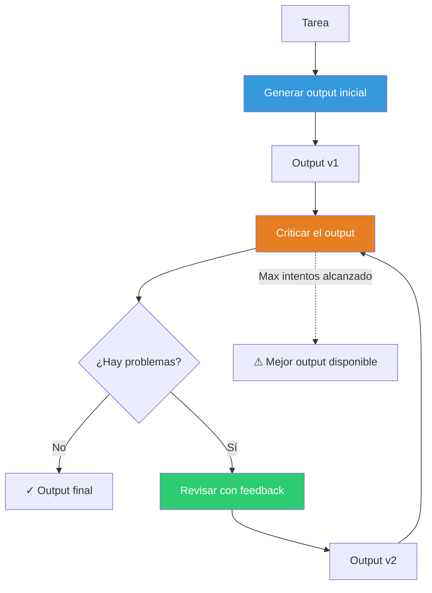
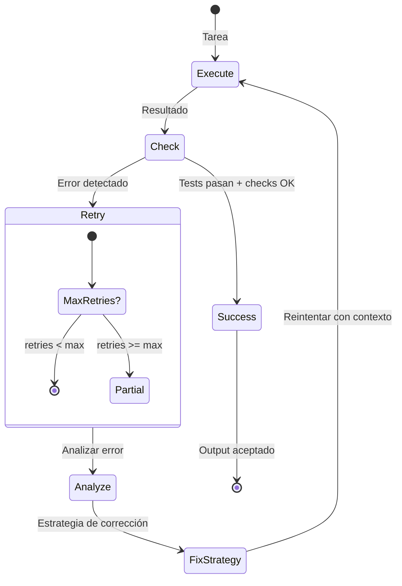
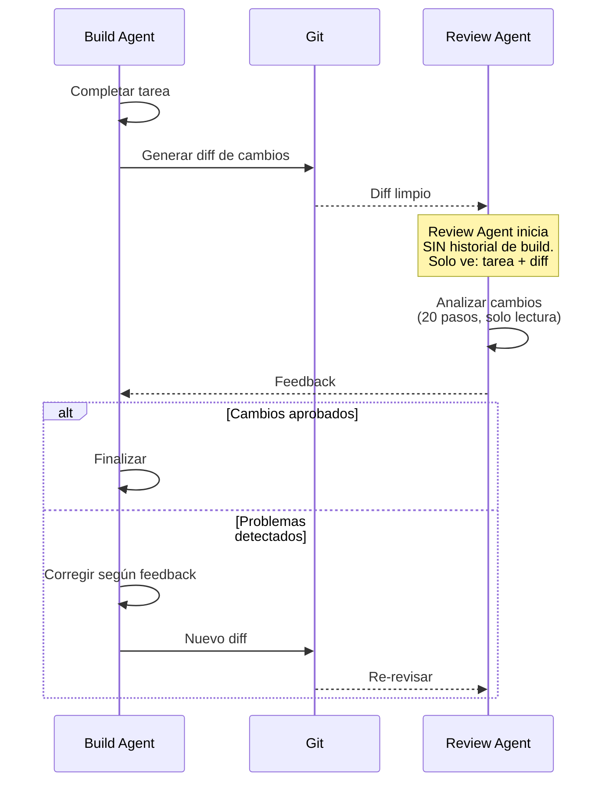

# Patrón Reflection — Auto-corrección y Mejora Iterativa

> [!abstract]
> El patrón *Reflection* permite que un agente ==evalúe y mejore sus propios outputs== mediante ciclos de generación → crítica → revisión. A diferencia de una sola llamada al LLM, la reflexión introduce un ==bucle de mejora iterativa== donde cada intento es mejor que el anterior. architect implementa este patrón en dos niveles: el ==Ralph Loop como reflexión táctica== (ejecutar → comprobar → si falla, reintentar con contexto del error) y el ==auto-review como reflexión estratégica== (un agente limpio revisa los cambios sin sesgo del proceso de construcción). ^resumen

## Problema

El primer intento de un LLM raramente es óptimo:

- **Código**: Funciona pero tiene bugs sutiles, es ineficiente o no sigue convenciones.
- **Texto**: Es correcto pero verboso, mal estructurado o con tono inadecuado.
- **Planes**: Son razonables pero no consideran edge cases o dependencias.
- **Análisis**: Identifican síntomas pero no causas raíz.

> [!danger] El sesgo del primer intento
> Los LLMs generan tokens secuencialmente y ==no pueden volver atrás para corregir==. Una decisión temprana en la generación condiciona todo lo que sigue. La reflexión permite al modelo "reconsiderar" su output completo con la perspectiva de haberlo terminado.

## Solución

Reflection implementa un ciclo de mejora iterativa:



### Variantes de reflexión

| Variante | Quién critica | Ventaja | Desventaja |
|---|---|---|---|
| Self-reflection | El mismo modelo | Simple, sin coste extra | Sesgo de auto-evaluación |
| External critique | Otro modelo | Perspectiva diferente | Doble coste |
| Peer review | Modelo del mismo nivel | Balance sesgo/coste | Puede requerir orquestación |
| Tool-based | Tests, linters, compiladores | Feedback objetivo | Solo errores detectables |
| Human feedback | Revisión humana | Máxima calidad | No escala |

> [!tip] La reflexión más efectiva combina múltiples fuentes
> No dependas solo de self-reflection. Combina:
> 1. **Self-reflection** para errores obvios de razonamiento.
> 2. **Tool-based** para errores detectables (tests, compilación).
> 3. **External critique** para calidad general.

## Reflection en architect: el Ralph Loop

El *Ralph Loop* de architect es una implementación de reflexión táctica: ejecutar → comprobar → si falla, reintentar con contexto del error.



> [!info] Cómo architect inyecta contexto de error
> Cuando un paso falla, architect añade al contexto:
> - El error completo (stderr, traceback).
> - El paso que falló y qué se intentaba hacer.
> - Historial de intentos previos (para evitar repetir el mismo error).
> - El diff de los cambios que causaron el fallo.

### Auto-review: reflexión con contexto limpio

El auto-review de architect es la forma más sofisticada de reflexión en el ecosistema:



> [!warning] ¿Por qué contexto limpio?
> Si el reviewer tiene acceso al historial de build, sufre de ==sesgo de anclaje==: conocer el razonamiento del builder le hace más indulgente con los errores. Un reviewer con contexto limpio ==evalúa el resultado, no la intención==, que es exactamente lo que un usuario real haría.

> [!example]- Prompt del auto-review agent
> ```python
> AUTO_REVIEW_PROMPT = """Eres un revisor de código experto.
> Analiza los siguientes cambios en el repositorio.
>
> ## Tarea original
> {original_task}
>
> ## Cambios realizados (diff)
> ```diff
> {git_diff}
> ```
>
> ## Tu trabajo
> Revisa los cambios críticamente. Evalúa:
>
> 1. **Corrección**: ¿Los cambios resuelven la tarea?
> 2. **Completitud**: ¿Falta algo por implementar?
> 3. **Bugs**: ¿Hay errores lógicos, edge cases no manejados?
> 4. **Seguridad**: ¿Hay vulnerabilidades introducidas?
> 5. **Convenciones**: ¿Sigue el estilo del proyecto?
> 6. **Tests**: ¿Se añadieron/actualizaron tests necesarios?
>
> Sé riguroso. Es mejor detectar un problema ahora que en
> producción. Si los cambios son correctos, di "APPROVED"
> con una breve justificación.
>
> Si hay problemas, lista cada uno con:
> - Severidad (critical/major/minor)
> - Archivo y línea
> - Descripción del problema
> - Sugerencia de fix
> """
> ```

## Implementación de referencia

> [!example]- Framework de reflexión genérico
> ```python
> from dataclasses import dataclass
> from typing import List, Optional, Callable
>
> @dataclass
> class ReflectionResult:
>     output: str
>     version: int
>     issues: List[str]
>     score: float
>     approved: bool
>
> class ReflectionLoop:
>     def __init__(
>         self,
>         generator_llm,
>         critic_llm,
>         max_iterations: int = 3,
>         quality_threshold: float = 0.8,
>         tool_checks: Optional[List[Callable]] = None,
>     ):
>         self.generator = generator_llm
>         self.critic = critic_llm
>         self.max_iterations = max_iterations
>         self.threshold = quality_threshold
>         self.tool_checks = tool_checks or []
>
>     async def run(self, task: str) -> ReflectionResult:
>         history = []
>
>         # Generación inicial
>         output = await self.generator.generate(task)
>
>         for iteration in range(self.max_iterations):
>             # Checks con herramientas (tests, linters)
>             tool_issues = []
>             for check in self.tool_checks:
>                 result = await check(output)
>                 if not result.passed:
>                     tool_issues.extend(result.issues)
>
>             # Crítica del LLM
>             critique = await self.critic.evaluate(
>                 task=task,
>                 output=output,
>                 tool_feedback=tool_issues,
>                 history=history,
>             )
>
>             if critique.score >= self.threshold and not tool_issues:
>                 return ReflectionResult(
>                     output=output,
>                     version=iteration + 1,
>                     issues=[],
>                     score=critique.score,
>                     approved=True,
>                 )
>
>             # Revisión con feedback
>             history.append({
>                 "version": iteration + 1,
>                 "output": output,
>                 "issues": critique.issues + tool_issues,
>             })
>
>             output = await self.generator.revise(
>                 task=task,
>                 current_output=output,
>                 feedback=critique.issues + tool_issues,
>                 history=history,
>             )
>
>         return ReflectionResult(
>             output=output,
>             version=self.max_iterations,
>             issues=critique.issues,
>             score=critique.score,
>             approved=False,
>         )
> ```

## Cuándo usar

> [!success] Escenarios ideales para reflexión
> - Generación de código donde la corrección es verificable (tests).
> - Tareas creativas donde la calidad mejora con iteración.
> - Análisis complejos donde el primer intento puede ser superficial.
> - Cuando el coste de un error en producción justifica el coste extra de reflexión.
> - Sistemas sin supervisión humana que necesitan auto-corrección.

## Cuándo NO usar

> [!failure] Escenarios donde la reflexión es contraproducente
> - **Tareas simples**: Respuestas factuales cortas no mejoran con iteración.
> - **Latencia crítica**: Cada iteración añade latencia completa de LLM.
> - **Presupuesto limitado**: 3 iteraciones = 6+ llamadas al LLM (genera + critica por iteración).
> - **Sin criterios claros**: Si no puedes definir qué es "mejor", la reflexión oscila sin converger.
> - **Modelo ya excelente**: Si el primer intento es consistentemente bueno, la reflexión desperdicia recursos.

> [!question] ¿Cuántas iteraciones son suficientes?
> Estudios muestran que la ==mayor mejora ocurre en la primera iteración de reflexión==. Las iteraciones subsiguientes tienen rendimientos decrecientes. Para la mayoría de tareas, 2-3 iteraciones son óptimas. Más allá de 3, el modelo tiende a sobre-optimizar o dar vueltas en círculos.

## Trade-offs

| Ventaja | Desventaja |
|---|---|
| Mejora significativa en la primera iteración | Coste multiplicado por iteraciones |
| Auto-corrección sin intervención humana | Latencia proporcional a iteraciones |
| Detección de errores que una sola pasada pierde | Rendimientos decrecientes después de 2-3 iteraciones |
| Combina con tool-based checks para feedback objetivo | Self-reflection tiene sesgo de auto-evaluación |
| El auto-review con contexto limpio elimina sesgo | Complejidad de implementación |
| Documentación implícita de mejoras | Puede empeorar en iteraciones tardías |

## Patrones relacionados

- [[pattern-evaluator]]: La fase de "crítica" de la reflexión es una instancia del evaluator.
- [[pattern-agent-loop]]: El loop puede incorporar reflexión en cada ciclo.
- [[pattern-planner-executor]]: El executor puede reflexionar sobre cada paso del plan.
- [[pattern-supervisor]]: El supervisor puede forzar reflexión cuando detecta problemas.
- [[pattern-orchestrator]]: Los workers pueden reflexionar antes de enviar resultados al orquestador.
- [[pattern-human-in-loop]]: La revisión humana es la forma más fiable de feedback para reflexión.
- [[pattern-guardrails]]: Los guardrails proporcionan criterios objetivos para la fase de crítica.
- [[pattern-pipeline]]: Reflexión como paso obligatorio en el pipeline.

## Relación con el ecosistema

[[architect-overview|architect]] implementa reflexión en dos niveles. El Ralph Loop es reflexión táctica: cuando un paso falla (test rojo, error de compilación), el build agent recibe el error como contexto y reintenta. El auto-review es reflexión estratégica: un review agent limpio evalúa el resultado completo sin el sesgo del proceso de construcción.

[[vigil-overview|vigil]] proporciona criterios objetivos para la fase de crítica: sus 26 reglas deterministas dan feedback concreto y accionable que el agente puede usar para mejorar. A diferencia de la auto-reflexión LLM, el feedback de vigil es ==100% consistente y verificable==.

[[intake-overview|intake]] puede beneficiarse de reflexión para mejorar las especificaciones generadas: generar spec → evaluar completitud → refinar → reevaluar.

[[licit-overview|licit]] utiliza reflexión en el contexto de compliance: generar evidencia → verificar contra regulación → refinar evidencia hasta cumplir todos los requisitos.

## Enlaces y referencias

> [!quote]- Bibliografía
> - Shinn, N. et al. (2023). *Reflexion: Language Agents with Verbal Reinforcement Learning*. Paper fundacional sobre reflexión en agentes.
> - Madaan, A. et al. (2023). *Self-Refine: Iterative Refinement with Self-Feedback*. Framework de auto-refinamiento.
> - Pan, L. et al. (2024). *Automatically Correcting Large Language Models*. Survey de técnicas de auto-corrección.
> - Anthropic. (2024). *Building effective agents — Reflection patterns*. Guía práctica de reflexión.
> - Huang, J. et al. (2024). *Large Language Models Cannot Self-Correct Reasoning Yet*. Limitaciones de self-reflection pura.

---

> [!tip] Navegación
> - Anterior: [[pattern-planner-executor]]
> - Siguiente: [[pattern-tool-maker]]
> - Índice: [[patterns-overview]]
