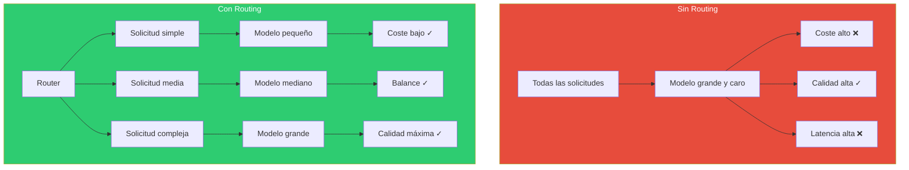
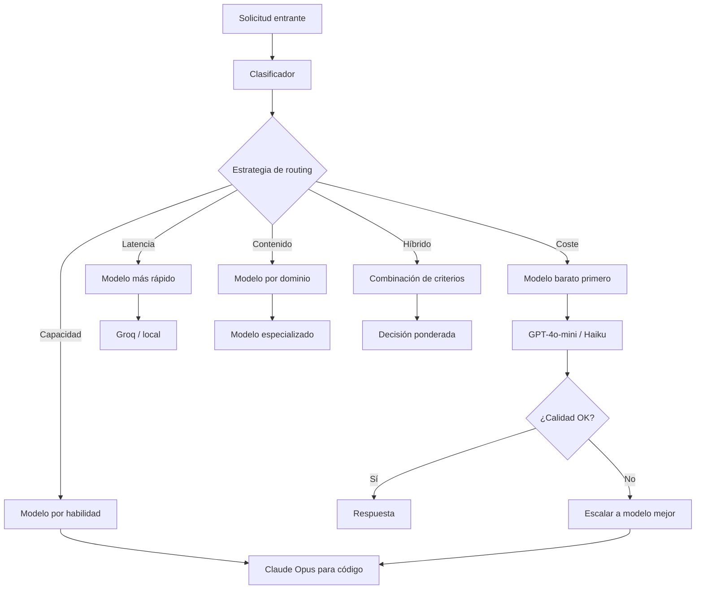
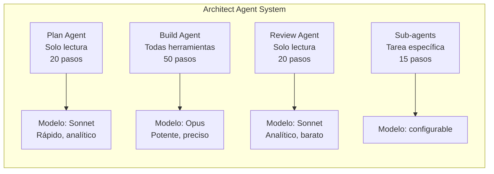

# Patrón LLM Routing — Selección Dinámica de Modelo

> [!abstract]
> El patrón *LLM Routing* resuelve el problema de que ==ningún modelo es óptimo para todas las tareas==. Implementa un clasificador que analiza cada solicitud y la dirige al modelo más adecuado según criterios de coste, capacidad, latencia o tipo de contenido. En producción, un sistema de routing bien diseñado puede ==reducir costes un 40-60% sin degradar calidad==, usando modelos baratos para tareas simples y reservando modelos potentes para tareas complejas. architect implementa selección de modelo por agente, asignando modelos diferentes a plan, build y review. ^resumen

## Problema

Las organizaciones que usan LLMs enfrentan un trilema:

1. **Coste**: Los modelos más capaces (GPT-4o, Claude Opus) cuestan 10-50x más que modelos ligeros.
2. **Calidad**: Los modelos baratos fallan en tareas complejas de razonamiento, código o análisis.
3. **Latencia**: Los modelos grandes son más lentos, afectando la experiencia de usuario.

> [!warning] El error de "un modelo para todo"
> Usar GPT-4o para responder "¿Qué hora es?" cuesta lo mismo que para resolver un bug complejo de concurrencia. Sin routing, ==el 60-70% de las llamadas usan un modelo sobredimensionado== para la tarea.



## Solución

El routing implementa un clasificador que precede a la llamada al LLM y selecciona el modelo óptimo:



### Estrategia 1: Routing basado en coste (*Cheap First*)

Intentar siempre con el modelo más barato primero. Si la respuesta no cumple un umbral de calidad, escalar.

| Paso | Modelo | Coste/1M tokens | Uso |
|---|---|---|---|
| 1 | GPT-4o-mini / Haiku | $0.25-0.50 | Intento inicial |
| 2 | Claude Sonnet / GPT-4o | $3-5 | Si paso 1 falla |
| 3 | Claude Opus | $15-75 | Último recurso |

> [!tip] Cuándo funciona bien el cheap-first
> - Alto volumen de solicitudes simples (chatbots, Q&A).
> - Cuando la latencia de re-intento es aceptable.
> - Cuando tienes un evaluador rápido de calidad (ver [[pattern-evaluator]]).

### Estrategia 2: Routing basado en capacidad

Clasificar la solicitud por tipo de tarea y asignar el modelo con mejor rendimiento en esa área.

| Tipo de tarea | Modelo recomendado | Razón |
|---|---|---|
| Generación de código | Claude Opus / Sonnet | Mejor en código complejo |
| Chat general | GPT-4o-mini | Rápido y suficiente |
| Análisis de documentos | GPT-4o / Gemini | Buen balance |
| Razonamiento matemático | Claude Opus / o1 | Requiere razonamiento profundo |
| Traducción | Modelos especializados | Mejor calidad/coste |
| Resumen | Modelos medianos | No requiere razonamiento |

### Estrategia 3: Routing basado en latencia

Para aplicaciones interactivas donde el tiempo de respuesta es crítico:

> [!info] Latencias típicas por modelo (2025)
> | Modelo | Latencia p50 | Latencia p99 |
> |---|---|---|
> | Modelos locales (Llama 3.1 8B) | 50ms | 200ms |
> | Groq (Llama 3.1 70B) | 100ms | 500ms |
> | GPT-4o-mini | 300ms | 1.5s |
> | Claude Sonnet | 500ms | 3s |
> | GPT-4o | 800ms | 5s |
> | Claude Opus | 1.5s | 8s |
> | o1-preview | 5s | 30s |

### Estrategia 4: Routing basado en contenido

Analizar el contenido de la solicitud para determinar qué modelo es más apropiado:

- **Contenido sensible** → Modelo con mejores guardrails (Claude).
- **Contenido multimodal** → Modelo con visión (GPT-4o, Gemini).
- **Contenido en idiomas poco comunes** → Modelo con mejor cobertura multilingüe.
- **Contenido largo** → Modelo con ventana de contexto amplia.

## Implementación con LiteLLM

> [!example]- Router con LiteLLM
> ```python
> from litellm import Router
>
> router = Router(
>     model_list=[
>         {
>             "model_name": "cheap",
>             "litellm_params": {
>                 "model": "gpt-4o-mini",
>                 "api_key": os.environ["OPENAI_API_KEY"],
>             },
>             "model_info": {"max_tokens": 16384}
>         },
>         {
>             "model_name": "balanced",
>             "litellm_params": {
>                 "model": "claude-sonnet-4-20250514",
>                 "api_key": os.environ["ANTHROPIC_API_KEY"],
>             },
>             "model_info": {"max_tokens": 8192}
>         },
>         {
>             "model_name": "powerful",
>             "litellm_params": {
>                 "model": "claude-opus-4-20250514",
>                 "api_key": os.environ["ANTHROPIC_API_KEY"],
>             },
>             "model_info": {"max_tokens": 4096}
>         },
>     ],
>     routing_strategy="cost-based",
>     fallbacks=[
>         {"cheap": ["balanced"]},
>         {"balanced": ["powerful"]},
>     ],
> )
>
> # El router selecciona automáticamente
> response = await router.acompletion(
>     model="cheap",  # Intenta primero el barato
>     messages=[{"role": "user", "content": query}],
> )
> ```

## Selección de modelo por agente en architect

architect implementa routing estático por tipo de agente:



> [!question] ¿Por qué routing estático por agente?
> En architect, cada agente tiene un perfil de tarea predecible:
> - **Plan**: Necesita comprensión amplia pero no genera código. Sonnet es suficiente.
> - **Build**: Genera código complejo, necesita máxima capacidad. Opus justifica el coste.
> - **Review**: Analiza diff y detecta problemas. Sonnet detecta bien sin el coste de Opus.

## Cuándo usar

> [!success] Escenarios ideales para routing
> - Alto volumen de solicitudes con complejidad variable.
> - Presupuesto limitado que obliga a optimizar costes.
> - Múltiples proveedores de LLM disponibles.
> - Latencia variable aceptable según tipo de solicitud.
> - Sistemas multi-agente donde cada agente tiene necesidades distintas.

## Cuándo NO usar

> [!failure] Escenarios donde routing no aporta valor
> - **Una sola tarea homogénea**: Si todas las solicitudes son similares, un modelo fijo es más simple.
> - **Volumen bajo**: Con pocas solicitudes, el ahorro no justifica la complejidad del router.
> - **Un solo proveedor**: Sin alternativas, no hay nada que enrutar.
> - **Latencia ultra-baja**: El clasificador añade latencia. Si cada milisegundo cuenta, evítalo.

## Trade-offs

| Ventaja | Desventaja |
|---|---|
| Reducción de costes 40-60% | Complejidad de infraestructura |
| Mejor latencia para tareas simples | Latencia del clasificador |
| Resiliencia multi-proveedor | Mantener configuración de múltiples modelos |
| Optimización por tipo de tarea | Testing más complejo (múltiples modelos) |
| Flexibilidad para nuevos modelos | El clasificador puede equivocarse |
| Preparación para cambio de modelos | Diferentes formatos de API entre proveedores |

## Patrones relacionados

- [[pattern-fallback]]: El fallback actúa cuando el modelo seleccionado por el router falla.
- [[pattern-circuit-breaker]]: Si un modelo muestra degradación, el circuit breaker redirige al router.
- [[pattern-semantic-cache]]: El cache puede interceptar antes del router para evitar la llamada.
- [[pattern-evaluator]]: Evalúa la calidad para decidir si escalar a un modelo mejor.
- [[pattern-orchestrator]]: El orquestador puede usar routing para asignar modelos a workers.
- [[pattern-agent-loop]]: El loop puede cambiar de modelo entre iteraciones.

## Relación con el ecosistema

[[architect-overview|architect]] implementa routing estático por agente, donde cada tipo de agente (plan, build, review, sub-agents) tiene un modelo asignado. La configuración se gestiona a través de LiteLLM, permitiendo cambiar modelos sin modificar código.

[[vigil-overview|vigil]] puede beneficiarse de routing para usar modelos diferentes según el tipo de validación: reglas deterministas no necesitan LLM, pero validaciones semánticas complejas podrían usar un modelo especializado.

[[intake-overview|intake]] utiliza routing para procesar requisitos: solicitudes simples de normalización van a modelos baratos, mientras que generación de especificaciones complejas va a modelos potentes.

[[licit-overview|licit]] puede requerir modelos específicos para análisis de compliance en diferentes jurisdicciones o regulaciones.

## Enlaces y referencias

> [!quote]- Bibliografía
> - BerriAI. (2024). *LiteLLM Router Documentation*. Documentación de referencia para routing con LiteLLM.
> - Ding, Y. et al. (2024). *Hybrid LLM: Cost-Efficient and Quality-Aware Query Routing*. Paper sobre routing híbrido.
> - Ong, M. et al. (2024). *RouteLLM: Learning to Route LLMs with Preference Data*. Framework de routing basado en aprendizaje.
> - Vsakota, M. et al. (2024). *FrugalGPT: How to Use Large Language Models While Reducing Cost and Improving Performance*. Estrategias de reducción de costes.
> - Chen, L. et al. (2023). *FrugalGPT: How to Use Large Language Models While Reducing Cost*. Análisis de coste-beneficio de routing.

---

> [!tip] Navegación
> - Anterior: [[pattern-guardrails]]
> - Siguiente: [[pattern-fallback]]
> - Índice: [[patterns-overview]]
