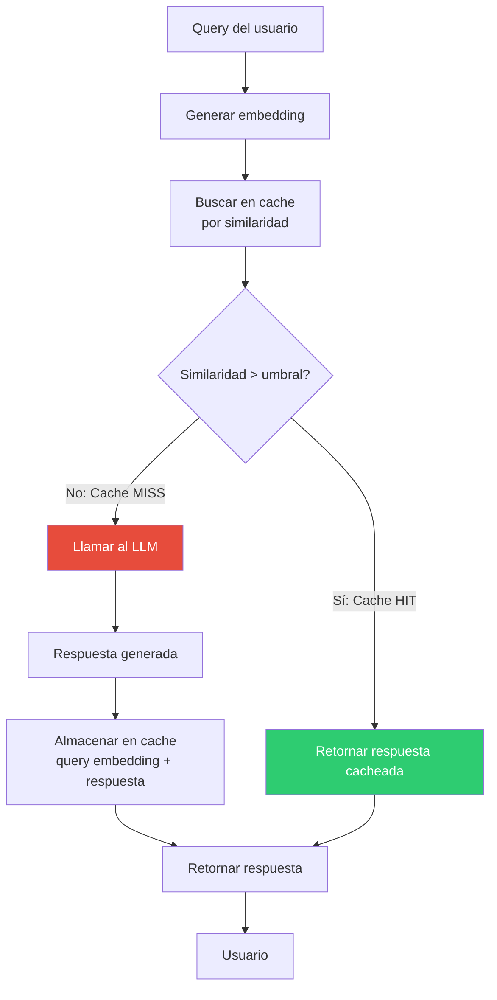

# Patrón Semantic Cache — Reutilización de Respuestas por Similaridad

> [!abstract]
> El *semantic cache* almacena respuestas de LLMs y las reutiliza para ==queries semánticamente similares==, no solo idénticas. A diferencia del cache exacto (key=hash del input), el semantic cache usa embeddings para encontrar queries previas con ==significado equivalente aunque usen palabras diferentes==. En workloads adecuados, puede reducir costes de tokens un ==50-80%== y latencia a milisegundos. Es especialmente valioso para chatbots, sistemas de soporte y FAQs donde las mismas preguntas se reformulan de muchas maneras. Es distinto del *prompt caching* de proveedores (que cachea el prefijo del prompt, no la respuesta). ^resumen

## Problema

Los LLMs procesan cada solicitud desde cero, incluso cuando ya respondieron una pregunta equivalente:

- "¿Cómo instalo Python?" y "¿Cuáles son los pasos para instalar Python?" producen la misma respuesta pero cuestan tokens duplicados.
- En un chatbot de soporte con 10K consultas/día, ==30-50% son variaciones de las mismas 100 preguntas==.
- Cada llamada al LLM cuesta dinero y tarda 1-5 segundos.

> [!warning] El coste invisible de la repetición
> | Métrica | Sin cache | Con semantic cache (50% hit rate) |
> |---|---|---|
> | Consultas/día | 10,000 | 10,000 |
> | Llamadas al LLM/día | 10,000 | 5,000 |
> | Coste diario ($3/1M tokens, 500 tokens/query) | $15.00 | $7.50 |
> | Coste mensual | $450 | $225 |
> | Latencia media | 2s | 1.05s |
>
> Con un hit rate del 70%, el ahorro sube a ==~$315/mes con latencia media de 0.65s==.

## Solución

El semantic cache implementa un flujo de lookup-before-call:



### Componentes

| Componente | Función | Tecnología |
|---|---|---|
| Embedding model | Vectorizar queries | text-embedding-3-small, BGE |
| Vector store | Almacenar y buscar embeddings | Redis, Chroma, Pinecone |
| Similarity metric | Calcular cercanía | Cosine similarity |
| Threshold | Umbral de "suficientemente similar" | 0.90-0.98 (depende del dominio) |
| TTL | Tiempo de vida de entradas | 1h - 30 días |

### El umbral de similaridad

> [!tip] Calibrar el umbral es crítico
> | Umbral | Hit rate | Riesgo |
> |---|---|---|
> | 0.99 | Muy bajo (~10%) | Casi solo hits exactos, poco beneficio |
> | 0.95 | Medio (~40%) | Buen balance para la mayoría de dominios |
> | 0.90 | Alto (~60%) | Posibles falsos positivos |
> | 0.85 | Muy alto (~75%) | Respuestas incorrectas frecuentes |
>
> Empieza con ==0.95 y ajusta basándote en evaluación manual== de los hits.

> [!danger] Falsos positivos del semantic cache
> Queries que parecen similares pero tienen respuestas diferentes:
> - "¿Cómo instalar Python 2?" vs "¿Cómo instalar Python 3?" — Similar en embedding, respuesta diferente.
> - "¿Precio del plan básico?" vs "¿Precio del plan premium?" — Mismo patrón, datos diferentes.
>
> **Mitigación**: Incluir entidades clave en el key del cache (no solo el embedding). Combinar similaridad semántica con matching de entidades.

## Implementación

> [!example]- Semantic cache con Redis y embeddings
> ```python
> import hashlib
> import json
> import numpy as np
> from redis import Redis
> from openai import OpenAI
>
> class SemanticCache:
>     def __init__(
>         self,
>         redis_url: str = "redis://localhost:6379",
>         similarity_threshold: float = 0.95,
>         ttl: int = 3600,  # 1 hora
>         embedding_model: str = "text-embedding-3-small",
>     ):
>         self.redis = Redis.from_url(redis_url)
>         self.threshold = similarity_threshold
>         self.ttl = ttl
>         self.client = OpenAI()
>         self.model = embedding_model
>
>     def _embed(self, text: str) -> list[float]:
>         response = self.client.embeddings.create(
>             input=text, model=self.model
>         )
>         return response.data[0].embedding
>
>     def _cosine_similarity(self, a: list, b: list) -> float:
>         a, b = np.array(a), np.array(b)
>         return float(np.dot(a, b) / (np.linalg.norm(a) * np.linalg.norm(b)))
>
>     def get(self, query: str) -> dict | None:
>         query_emb = self._embed(query)
>
>         # Buscar todos los embeddings almacenados
>         keys = self.redis.keys("scache:*")
>         best_match = None
>         best_sim = 0.0
>
>         for key in keys:
>             cached = json.loads(self.redis.get(key))
>             sim = self._cosine_similarity(query_emb, cached["embedding"])
>             if sim > best_sim:
>                 best_sim = sim
>                 best_match = cached
>
>         if best_sim >= self.threshold and best_match:
>             return {
>                 "response": best_match["response"],
>                 "similarity": best_sim,
>                 "original_query": best_match["query"],
>                 "cached": True,
>             }
>         return None
>
>     def set(self, query: str, response: str):
>         embedding = self._embed(query)
>         key = f"scache:{hashlib.sha256(query.encode()).hexdigest()[:16]}"
>         self.redis.setex(
>             key, self.ttl,
>             json.dumps({
>                 "query": query,
>                 "embedding": embedding,
>                 "response": response,
>             })
>         )
> ```

## Estrategias de invalidación

> [!warning] Cache invalidation sigue siendo uno de los problemas más difíciles
> Para semantic cache, la invalidación es aún más compleja porque no hay una key exacta que borrar.

| Estrategia | Descripción | Cuándo usar |
|---|---|---|
| TTL fijo | Entries expiran después de N minutos | Datos que cambian frecuentemente |
| TTL por categoría | Diferentes TTLs según tipo de query | Mezcla de datos estáticos y dinámicos |
| Invalidación por evento | Borrar cache cuando cambian datos subyacentes | Datos con fuente de verdad conocida |
| Versionado | Incluir versión de datos en key | Actualizaciones controladas |
| LRU | Evict entradas menos usadas | Limitación de memoria |

## Prompt caching vs semantic cache

> [!info] Son mecanismos diferentes con objetivos diferentes
> | Aspecto | Prompt caching (proveedor) | Semantic cache (aplicación) |
> |---|---|---|
> | Qué cachea | Prefijo del prompt (system + context) | Respuesta completa |
> | Quién lo implementa | Anthropic, OpenAI | Tu aplicación |
> | Beneficio | Reduce coste del input | Elimina llamada al LLM |
> | Latencia | Reduce ligeramente | Reduce drásticamente |
> | Similaridad | Requiere prefijo idéntico | Similaridad semántica |
> | Validez | Mientras el prefijo no cambie | Según TTL configurado |

Los dos son complementarios: usa prompt caching del proveedor para reducir coste de las llamadas que sí haces, y semantic cache para evitar llamadas repetidas.

## Cuándo usar

> [!success] Escenarios ideales para semantic cache
> - Chatbots y sistemas de soporte con alto volumen de consultas repetitivas.
> - FAQs donde las preguntas son variaciones de un conjunto limitado.
> - Sistemas de búsqueda con queries reformuladas frecuentemente.
> - APIs de generación donde los mismos inputs producen outputs estables.
> - Cualquier workload con tasa de repetición > 20%.

## Cuándo NO usar

> [!failure] Escenarios donde semantic cache es contraproducente
> - **Queries únicas**: Si cada query es completamente diferente, el cache nunca hace hit.
> - **Datos en tiempo real**: Si la respuesta correcta cambia cada minuto, el cache devuelve datos obsoletos.
> - **Personalización por usuario**: Si la respuesta depende del perfil del usuario, el cache de un usuario no sirve para otro.
> - **Tareas creativas**: Si el usuario espera variedad (escritura creativa), el cache repite respuestas.
> - **Agentes con herramientas**: Las acciones del agente dependen del estado actual, no de queries pasadas.

> [!question] ¿Qué tasa de repetición justifica semantic cache?
> Como regla general, si ==más del 20% de tus queries son semánticamente similares a queries previas==, el semantic cache ahorra más de lo que cuesta implementar y mantener. Mide la distribución de tus queries antes de implementar.

## Trade-offs

| Ventaja | Desventaja |
|---|---|
| Reducción de costes 50-80% (workloads adecuados) | Coste de embedding por query (aunque mucho menor que LLM) |
| Latencia de milisegundos vs segundos | Riesgo de respuestas obsoletas |
| Reduce carga en APIs de LLM | Falsos positivos devuelven respuestas incorrectas |
| Mejora disponibilidad (responde sin LLM) | Complejidad de invalidación |
| Escalable horizontalmente | Almacenamiento de embeddings + respuestas |
| Combinable con prompt caching | Calibración del umbral requiere experimentación |

## Métricas clave

> [!success] KPIs para semantic cache
> - **Hit rate**: % de queries servidas desde cache. Target: > 30%.
> - **Precision**: % de hits que son respuestas correctas. Target: > 95%.
> - **Latencia p50 del hit**: Tiempo de respuesta para cache hits. Target: < 100ms.
> - **Ahorro neto**: (Coste sin cache - Coste con cache) - Coste del cache. Debe ser positivo.
> - **Freshness**: % de respuestas cacheadas que siguen siendo correctas. Target: > 98%.

## Patrones relacionados

- [[pattern-rag]]: RAG recupera documentos; semantic cache recupera respuestas completas.
- [[pattern-routing]]: El cache puede interceptar antes del router para evitar routing innecesario.
- [[pattern-fallback]]: El cache puede actuar como nivel de fallback cuando la API del LLM falla.
- [[pattern-circuit-breaker]]: Con circuito abierto, el cache puede servir respuestas mientras el modelo se recupera.
- [[pattern-evaluator]]: Evaluar la calidad de los cache hits para ajustar el umbral.
- [[pattern-map-reduce]]: Cachear resultados individuales del map para reutilizar en futuras ejecuciones.

## Relación con el ecosistema

[[architect-overview|architect]] como agente CLI de sesión única tiene menos oportunidades de semantic cache que un servicio web. Sin embargo, a nivel de proyecto, podría cachear análisis de archivos que no han cambiado entre sesiones.

[[intake-overview|intake]] se beneficia significativamente del semantic cache: muchos requisitos se expresan de formas similares, y la normalización puede reutilizarse.

[[vigil-overview|vigil]] no necesita semantic cache porque sus reglas son deterministas y ya son eficientes sin llamadas a LLM.

[[licit-overview|licit]] puede cachear análisis de compliance para cláusulas regulatorias similares, dado que la regulación no cambia frecuentemente (TTL largo).

## Enlaces y referencias

> [!quote]- Bibliografía
> - Zhu, B. et al. (2023). *GPTCache: An Open-Source Semantic Cache for LLM Applications*. Framework de referencia para semantic cache.
> - Bang, J. et al. (2023). *GPTCache: Improving LLM Inference Performance and Reducing Cost Through Semantic Caching*. Análisis de rendimiento.
> - Redis. (2024). *Redis vector search for semantic caching*. Implementación con Redis.
> - Anthropic. (2024). *Prompt caching documentation*. Mecanismo de prompt caching del proveedor.
> - OpenAI. (2024). *Prompt caching documentation*. Mecanismo complementario de caching de prefijo.

---

> [!tip] Navegación
> - Anterior: [[pattern-circuit-breaker]]
> - Siguiente: [[pattern-speculative-execution]]
> - Índice: [[patterns-overview]]
