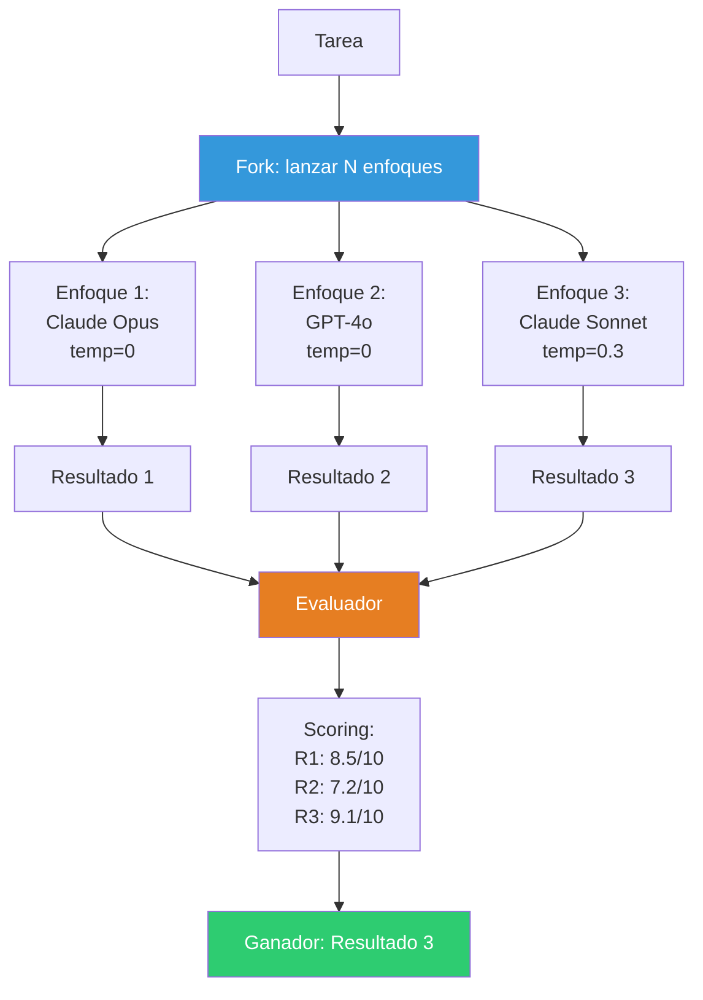
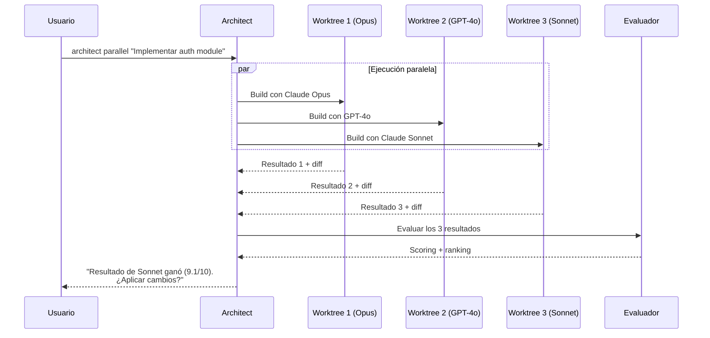
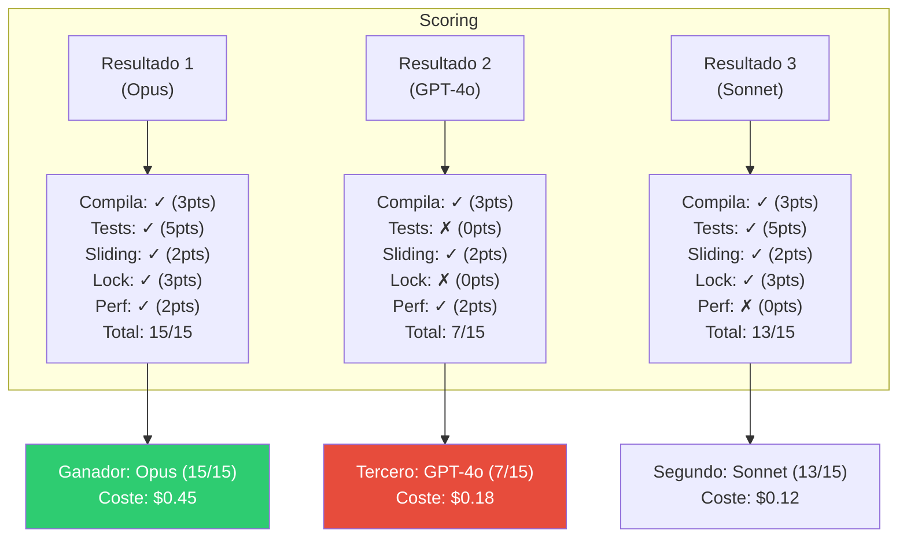

# Patrón Speculative Execution — Múltiples Enfoques en Paralelo

> [!abstract]
> La *speculative execution* lanza ==múltiples agentes o modelos en paralelo para resolver la misma tarea== y selecciona el mejor resultado. A diferencia de [[pattern-map-reduce|map-reduce]] que divide el trabajo, la ejecución especulativa ==replica el trabajo con diferentes estrategias== y compite por la mejor solución. architect implementa esto en su comando `parallel` (misma tarea con diferentes modelos, evaluación competitiva con scoring) y en su comando `eval` (comparación multi-modelo con checks). El trade-off fundamental es ==coste multiplicado vs mayor probabilidad de éxito==. ^resumen

## Problema

Cuando enfrentas una tarea donde la estrategia óptima no es obvia:

1. **Incertidumbre del enfoque**: ¿Refactorizar incrementalmente o reescribir desde cero?
2. **Variabilidad entre modelos**: GPT-4o y Claude Opus pueden dar soluciones significativamente diferentes.
3. **Naturaleza probabilística**: El mismo modelo con temperature > 0 produce resultados diferentes.
4. **Coste del error**: Si el primer intento falla, el retry consume el doble de tiempo.

> [!warning] El problema de la apuesta única
> Con un solo intento, estás apostando a que el modelo elegido, con el prompt actual, producirá una solución suficientemente buena ==al primer intento==. La ejecución especulativa transforma esta apuesta en una cartera diversificada.

## Solución

Lanzar N instancias de la tarea en paralelo, cada una con una variación (modelo, prompt, estrategia, temperatura), y seleccionar la mejor:



### Dimensiones de variación

| Dimensión | Variantes | Ejemplo |
|---|---|---|
| Modelo | Diferentes proveedores/modelos | Claude vs GPT-4o vs Gemini |
| Temperatura | Diferentes niveles de creatividad | temp=0 vs temp=0.3 vs temp=0.7 |
| Prompt | Diferentes instrucciones | Detallado vs conciso vs few-shot |
| Estrategia | Diferentes enfoques al problema | Refactoring vs rewrite vs patch |
| Herramientas | Diferentes conjuntos de herramientas | Con linter vs sin linter |

## Ejecución competitiva en architect

### Comando `parallel`

architect puede ejecutar la misma tarea con diferentes modelos simultáneamente:



> [!info] Worktrees para aislamiento
> architect usa *git worktrees* para ejecutar cada enfoque en un directorio aislado. Esto permite que múltiples agentes modifiquen el código simultáneamente sin conflictos. Al final, el worktree ganador se mergea al repositorio principal.

### Comando `eval`

El comando `eval` compara modelos usando checks automatizados:

> [!example]- Evaluación competitiva con checks
> ```yaml
> # eval-config.yaml
> task: "Implementar rate limiter con sliding window"
> models:
>   - claude-opus-4-20250514
>   - gpt-4o
>   - claude-sonnet-4-20250514
>
> checks:
>   - name: "Compila sin errores"
>     type: command
>     value: "python -m py_compile src/rate_limiter.py"
>     weight: 3
>
>   - name: "Tests pasan"
>     type: command
>     value: "pytest tests/test_rate_limiter.py -v"
>     weight: 5
>
>   - name: "Implementa sliding window"
>     type: contains
>     value: "sliding"
>     weight: 2
>
>   - name: "Maneja concurrencia"
>     type: contains
>     value: "lock"
>     weight: 3
>
>   - name: "Performance test"
>     type: command
>     value: "python benchmarks/bench_rate_limiter.py"
>     weight: 2
>
> scoring:
>   method: weighted_sum
>   tie_breaker: cost  # En empate, preferir más barato
> ```

### Evaluación multi-criterio



## Estrategias de selección

| Estrategia | Descripción | Cuándo usar |
|---|---|---|
| Score máximo | Seleccionar el resultado con mayor puntuación | Calidad es prioridad absoluta |
| Score/coste | Seleccionar mejor relación calidad/precio | Presupuesto limitado |
| First-to-pass | Seleccionar el primero que pasa todos los checks | Latencia es prioridad |
| Consensus | Seleccionar la respuesta que más coincida entre variantes | Consistencia importa |
| Human choice | Presentar los N mejores al humano para elegir | Decisiones críticas |

## Cuándo el coste extra se justifica

> [!question] ¿Vale la pena pagar 3x por 3 ejecuciones paralelas?
> Depende del coste de un resultado fallido:

| Escenario | Coste del fallo | Coste de 3 paralelos | ¿Justificado? |
|---|---|---|---|
| Bug fix rutinario | Retry manual (minutos) | 3x tokens (~$0.30) | No |
| Feature compleja | Horas de debugging | 3x tokens (~$3.00) | Sí |
| Migración de sistema | Días de trabajo manual | 3x tokens (~$10.00) | Definitivamente |
| Código de seguridad | Vulnerabilidad en producción | 3x tokens (~$5.00) | Siempre |
| Demo para cliente | Pérdida de contrato | 3x tokens (~$2.00) | Absolutamente |

> [!tip] Regla práctica
> Usa ejecución especulativa cuando el ==coste de un resultado fallido es al menos 10x el coste de ejecutar paralelos adicionales==.

## Implementación de referencia

> [!example]- Speculative execution genérica
> ```python
> import asyncio
> from dataclasses import dataclass
> from typing import List, Callable, Optional
>
> @dataclass
> class Approach:
>     name: str
>     model: str
>     prompt_variant: str
>     temperature: float = 0.0
>
> @dataclass
> class Result:
>     approach: Approach
>     output: str
>     score: float
>     cost: float
>     latency: float
>     checks_passed: List[str]
>     checks_failed: List[str]
>
> class SpeculativeExecutor:
>     def __init__(
>         self,
>         approaches: List[Approach],
>         checks: List[Callable],
>         evaluator: Optional[Callable] = None,
>         strategy: str = "max_score",
>     ):
>         self.approaches = approaches
>         self.checks = checks
>         self.evaluator = evaluator
>         self.strategy = strategy
>
>     async def execute(self, task: str) -> Result:
>         # Lanzar todos en paralelo
>         tasks = [
>             self._run_approach(approach, task)
>             for approach in self.approaches
>         ]
>
>         if self.strategy == "first_to_pass":
>             # Retornar el primero que pase todos los checks
>             for coro in asyncio.as_completed(tasks):
>                 result = await coro
>                 if not result.checks_failed:
>                     return result
>             # Si ninguno pasó todos, retornar el mejor
>             results = [await t for t in tasks if not t.done()]
>         else:
>             results = await asyncio.gather(*tasks)
>
>         # Scoring
>         for result in results:
>             if self.evaluator:
>                 result.score = await self.evaluator(task, result.output)
>
>         # Selección según estrategia
>         if self.strategy == "max_score":
>             return max(results, key=lambda r: r.score)
>         elif self.strategy == "score_per_cost":
>             return max(results, key=lambda r: r.score / max(r.cost, 0.01))
>         elif self.strategy == "consensus":
>             return self._find_consensus(results)
>
>         return max(results, key=lambda r: r.score)
> ```

## Cuándo usar

> [!success] Escenarios ideales para speculative execution
> - Tareas donde la calidad del resultado es crítica (código de seguridad, features de producción).
> - Evaluación de modelos: comparar qué modelo funciona mejor para tu caso de uso.
> - Cuando el coste de un mal resultado es significativamente mayor que el de ejecuciones paralelas.
> - Tareas con alta variabilidad de resultado entre modelos o configuraciones.
> - Benchmarking continuo de nuevos modelos o prompts.

## Cuándo NO usar

> [!failure] Escenarios donde la ejecución especulativa es desperdicio
> - **Tareas deterministas**: Si el resultado es predecible, una ejecución basta.
> - **Presupuesto muy limitado**: Multiplicar costes por N puede ser prohibitivo.
> - **Latencia como cuello de botella**: Si usas first-to-pass, la latencia total es la del más rápido. Si evalúas todos, es la del más lento.
> - **Tareas simples**: Respuestas que cualquier modelo genera correctamente.
> - **Alto volumen**: 10K queries/día × 3 modelos = 30K queries/día.

## Trade-offs

| Ventaja | Desventaja |
|---|---|
| Mayor probabilidad de resultado óptimo | Coste multiplicado por N enfoques |
| Descubre qué modelo/enfoque funciona mejor | Complejidad de evaluación y selección |
| Reduce riesgo de resultado fallido | Necesita infraestructura de paralelismo |
| Proporciona datos de benchmarking | Overhead de gestión de N ejecuciones |
| Estrategia "first-to-pass" reduce latencia | Desperdicio de compute en N-1 resultados descartados |
| Diversificación de estrategias | Más difícil de debuggear |

## Patrones relacionados

- [[pattern-evaluator]]: El evaluador selecciona el ganador entre resultados paralelos.
- [[pattern-map-reduce]]: Map-reduce divide datos; speculative execution replica la tarea.
- [[pattern-orchestrator]]: El orquestador puede lanzar workers especulativos.
- [[pattern-routing]]: El routing elige un modelo; la especulación prueba varios.
- [[pattern-agent-loop]]: Cada enfoque ejecuta su propio agent loop independiente.
- [[pattern-fallback]]: Si el enfoque ganador tiene problemas, los otros resultados sirven de fallback.
- [[pattern-pipeline]]: Un step del pipeline puede usar ejecución especulativa.

## Relación con el ecosistema

[[architect-overview|architect]] implementa ejecución especulativa en dos formas: el comando `parallel` que lanza la misma tarea con diferentes modelos en worktrees aislados, y el comando `eval` que compara modelos con checks automatizados y scoring. Ambos usan worktrees de git para aislamiento y evaluación competitiva con criterios configurables.

[[vigil-overview|vigil]] actúa como evaluador determinista de los resultados especulativos, aplicando sus 26 reglas a cada resultado para una puntuación consistente y reproducible.

[[intake-overview|intake]] puede usar ejecución especulativa para generar múltiples especificaciones desde los mismos requisitos y seleccionar la más completa.

[[licit-overview|licit]] puede requerir que todos los resultados especulativos pasen compliance checks, no solo el ganador, para documentar que ningún enfoque viola normativas.

## Enlaces y referencias

> [!quote]- Bibliografía
> - Brown, T. et al. (2020). *Language Models are Few-Shot Learners*. Demostración de variabilidad entre configuraciones.
> - Zheng, L. et al. (2023). *Chatbot Arena: An Open Platform for Evaluating LLMs via Human Preference*. Evaluación competitiva de modelos.
> - Chen, M. et al. (2021). *Evaluating Large Language Models Trained on Code*. Uso de pass@k como métrica (k intentos, al menos 1 correcto).
> - Li, Y. et al. (2023). *Competition-Level Code Generation with AlphaCode*. Generación masiva + filtrado como ejecución especulativa a escala.
> - Anthropic. (2024). *Model comparison documentation*. Guía para comparación de modelos.

---

> [!tip] Navegación
> - Anterior: [[pattern-semantic-cache]]
> - Siguiente: [[pattern-supervisor]]
> - Índice: [[patterns-overview]]
