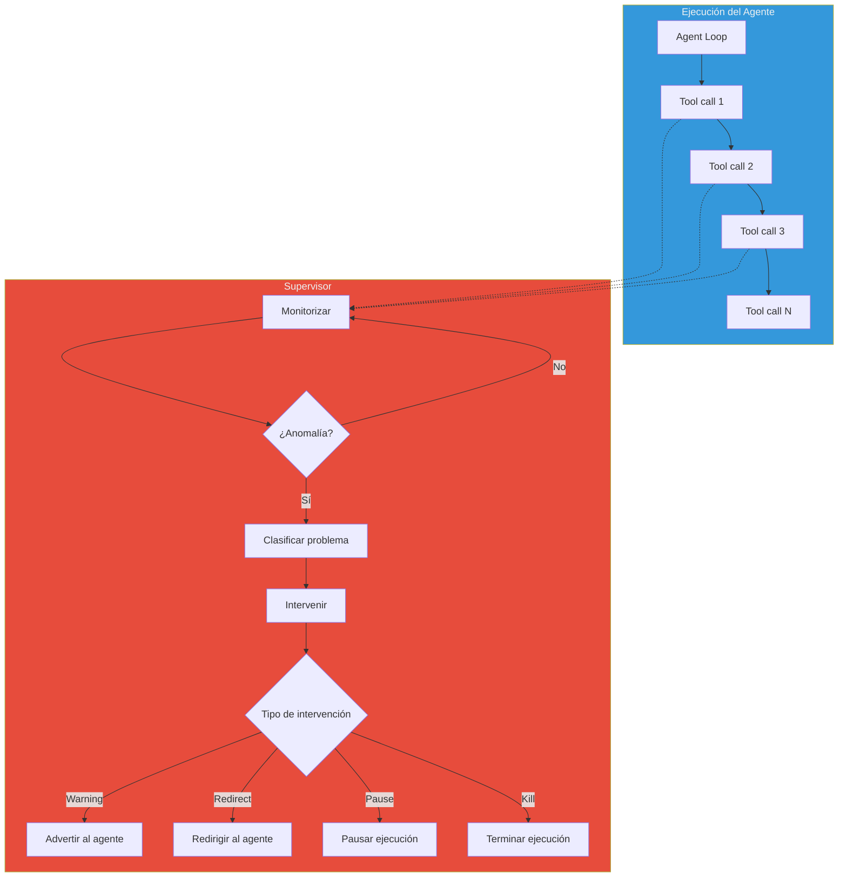
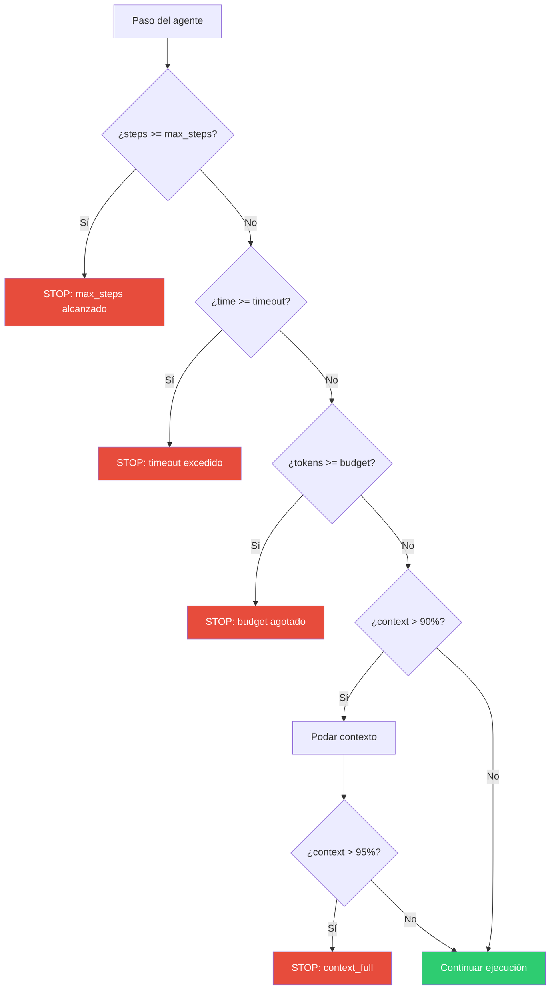
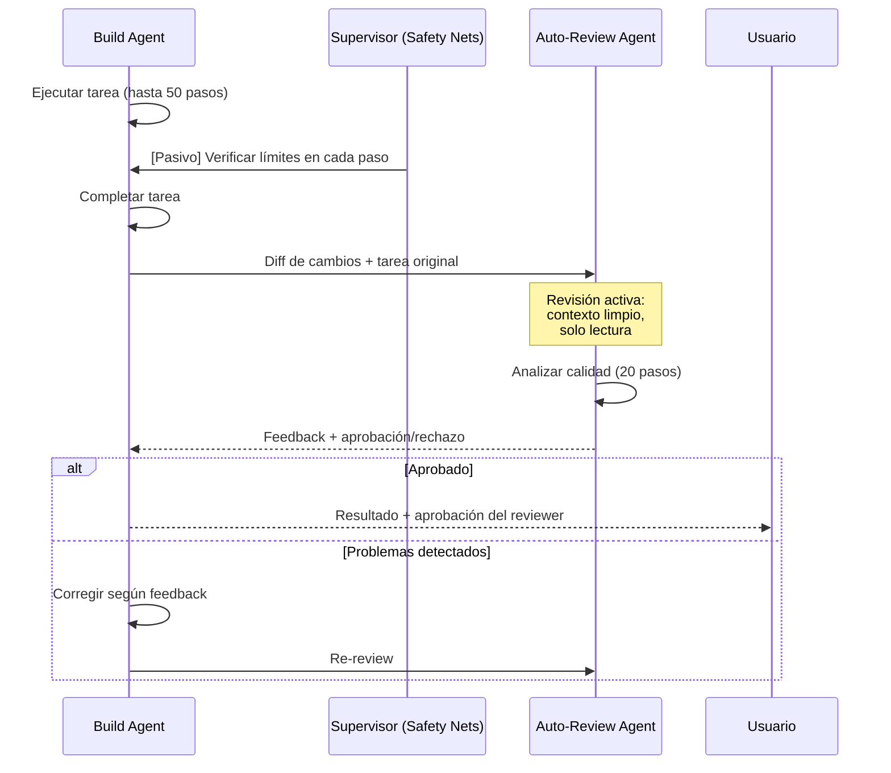
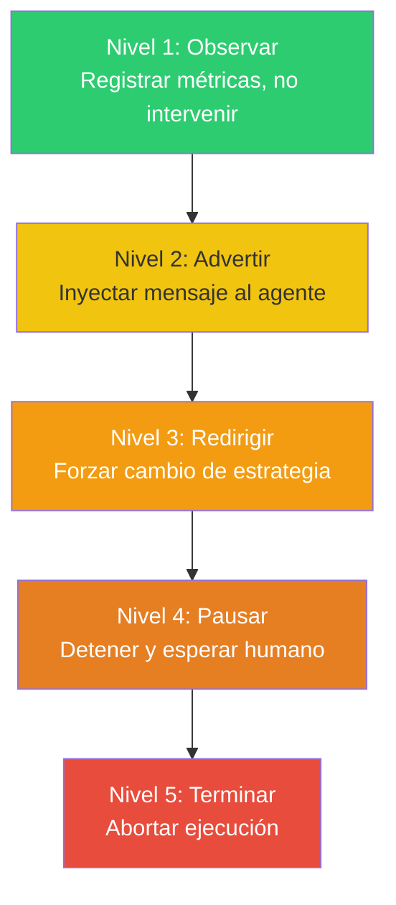

# Patrón Supervisor — Agente que Monitoriza y Corrige a Otros Agentes

> [!abstract]
> El patrón *Supervisor* introduce un ==agente cuya única responsabilidad es observar, evaluar e intervenir== en la ejecución de otros agentes. A diferencia del orquestador que asigna trabajo, el supervisor ==monitoriza el progreso, detecta estancamientos, aplica estándares de calidad y gestiona recursos==. architect implementa supervisión pasiva a través de sus safety nets (`max_steps`, `budget`, `timeout`, `context_full`) que garantizan terminación elegante, y supervisión activa con su auto-review agent que inspecciona los cambios producidos por el build agent. ^resumen

## Problema

Los agentes autónomos pueden desviarse de múltiples maneras:

1. **Drift de objetivo**: El agente se desvía de la tarea original persiguiendo tangentes.
2. **Estancamiento**: El agente repite las mismas acciones sin progresar.
3. **Degradación de calidad**: La calidad del output cae a medida que el contexto crece.
4. **Consumo excesivo de recursos**: Tokens, tiempo o llamadas API se acumulan sin resultado.
5. **Errores en cascada**: Un error temprano se propaga y amplifica en pasos posteriores.

> [!danger] Agentes sin supervisión: accidentes esperando ocurrir
> Un agente con 50 herramientas, sin límites de pasos, sin timeout y sin revisión puede estar ejecutando durante horas, gastando cientos de dólares en tokens, modificando archivos de maneras cada vez más erráticas, ==sin que nadie lo detecte hasta que el daño ya está hecho==.

## Solución

El supervisor implementa un ciclo de monitorización independiente del ciclo de ejecución del agente:



### Roles del supervisor

| Rol | Descripción | Ejemplo de intervención |
|---|---|---|
| Monitor de progreso | Detectar si el agente avanza | "Llevas 10 pasos sin cambios significativos" |
| Detector de estancamiento | Identificar loops o repeticiones | "Has ejecutado el mismo test 3 veces consecutivas" |
| Enforcer de calidad | Verificar estándares de calidad | "El último cambio degradó la cobertura de tests" |
| Gestor de recursos | Controlar consumo de tokens/tiempo | "80% del presupuesto consumido, 40% de la tarea pendiente" |
| Detector de errores | Identificar cascadas de errores | "Los últimos 5 pasos están intentando arreglar un error del paso 3" |
| Escalador | Decidir cuándo escalar a un humano | "Problema fuera del scope del agente, requiere decisión humana" |

## Supervisión pasiva en architect

architect implementa supervisión pasiva a través de safety nets que se verifican en cada iteración del [[pattern-agent-loop|agent loop]]:



> [!info] Safety nets como supervisor pasivo
> | Safety net | Qué detecta | Acción |
> |---|---|---|
> | `max_steps` | Agente atascado o tarea demasiado compleja | Terminación con resultado parcial |
> | `timeout` | Ejecución lenta o estancada | Terminación con warning |
> | `budget` | Consumo excesivo de tokens | Terminación o degradación a modelo más barato |
> | `context_full` | Contexto saturado | Poda progresiva o terminación |

Estos son supervisores "pasivos" porque ==solo verifican invariantes cuantitativos==. No evalúan la calidad de lo que el agente está haciendo, solo si está dentro de los límites.

## Supervisión activa: auto-review

El auto-review de architect es supervisión activa: un agente separado evalúa la calidad del trabajo producido.



> [!tip] La combinación de supervisión pasiva y activa es más robusta que cualquiera por separado
> - **Pasiva**: Garantiza que el agente ==no exceda recursos== (previene daño por acción).
> - **Activa**: Garantiza que el agente ==produce resultados de calidad== (previene daño por omisión).

## Patrones de intervención

### Niveles de escalación



> [!warning] La intervención debe ser proporcional al problema
> Un supervisor demasiado agresivo interrumpe constantemente al agente, reduciendo su efectividad. Un supervisor demasiado permisivo permite que los problemas se acumulen. ==Calibrar los umbrales de intervención es tan importante como implementar el supervisor==.

### Señales de intervención

| Señal | Nivel | Acción sugerida |
|---|---|---|
| 5 pasos sin cambios en archivos | 2 - Advertir | "No estás progresando, ¿necesitas replantear?" |
| Mismo test ejecutado 3+ veces | 3 - Redirigir | "Deja de reintentar; analiza el error raíz" |
| 80% del presupuesto con 50% de tarea pendiente | 2 - Advertir | "Presupuesto bajo, prioriza las partes críticas" |
| 3 errores consecutivos del mismo tipo | 3 - Redirigir | "Patrón de error detectado, cambia de enfoque" |
| Operación fuera del scope de la tarea | 4 - Pausar | "Acción no relacionada con la tarea, ¿continuar?" |
| Cambio destructivo detectado | 5 - Terminar | "Operación peligrosa bloqueada" |

## Implementación de referencia

> [!example]- Supervisor activo con métricas
> ```python
> from dataclasses import dataclass, field
> from typing import List
> import time
>
> @dataclass
> class SupervisorMetrics:
>     steps: int = 0
>     tool_calls: int = 0
>     files_changed: set = field(default_factory=set)
>     errors: List[str] = field(default_factory=list)
>     tokens_used: int = 0
>     start_time: float = field(default_factory=time.time)
>     last_progress_step: int = 0
>     repeated_actions: dict = field(default_factory=dict)
>
> class AgentSupervisor:
>     def __init__(self, config: dict):
>         self.config = config
>         self.metrics = SupervisorMetrics()
>
>     def observe(self, step: dict) -> str | None:
>         """Observa cada paso del agente. Retorna intervención o None."""
>         self.metrics.steps += 1
>
>         # Detectar estancamiento
>         if step.get("tool_name"):
>             action_key = f"{step['tool_name']}:{step.get('args_hash')}"
>             self.metrics.repeated_actions[action_key] = (
>                 self.metrics.repeated_actions.get(action_key, 0) + 1
>             )
>             if self.metrics.repeated_actions[action_key] >= 3:
>                 return self._intervene(
>                     level=3,
>                     message=f"Acción repetida {action_key} 3+ veces. "
>                             "Intenta un enfoque diferente."
>                 )
>
>         # Detectar falta de progreso
>         if step.get("files_changed"):
>             self.metrics.files_changed.update(step["files_changed"])
>             self.metrics.last_progress_step = self.metrics.steps
>         elif self.metrics.steps - self.metrics.last_progress_step > 5:
>             return self._intervene(
>                 level=2,
>                 message="5 pasos sin cambios en archivos. "
>                         "¿Necesitas replantear tu enfoque?"
>             )
>
>         # Detectar errores en cascada
>         if step.get("error"):
>             self.metrics.errors.append(step["error"])
>             if len(self.metrics.errors) >= 3:
>                 recent = self.metrics.errors[-3:]
>                 if self._similar_errors(recent):
>                     return self._intervene(
>                         level=3,
>                         message="3 errores similares consecutivos. "
>                                 "Analiza la causa raíz en lugar de reintentar."
>                     )
>
>         # Verificar recursos
>         budget_used = self.metrics.tokens_used / self.config["budget"]
>         if budget_used > 0.8:
>             return self._intervene(
>                 level=2,
>                 message=f"80% del presupuesto usado. "
>                         f"Prioriza completar las partes críticas."
>             )
>
>         return None
>
>     def _intervene(self, level: int, message: str) -> str:
>         if level >= 5:
>             raise AgentTerminated(message)
>         if level >= 4:
>             raise AgentPaused(message)
>         return f"[SUPERVISOR L{level}] {message}"
> ```

## Cuándo usar

> [!success] Escenarios ideales para supervisor
> - Agentes autónomos con acceso a operaciones de alto impacto.
> - Ejecuciones largas (> 20 pasos) donde la degradación es probable.
> - Sistemas multi-agente donde los agentes pueden interferirse.
> - Entornos de producción donde los errores tienen coste real.
> - Cuando el presupuesto de tokens es limitado y debe optimizarse.
> - Agentes que operan sin supervisión humana directa.

## Cuándo NO usar

> [!failure] Escenarios donde el supervisor es innecesario
> - **Tareas cortas**: Un agente que ejecuta 5 pasos no necesita supervisión.
> - **Entornos sandboxed**: Si el agente no puede causar daño, la supervisión es overhead.
> - **HITL completo**: Si un humano revisa cada paso, el supervisor es redundante.
> - **Tareas deterministas**: Si el flujo es predecible, un pipeline basta.

## Trade-offs

| Ventaja | Desventaja |
|---|---|
| Previene estancamiento y drift | Overhead de monitorización |
| Gestión proactiva de recursos | Complejidad de implementación |
| Detección temprana de problemas | Falsos positivos pueden interrumpir al agente |
| Escalación automática a humanos | Requiere calibración de umbrales |
| Audit trail de intervenciones | El supervisor consume tokens adicionales (si usa LLM) |
| Complementa safety nets pasivos | Puede crear dependencia (agentes menos autónomos) |

> [!question] ¿El supervisor debería usar un LLM?
> Depende del tipo de supervisión:
> - **Métricas cuantitativas** (steps, tokens, tiempo): Código determinista, sin LLM.
> - **Detección de patrones** (repetición, estancamiento): Heurísticas simples, sin LLM.
> - **Evaluación de calidad** (¿el output es bueno?): LLM como evaluador, con coste.
> - **Decisión de intervención** (¿debo pausar?): LLM para casos ambiguos.
>
> ==Empieza con supervisión determinista y añade LLM solo donde aporta valor==.

## Patrones relacionados

- [[pattern-agent-loop]]: El supervisor observa y condiciona el agent loop.
- [[pattern-orchestrator]]: El orquestador asigna trabajo; el supervisor asegura que se hace bien.
- [[pattern-human-in-loop]]: El supervisor puede escalar al humano cuando detecta problemas.
- [[pattern-guardrails]]: Los guardrails bloquean acciones peligrosas; el supervisor detecta patrones de comportamiento.
- [[pattern-evaluator]]: El supervisor usa evaluadores para medir calidad.
- [[pattern-reflection]]: La reflexión es auto-supervisión; el supervisor es supervisión externa.
- [[pattern-circuit-breaker]]: El supervisor puede actuar como circuit breaker para el agente.
- [[pattern-pipeline]]: El supervisor monitoriza la ejecución de todo el pipeline.

## Relación con el ecosistema

[[architect-overview|architect]] combina supervisión pasiva (safety nets: max_steps, budget, timeout, context_full) con supervisión activa (auto-review agent). Las safety nets se verifican en cada iteración del loop y garantizan terminación. El auto-review agent inspecciona el resultado completo con contexto limpio después de que el build agent termina.

[[vigil-overview|vigil]] actúa como supervisor de contenido: sus 26 reglas y 4 analizadores monitorean la calidad de cada output, proporcionando señales que un supervisor de nivel superior puede usar para decidir intervenciones.

[[intake-overview|intake]] puede beneficiarse de supervisión cuando normaliza requisitos complejos, detectando cuando el agente se desvía de los requisitos originales.

[[licit-overview|licit]] implementa supervisión regulatoria: monitorea que todos los agentes operen dentro de los marcos de compliance, generando alertas cuando se detectan violaciones potenciales.

## Enlaces y referencias

> [!quote]- Bibliografía
> - Anthropic. (2024). *Building effective agents — Supervision patterns*. Patrones de supervisión para agentes.
> - OpenAI. (2024). *Safety best practices for AI agents*. Mejores prácticas de seguridad para agentes.
> - Russell, S. & Norvig, P. (2021). *Artificial Intelligence: A Modern Approach*. 4th ed. Capítulo sobre agentes y supervisión.
> - Amodei, D. et al. (2016). *Concrete Problems in AI Safety*. Problemas concretos de seguridad en IA que el supervisor aborda.
> - Hadfield-Menell, D. et al. (2017). *The Off-Switch Game*. Formalización del problema de terminación de agentes.

---

> [!tip] Navegación
> - Anterior: [[pattern-speculative-execution]]
> - Siguiente: [[patterns-overview]] (volver al índice)
> - Índice: [[patterns-overview]]
