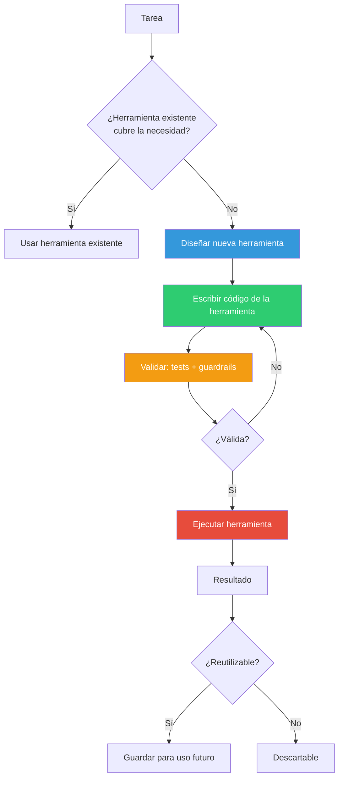
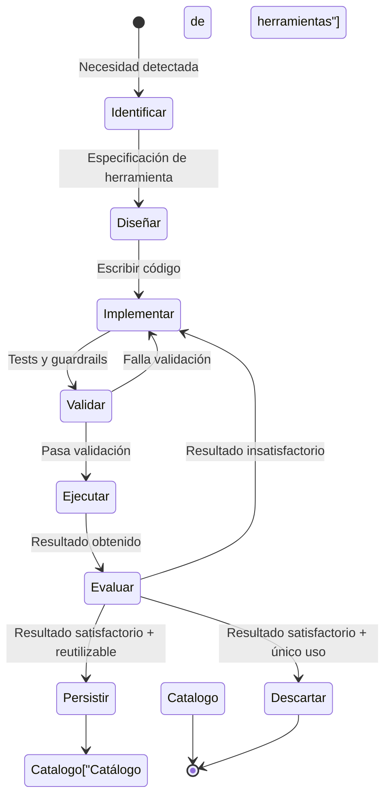
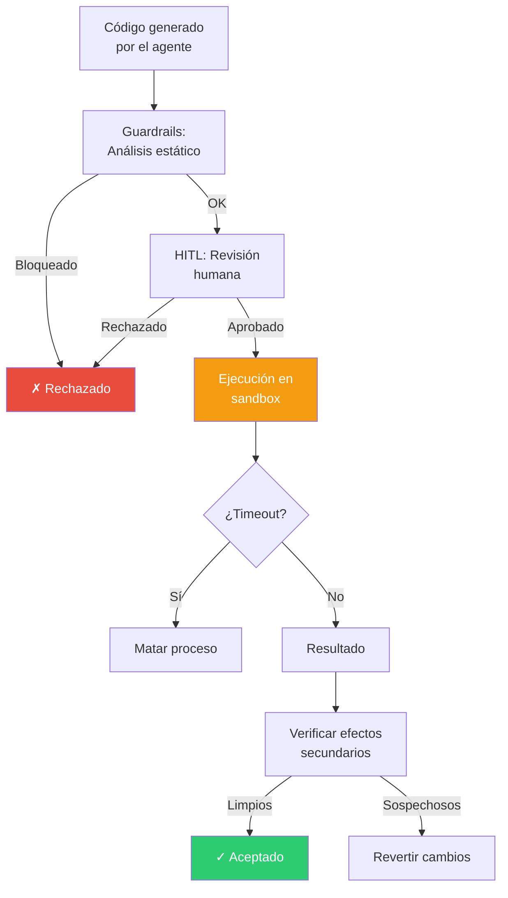

# Patrón Tool-Making Agents — Agentes que Crean sus Propias Herramientas

> [!abstract]
> El patrón *Tool-Making* permite que un agente ==cree herramientas nuevas en tiempo de ejecución== cuando las herramientas predefinidas son insuficientes para la tarea. En lugar de estar limitado a un conjunto fijo de funciones, el agente puede ==escribir scripts, crear wrappers de API, construir utilidades y reutilizarlas==. Es el patrón más potente y el más peligroso: otorga al agente capacidad de meta-programación. architect implementa esto a través de su herramienta `run_command`, que permite ejecutar código arbitrario, efectivamente creando herramientas *ad-hoc*. ^resumen

## Problema

Las herramientas predefinidas de un agente son finitas y no pueden anticipar todas las necesidades:

- **APIs no cubiertas**: El agente necesita interactuar con un servicio para el que no tiene herramienta.
- **Transformaciones específicas**: Procesar datos en un formato particular que ninguna herramienta maneja.
- **Operaciones compuestas**: Combinar múltiples operaciones en un flujo que se repite frecuentemente.
- **Dominio nuevo**: Tareas en un dominio para el que no se diseñaron herramientas.

> [!warning] La limitación del conjunto fijo de herramientas
> Un agente con 10 herramientas predefinidas solo puede resolver problemas que esas 10 herramientas cubren. Un agente que puede ==crear herramientas tiene, en teoría, herramientas infinitas==. Pero esta capacidad viene con riesgos proporcionalmente mayores.

## Solución

El agente identifica que necesita una herramienta que no existe, la implementa como código, la valida y la ejecuta:



### Tipos de herramientas que un agente puede crear

| Tipo | Ejemplo | Complejidad | Riesgo |
|---|---|---|---|
| Script de una sola ejecución | Parsear un CSV específico | Baja | Bajo |
| Wrapper de API | Cliente para una API REST | Media | Medio |
| Utilidad reutilizable | Formateador de datos | Media | Bajo |
| Pipeline de datos | ETL completo | Alta | Alto |
| Extensión de herramienta | Plugin para herramienta existente | Alta | Medio |
| Test automatizado | Suite de verificación | Media | Bajo |

## Ciclo de vida de una herramienta creada



## Implementación en architect

architect no tiene una funcionalidad explícita de "crear herramientas", pero su herramienta `run_command` permite ==ejecutar cualquier código==, lo que efectivamente habilita tool-making:

> [!example]- Ejemplo de tool-making en architect
> ```python
> # El agente necesita analizar la complejidad ciclomática
> # de un módulo Python, pero no tiene herramienta para eso.
>
> # Paso 1: El agente escribe un script de análisis
> analysis_script = '''
> import ast
> import sys
>
> class ComplexityVisitor(ast.NodeVisitor):
>     def __init__(self):
>         self.complexity = {}
>
>     def visit_FunctionDef(self, node):
>         complexity = 1  # Base
>         for child in ast.walk(node):
>             if isinstance(child, (ast.If, ast.While, ast.For,
>                                   ast.ExceptHandler, ast.With,
>                                   ast.BoolOp)):
>                 complexity += 1
>             if isinstance(child, ast.BoolOp):
>                 complexity += len(child.values) - 1
>         self.complexity[node.name] = complexity
>         self.generic_visit(node)
>
> with open(sys.argv[1]) as f:
>     tree = ast.parse(f.read())
>
> visitor = ComplexityVisitor()
> visitor.visit(tree)
>
> for func, cc in sorted(visitor.complexity.items(),
>                         key=lambda x: x[1], reverse=True):
>     print(f"{func}: {cc}")
> '''
>
> # Paso 2: El agente guarda el script
> # run_command: echo '...' > /tmp/analyze_complexity.py
>
> # Paso 3: El agente lo ejecuta
> # run_command: python /tmp/analyze_complexity.py src/agent.py
>
> # Paso 4: Si es útil, el agente lo guarda en el proyecto
> # como herramienta reutilizable
> ```

> [!danger] Riesgos de ejecución de código arbitrario
> El tool-making implica que el agente ==ejecuta código que él mismo escribió==. Esto es inherentemente peligroso:
>
> 1. **Inyección**: El agente podría escribir código malicioso (accidental o por prompt injection).
> 2. **Escalación de privilegios**: El código ejecutado tiene los permisos del proceso del agente.
> 3. **Efectos secundarios**: El código puede modificar el sistema de archivos, red, o estado del sistema.
> 4. **Recursión**: El agente podría crear herramientas que crean herramientas (meta-meta-programación descontrolada).

### Mitigaciones de seguridad

> [!tip] Capas de protección para tool-making
> 1. **Sandboxing**: Ejecutar código creado en contenedores aislados.
> 2. **[[pattern-guardrails|Guardrails]]**: Validar el código antes de ejecutar (no secretos, no operaciones de red no autorizadas, no acceso al sistema).
> 3. **[[pattern-human-in-loop|HITL]]**: Requerir aprobación humana antes de ejecutar código generado.
> 4. **Timeouts estrictos**: Limitar tiempo de ejecución del código creado.
> 5. **Recursos limitados**: Caps en memoria, CPU y disk I/O.
> 6. **Revisión post-ejecución**: Verificar que el código no dejó efectos secundarios inesperados.



## Persistencia y reutilización

> [!info] Herramientas efímeras vs persistentes
> - **Efímeras**: Scripts de un solo uso que se descartan después de ejecutar. La mayoría de herramientas creadas son efímeras.
> - **Persistentes**: Herramientas que se guardan para reutilización futura. Requieren documentación, tests y versionado.

La conexión con [[pattern-memory]] es directa: las herramientas persistentes son una forma de *procedural memory* — el agente "aprende" a hacer algo y lo recuerda para la próxima vez.

| Aspecto | Efímera | Persistente |
|---|---|---|
| Duración | Una ejecución | Múltiples sesiones |
| Ubicación | /tmp | Directorio del proyecto |
| Documentación | Ninguna | Docstring + README |
| Testing | Validación inmediata | Tests unitarios |
| Mantenimiento | Ninguno | Actualizaciones periódicas |

## Cuándo usar

> [!success] Escenarios ideales para tool-making
> - El agente necesita interactuar con APIs o formatos no cubiertos por herramientas existentes.
> - Tareas de análisis de datos ad-hoc que requieren transformaciones específicas.
> - Automatización de workflows repetitivos que el agente identifica.
> - Cuando añadir herramientas predefinidas no es práctico (demasiadas variantes).
> - Proyectos que necesitan scripts de utilidad como parte del deliverable.

## Cuándo NO usar

> [!failure] Escenarios donde tool-making es innecesario o peligroso
> - **Herramienta existente disponible**: Si una herramienta predefinida cubre la necesidad, úsala.
> - **Entornos sin sandboxing**: Sin aislamiento, el código generado puede dañar el sistema.
> - **Tareas simples**: No crear un script para algo que una llamada API directa resuelve.
> - **Requisitos de auditabilidad estrictos**: Código generado dinámicamente es difícil de auditar.
> - **Producción sin supervisión**: Agentes autónomos creando y ejecutando código en producción es una receta para incidentes.

## Trade-offs

| Ventaja | Desventaja |
|---|---|
| Herramientas ilimitadas para cualquier necesidad | Riesgo de seguridad por ejecución de código |
| Adaptación a tareas imprevistas | Calidad variable del código generado |
| Reutilización con persistencia | Dificultad de mantenimiento de herramientas generadas |
| Meta-capacidad: el agente se auto-mejora | Complejidad de sandboxing |
| Reduce la necesidad de anticipar todas las herramientas | Debugging difícil de herramientas creadas |
| Permite soluciones creativas | Potencial de loops recursivos incontrolados |

> [!question] ¿Cuándo un agente debería crear vs pedir una herramienta?
> Si la herramienta será usada más de una vez o por otros agentes, es mejor que un humano la cree formalmente. El tool-making es para ==necesidades inmediatas y específicas que no justifican desarrollo formal==.

## Patrones relacionados

- [[pattern-agent-loop]]: El tool-making ocurre dentro del agent loop como una meta-acción.
- [[pattern-guardrails]]: Críticos para validar código generado antes de ejecutar.
- [[pattern-human-in-loop]]: Aprobación humana para código generado en contextos sensibles.
- [[pattern-reflection]]: El agente reflexiona sobre la herramienta creada para mejorarla.
- [[pattern-memory]]: Las herramientas persistentes son una forma de memoria procedimental.
- [[pattern-supervisor]]: El supervisor puede restringir qué tipos de herramientas se crean.
- [[pattern-evaluator]]: Evaluar la calidad del código generado como herramienta.
- [[anti-patterns-ia]]: Crear herramientas sin guardrails es un anti-patrón peligroso.

## Relación con el ecosistema

[[architect-overview|architect]] habilita tool-making a través de `run_command`, que ejecuta cualquier comando shell. Esto permite al agente escribir scripts Python, bash, o cualquier otro lenguaje, guardarlos y ejecutarlos. Los worktrees de git proporcionan aislamiento parcial para el código generado.

[[vigil-overview|vigil]] debe validar tanto el código generado (análisis estático) como los resultados de ejecutarlo (validación de output). Sus reglas de seguridad son especialmente relevantes para detectar código potencialmente peligroso.

[[licit-overview|licit]] impone restricciones sobre qué tipo de código puede generarse y ejecutarse según políticas de compliance. En entornos regulados, el tool-making puede estar restringido o requerir aprobación documentada.

[[intake-overview|intake]] puede generar especificaciones que incluyan la necesidad de herramientas custom, que architect luego implementa via tool-making.

## Enlaces y referencias

> [!quote]- Bibliografía
> - Cai, T. et al. (2023). *Large Language Models as Tool Makers*. Paper que formaliza el patrón de LLMs creando herramientas.
> - Qian, C. et al. (2023). *CREATOR: Tool Creation for Disentangling Abstract and Concrete Reasoning of Large Language Models*. Framework para creación de herramientas.
> - Yuan, Z. et al. (2023). *CRAFT: Customizing LLMs by Creating and Retrieving from Specialized Toolsets*. Catálogos de herramientas generadas.
> - Schick, T. et al. (2023). *Toolformer: Language Models Can Teach Themselves to Use Tools*. Aprendizaje autónomo de uso de herramientas.
> - Wang, X. et al. (2024). *GEAR: Augmenting Language Models with Generalizable and Efficient Tool Resolution*. Resolución eficiente de herramientas.

---

> [!tip] Navegación
> - Anterior: [[pattern-reflection]]
> - Siguiente: [[pattern-memory]]
> - Índice: [[patterns-overview]]
