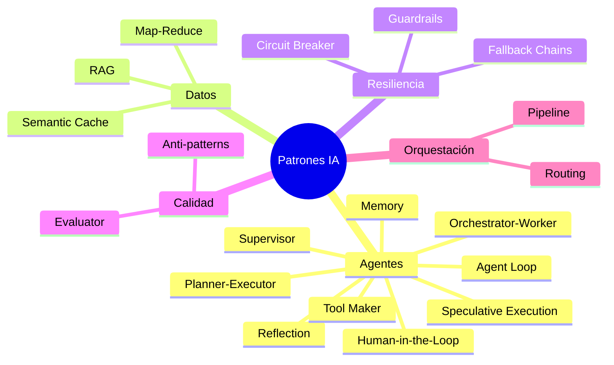
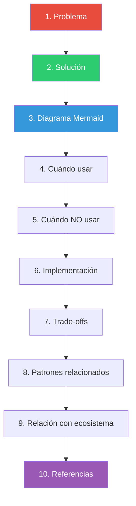
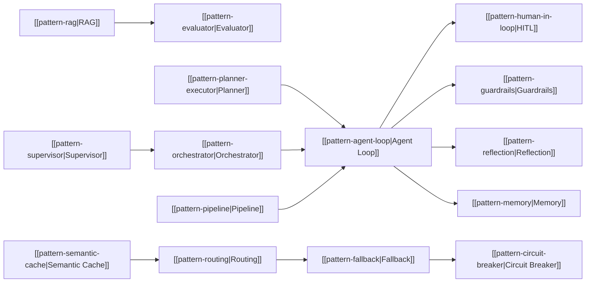

# Catálogo de Patrones de Arquitectura IA

> [!abstract]
> Este documento es la ==puerta de entrada al catálogo de patrones de arquitectura== para sistemas de inteligencia artificial. Clasifica los patrones en cinco categorías: agentes, datos, resiliencia, calidad y orquestación. Cada patrón sigue una estructura estandarizada de ==Problema → Solución → Cuándo usar → Cuándo NO usar → Implementación → Trade-offs → Patrones relacionados==. El catálogo está diseñado para equipos que construyen sistemas productivos con LLMs. ^resumen

## Qué es un patrón de arquitectura IA

Un *design pattern* en el contexto de sistemas de inteligencia artificial es una solución reutilizable a un problema recurrente que surge al construir aplicaciones basadas en modelos de lenguaje (*Large Language Models*, LLMs). A diferencia de los patrones clásicos de software (GoF, enterprise patterns), los patrones IA lidian con la ==naturaleza probabilística== de los modelos generativos[^1].

> [!info] Origen de los patrones
> Los patrones de este catálogo no provienen de un único libro o framework. Son destilaciones de la experiencia colectiva de la comunidad de ingeniería de IA, combinadas con lecciones específicas del ecosistema [[architect-overview|architect]], [[vigil-overview|vigil]], [[licit-overview|licit]] e [[intake-overview|intake]].

### Diferencias con patrones de software clásicos

| Aspecto | Patrones clásicos | Patrones IA |
|---|---|---|
| Determinismo | Entrada → Salida predecible | Entrada → Salida probabilística |
| Testing | Unit tests directos | Evaluaciones estadísticas |
| Costes | CPU/memoria fijos | Tokens variables, costes por llamada |
| Latencia | Milisegundos | Segundos a minutos |
| Fallos | Excepciones tipadas | Alucinaciones, drift, incoherencia |
| Seguridad | Validación de inputs | Validación de inputs Y outputs |

## Categorías de patrones

### 1. Patrones de agentes

Los patrones de agentes definen cómo los sistemas autónomos o semi-autónomos toman decisiones y ejecutan acciones.

| Patrón | Dificultad | Problema que resuelve |
|---|---|---|
| [[pattern-agent-loop\|Agent Loop]] | Intermedio | Tareas complejas que requieren múltiples pasos |
| [[pattern-human-in-loop\|Human-in-the-Loop]] | Intermedio | Operaciones sensibles que necesitan supervisión |
| [[pattern-reflection\|Reflection]] | Avanzado | Outputs subóptimos en el primer intento |
| [[pattern-tool-maker\|Tool Maker]] | Avanzado | Herramientas predefinidas insuficientes |
| [[pattern-memory\|Memory]] | Intermedio | Agentes que olvidan entre sesiones |
| [[pattern-planner-executor\|Planner-Executor]] | Intermedio | Tareas complejas sin estrategia clara |
| [[pattern-orchestrator\|Orchestrator]] | Avanzado | Subtareas diversas que necesitan especialistas |
| [[pattern-supervisor\|Supervisor]] | Avanzado | Agentes autónomos que pueden desviarse |
| [[pattern-speculative-execution\|Speculative Execution]] | Avanzado | Incertidumbre sobre el mejor enfoque |

> [!tip] Punto de partida recomendado
> Si estás comenzando con agentes, empieza por [[pattern-agent-loop]] y [[pattern-human-in-loop]]. Son los cimientos sobre los que se construyen todos los demás patrones de agentes.

### 2. Patrones de datos

Los patrones de datos manejan cómo los LLMs acceden, procesan y almacenan información.

| Patrón | Dificultad | Problema que resuelve |
|---|---|---|
| [[pattern-rag\|RAG]] | Intermedio | LLMs sin conocimiento actual o específico |
| [[pattern-semantic-cache\|Semantic Cache]] | Intermedio | Consultas repetitivas desperdician tokens |
| [[pattern-map-reduce\|Map-Reduce]] | Intermedio | Documentos que exceden la ventana de contexto |

### 3. Patrones de resiliencia

Los patrones de resiliencia aseguran que el sistema funcione correctamente incluso cuando componentes fallan.

| Patrón | Dificultad | Problema que resuelve |
|---|---|---|
| [[pattern-fallback\|Fallback Chains]] | Intermedio | APIs de LLM fallan o degradan |
| [[pattern-circuit-breaker\|Circuit Breaker]] | Avanzado | Degradación causa fallos en cascada |
| [[pattern-guardrails\|Guardrails]] | Intermedio | Outputs impredecibles del LLM |

### 4. Patrones de calidad

| Patrón | Dificultad | Problema que resuelve |
|---|---|---|
| [[pattern-evaluator\|Evaluator]] | Intermedio | Necesidad de evaluación automatizada |
| [[anti-patterns-ia\|Anti-patterns]] | Intermedio | Errores comunes a evitar |

### 5. Patrones de orquestación

| Patrón | Dificultad | Problema que resuelve |
|---|---|---|
| [[pattern-pipeline\|Pipeline]] | Intermedio | Workflows complejos con validación entre etapas |
| [[pattern-routing\|Routing]] | Intermedio | Ningún modelo es óptimo para todo |

## Cómo leer las notas de patrones

Cada nota de patrón sigue una estructura estandarizada:

> [!warning] Estructura obligatoria
> Todas las notas de patrones DEBEN seguir esta estructura. Si encuentras una nota sin alguna sección, considera que está incompleta y necesita revisión.

### Convenciones de nomenclatura

- **Archivos**: `pattern-nombre-del-patron.md`
- **Anti-patrones**: `anti-patterns-ia.md`
- **Este índice**: `patterns-overview.md`
- **Wikilinks**: `[[pattern-nombre|Nombre legible]]`

### Niveles de dificultad

> [!example] Escala de dificultad
> - **Beginner**: Conceptos fundamentales. No requiere experiencia previa con LLMs en producción.
> - **Intermediate**: Requiere familiaridad con al menos un framework de agentes y conceptos básicos de LLMs.
> - **Advanced**: Patrones para sistemas en producción con requisitos de escala, resiliencia o multi-agente.

## Cuándo los patrones ayudan vs sobreingeniería

> [!danger] Síndrome del astronauta de la arquitectura
> No todo sistema IA necesita todos los patrones. Un chatbot simple NO necesita circuit breakers, supervisores ni ejecución especulativa. Aplica patrones cuando el problema que resuelven realmente existe en tu sistema.

### Señales de que necesitas un patrón

| Señal | Patrón sugerido |
|---|---|
| El LLM alucina con datos de tu dominio | [[pattern-rag]] |
| Las tareas requieren múltiples herramientas | [[pattern-agent-loop]] |
| Los agentes hacen operaciones destructivas | [[pattern-human-in-loop]], [[pattern-guardrails]] |
| La API del LLM falla intermitentemente | [[pattern-fallback]], [[pattern-circuit-breaker]] |
| Las respuestas del primer intento son mediocres | [[pattern-reflection]], [[pattern-evaluator]] |
| Pagas mucho en tokens repetitivos | [[pattern-semantic-cache]] |
| Los documentos no caben en el contexto | [[pattern-map-reduce]] |
| Necesitas workflow reproducibles | [[pattern-pipeline]] |

### Señales de sobreingeniería

> [!warning] Antipatrones de adopción
> - Implementar [[pattern-orchestrator]] cuando un solo agente basta.
> - Añadir [[pattern-circuit-breaker]] cuando usas un solo modelo con baja carga.
> - Implementar [[pattern-semantic-cache]] cuando las consultas son únicas.
> - Usar [[pattern-speculative-execution]] cuando el presupuesto es limitado.

## Lenguaje de patrones para sistemas IA

Un *pattern language* conecta patrones individuales en un sistema coherente. Los patrones de este catálogo no son independientes; forman una red de soluciones complementarias.

## Relación con el ecosistema

Cada patrón de este catálogo tiene implementaciones concretas en el ecosistema:

| Componente | Patrones principales |
|---|---|
| [[architect-overview\|architect]] | [[pattern-agent-loop]], [[pattern-planner-executor]], [[pattern-reflection]], [[pattern-pipeline]], [[pattern-speculative-execution]] |
| [[vigil-overview\|vigil]] | [[pattern-guardrails]], [[pattern-evaluator]] |
| [[licit-overview\|licit]] | [[pattern-pipeline]] (compliance gates), [[pattern-human-in-loop]] |
| [[intake-overview\|intake]] | [[pattern-rag]], [[pattern-pipeline]] |

> [!success] Ecosistema integrado
> El verdadero poder de estos patrones emerge cuando se combinan. Por ejemplo, architect usa [[pattern-agent-loop]] con [[pattern-guardrails]] (delegando en vigil) dentro de un [[pattern-pipeline]] con [[pattern-human-in-loop]] según el modo de confirmación.

## Mapa de madurez

> [!question] ¿Qué tan maduro es cada patrón?
> No todos los patrones tienen el mismo nivel de adopción en la industria.

| Madurez | Patrones |
|---|---|
| Establecido (amplia adopción) | RAG, Agent Loop, Guardrails, Pipeline |
| Maduro (adopción creciente) | Human-in-the-Loop, Fallback, Evaluator, Routing |
| Emergente (adopción temprana) | Reflection, Memory, Orchestrator, Planner-Executor |
| Experimental (en exploración) | Tool Maker, Speculative Execution, Supervisor, Semantic Cache, Circuit Breaker |

## Enlaces y referencias

> [!quote]- Bibliografía
> - [^1]: Alexander, C. (1977). *A Pattern Language*. Oxford University Press. Concepto original de pattern language aplicado aquí a sistemas IA.
> - Anthropic. (2024). *Building effective agents*. Referencia fundamental para patrones de agentes.
> - Google. (2024). *Agents white paper*. Clasificación de patrones agénticos.
> - LangChain. (2024). *Agent architectures*. Framework de referencia para implementaciones.
> - Microsoft. (2024). *AutoGen: Enabling Next-Gen LLM Applications*. Patrones multi-agente.
> - Harrison Chase. (2024). *Cognitive Architecture for Language Agents (CoALA)*. Taxonomía de agentes.

[^1]: Christopher Alexander introdujo el concepto de *pattern language* en arquitectura física. Aquí lo adaptamos a arquitectura de sistemas de inteligencia artificial.

---

> [!tip] Navegación
> - Siguiente lectura recomendada: [[pattern-agent-loop]]
> - Para anti-patrones: [[anti-patterns-ia]]
> - Volver al MOC: [[moc-patrones]]
