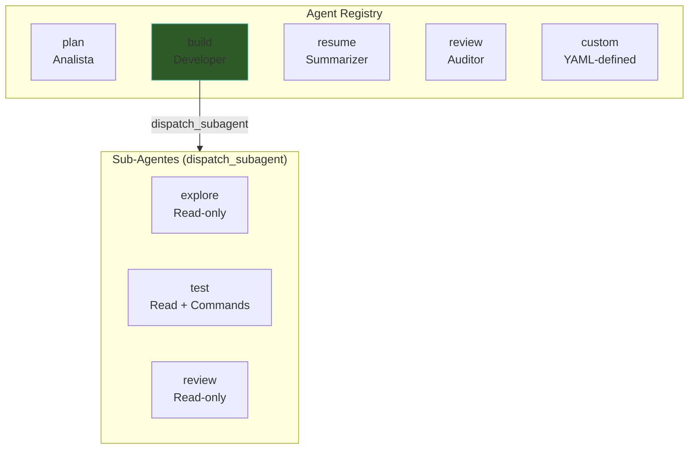
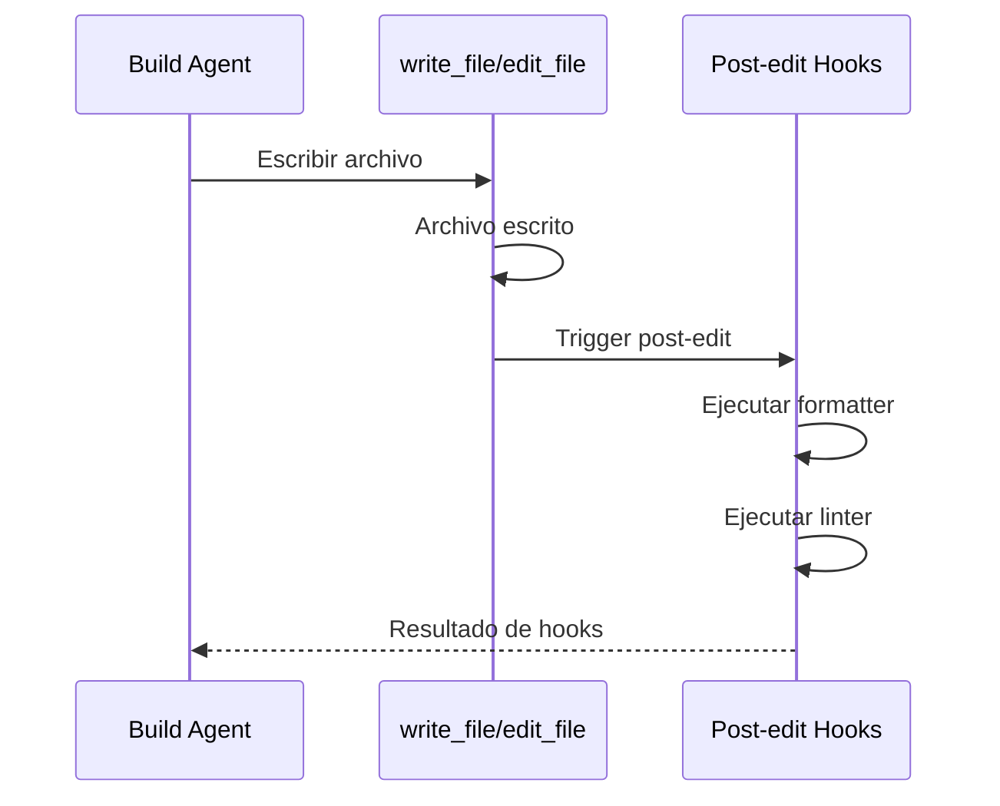
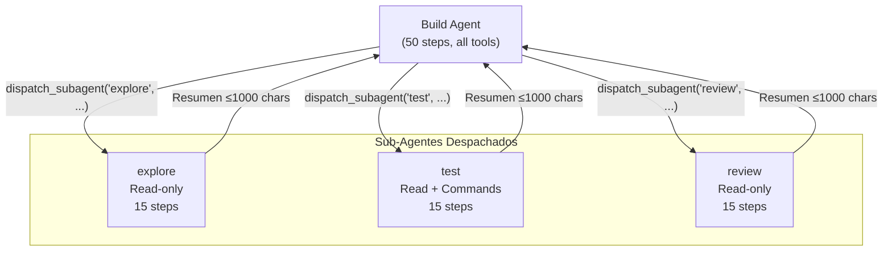
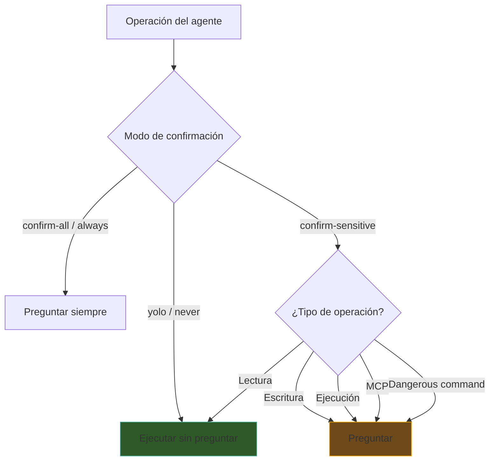
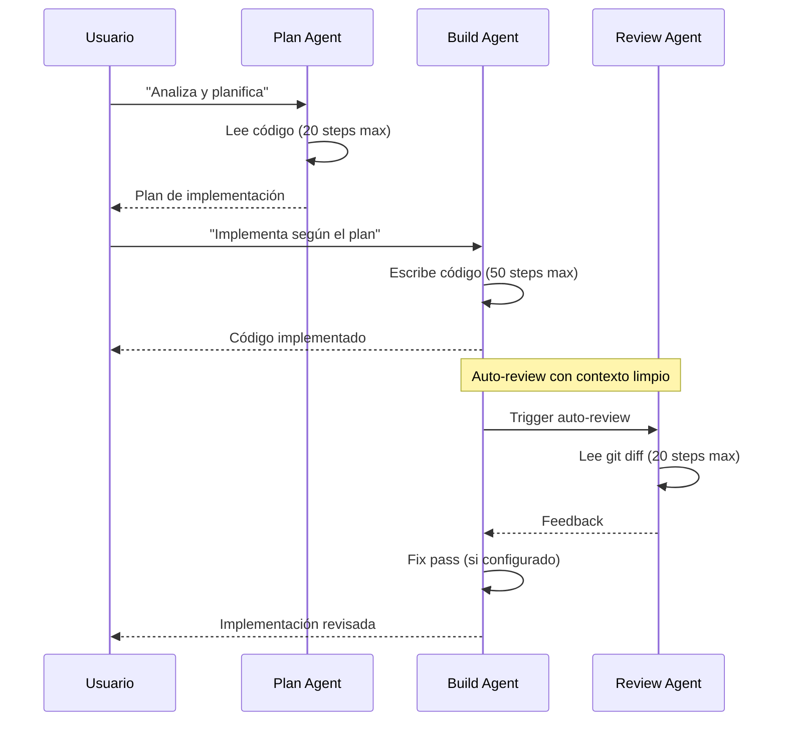
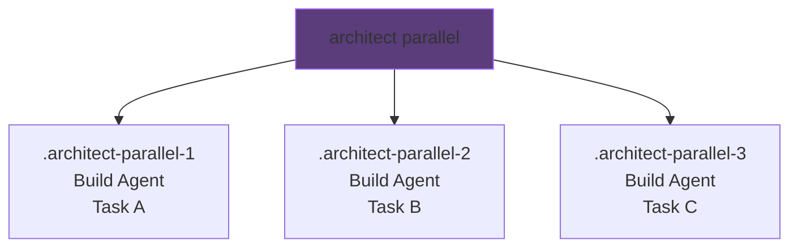

# Architect — Sistema de Agentes

> [!abstract] Resumen
> Architect tiene ==4 agentes built-in== (plan, build, resume, review) con roles, permisos y límites específicos. El agente build puede despachar ==3 tipos de sub-agentes== (explore, test, review) con máximo 15 steps y resúmenes de 1000 caracteres. Los agentes custom se definen en ==archivos YAML== con sistema prompt, herramientas permitidas, y modo de confirmación configurables. Cada agente opera con su propio conjunto de ==permisos y safety nets==. ^resumen

---

## Arquitectura del Sistema de Agentes



---

## 4 Agentes Built-in

### Plan — El Analista

| Propiedad | Valor |
|-----------|-------|
| Rol | ==Analista== |
| Permisos | Read-only |
| Max Steps | 20 |
| Herramientas | `read_file`, `list_files`, `search_code`, `grep`, `find_files` |
| Confirmación | No requiere (solo lee) |

> [!info] Cuándo usar plan
> El agente plan es ideal para:
> - Analizar una base de código antes de implementar
> - Entender la arquitectura existente
> - Identificar patrones y convenciones
> - ==Generar un plan de implementación== que build pueda seguir
>
> Al ser read-only, es ==completamente seguro==: no puede modificar archivos ni ejecutar comandos.

```bash
architect run plan "Analyze this codebase and propose a refactoring strategy"
```

---

### Build — El Developer

| Propiedad | Valor |
|-----------|-------|
| Rol | ==Developer== |
| Permisos | ==Todos== (lectura, escritura, ejecución, delegación) |
| Max Steps | ==50== |
| Herramientas | Las 11 herramientas |
| Confirmación | Según modo (yolo/confirm-all/confirm-sensitive) |
| Hooks especiales | ==Post-edit hooks== |

> [!danger] El agente más poderoso
> Build tiene acceso a ==todas las herramientas== incluyendo `write_file`, `delete_file`, `run_command`, y `dispatch_subagent`. Esto lo hace el agente más poderoso y potencialmente ==más peligroso==. Siempre:
> - Configura un `--budget` cuando uses build
> - Usa `--mode confirm-sensitive` en primera ejecución
> - Revisa los archivos modificados después

```bash
architect run build "Implement the authentication module" --budget 2.00
```

### Post-edit Hooks del Build

Después de cada operación de escritura de archivos, build ejecuta ==hooks post-edición==:



> [!example]- Configurar post-edit hooks
> ```yaml
> # .architect/config.yaml
> agents:
>   build:
>     post_edit_hooks:
>       - pattern: "*.py"
>         command: "ruff format {file}"
>       - pattern: "*.ts"
>         command: "prettier --write {file}"
>       - pattern: "*.rs"
>         command: "rustfmt {file}"
> ```

---

### Resume — El Summarizer

| Propiedad | Valor |
|-----------|-------|
| Rol | ==Summarizer== |
| Permisos | Read-only |
| Max Steps | 15 |
| Herramientas | `read_file`, `list_files`, `search_code`, `grep`, `find_files` |
| Confirmación | No requiere |

> [!tip] Continuidad entre sesiones
> Resume se usa para ==retomar el trabajo== cuando se reanuda una sesión. Lee el estado actual del proyecto y resume qué se hizo, qué falta, y cuáles son los próximos pasos. Es invocado automáticamente por `architect resume <session-id>`.

```bash
# Resumir sesión anterior
architect resume session-abc123
```

---

### Review — El Auditor

| Propiedad | Valor |
|-----------|-------|
| Rol | ==Auditor== |
| Permisos | Read-only |
| Max Steps | 20 |
| Herramientas | `read_file`, `list_files`, `search_code`, `grep`, `find_files` |
| Confirmación | No requiere |

> [!info] Contexto limpio en auto-review
> Cuando review se usa en ==auto-review== (después de build), recibe un ==contexto completamente limpio==: no tiene acceso al historial del build. Solo ve el `git diff` de los cambios. Esto simula una revisión independiente, sin sesgo del proceso de construcción.

```bash
architect run review "Review the latest changes for security and code quality"
```

---

## Comparación de Agentes Built-in

| Aspecto | plan | build | resume | review |
|---------|------|-------|--------|--------|
| Rol | Analista | Developer | Summarizer | Auditor |
| Lectura | ✓ | ✓ | ✓ | ✓ |
| Escritura | ✗ | ==✓== | ✗ | ✗ |
| Ejecución | ✗ | ==✓== | ✗ | ✗ |
| Sub-agentes | ✗ | ==✓== | ✗ | ✗ |
| Max Steps | 20 | ==50== | 15 | 20 |
| Seguridad | Alta | ==Variable== | Alta | Alta |

---

## Sub-Agentes

El agente build puede despachar ==3 tipos de sub-agentes== mediante la herramienta `dispatch_subagent`:



### Características de Sub-Agentes

| Sub-Agente | Permisos | Max Steps | Propósito |
|-----------|----------|-----------|-----------|
| **explore** | ==Read-only== | 15 | Explorar código, entender módulos |
| **test** | ==Read + Commands== | 15 | Ejecutar tests, verificar builds |
| **review** | ==Read-only== | 15 | Revisar código específico |

> [!warning] Resumen de 1000 caracteres
> Cada sub-agente retorna un ==resumen de máximo 1000 caracteres== al agente padre (build). Esto es deliberado: mantiene el contexto del agente principal limpio y evita que resultados detallados de sub-agentes llenen la ventana de contexto.

### Cuándo se Despachan Sub-Agentes

| Situación | Sub-Agente | Ejemplo |
|-----------|-----------|---------|
| Necesita entender un módulo antes de modificarlo | `explore` | "Explorar cómo funciona el módulo de autenticación" |
| Necesita verificar que los tests pasan | `test` | "Ejecutar tests del módulo auth y reportar resultados" |
| Quiere revisión parcial antes de continuar | `review` | "Revisar los cambios en auth/validator.py" |

> [!question] ¿Los sub-agentes pueden despachar otros sub-agentes?
> ==No==. Los sub-agentes no tienen acceso a `dispatch_subagent`. Esto previene cadenas recursivas de sub-agentes que podrían consumir recursos sin control.

---

## Agentes Custom vía YAML

Se pueden definir ==agentes personalizados== en archivos YAML:

> [!example]- Definición de un agente custom
> ```yaml
> # .architect/agents/security-auditor.yaml
> name: security-auditor
> description: "Security-focused code auditor"
> system_prompt: |
>   You are a security auditor. Your job is to:
>   1. Identify security vulnerabilities
>   2. Check for OWASP Top 10 issues
>   3. Verify authentication and authorization
>   4. Check for injection vulnerabilities
>   5. Review cryptographic usage
>
>   You can only READ code. Never suggest modifications directly.
>   Report all findings with severity (critical/high/medium/low).
>
> tools:
>   - read_file
>   - list_files
>   - search_code
>   - grep
>   - find_files
>
> max_steps: 25
> confirmation_mode: never  # Read-only, no confirmation needed
> ```
>
> ```bash
> # Usar el agente custom
> architect run security-auditor "Audit the authentication module for vulnerabilities"
> ```

### Campos de Configuración para Agentes Custom

| Campo | Tipo | Requerido | Descripción |
|-------|------|-----------|-------------|
| `name` | string | ==Sí== | Identificador del agente |
| `description` | string | No | Descripción legible |
| `system_prompt` | string | ==Sí== | Prompt del sistema |
| `tools` | list[string] | ==Sí== | Herramientas permitidas (de las 11 disponibles) |
| `max_steps` | int | No | Max iteraciones (default: 20) |
| `confirmation_mode` | string | No | never/always/sensitive |

### Herramientas Disponibles para Custom Agents

Los agentes custom pueden usar cualquier combinación de las ==11 herramientas==:

| Herramienta | Tipo | Descripción |
|------------|------|-------------|
| `read_file` | Lectura | Lee un archivo |
| `write_file` | Escritura | Escribe un archivo |
| `delete_file` | Escritura | Elimina un archivo |
| `list_files` | Lectura | Lista un directorio |
| `edit_file` | Escritura | Edita partes de un archivo |
| `apply_patch` | Escritura | Aplica un patch |
| `search_code` | Lectura | Búsqueda semántica |
| `grep` | Lectura | Búsqueda por regex |
| `find_files` | Lectura | Busca por patrón de nombre |
| `run_command` | Ejecución | Ejecuta comando shell |
| `dispatch_subagent` | Delegación | Lanza sub-agente |

> [!danger] Cuidado con run_command y dispatch_subagent
> Si incluyes `run_command` o `dispatch_subagent` en un agente custom, asegúrate de configurar el `confirmation_mode` apropiadamente. ==Un agente custom con `run_command` y `confirmation_mode: never` es extremadamente peligroso.==

---

## Modos de Confirmación por Agente

Cada agente opera con un ==modo de confirmación== que controla cuándo se pide autorización al usuario:



| Modo | Built-in | Comportamiento |
|------|----------|---------------|
| `never` / `yolo` | plan, resume, review | ==Nunca pide confirmación== (solo lectura) |
| `always` / `confirm-all` | — | Pide para toda operación |
| `sensitive` / `confirm-sensitive` | ==Recomendado para build== | Solo para escritura, ejecución, MCP, dangerous |

> [!tip] Combinación con presets
> El preset `paranoid` fuerza `confirm-all` para todos los agentes. El preset `yolo` fuerza `never`. El preset `ci` usa `never` (necesario para automatización). Consulta [[architect-overview]] para la lista de presets.

---

## Flujo de Trabajo entre Agentes

### Patrón: Plan → Build → Review



### Auto-review

El *auto-review* es un paso automático que ocurre después de build:

| Aspecto | Detalle |
|---------|---------|
| Trigger | Después de build (configurable) |
| Contexto | ==Limpio== (sin historial del build) |
| Input | `git diff` de los cambios |
| Output | Feedback y issues |
| Fix passes | Configurables (0 = solo reportar) |

> [!success] Beneficio del contexto limpio
> Al darle al review agent un ==contexto limpio sin historial del build==, se simula una revisión independiente. El reviewer no tiene el sesgo de haber visto el proceso de construcción y puede detectar problemas que el builder normalizó.

---

## Agentes en Pipelines

Los agentes se referencian por nombre en los ==pasos de pipelines YAML==:

```yaml
steps:
  - name: analyze
    agent: plan                    # Agente built-in
    prompt: "Analyze the codebase"

  - name: implement
    agent: build                   # Agente built-in
    prompt: "Implement changes"

  - name: security-check
    agent: security-auditor        # Agente custom
    prompt: "Audit for vulnerabilities"

  - name: final-review
    agent: review                  # Agente built-in
    prompt: "Final review"
```

Consulta [[architect-pipelines]] para la referencia completa de pipelines.

---

## Agentes en Ejecución Paralela

Para ==ejecución paralela== (`architect parallel`), cada instancia del agente opera en su propio *git worktree*:



> [!info] Round-robin de tareas y modelos
> La ejecución paralela soporta ==round-robin== de tareas y modelos. Se pueden asignar diferentes modelos a diferentes worktrees para evaluación competitiva. Consulta [[architect-overview]] para detalles de la evaluación competitiva.

---

## Mejores Prácticas

> [!tip] Recomendaciones para agentes
> 1. **Usa plan antes de build**: ahorra tokens y mejora la calidad
> 2. **Configura budget para build**: siempre `--budget X.XX`
> 3. **Activa auto-review**: detecta problemas temprano
> 4. **Crea agentes custom** para tareas recurrentes con permisos mínimos
> 5. **En CI/CD**, usa mode `yolo` con budget estricto
> 6. **Para agentes custom**, aplica el ==principio de menor privilegio==: solo las herramientas necesarias

> [!failure] Anti-patrones
> - Agente custom con todas las herramientas y `confirmation_mode: never`
> - Build sin budget en producción
> - Skip de review en features críticas
> - Sub-agentes para tareas triviales (overhead de contexto)

---

## Enlaces y referencias

> [!quote]- Referencias internas
> - [[architect-overview]] — Visión general con los 4 agentes
> - [[architect-architecture]] — Pipeline de ejecución de herramientas
> - [[architect-ralph-loop]] — Loop iterativo con el agente build
> - [[architect-pipelines]] — Agentes en pipelines YAML
> - [[ecosistema-completo]] — Flujo integrado del ecosistema
> - [[vigil-overview]] — Seguridad del código generado por build

[^1]: Los sub-agentes tienen un máximo de 15 steps y retornan resúmenes de máximo 1000 caracteres.
[^2]: Los agentes custom se descubren automáticamente desde `.architect/agents/*.yaml`.
[^3]: El auto-review usa un contexto limpio deliberadamente para simular revisión independiente.
[^4]: Los post-edit hooks del build se ejecutan solo para operaciones de escritura exitosas.
