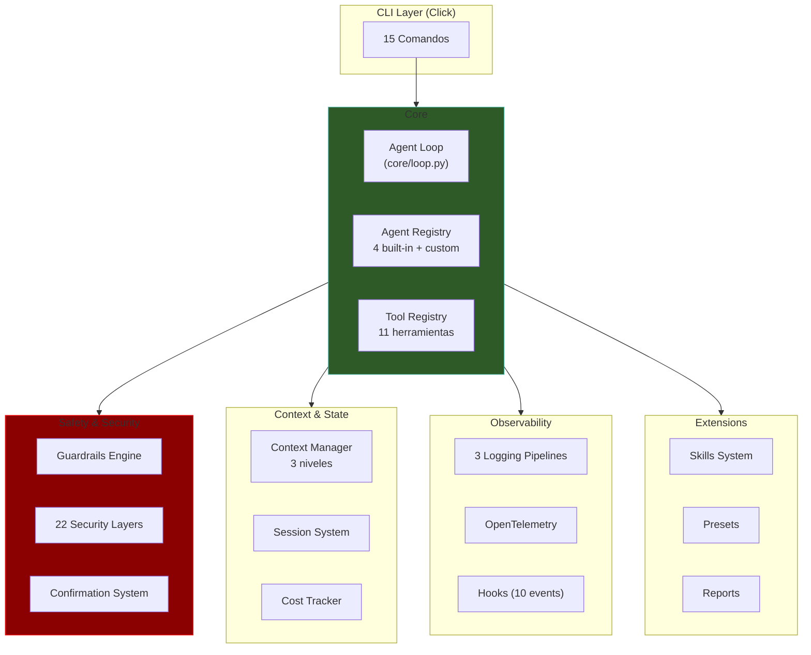
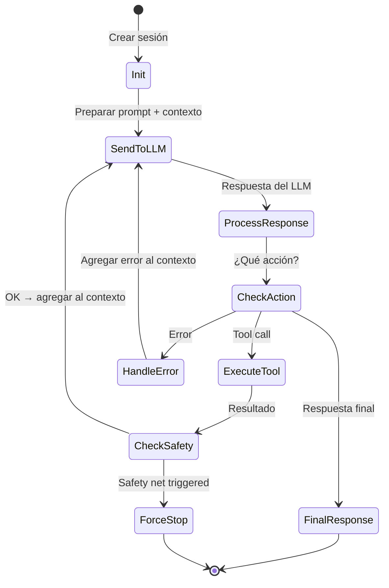
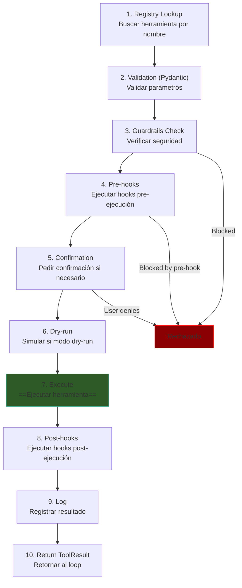
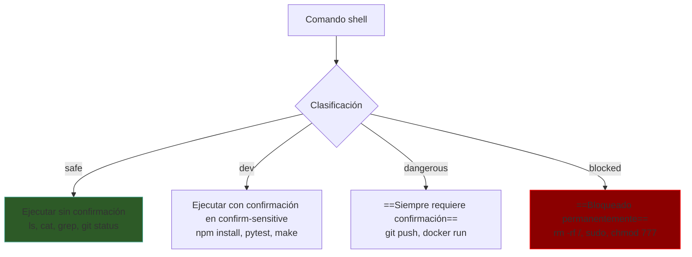
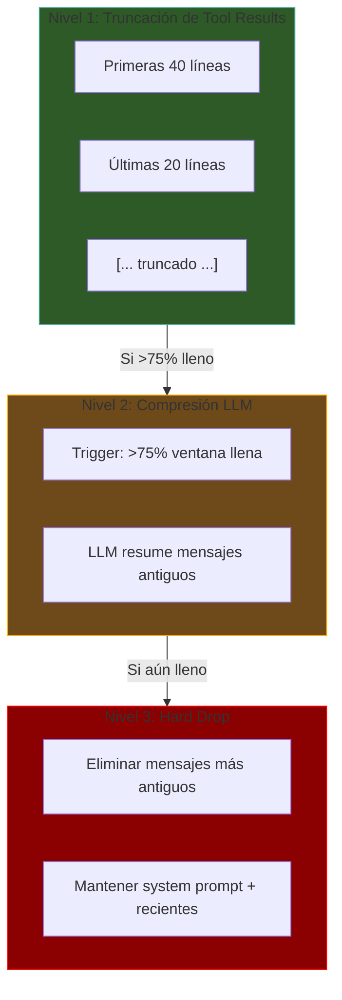
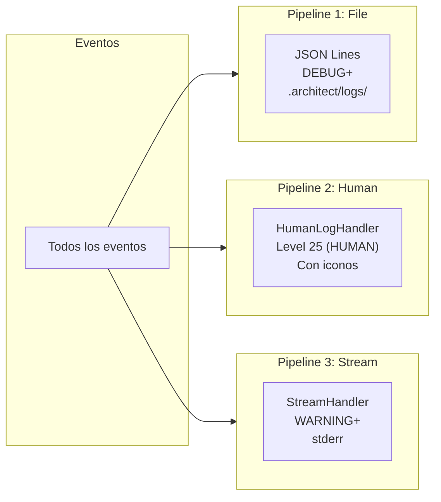
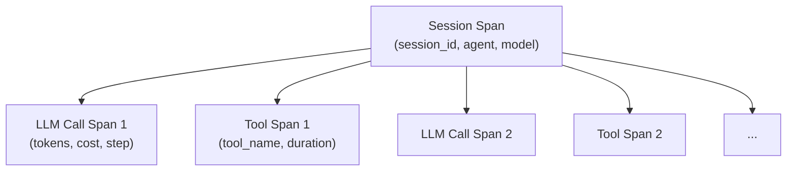

# Architect — Arquitectura Técnica

> [!abstract] Resumen
> La arquitectura de Architect se organiza alrededor de un ==*agent loop* síncrono con safety nets==, un pipeline de ejecución de herramientas de ==10 pasos==, un ==motor de guardrails==, ==3 niveles de gestión de contexto==, sistema de sesiones con auto-guardado, *cost tracking* por paso, ==3 pipelines de logging==, *OpenTelemetry* opcional, ==10 eventos de hooks==, y un sistema de *skills* con activación por glob. ^resumen

---

## Arquitectura General



---

## Agent Loop — core/loop.py

El *agent loop* es un ==`while True` con safety nets==:



### Safety Nets del Loop

| Safety Net | Mecanismo | Trigger |
|-----------|-----------|---------|
| `max_steps` | Contador por iteración | ==Varía por agente== (plan: 20, build: 50, resume: 15, review: 20) |
| `timeout` | Timer global | Tiempo configurable |
| `budget` | Acumulador de costos USD | `--budget` flag |
| `context_full` | Monitor de tokens | Ventana de contexto al 100% |

> [!warning] Sync-first deliberado
> Architect usa ==ejecución síncrona==, no asyncio. Cada paso del loop es bloqueante. Esta decisión de diseño es deliberada: simplifica el debugging, elimina race conditions, y es suficiente para el caso de uso principal donde cada paso depende del anterior.

---

## Pipeline de Ejecución de Herramientas — 10 Pasos

Cada invocación de herramienta pasa por ==exactamente 10 pasos==:



### Puntos de Bloqueo

Tres pasos pueden ==bloquear la ejecución==:

1. **Paso 3 — Guardrails**: si la herramienta viola una regla de seguridad
2. **Paso 4 — Pre-hooks**: si un hook pre-ejecución retorna `block=True`
3. **Paso 5 — Confirmation**: si el usuario deniega la confirmación (en modo `confirm-all` o `confirm-sensitive`)

> [!danger] Post-edit hooks del agente build
> El agente build tiene ==hooks post-edición== que se ejecutan automáticamente después de cada escritura de archivo. Esto permite, por ejemplo, ejecutar linters o formatters después de cada cambio. Los hooks se configuran por proyecto.

---

## Motor de Guardrails

El motor de guardrails implementa ==4 funciones de verificación==:

| Función | Verifica | Ejemplo |
|---------|----------|---------|
| `check_file_access` | Acceso a archivos | Bloquea `.env`, `*.pem`, `*.key` |
| `check_command` | Comandos shell | Bloquea `rm -rf`, `sudo`, fork bombs |
| `check_edit_limits` | Tamaño de ediciones | Limita archivos muy grandes |
| `check_code_rules` | Reglas de código | Patrones prohibidos |

### Clasificación de Comandos



### 22 Capas de Seguridad — Detalle

| # | Capa | Implementación |
|---|------|---------------|
| 1 | Path traversal | `Path.resolve()` + `is_relative_to()` |
| 2 | Blocklist `rm -rf` | Regex match |
| 3 | Blocklist `sudo` | Regex match |
| 4 | Blocklist `chmod 777` | Regex match |
| 5 | Blocklist `curl\|bash` | Pipe detection |
| 6 | Blocklist `mkfs` | Regex match |
| 7 | Blocklist fork bomb | Pattern detection |
| 8 | Blocklist `pkill` | Regex match |
| 9 | Command classification | safe/dev/dangerous |
| 10 | Timeouts por herramienta | Configurable |
| 11 | Output limits | Truncación automática |
| 12 | Directory sandboxing | Solo dirs permitidos |
| 13 | Sensitive files | `.env`, `*.pem`, `*.key` |
| 14 | MCP tool validation | Schema verification |
| 15 | Budget enforcement | Cost tracking |
| 16 | Max steps | Por agente |
| 17 | Context window monitor | Tokens disponibles |
| 18 | Session timeout | Global |
| 19 | Guardrails: file access | `check_file_access` |
| 20 | Guardrails: command | `check_command` |
| 21 | Guardrails: edit limits | `check_edit_limits` |
| 22 | Guardrails: code rules | `check_code_rules` |

> [!success] Defensa en profundidad
> Las 22 capas implementan ==defensa en profundidad==: múltiples capas independientes de protección. Si una falla, las otras siguen protegiendo el sistema. Esto es evaluado por [[vigil-overview|Vigil]] y documentado por [[licit-overview|Licit]].

---

## Gestión de Contexto — 3 Niveles

La ventana de contexto del LLM es finita. Architect gestiona esto con ==3 niveles progresivos==:



| Nivel | Trigger | Acción | Pérdida |
|-------|---------|--------|---------|
| L1 | Siempre (en cada tool result) | Truncar a ==40+20 líneas== | Mínima (detalles internos) |
| L2 | ==>75% ventana llena== | LLM comprime mensajes | Media (resumen vs original) |
| L3 | Ventana crítica | ==Drop mensajes antiguos== | Alta (se pierde contexto) |

> [!warning] Nivel 3 es destructivo
> Cuando se alcanza el Nivel 3, se ==pierden mensajes del contexto==. El agente puede olvidar instrucciones o contexto importante. Esto es por qué las sesiones se guardan automáticamente: siempre se puede consultar el historial completo desde disco.

---

## Sistema de Sesiones

### Auto-guardado

```mermaid
sequenceDiagram
    participant Loop as Agent Loop
    participant SM as Session Manager
    participant FS as .architect/sessions/

    Loop->>SM: Paso completado
    SM->>FS: Guardar sesión<br/><id>.json
    Note over FS: Auto-save después<br/>de cada paso

    Loop->>SM: Sesión >50 mensajes
    SM->>SM: Truncar a 30 mensajes
    SM->>FS: Guardar versión truncada
```

| Aspecto | Detalle |
|---------|---------|
| Ubicación | `.architect/sessions/<id>.json` |
| Trigger | ==Auto-save después de cada paso== |
| Truncación | >50 mensajes → reducir a 30 |
| Resume | `architect resume <session-id>` |

> [!info] Formato de sesión
> Las sesiones se guardan como JSON con todos los mensajes, resultados de herramientas, costos acumulados, y metadatos. Esto permite no solo resumir, sino también ==analizar el comportamiento del agente== post-mortem.

---

## Cost Tracking

El sistema de *cost tracking* registra ==costos por paso==:

| Campo | Descripción |
|-------|-------------|
| `input_tokens` | Tokens de entrada al LLM |
| `output_tokens` | Tokens generados por el LLM |
| `cached_tokens` | Tokens servidos desde cache |
| `cost_usd` | Costo en USD |

### Componentes

| Componente | Función |
|------------|---------|
| `CostTracker` | Acumulador por sesión |
| `PriceLoader` | Catálogo de precios por modelo |
| `--budget` flag | Enforcement de presupuesto máximo |
| *Prompt caching* | Soporte para caching de proveedores |

> [!tip] Prompt caching
> Architect soporta ==*prompt caching*== de proveedores como Anthropic y OpenAI. Los tokens cacheados son significativamente más baratos. El *CostTracker* contabiliza tokens cacheados por separado para un cálculo de costos preciso.

---

## 3 Pipelines de Logging

Architect tiene ==3 pipelines de logging independientes==:



| Pipeline | Handler | Nivel | Formato | Destino |
|----------|---------|-------|---------|---------|
| File | JSON Lines | ==DEBUG+== | JSON estructurado | `.architect/logs/` |
| Human | HumanLogHandler | ==HUMAN (25)== | Texto con iconos | stdout |
| Stream | StreamHandler | ==WARNING+== | Texto simple | stderr |

> [!info] Nivel HUMAN personalizado
> Architect define un nivel de log personalizado ==HUMAN (25)==, entre INFO (20) y WARNING (30). Este nivel muestra solo mensajes relevantes para el usuario humano, con iconos para facilitar la lectura. El nivel se usa exclusivamente en el HumanLogHandler.

### Soporte i18n

Los mensajes del HumanLogHandler soportan ==internacionalización (i18n)== con traducciones disponibles en español (es) e inglés (en).

---

## OpenTelemetry

Architect soporta *OpenTelemetry* como ==dependencia opcional==:

```bash
pip install architect-ai-cli[telemetry]
```

### Estructura de Spans



### Exporters

| Exporter | Protocolo | Uso |
|----------|-----------|-----|
| `otlp` | ==OTLP/gRPC== | Producción (Jaeger, Grafana) |
| `console` | stdout | Desarrollo |
| `json-file` | JSON Lines | Archivado |

> [!tip] Integración con Licit
> [[licit-overview|Licit]] puede leer los datos de OpenTelemetry como parte de su ==*evidence bundle*== para compliance. Los spans de sesión proporcionan un *audit trail* completo de las acciones del agente.

---

## Hooks — 10 Eventos de Lifecycle

El sistema de hooks permite ejecutar código personalizado en ==10 puntos del ciclo de vida==:

| # | Evento | Cuándo | ¿Puede bloquear? |
|---|--------|--------|-------------------|
| 1 | `pre_tool_use` | Antes de ejecutar herramienta | ==Sí== |
| 2 | `post_tool_use` | Después de ejecutar herramienta | No |
| 3 | `pre_llm_call` | Antes de llamar al LLM | ==Sí== |
| 4 | `post_llm_call` | Después de respuesta del LLM | No |
| 5 | `session_start` | Al iniciar sesión | No |
| 6 | `session_end` | Al terminar sesión | No |
| 7 | `on_error` | Cuando ocurre un error | No |
| 8 | `budget_warning` | Cuando el presupuesto está por agotarse | No |
| 9 | `context_compress` | Cuando se comprime contexto (L2) | No |
| 10 | `agent_complete` | Cuando el agente completa su tarea | No |

> [!danger] Pre-hooks bloqueantes
> Los hooks `pre_tool_use` y `pre_llm_call` pueden ==retornar `block=True`== para impedir la ejecución. Esto permite implementar políticas de seguridad personalizadas, como bloquear ciertos modelos o herramientas en ciertos contextos.

---

## Sistema de Skills

### Estructura

| Archivo | Propósito |
|---------|-----------|
| `.architect.md` | ==Skill global== del proyecto |
| `.architect/skills/*.md` | Skills específicos con activación por glob |
| `.architect/memory.md` | ==Memoria procedural== (persistente) |

### Activación por Glob

Los skills en `.architect/skills/` se activan automáticamente cuando el agente trabaja con archivos que coinciden con un patrón glob definido en el *frontmatter* del skill:

> [!example]- Ejemplo de skill con activación por glob
> ```markdown
> ---
> glob: "**/*.py"
> ---
>
> # Python Development Guidelines
>
> - Always use type hints
> - Follow PEP 8
> - Use pytest for testing
> - Prefer composition over inheritance
> ```

> [!question] ¿Cómo funciona la memoria procedural?
> El archivo `.architect/memory.md` es un archivo Markdown que el agente puede ==leer y escribir==. Persiste entre sesiones. El agente lo usa para recordar decisiones, patrones del proyecto, y lecciones aprendidas. Es como una "libreta de notas" persistente.

---

## Reports y Code Health

### Formatos de Reporte

| Formato | Flag | Uso |
|---------|------|-----|
| JSON | `--report json` | Procesamiento automático |
| Markdown | `--report md` | Lectura humana |
| GitHub PR comment | `--report github` | ==Integración PR== |

### Code Health Delta

Con `--health`, Architect mide el ==delta de salud del código==:

| Métrica | Descripción |
|---------|-------------|
| Complejidad ciclomática | Cambio en complejidad promedio |
| Funciones | Número total de funciones |
| Funciones largas | Funciones que exceden el límite |
| Código duplicado | Porcentaje de duplicación |

---

## CI/CD Exit Codes

| Código | Constante | Significado |
|--------|-----------|-------------|
| 0 | `SUCCESS` | Completado exitosamente |
| 1 | `FAILED` | Falló |
| 2 | `PARTIAL` | Parcialmente completado |
| 3 | `CONFIG_ERROR` | Error de configuración |
| 4 | `AUTH_ERROR` | Error de autenticación |
| 5 | `TIMEOUT` | Tiempo excedido |
| 130 | `INTERRUPTED` | Interrumpido (Ctrl+C) |

> [!info] Flag --exit-code-on-partial
> Con `--exit-code-on-partial`, el exit code 2 (PARTIAL) se trata como éxito o fallo según la configuración. Útil para CI/CD donde "parcial" puede ser aceptable.

---

## Enlaces y referencias

> [!quote]- Referencias internas
> - [[architect-overview]] — Visión general
> - [[architect-ralph-loop]] — Ralph Loop en detalle
> - [[architect-pipelines]] — Pipelines YAML
> - [[architect-agents]] — Sistema de agentes
> - [[intake-architecture]] — Arquitectura de Intake (comparte stack)
> - [[vigil-architecture]] — Arquitectura de Vigil
> - [[licit-architecture]] — Arquitectura de Licit
> - [[ecosistema-completo]] — Integración del ecosistema

[^1]: El pipeline de 10 pasos se ejecuta para cada invocación de herramienta, sin excepciones.
[^2]: El nivel HUMAN (25) es un nivel personalizado de structlog definido entre INFO (20) y WARNING (30).
[^3]: OpenTelemetry es completamente opcional y no afecta el rendimiento cuando está deshabilitado.
[^4]: La memoria procedural en `.architect/memory.md` persiste entre sesiones pero no entre proyectos.
