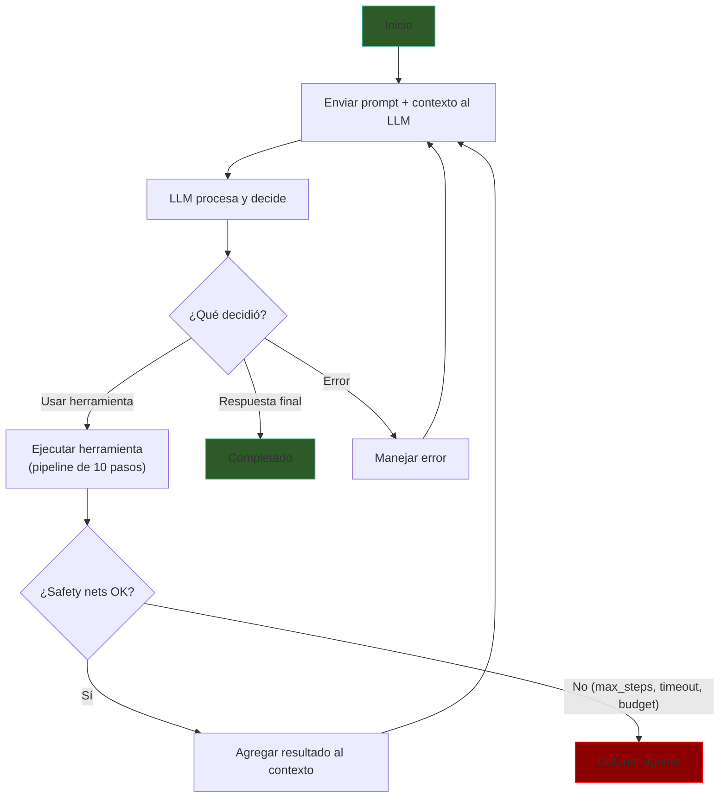
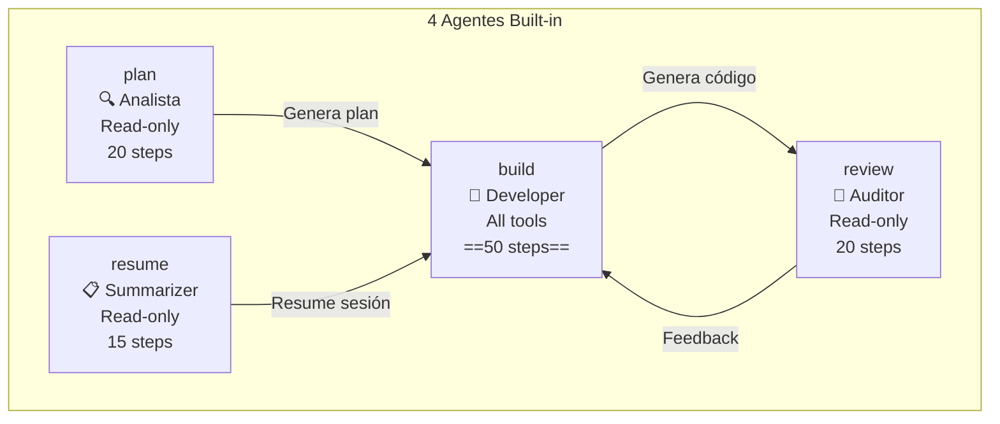
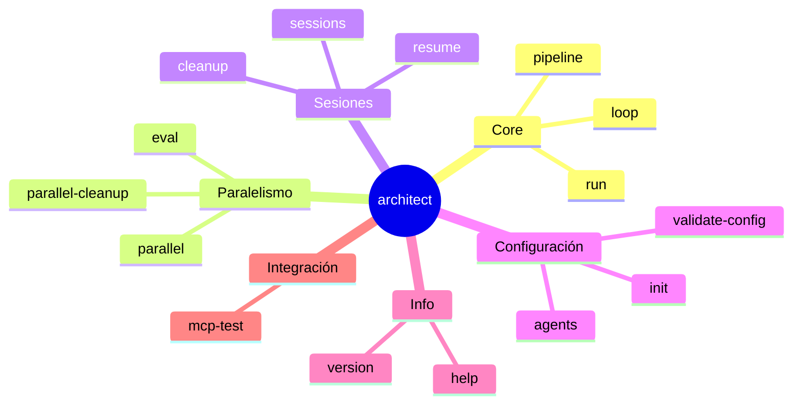
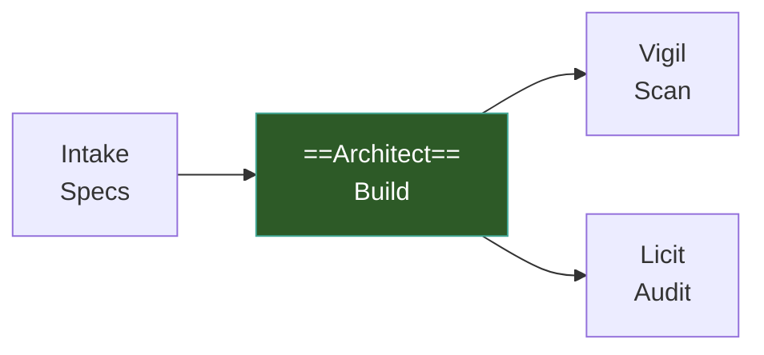

# Architect — Visión General

> [!abstract] Resumen
> **Architect** es una ==CLI headless que conecta LLMs a herramientas del sistema== (filesystem, comandos, MCP). Opera mediante un *agent loop* donde el ==LLM decide cuándo parar==. Ofrece 4 agentes built-in, 11 herramientas, 22 capas de seguridad, y 15 comandos CLI. Soporta *Ralph Loop* (execute→check→retry), pipelines YAML, ejecución paralela, evaluación competitiva, y auto-review. ==Sync-first, sin asyncio==. ^resumen

---

## Qué es Architect

Architect es el ==motor de construcción del ecosistema==. Donde [[intake-overview|Intake]] normaliza requisitos, Architect los convierte en código funcional. Su diseño se basa en tres principios:

1. **LLM como cerebro**: el modelo decide qué herramientas usar y cuándo parar
2. **Herramientas como manos**: 11 herramientas para interactuar con el filesystem y ejecutar comandos
3. **Seguridad como columna vertebral**: 22 capas de seguridad que previenen daños al sistema

> [!tip] Headless por diseño
> Architect no tiene UI gráfica. Es una ==CLI pura== diseñada para ser invocada por humanos, scripts, y pipelines CI/CD. Esto lo hace ideal para automatización y reproducibilidad.

---

## Agent Loop

El corazón de Architect es su *agent loop* implementado en `core/loop.py`:



> [!info] Sync-first
> El *agent loop* es ==síncrono por diseño==. No usa asyncio. Cada paso se ejecuta secuencialmente: LLM → herramienta → resultado → LLM. Esto simplifica el debugging y elimina una categoría completa de bugs de concurrencia.

### Safety Nets

El loop tiene ==4 mecanismos de seguridad== que pueden detenerlo:

| Safety Net | Descripción | Default |
|-----------|-------------|---------|
| `max_steps` | Número máximo de iteraciones | Varía por agente |
| `timeout` | Tiempo máximo de ejecución | Configurable |
| `budget` | Presupuesto máximo en USD | `--budget` flag |
| `context_full` | Ventana de contexto llena | Automático |

> [!danger] El LLM decide cuándo parar
> A diferencia de sistemas con número fijo de iteraciones, en Architect ==el LLM decide cuándo ha terminado==. Los *safety nets* son solo límites superiores para evitar loops infinitos. Un agente bien diseñado debería parar antes de alcanzar cualquier safety net.

---

## 4 Agentes Built-in

Architect viene con ==4 agentes== predefinidos, cada uno con un rol y permisos específicos:



| Agente | Rol | Permisos | Max Steps | Descripción |
|--------|-----|----------|-----------|-------------|
| **plan** | Analista | ==Read-only== | 20 | Analiza el proyecto y genera un plan |
| **build** | Developer | Todos | ==50== | Implementa código con todas las herramientas |
| **resume** | Summarizer | Read-only | 15 | Resume sesiones previas para continuidad |
| **review** | Auditor | Read-only | 20 | Revisa código, no puede modificar |

> [!question] ¿Puedo crear agentes personalizados?
> ==Sí==. Los agentes custom se definen en archivos YAML con su sistema prompt, herramientas permitidas, max steps, y modo de confirmación. Consulta [[architect-agents]] para la guía completa.

---

## 11 Herramientas

Los agentes interactúan con el sistema a través de ==11 herramientas==:

| # | Herramienta | Tipo | Descripción |
|---|------------|------|-------------|
| 1 | `read_file` | Lectura | Lee contenido de un archivo |
| 2 | `write_file` | ==Escritura== | Escribe un archivo completo |
| 3 | `delete_file` | ==Escritura== | Elimina un archivo |
| 4 | `list_files` | Lectura | Lista archivos en un directorio |
| 5 | `edit_file` | ==Escritura== | Edita secciones de un archivo |
| 6 | `apply_patch` | ==Escritura== | Aplica un patch diff |
| 7 | `search_code` | Lectura | Búsqueda semántica en código |
| 8 | `grep` | Lectura | Búsqueda por regex |
| 9 | `find_files` | Lectura | Busca archivos por patrón |
| 10 | `run_command` | ==Ejecución== | Ejecuta comandos shell |
| 11 | `dispatch_subagent` | ==Delegación== | Lanza un sub-agente |

> [!warning] Herramientas peligrosas
> Las herramientas de escritura y ejecución (`write_file`, `delete_file`, `edit_file`, `apply_patch`, `run_command`) pasan por el ==sistema de guardraíles== antes de ejecutarse. En modo `confirm-sensitive`, requieren confirmación del usuario. Ver [[architect-architecture]] para el pipeline de ejecución de 10 pasos.

### Pipeline de Ejecución de Herramientas

Cada invocación de herramienta pasa por ==10 pasos==:


> [!tip] Pre-hooks pueden bloquear
> Los *pre-hooks* (paso 4) pueden ==bloquear la ejecución== de una herramienta. Esto es útil para implementar políticas de seguridad personalizadas, como prohibir escritura en ciertos directorios.

---

## 22 Capas de Seguridad

Architect implementa ==22 capas de seguridad== para proteger el sistema:

| Categoría | Capas | Ejemplos |
|-----------|-------|----------|
| Path traversal | `validate_path` | `Path.resolve()` + `is_relative_to()` |
| Command blocklist | Comandos prohibidos | `rm -rf`, `sudo`, `chmod 777`, `curl\|bash`, `mkfs`, fork bomb, `pkill` |
| Command classification | 3 niveles | ==safe / dev / dangerous== |
| Timeouts | Límites temporales | Por herramienta y por sesión |
| Output limits | Truncación | Evita llenar contexto |
| Directory sandboxing | Confinamiento | Solo directorios permitidos |
| Sensitive files | Protección | `.env`, `*.pem`, `*.key` |
| MCP validation | Validación de tools MCP | Verificación de schemas |

> [!danger] Command blocklist
> Architect ==bloquea permanentemente== los siguientes comandos, sin importar el modo de confirmación:
> - `rm -rf /` y variantes destructivas
> - `sudo` (escalada de privilegios)
> - `chmod 777` (permisos inseguros)
> - `curl | bash` (ejecución remota)
> - `mkfs` (formateo de discos)
> - Fork bombs
> - `pkill` y variantes

### Modos de Confirmación

| Modo | Comportamiento | Uso típico |
|------|---------------|-----------|
| `yolo` | ==Nunca pide confirmación== | CI/CD, automatización |
| `confirm-all` | Siempre pide | Operaciones sensibles |
| `confirm-sensitive` | Solo para escritura/MCP/dangerous | ==Recomendado== |

---

## 15 Comandos CLI



| Comando | Descripción |
|---------|-------------|
| `run` | Ejecuta un agente con un prompt |
| `loop` | ==Ejecuta el Ralph Loop== (execute→check→retry) |
| `pipeline` | Ejecuta un pipeline YAML |
| `parallel` | Ejecución paralela en worktrees |
| `parallel-cleanup` | Limpia worktrees paralelos |
| `eval` | Evaluación competitiva multi-modelo |
| `sessions` | Lista sesiones guardadas |
| `resume` | Reanuda una sesión |
| `cleanup` | Limpia sesiones antiguas |
| `init` | Inicializa configuración |
| `validate-config` | Valida la configuración |
| `agents` | Lista agentes disponibles |
| `help` | Muestra ayuda |
| `version` | Muestra versión |
| `mcp-test` | Prueba conexión MCP |

---

## Funcionalidades Avanzadas

### Ralph Loop

El ==Ralph Loop== es un mecanismo de ejecución iterativa: execute → check → if fail, retry con contexto de error. Con aislamiento en *git worktree* y máximo de 25 iteraciones.

> [!tip] Cuándo usar Ralph Loop
> Ideal para implementar funcionalidades donde hay una ==forma objetiva de verificar== el resultado (tests que pasan, linting sin errores, build exitoso). Consulta [[architect-ralph-loop]] para la guía completa.

### Pipelines YAML

Permiten definir ==secuencias de pasos== con diferentes agentes, checks, checkpoints (commits git), variables, y condiciones.

> [!example]- Pipeline YAML mínimo
> ```yaml
> name: feature-implementation
> steps:
>   - name: plan
>     agent: plan
>     prompt: "Analyze the codebase and plan implementation of {{feature}}"
>
>   - name: implement
>     agent: build
>     prompt: "Implement the plan from the previous step"
>     checks:
>       - "pytest tests/ -x"
>     checkpoint: "feat: implement {{feature}}"
>
>   - name: review
>     agent: review
>     prompt: "Review the implementation for quality and security"
> ```
> Consulta [[architect-pipelines]] para la referencia completa.

### Ejecución Paralela

Usa ==*ProcessPoolExecutor*== y *git worktrees* para ejecutar múltiples tareas o modelos en paralelo. Cada tarea obtiene su propio worktree aislado (`.architect-parallel-N`).

### Evaluación Competitiva

Ejecuta la misma tarea con múltiples modelos en paralelo y compara resultados con *composite scoring*:

| Criterio | Peso |
|----------|------|
| Checks pasados | ==40 pts== |
| Status final | 30 pts |
| Eficiencia (steps) | 20 pts |
| Costo | 10 pts |

### Auto-review

Después de un build, un agente review con ==contexto limpio== (sin historial del build) examina el `git diff`. Si encuentra problemas, puede ejecutar passes de fix configurables.

### Self-evaluator

| Modo | Comportamiento |
|------|---------------|
| `off` | Sin evaluación |
| `basic` | Un pase de evaluación |
| `full` | ==evaluate → fix → retry== |

La respuesta del self-evaluator es JSON: `{completed, confidence, issues, suggestion}`.

---

## Stack Tecnológico

| Componente | Tecnología | Notas |
|------------|-----------|-------|
| Lenguaje | ==Python 3.12+== | Sync-first |
| CLI | *Click* | 15 comandos |
| Validación | *Pydantic v2* | Todos los modelos |
| LLM | *LiteLLM* | Multi-proveedor |
| Logging | *structlog* | JSON Lines + Human |
| Telemetría | *OpenTelemetry* | Opcional |

> [!info] Tests y cobertura
> Architect tiene ==717+ tests== con un ratio test-to-code de ~80%. Esto refleja la importancia de la fiabilidad en un sistema que modifica código autónomamente.

---

## Quick Start

> [!example] Inicio rápido
> ```bash
> # 1. Instalar
> pip install architect-ai-cli
>
> # 2. Inicializar en un proyecto
> architect init
>
> # 3. Ejecutar el agente plan
> architect run plan "Analyze this project and propose improvements"
>
> # 4. Ejecutar el agente build
> architect run build "Implement the proposed improvements" --budget 2.00
>
> # 5. Usar Ralph Loop con checks
> architect loop "Add input validation to all endpoints" \
>   --check "pytest tests/ -x" \
>   --max-iterations 10
> ```

> [!warning] Presupuesto
> ==Siempre configura un presupuesto== con `--budget` cuando uses el agente build. Sin presupuesto, el agente podría ejecutar muchos pasos con modelos costosos. Consulta [[architect-architecture]] para detalles del sistema de costos.

---

## CI/CD Integration

Architect es ==CI/CD first-class== con exit codes estandarizados:

| Código | Significado |
|--------|-------------|
| 0 | SUCCESS |
| 1 | FAILED |
| 2 | PARTIAL |
| 3 | CONFIG_ERROR |
| 4 | AUTH_ERROR |
| 5 | TIMEOUT |
| 130 | INTERRUPTED |

Flags útiles para CI/CD: `--mode yolo`, `--json`, `--quiet`, `--exit-code-on-partial`.

> [!info] Pipeline completo
> Para ver cómo Architect se integra con Intake, Vigil y Licit en un pipeline CI/CD, consulta [[ecosistema-cicd-integration]].

---

## Presets

| Preset | Descripción |
|--------|-------------|
| `python` | Configuración para proyectos Python |
| `node-react` | Configuración para Node.js + React |
| `ci` | ==Optimizado para CI/CD== |
| `paranoid` | Máxima seguridad, confirma todo |
| `yolo` | Sin confirmaciones, máxima velocidad |

---

## Relación con el Ecosistema

Architect consume especificaciones de [[intake-overview|Intake]], genera código que [[vigil-overview|Vigil]] escanea, y produce artefactos que [[licit-overview|Licit]] audita:



---

## Enlaces y referencias

> [!quote]- Referencias internas
> - [[architect-architecture]] — Arquitectura técnica completa
> - [[architect-ralph-loop]] — Ralph Loop en detalle
> - [[architect-pipelines]] — Pipelines YAML
> - [[architect-agents]] — Sistema de agentes
> - [[intake-overview]] — Fuente de especificaciones
> - [[vigil-overview]] — Escaneo de seguridad del código generado
> - [[licit-overview]] — Compliance y trazabilidad
> - [[ecosistema-completo]] — Flujo integrado

[^1]: El ratio de 717+ tests con ~80% test-to-code refleja la criticidad de la fiabilidad en un sistema autónomo.
[^2]: El modo sync-first elimina la complejidad de asyncio sin sacrificar rendimiento en el caso de uso principal (ejecución secuencial de herramientas).
[^3]: Los presets son conjuntos de configuración predefinidos que se pueden extender o sobreescribir.
