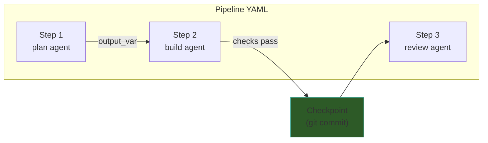
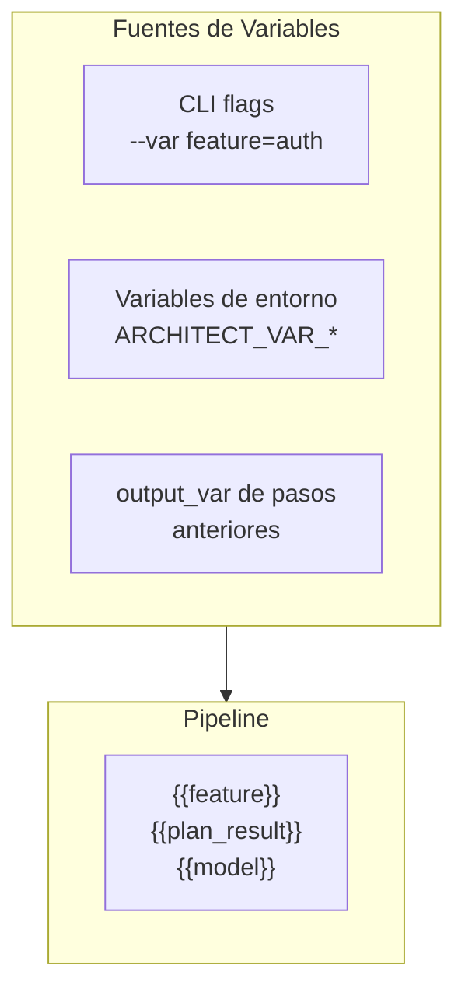
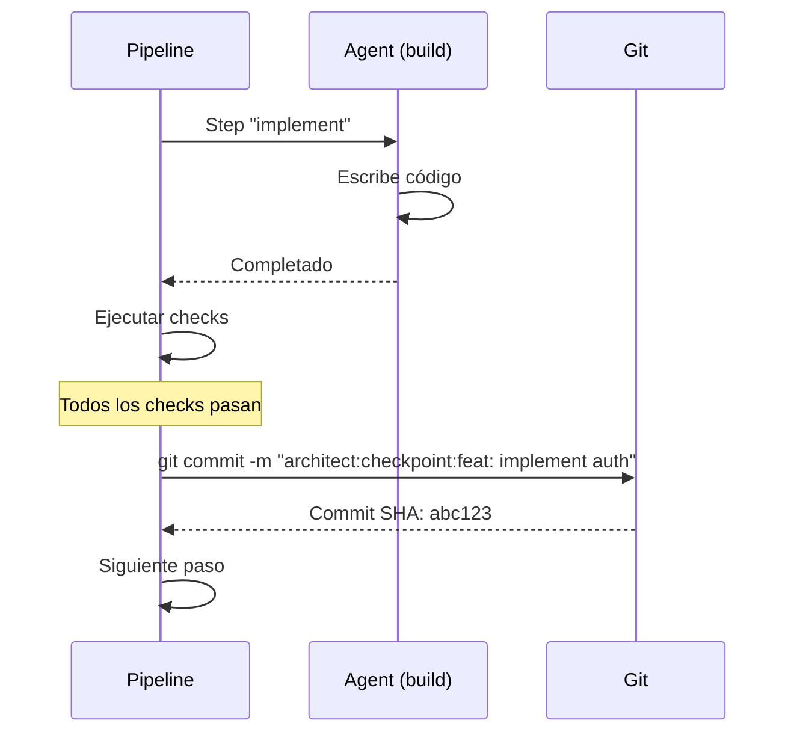
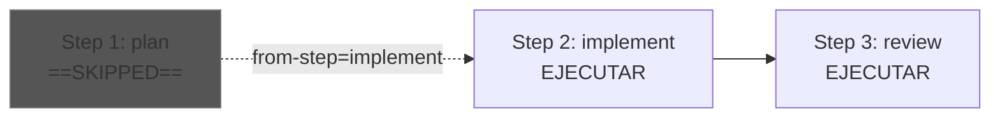

# Architect — Pipelines YAML

> [!abstract] Resumen
> Los *pipelines* YAML de Architect permiten definir ==secuencias de pasos== donde cada paso especifica un agente, un prompt, checks opcionales, y checkpoints. Soportan ==sustitución de variables== (`{{var}}`), ==ejecución condicional==, captura de output, checkpoints como commits git (`architect:checkpoint:` prefix), *dry-run* para previsualización, y ==resume desde un paso específico== (`from-step`). Los checks se validan con exit code 3 para errores de validación. ^resumen

---

## Concepto

Los pipelines YAML permiten ==orquestar múltiples agentes== en una secuencia predefinida. Mientras que [[architect-ralph-loop|Ralph Loop]] es un ciclo de un solo agente, un pipeline coordina plan → build → review → etc., con verificaciones entre cada paso.



> [!tip] Pipelines vs Ralph Loop
> - **[[architect-ralph-loop|Ralph Loop]]**: un solo agente, un solo check, loop hasta que pase
> - **Pipeline**: ==múltiples agentes, múltiples pasos==, ejecución secuencial con condiciones

---

## Sintaxis Completa de un Step

Cada paso de un pipeline tiene los siguientes campos:

| Campo | Tipo | Requerido | Descripción |
|-------|------|-----------|-------------|
| `name` | string | ==Sí== | Identificador único del paso |
| `agent` | string | ==Sí== | Agente a usar (plan, build, review, custom) |
| `prompt` | string | ==Sí== | Instrucciones para el agente |
| `checks` | list[string] | No | Comandos shell de verificación |
| `checkpoint` | string | No | Mensaje para commit git |
| `output_var` | string | No | Variable para capturar output |
| `condition` | string | No | Expresión booleana para ejecución condicional |

> [!example]- Schema completo de un step
> ```yaml
> steps:
>   - name: "nombre-unico"          # Identificador del paso
>     agent: "build"                 # Agente: plan | build | review | resume | custom
>     prompt: "Instrucciones {{var}}" # Prompt con variables
>     checks:                        # Verificaciones opcionales
>       - "pytest tests/ -x"
>       - "npm run lint"
>     checkpoint: "feat: {{feature}}" # Commit git con prefijo architect:checkpoint:
>     output_var: "plan_result"       # Captura output del agente
>     condition: "{{skip_review}} != 'true'" # Condicional
> ```

---

## Sustitución de Variables

Los pipelines soportan ==sustitución de variables== con la sintaxis `{{var}}`:

### Fuentes de Variables



| Fuente | Sintaxis | Ejemplo |
|--------|----------|---------|
| CLI | `--var key=value` | `--var feature=authentication` |
| Entorno | `ARCHITECT_VAR_KEY` | `ARCHITECT_VAR_MODEL=gpt-4o` |
| Output previo | `output_var: nombre` | `{{nombre}}` en pasos siguientes |

> [!example]- Uso de variables
> ```yaml
> name: implement-feature
> steps:
>   - name: plan
>     agent: plan
>     prompt: "Plan implementation of {{feature}} for {{project}}"
>     output_var: plan_output
>
>   - name: implement
>     agent: build
>     prompt: |
>       Implement {{feature}} following this plan:
>       {{plan_output}}
>     checks:
>       - "pytest tests/ -x"
>     checkpoint: "feat: implement {{feature}}"
> ```
>
> ```bash
> # Ejecución con variables desde CLI
> architect pipeline run feature.yaml \
>   --var feature=rate-limiting \
>   --var project=api-service
> ```

---

## Checks — Verificación de Pasos

Los checks son ==comandos shell== que verifican el resultado de un paso:

### Comportamiento

| Exit Code | Significado | Acción |
|-----------|-------------|--------|
| 0 | ==Pass== | Continúa al siguiente paso |
| 1-2 | Fail | El paso se marca como fallido |
| ==3== | ==Validation Error== | Error de validación del pipeline |
| Otro | Error | Error de ejecución |

> [!warning] Exit code 3 — Validación
> El exit code ==3 es especial==: indica un error de validación del propio pipeline, no un fallo del paso. Esto detiene toda la ejecución del pipeline inmediatamente, a diferencia de exit 1-2 que solo marca el paso como fallido.

### Checks Compuestos

Se pueden encadenar múltiples checks. ==Todos deben pasar== para que el paso sea exitoso:

```yaml
checks:
  - "pytest tests/ -x"          # Tests unitarios
  - "npm run lint"               # Linting
  - "mypy src/ --strict"         # Type checking
  - "vigil scan --fail-on high"  # Seguridad con Vigil
```

> [!tip] Integración con Vigil
> Los checks de pipeline son un excelente punto para integrar [[vigil-overview|Vigil]]. Agrega `vigil scan --fail-on high` como check después de pasos de build para ==verificar seguridad automáticamente==.

---

## Checkpoints — Commits Git

Los checkpoints crean ==commits git automáticos== con el prefijo `architect:checkpoint:`:



### Formato del Commit

```
architect:checkpoint:<mensaje del checkpoint>
```

Ejemplo:
```
architect:checkpoint:feat: implement rate limiting
```

> [!info] ¿Por qué el prefijo?
> El prefijo `architect:checkpoint:` permite:
> - ==Identificar commits automáticos== vs manuales
> - Filtrar en `git log` con `--grep="architect:checkpoint:"`
> - Que [[licit-overview|Licit]] identifique commits generados por agentes
> - Rollback selectivo de checkpoints

> [!danger] Checkpoints requieren checks
> Un checkpoint solo se crea ==si todos los checks del paso pasan==. Si un check falla, no se hace commit. Esto garantiza que solo se commitean cambios verificados. Si no hay checks definidos, el checkpoint se crea incondicionalmente (no recomendado).

---

## Ejecución Condicional

Los pasos pueden tener una ==condición== que determina si se ejecutan:

```yaml
steps:
  - name: review
    agent: review
    prompt: "Review the implementation"
    condition: "{{skip_review}} != 'true'"

  - name: deploy-staging
    agent: build
    prompt: "Deploy to staging"
    condition: "{{environment}} == 'staging'"
```

| Operador | Ejemplo |
|----------|---------|
| `==` | `{{var}} == 'value'` |
| `!=` | `{{var}} != 'true'` |
| Presencia | `{{var}}` (truthy/falsy) |

> [!warning] Evaluación de condiciones
> Las condiciones se evalúan como ==comparaciones de strings==. No hay evaluación aritmética ni lógica booleana compleja. Para condiciones más sofisticadas, usa un script como check.

---

## Captura de Output

Con `output_var`, el ==output del agente se captura== en una variable disponible para pasos posteriores:

```yaml
steps:
  - name: analyze
    agent: plan
    prompt: "Analyze the codebase and list all endpoints"
    output_var: endpoints_list

  - name: test-endpoints
    agent: build
    prompt: |
      Write integration tests for these endpoints:
      {{endpoints_list}}
    checks:
      - "pytest tests/test_integration.py -v"
```

> [!tip] Flujo de datos entre agentes
> La combinación de `output_var` y `{{var}}` permite crear ==cadenas de procesamiento== donde cada agente refina el output del anterior. Esto es especialmente útil para el patrón plan → build → review.

---

## Dry-run

El *dry-run* muestra ==qué haría el pipeline sin ejecutar nada==:

```bash
architect pipeline run my-pipeline.yaml --dry-run
```

> [!example]- Output de dry-run
> ```
> Pipeline: implement-feature (3 steps)
>
> Step 1: plan
>   Agent: plan (read-only, max 20 steps)
>   Prompt: "Plan implementation of rate-limiting for api-service"
>   Checks: none
>   Output: → plan_output
>
> Step 2: implement
>   Agent: build (all tools, max 50 steps)
>   Prompt: "Implement rate-limiting following this plan: {{plan_output}}"
>   Checks: pytest tests/ -x
>   Checkpoint: "feat: implement rate-limiting"
>
> Step 3: review
>   Agent: review (read-only, max 20 steps)
>   Prompt: "Review the implementation for quality and security"
>   Condition: skip_review != 'true' → WILL EXECUTE
>
> Variables:
>   feature = "rate-limiting"
>   project = "api-service"
>   skip_review = (not set)
> ```

---

## From-step Resume

Si un pipeline falla en un paso intermedio, se puede ==resumir desde ese paso==:

```bash
# Pipeline falló en el paso "implement"
architect pipeline run my-pipeline.yaml --from-step implement
```

### Comportamiento del Resume



> [!warning] Variables de pasos previos
> Cuando se usa `--from-step`, los ==`output_var` de pasos anteriores no están disponibles== porque esos pasos no se ejecutaron. Si un paso depende de variables de pasos previos, necesitas proveerlas manualmente con `--var`.

---

## Ejemplo Completo de Pipeline

> [!example]- Pipeline completo: Feature implementation
> ```yaml
> name: full-feature-implementation
> description: "End-to-end feature implementation with tests and review"
>
> steps:
>   # 1. Analizar la base de código
>   - name: analyze
>     agent: plan
>     prompt: |
>       Analyze the codebase and understand the architecture.
>       Focus on: {{focus_area}}
>       Identify patterns, conventions, and potential integration points
>       for implementing: {{feature}}
>     output_var: analysis
>
>   # 2. Escribir tests primero (TDD)
>   - name: write-tests
>     agent: build
>     prompt: |
>       Based on this analysis:
>       {{analysis}}
>
>       Write comprehensive tests for: {{feature}}
>       Follow existing test patterns. Include:
>       - Unit tests
>       - Edge cases
>       - Error handling tests
>     checks:
>       - "python -m pytest tests/ --collect-only -q"
>     checkpoint: "test: add tests for {{feature}}"
>     output_var: test_files
>
>   # 3. Implementar hasta que tests pasen
>   - name: implement
>     agent: build
>     prompt: |
>       Implement {{feature}} to make all tests pass.
>       Test files: {{test_files}}
>       Follow the existing architecture patterns.
>     checks:
>       - "pytest tests/ -x --tb=short"
>       - "ruff check src/"
>       - "mypy src/ --strict"
>     checkpoint: "feat: implement {{feature}}"
>
>   # 4. Escaneo de seguridad con Vigil
>   - name: security-scan
>     agent: plan
>     prompt: |
>       Review the vigil scan results and identify any
>       security issues that need attention.
>     checks:
>       - "vigil scan --fail-on critical"
>     condition: "{{skip_security}} != 'true'"
>
>   # 5. Review con contexto limpio
>   - name: review
>     agent: review
>     prompt: |
>       Review the complete implementation of {{feature}}.
>       Check for:
>       - Code quality and maintainability
>       - Security best practices
>       - Test coverage completeness
>       - Documentation accuracy
>     output_var: review_feedback
>
>   # 6. Fix issues del review
>   - name: fix-review-issues
>     agent: build
>     prompt: |
>       Address these review findings:
>       {{review_feedback}}
>     checks:
>       - "pytest tests/ -x"
>     checkpoint: "fix: address review feedback for {{feature}}"
>     condition: "{{auto_fix}} == 'true'"
> ```
>
> ```bash
> # Ejecución
> architect pipeline run full-feature.yaml \
>   --var feature="rate-limiting" \
>   --var focus_area="api/endpoints" \
>   --var auto_fix=true
>
> # Dry-run primero
> architect pipeline run full-feature.yaml \
>   --var feature="rate-limiting" \
>   --dry-run
>
> # Resume desde security scan
> architect pipeline run full-feature.yaml \
>   --var feature="rate-limiting" \
>   --from-step security-scan
> ```

---

## Validación del Pipeline

Antes de ejecutar, Architect valida el archivo YAML del pipeline:

| Validación | Descripción |
|------------|-------------|
| Schema | Estructura YAML correcta |
| Steps únicos | Nombres de paso ==no duplicados== |
| Agentes válidos | Agentes referenciados existen |
| Variables | Variables referenciadas tienen fuente |
| Condiciones | Sintaxis de condiciones correcta |
| Checks | Sintaxis de comandos check válida |

```bash
# Validar sin ejecutar
architect validate-config --pipeline my-pipeline.yaml
```

---

## Integración con CI/CD

Los pipelines YAML son ideales para ==CI/CD==:

> [!example]- Pipeline en GitHub Actions
> ```yaml
> # .github/workflows/architect-pipeline.yml
> name: Architect Pipeline
> on:
>   workflow_dispatch:
>     inputs:
>       feature:
>         description: 'Feature to implement'
>         required: true
>
> jobs:
>   implement:
>     runs-on: ubuntu-latest
>     steps:
>       - uses: actions/checkout@v4
>       - uses: actions/setup-python@v5
>         with:
>           python-version: '3.12'
>       - run: pip install architect-ai-cli
>       - name: Run pipeline
>         run: |
>           architect pipeline run .architect/pipelines/feature.yaml \
>             --var feature="${{ inputs.feature }}" \
>             --mode yolo \
>             --budget 5.00 \
>             --json
>         env:
>           OPENAI_API_KEY: ${{ secrets.OPENAI_API_KEY }}
> ```
> Consulta [[ecosistema-cicd-integration]] para el pipeline CI/CD completo del ecosistema.

---

## Patrones Comunes

### TDD Pipeline

| Paso | Agente | Propósito |
|------|--------|-----------|
| 1. Plan | plan | Analizar y planificar |
| 2. Tests | build | ==Escribir tests primero== |
| 3. Implementar | build | Código hasta que tests pasen |
| 4. Review | review | Verificar calidad |

### Security-first Pipeline

| Paso | Agente | Propósito |
|------|--------|-----------|
| 1. Implement | build | Escribir código |
| 2. Security scan | plan | ==[[vigil-overview\|Vigil]] scan== |
| 3. Fix | build | Corregir vulnerabilidades |
| 4. Verify | plan | Verificar correcciones |

---

## Enlaces y referencias

> [!quote]- Referencias internas
> - [[architect-overview]] — Visión general de Architect
> - [[architect-architecture]] — Arquitectura técnica
> - [[architect-ralph-loop]] — Ralph Loop (loop de un solo agente)
> - [[architect-agents]] — Agentes disponibles para pipelines
> - [[intake-overview]] — Fuente de especificaciones para pipelines
> - [[ecosistema-cicd-integration]] — Pipelines en CI/CD
> - [[vigil-overview]] — Checks de seguridad en pipelines

[^1]: Los checkpoints usan el prefijo `architect:checkpoint:` para identificación automática en git log.
[^2]: El exit code 3 está reservado para errores de validación del pipeline. No debe usarse en checks normales.
[^3]: La sustitución de variables es textual (string interpolation), no evaluación de expresiones.
