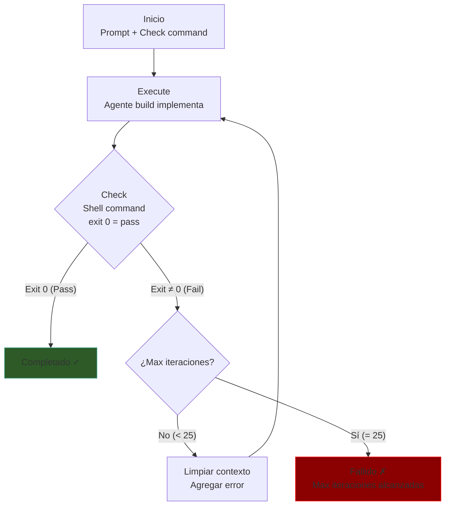
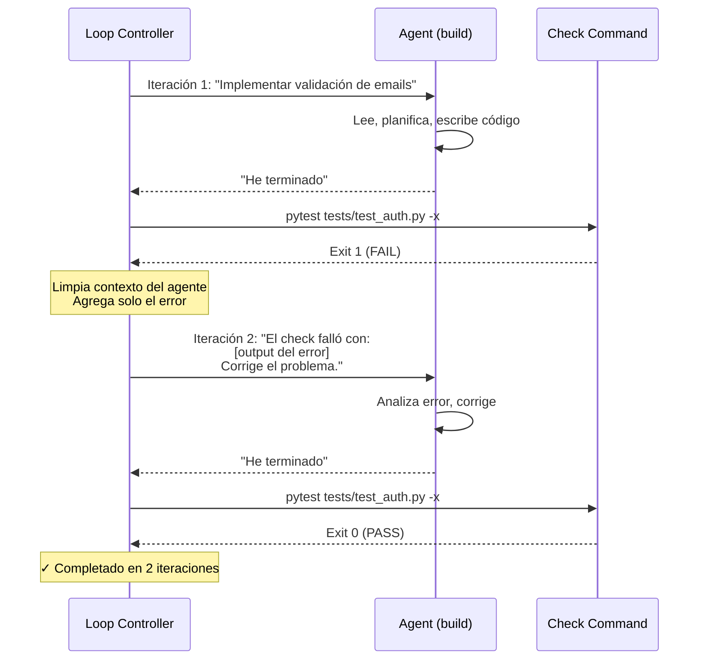
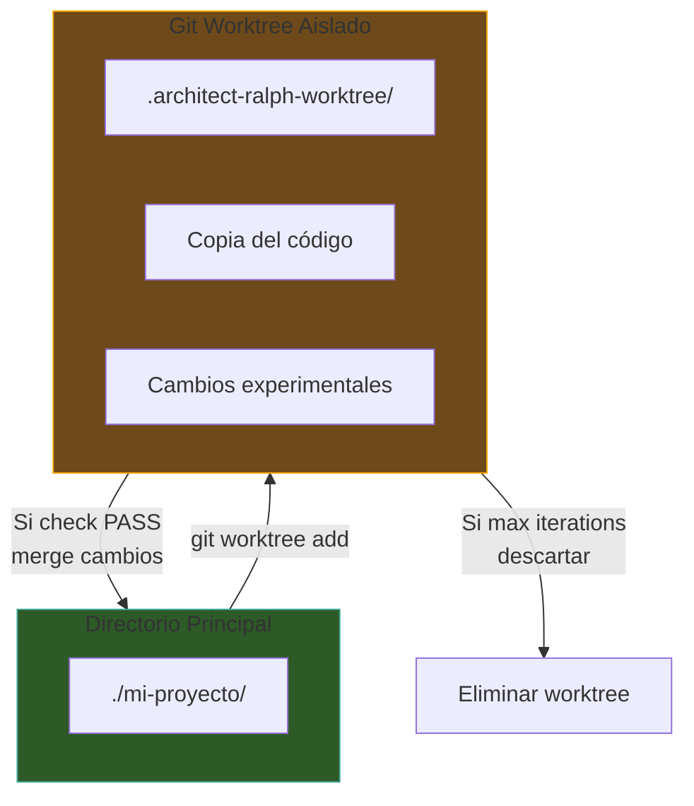
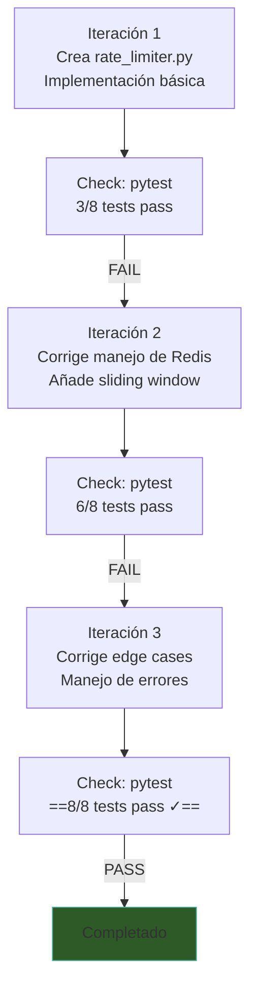
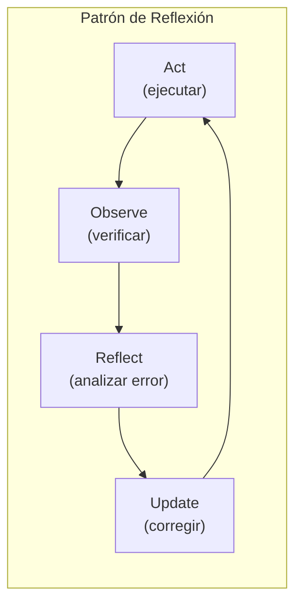

# Architect — Ralph Loop

> [!abstract] Resumen
> El *Ralph Loop* es el mecanismo de ==ejecución iterativa== de Architect: ejecuta una tarea, verifica el resultado con un comando shell, y si falla, ==reintenta con contexto de error limpio==. Soporta aislamiento en *git worktree* (`.architect-ralph-worktree`), tracking de progreso (`.architect/ralph-progress.md`), y un máximo de ==25 iteraciones==. Es el patrón fundamental para implementar funcionalidades donde existe una verificación objetiva. ^resumen

---

## Concepto Fundamental

El *Ralph Loop* implementa el patrón ==execute → check → retry==:



> [!tip] ¿Por qué "Ralph"?
> El nombre viene del patrón de "Ralph the builder": construye algo, verifica si funciona, y si no, lo intenta de nuevo con lo que aprendió del error. Es una referencia al ciclo de *trial and error* con aprendizaje.

---

## Cómo Funciona — Paso a Paso

### Paso 1: Inicio

El usuario invoca el loop con un prompt y un comando de verificación:

```bash
architect loop "Implementar validación de emails en el módulo auth" \
  --check "pytest tests/test_auth.py -x" \
  --max-iterations 10
```

### Paso 2: Primera Ejecución

El agente build recibe el prompt y trabaja normalmente:
- Lee el código existente
- Planifica la implementación
- Escribe archivos
- Ejecuta comandos auxiliares

### Paso 3: Verificación

Una vez que el agente indica que terminó, Architect ejecuta el ==comando check como un comando shell==:

```bash
# El check es un comando shell estándar
pytest tests/test_auth.py -x
# exit 0 = PASS → Loop termina
# exit ≠ 0 = FAIL → Loop continúa
```

> [!info] El check es cualquier comando shell
> El check puede ser ==cualquier comando== que retorne exit 0 para éxito y exit ≠ 0 para fallo:
> - `pytest tests/ -x` — tests pasan
> - `npm run lint` — linting sin errores
> - `cargo build` — compilación exitosa
> - `make check` — suite de verificación custom
> - `bash verify.sh` — script personalizado

### Paso 4: Retry con Contexto Limpio

Si el check falla, Architect ==limpia el contexto== y prepara una nueva iteración:



> [!warning] Contexto limpio por iteración
> Cada iteración del Ralph Loop comienza con un ==contexto limpio==. El agente NO tiene acceso al historial completo de iteraciones anteriores. Solo recibe:
> 1. El prompt original
> 2. La salida del último check que falló
> 3. El número de iteración actual
>
> Esto es deliberado: evita que el contexto crezca sin control y fuerza al agente a re-evaluar la situación desde cero.

---

## Aislamiento con Git Worktree

Para evitar que cambios fallidos contaminen el directorio de trabajo principal, el Ralph Loop puede usar ==aislamiento en *git worktree*==:



### Beneficios del Worktree

| Beneficio | Descripción |
|-----------|-------------|
| Aislamiento | Los cambios fallidos ==no contaminan== el directorio principal |
| Reversibilidad | Si todo falla, se descarta el worktree |
| Limpieza | Solo se mergen los cambios exitosos |
| Paralelismo | Permite ejecutar múltiples loops en paralelo |

> [!tip] Cuándo activar worktree
> El worktree es ==recomendado== cuando:
> - El check puede fallar de formas destructivas
> - Se trabaja en una rama compartida
> - Se quiere la opción de descartar todos los cambios
>
> No es necesario para cambios simples o cuando se trabaja en una rama feature dedicada.

---

## Tracking de Progreso

El Ralph Loop registra su progreso en `.architect/ralph-progress.md`:

> [!example]- Ejemplo de ralph-progress.md
> ```markdown
> # Ralph Loop Progress
>
> ## Session: abc123
> - **Task**: Implementar validación de emails
> - **Check**: pytest tests/test_auth.py -x
> - **Max Iterations**: 10
> - **Started**: 2025-06-01T10:00:00Z
>
> ### Iteration 1
> - **Status**: FAILED
> - **Duration**: 45s
> - **Error**: AssertionError: email_validator not found
> - **Files Modified**: auth/validator.py, tests/test_auth.py
>
> ### Iteration 2
> - **Status**: FAILED
> - **Duration**: 30s
> - **Error**: TypeError: validate_email() missing 'domain' parameter
> - **Files Modified**: auth/validator.py
>
> ### Iteration 3
> - **Status**: PASSED
> - **Duration**: 25s
> - **Files Modified**: auth/validator.py, auth/utils.py
>
> ## Summary
> - **Total Iterations**: 3
> - **Total Duration**: 100s
> - **Total Cost**: $0.12
> - **Result**: SUCCESS
> ```

> [!info] Uso del progress file
> El archivo de progreso es útil para:
> - Debugging post-mortem
> - Métricas de eficiencia del loop
> - ==Evidencia para [[licit-overview|Licit]]==
> - Documentación de la sesión de desarrollo

---

## Configuración

### Parámetros del Ralph Loop

| Parámetro | Flag CLI | Default | Descripción |
|-----------|----------|---------|-------------|
| Max iteraciones | `--max-iterations` | ==25== | Número máximo de reintentos |
| Max costo | `--max-cost` | Sin límite | Presupuesto en USD |
| Max tiempo | `--max-time` | Sin límite | Duración máxima |
| Worktree | `--worktree` | `false` | Activar aislamiento git |
| Check | `--check` | ==Requerido== | Comando de verificación |

> [!danger] Sin check, no hay loop
> El parámetro `--check` es ==obligatorio==. Sin un comando de verificación, el Ralph Loop no tiene forma de saber si la tarea se completó correctamente. Si intentas ejecutar sin check, obtienes un error:
> ```
> Error: --check is required for loop mode
> ```

### Ejemplos de Configuración

> [!example]- Diferentes configuraciones de loop
> ```bash
> # Loop básico con tests
> architect loop "Add input validation" \
>   --check "pytest tests/ -x"
>
> # Loop con límites estrictos
> architect loop "Refactor database layer" \
>   --check "pytest tests/test_db.py -x && npm run lint" \
>   --max-iterations 5 \
>   --max-cost 1.00 \
>   --max-time 600
>
> # Loop con worktree aislado
> architect loop "Implement new API endpoint" \
>   --check "make test && make lint" \
>   --worktree \
>   --max-iterations 15
>
> # Loop con check compuesto
> architect loop "Fix security vulnerabilities" \
>   --check "vigil scan --fail-on high && pytest tests/test_security.py"
> ```

---

## Ejemplo Real: Implementar Feature hasta que Tests Pasen

### Escenario

Implementar un sistema de rate limiting para una API REST. Los tests ya están escritos pero fallan porque la implementación no existe.

### Ejecución

```bash
architect loop \
  "Implement rate limiting for the REST API. \
   The tests in tests/test_rate_limit.py define the expected behavior. \
   Use Redis as the backend store." \
  --check "pytest tests/test_rate_limit.py -v" \
  --max-iterations 10 \
  --worktree
```

### Flujo Típico



> [!success] Convergencia típica
> En la práctica, la mayoría de tareas bien definidas ==convergen en 2-5 iteraciones==. Si una tarea no converge en 10 iteraciones, generalmente indica que:
> - La tarea es demasiado ambigua
> - Los tests tienen dependencias no documentadas
> - Se requiere un cambio arquitectónico que el agente no puede inferir

---

## Conexión con el Patrón de Reflexión

El Ralph Loop implementa el patrón de *reflection* de la literatura de agentes de IA:



| Componente del Patrón | Implementación en Ralph Loop |
|----------------------|------------------------------|
| Act | Agente build ejecuta la tarea |
| Observe | ==Check command== verifica resultado |
| Reflect | Contexto limpio con error |
| Update | Nueva iteración con correcciones |

> [!quote] Referencia teórica
> El patrón de reflexión fue popularizado por Shinn et al. (2023) en "Reflexion: Language Agents with Verbal Reinforcement Learning". El Ralph Loop es una ==implementación práctica y determinista== de este patrón: en lugar de "verbal reinforcement", usa el output concreto de un comando shell como señal de refuerzo.

---

## Diferencias con el Agent Loop Normal

| Aspecto | Agent Loop Normal | Ralph Loop |
|---------|-------------------|------------|
| Terminación | ==LLM decide== | ==Check command decide== |
| Contexto | Acumulativo | Limpio por iteración |
| Verificación | Implícita | Explícita (shell command) |
| Aislamiento | Sin worktree | Worktree opcional |
| Progreso | Session JSON | ralph-progress.md |
| Max iteraciones | Por agente (50) | Configurable (==default 25==) |

> [!question] ¿Cuándo usar Ralph Loop vs Agent Loop normal?
> - **Agent Loop normal** (`architect run build`): tareas exploratorias, creativas, o donde no hay una verificación objetiva clara
> - **Ralph Loop** (`architect loop`): tareas con ==criterio de éxito verificable== (tests, linting, compilación, checks de seguridad)

---

## Integración con Pipelines

El Ralph Loop se puede usar dentro de ==pipelines YAML== como un step con checks:

> [!example]- Ralph Loop en un pipeline
> ```yaml
> name: feature-with-tests
> steps:
>   - name: write-tests
>     agent: build
>     prompt: "Write tests for the new email validation feature"
>     checks:
>       - "python -c 'import pytest; pytest.main([\"tests/test_email.py\", \"--collect-only\"])'"
>     checkpoint: "test: add email validation tests"
>
>   - name: implement
>     agent: build
>     prompt: "Implement email validation to make all tests pass"
>     checks:
>       - "pytest tests/test_email.py -v"
>     checkpoint: "feat: implement email validation"
>
>   - name: review
>     agent: review
>     prompt: "Review the implementation for security and correctness"
> ```
> Consulta [[architect-pipelines]] para la referencia completa de pipelines YAML.

---

## Métricas y Observabilidad

El Ralph Loop emite métricas a través de ==*OpenTelemetry*== y ==hooks==:

| Métrica | Fuente |
|---------|--------|
| Iteraciones totales | Progress file + OTel |
| Duración por iteración | OTel spans |
| Costo por iteración | CostTracker |
| Tasa de convergencia | Progress file |
| Errores por tipo | Logs JSON |

> [!tip] Hook budget_warning
> El hook `budget_warning` (del [[architect-architecture|sistema de hooks]]) se dispara cuando el presupuesto del loop está cerca de agotarse. Esto permite al usuario intervenir antes de que se detenga abruptamente.

---

## Limitaciones Conocidas

> [!failure] Limitaciones del Ralph Loop
> 1. **No hay acumulación de contexto**: cada iteración empieza limpia, lo que puede causar que el agente ==repita errores== de iteraciones muy anteriores
> 2. **Check binario**: el check es pass/fail, no hay gradientes. Un test que pasa 7/8 se trata igual que uno que pasa 0/8
> 3. **Sin backtracking**: si la iteración 3 rompe algo que la iteración 2 había arreglado, no hay mecanismo automático de rollback (excepto worktree)
> 4. **Costo acumulativo**: cada iteración consume tokens del LLM. Tareas que no convergen pueden ser costosas

---

## Enlaces y referencias

> [!quote]- Referencias internas
> - [[architect-overview]] — Visión general de Architect
> - [[architect-architecture]] — Arquitectura técnica (safety nets, hooks)
> - [[architect-pipelines]] — Pipelines YAML que usan checks
> - [[architect-agents]] — Sistema de agentes (build es el agente usado)
> - [[ecosistema-cicd-integration]] — Ralph Loop en CI/CD
> - [[ecosistema-completo]] — Flujo integrado del ecosistema
> - [[licit-overview]] — Progress files como evidencia de compliance

[^1]: El máximo de 25 iteraciones es un default conservador. En la práctica, la mayoría de tareas convergen en menos de 10.
[^2]: El worktree se crea con `git worktree add .architect-ralph-worktree` y se limpia automáticamente al completar.
[^3]: Shinn, N., et al. "Reflexion: Language Agents with Verbal Reinforcement Learning." NeurIPS 2023.
