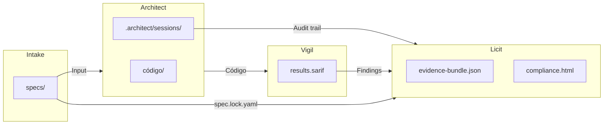
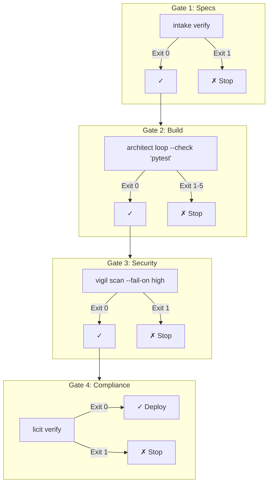
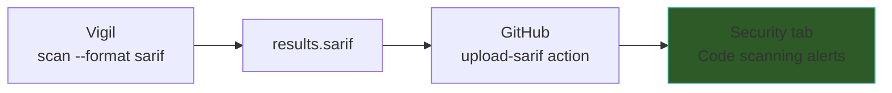

# Ecosistema — Integración CI/CD

> [!abstract] Resumen
> Las 4 herramientas del ecosistema están diseñadas para ==integración CI/CD nativa==. El pipeline completo sigue el flujo: `intake verify` → `architect loop/pipeline` → `vigil scan` → `licit verify`. Cada herramienta tiene ==exit codes estandarizados== y modos para automatización (`--json`, `--quiet`, `--mode yolo`). Los artefactos fluyen como: specs → código → ==SARIF== → evidence → reportes. Este documento incluye un ==workflow completo de GitHub Actions==. ^resumen

---

## Pipeline CI/CD Completo

```mermaid
flowchart TB
    subgraph Trigger["Trigger"]
        PR["Pull Request"]
        PUSH["Push to main"]
        MANUAL["Manual dispatch"]
    end

    subgraph Stage1["Stage 1: Specs"]
        IV["intake verify"]
        IE["intake export-ci"]
    end

    subgraph Stage2["Stage 2: Build"]
        AL["architect loop/pipeline<br/>--mode yolo --budget X"]
    end

    subgraph Stage3["Stage 3: Security"]
        VS["vigil scan<br/>--format sarif --fail-on high"]
    end

    subgraph Stage4["Stage 4: Compliance"]
        LV["licit verify<br/>--framework eu-ai-act"]
    end

    subgraph Artifacts["Artefactos"]
        SPECS["Specs (tar.gz)"]
        CODE["Código generado"]
        SARIF["results.sarif"]
        REPORT["compliance.html"]
    end

    Trigger --> Stage1 --> Stage2 --> Stage3 --> Stage4
    Stage1 --> SPECS
    Stage2 --> CODE
    Stage3 --> SARIF
    Stage4 --> REPORT

    style Stage1 fill:#2d5a27,stroke:#4a9
    style Stage2 fill:#1a4a6e,stroke:#4af
    style Stage3 fill:#8b0000,stroke:#f00
    style Stage4 fill:#5a3d7a,stroke:#a6f
```



---

## Exit Codes por Herramienta

Cada herramienta tiene ==exit codes estandarizados== para CI/CD:

### Intake

| Código | Significado |
|--------|-------------|
| 0 | Verificación exitosa |
| 1 | Verificación fallida |

### Architect

| Código | Significado |
|--------|-------------|
| 0 | ==SUCCESS== |
| 1 | FAILED |
| 2 | PARTIAL |
| 3 | CONFIG_ERROR |
| 4 | AUTH_ERROR |
| 5 | TIMEOUT |
| 130 | INTERRUPTED |

### Vigil

| Código | Significado |
|--------|-------------|
| 0 | ==Clean== (sin hallazgos ≥ umbral) |
| 1 | ==Findings== (hallazgos ≥ umbral de `--fail-on`) |
| 2 | Execution error |

### Licit

| Código | Significado |
|--------|-------------|
| 0 | ==COMPLIANT== |
| 1 | ==NON_COMPLIANT== |
| 2 | ==PARTIAL== |

> [!tip] Consistencia de exit codes
> Exit code 0 siempre significa ==éxito/compliance==. Exit code 1 siempre significa ==fallo/hallazgos/non-compliance==. Los códigos 2+ son específicos de cada herramienta.

---

## Flags para CI/CD

| Flag | Herramienta | Uso |
|------|-------------|-----|
| `--mode yolo` | Architect | ==Sin confirmaciones== |
| `--json` | Architect | Output JSON |
| `--quiet` | Architect | Mínimo output |
| `--budget X.XX` | Architect | Límite de costo |
| `--exit-code-on-partial` | Architect | Tratar PARTIAL como fallo |
| `--format sarif` | Vigil | SARIF para GitHub Security |
| `--fail-on high` | Vigil | Umbral de severidad |
| `--changed-only` | Vigil | Solo archivos modificados |
| `--offline` | Vigil | Sin acceso a registros |
| `--format json` | Licit | Output JSON |
| `--threshold 0.7` | Licit | Umbral de compliance |

---

## Flujo de Artefactos



| Artefacto | Generado por | Consumido por | Formato |
|-----------|-------------|---------------|---------|
| `specs/` | Intake | Architect | ==architect format== |
| `spec.lock.yaml` | Intake | Licit | YAML (hashes) |
| Código fuente | Architect | Vigil | Archivos en disco |
| `.architect/sessions/` | Architect | Licit | JSON |
| `results.sarif` | Vigil | Licit, ==GitHub Security== | SARIF 2.1.0 |
| `evidence-bundle.json` | Licit | Auditoría | JSON |
| `compliance.html` | Licit | Stakeholders | HTML |

---

## GitHub Actions — Workflow Completo

> [!example]- Workflow GitHub Actions completo
> ```yaml
> name: Ecosystem Pipeline
> on:
>   pull_request:
>     branches: [main]
>   workflow_dispatch:
>     inputs:
>       feature:
>         description: 'Feature to implement'
>         required: false
>       budget:
>         description: 'Budget in USD'
>         required: false
>         default: '5.00'
>
> permissions:
>   contents: write
>   security-events: write
>   pull-requests: write
>
> jobs:
>   # Stage 1: Verify and export specs
>   specs:
>     runs-on: ubuntu-latest
>     steps:
>       - uses: actions/checkout@v4
>       - uses: actions/setup-python@v5
>         with:
>           python-version: '3.12'
>
>       - name: Install Intake
>         run: pip install intake-cli
>
>       - name: Verify specifications
>         run: intake verify
>         env:
>           OPENAI_API_KEY: ${{ secrets.OPENAI_API_KEY }}
>
>       - name: Export specs
>         run: intake export-ci --output specs-artifact/
>
>       - uses: actions/upload-artifact@v4
>         with:
>           name: specs
>           path: specs-artifact/
>
>   # Stage 2: Build with Architect
>   build:
>     needs: specs
>     runs-on: ubuntu-latest
>     if: github.event_name == 'workflow_dispatch'
>     steps:
>       - uses: actions/checkout@v4
>       - uses: actions/setup-python@v5
>         with:
>           python-version: '3.12'
>
>       - uses: actions/download-artifact@v4
>         with:
>           name: specs
>           path: specs/
>
>       - name: Install Architect
>         run: pip install architect-ai-cli
>
>       - name: Run Architect
>         run: |
>           architect loop \
>             "${{ inputs.feature || 'Implement pending tasks' }}" \
>             --check "pytest tests/ -x" \
>             --mode yolo \
>             --budget ${{ inputs.budget || '5.00' }} \
>             --json \
>             --quiet
>         env:
>           OPENAI_API_KEY: ${{ secrets.OPENAI_API_KEY }}
>
>       - uses: actions/upload-artifact@v4
>         with:
>           name: architect-sessions
>           path: .architect/sessions/
>
>   # Stage 3: Security scan with Vigil
>   security:
>     needs: [build]
>     runs-on: ubuntu-latest
>     if: always() && needs.build.result != 'cancelled'
>     steps:
>       - uses: actions/checkout@v4
>       - uses: actions/setup-python@v5
>         with:
>           python-version: '3.12'
>
>       - name: Install Vigil
>         run: pip install vigil-scanner
>
>       - name: Run Vigil scan
>         run: vigil scan --format sarif --fail-on high > results.sarif
>         continue-on-error: true
>
>       - name: Upload SARIF to GitHub Security
>         uses: github/codeql-action/upload-sarif@v3
>         with:
>           sarif_file: results.sarif
>
>       - uses: actions/upload-artifact@v4
>         with:
>           name: vigil-sarif
>           path: results.sarif
>
>   # Stage 4: Compliance check with Licit
>   compliance:
>     needs: [security]
>     runs-on: ubuntu-latest
>     if: always() && needs.security.result != 'cancelled'
>     steps:
>       - uses: actions/checkout@v4
>       - uses: actions/setup-python@v5
>         with:
>           python-version: '3.12'
>
>       - uses: actions/download-artifact@v4
>         with:
>           name: architect-sessions
>           path: .architect/sessions/
>         continue-on-error: true
>
>       - uses: actions/download-artifact@v4
>         with:
>           name: vigil-sarif
>           path: ./
>
>       - name: Install Licit
>         run: pip install licit-cli
>
>       - name: Initialize Licit
>         run: licit init
>
>       - name: Connect to data sources
>         run: |
>           licit connect --architect .architect/ || true
>           licit connect --vigil results.sarif || true
>
>       - name: Generate compliance report
>         run: licit report --format html
>
>       - name: Verify compliance
>         run: licit verify --threshold 0.6
>
>       - uses: actions/upload-artifact@v4
>         with:
>           name: compliance-report
>           path: .licit/reports/
> ```

> [!warning] Secrets necesarios
> El workflow requiere configurar ==secrets== en el repositorio:
> - `OPENAI_API_KEY` (o el API key del proveedor LLM configurado)
> - Tokens de conectores si se usan (JIRA_TOKEN, etc.)

---

## Gates de Calidad Automatizados



> [!danger] Cada gate puede detener el pipeline
> Si cualquier gate falla, el pipeline se ==detiene completamente==. Esto garantiza que solo código que:
> 1. Tiene specs verificadas
> 2. Pasa todos los tests
> 3. No tiene vulnerabilidades de seguridad críticas
> 4. Cumple con estándares de compliance
>
> ...llega a producción.

---

## SARIF → GitHub Advanced Security



> [!success] Integración nativa con GitHub
> La salida SARIF 2.1.0 de Vigil es ==100% compatible== con GitHub Advanced Security. Los hallazgos aparecen como alertas en:
> - **Security** → **Code scanning alerts**
> - **Pull requests** → Security annotations
> - **Repository insights** → Security overview

### Severidades en GitHub

| Vigil Severity | SARIF Level | GitHub Display |
|---------------|-------------|----------------|
| Critical | error | ==Error== (bloquea PR) |
| High | error | Error |
| Medium | warning | Warning |
| Low | note | Note |

---

## Configuración por Entorno

| Entorno | Intake | Architect | Vigil | Licit |
|---------|--------|-----------|-------|-------|
| **Desarrollo** | `verify` | `run build` | `scan` | `status` |
| **PR/CI** | `verify` + `export-ci` | `loop --check pytest` | ==`scan --changed-only`== | `verify` |
| **Staging** | — | `pipeline run` | `scan --fail-on medium` | `report --format html` |
| **Producción** | — | — | ==`scan --fail-on low`== | `verify --threshold 0.8` |

> [!tip] --changed-only para PRs
> En PRs, usa `vigil scan --changed-only` para ==escanear solo archivos modificados==. Esto es más rápido y reduce ruido de archivos existentes que no se tocaron.

---

## Monitoreo Continuo

### Watch Mode de Intake

```bash
# Verificar specs automáticamente al cambiar
intake watch
```

### Integración con Cron

> [!example]- Escaneo periódico de compliance
> ```yaml
> # .github/workflows/compliance-check.yml
> name: Weekly Compliance Check
> on:
>   schedule:
>     - cron: '0 9 * * 1'  # Lunes a las 9 AM
>
> jobs:
>   compliance:
>     runs-on: ubuntu-latest
>     steps:
>       - uses: actions/checkout@v4
>       - uses: actions/setup-python@v5
>         with:
>           python-version: '3.12'
>       - run: pip install vigil-scanner licit-cli
>       - run: vigil scan --format sarif > results.sarif
>       - run: |
>           licit init
>           licit connect --vigil results.sarif
>           licit report --format html
>           licit gaps
>       - uses: actions/upload-artifact@v4
>         with:
>           name: weekly-compliance
>           path: .licit/reports/
> ```

---

## Métricas de Pipeline

| Métrica | Fuente | Valor Típico |
|---------|--------|-------------|
| Tiempo de specs | Intake verify | ==< 30s== |
| Tiempo de build | Architect loop | 2-15 min |
| Tiempo de scan | Vigil | ==< 10s== |
| Tiempo de compliance | Licit verify | ==< 5s== |
| Costo de build | Architect cost tracker | $0.50 - $5.00 |
| Artefactos generados | Todas | 5-10 archivos |

> [!question] ¿El costo del LLM es significativo en CI/CD?
> Depende del uso. `intake verify` y `licit verify` ==no requieren LLM==. Solo `architect loop/pipeline` usa LLM y tiene costo. Con `--budget`, se puede controlar estrictamente. Un pipeline típico cuesta ==entre $0.50 y $5.00 USD== dependiendo de la complejidad de la tarea.

---

## Best Practices

> [!tip] Recomendaciones para CI/CD
> 1. **Siempre configura `--budget`** para Architect en CI/CD
> 2. **Usa `--mode yolo`** para Architect (no hay humano para confirmar)
> 3. **Usa `--changed-only`** para Vigil en PRs
> 4. **Sube SARIF a GitHub** para visibilidad de security alerts
> 5. **Genera reportes HTML** de Licit como artefactos para stakeholders
> 6. **Configura umbrales apropiados**: strict para producción, relaxed para desarrollo
> 7. **Ejecuta `intake doctor`** como primer paso para detectar problemas de config

> [!failure] Anti-patrones
> - Architect sin budget en CI/CD (puede consumir cientos de dólares)
> - Vigil con `--offline` en CI/CD (pierde detección de slopsquatting)
> - Licit verify sin `--threshold` (usa default que puede ser demasiado estricto)
> - No subir SARIF a GitHub (pierde visibilidad de seguridad)

---

## Enlaces y referencias

> [!quote]- Referencias internas
> - [[ecosistema-completo]] — Flujo integrado de las 4 herramientas
> - [[intake-overview]] — 22 comandos, export-ci
> - [[architect-overview]] — 15 comandos, exit codes, modo yolo
> - [[architect-pipelines]] — Pipelines YAML para CI/CD
> - [[vigil-overview]] — 5 comandos, SARIF, fail-on
> - [[licit-overview]] — 10 comandos, verify, thresholds
> - [[ecosistema-vs-competidores]] — Comparación con alternativas

[^1]: GitHub Advanced Security es gratuito para repositorios públicos y de pago para privados.
[^2]: El costo del LLM en CI/CD se puede optimizar usando modelos más baratos o prompt caching.
[^3]: SARIF 2.1.0 es soportado nativamente por GitHub, Azure DevOps, y otras plataformas CI/CD.
