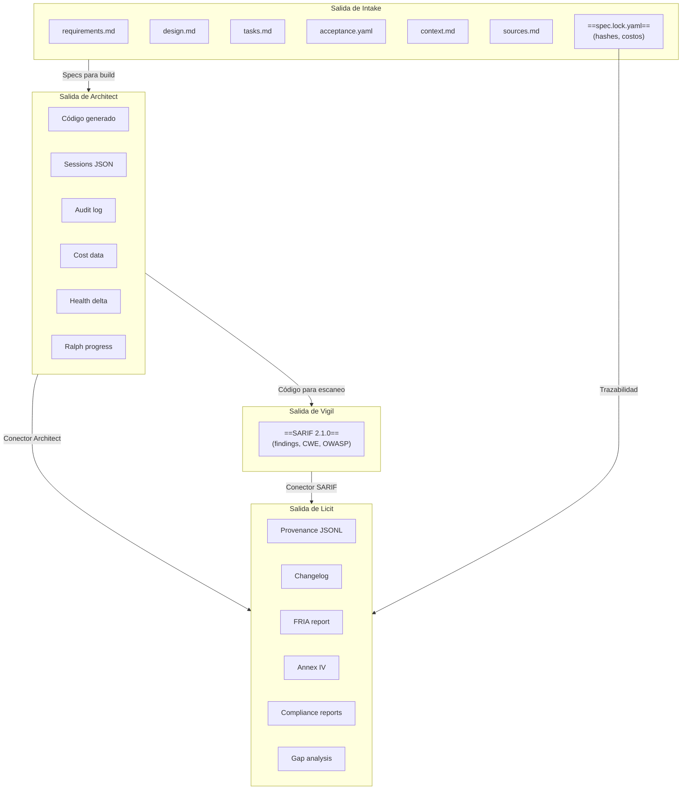
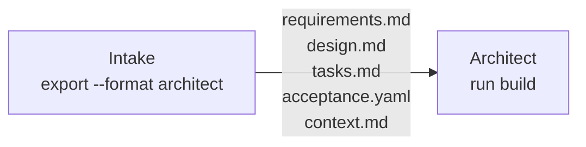
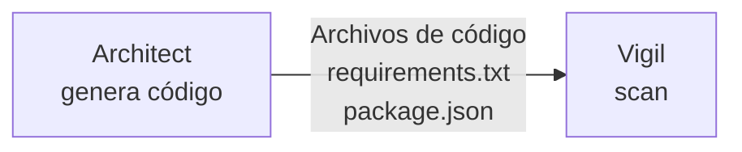
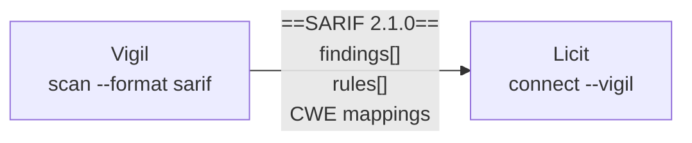
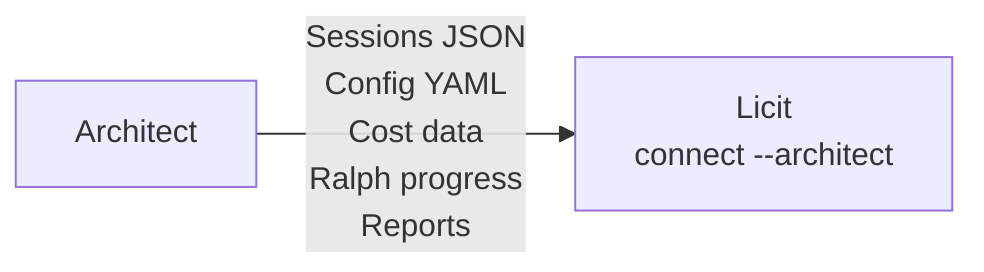
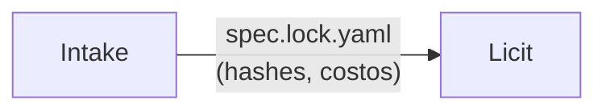
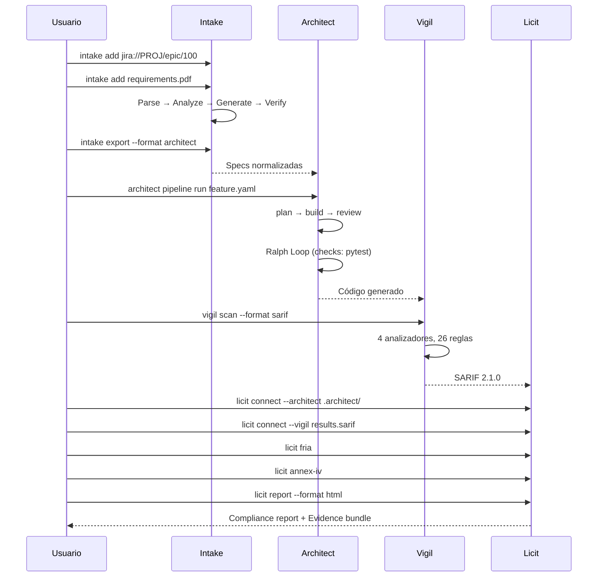
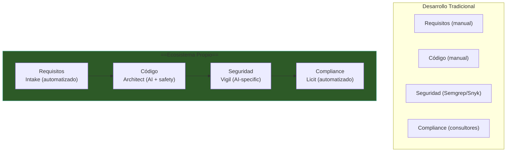

# Ecosistema Completo — Las 4 Herramientas Integradas

> [!abstract] Resumen
> El ecosistema consta de ==4 herramientas CLI== que cubren el ciclo completo de desarrollo con IA: **Intake** (requisitos → specs), **Architect** (specs → código), **Vigil** (código → seguridad), **Licit** (todo → compliance). Comparten ==4 tecnologías base== (Python 3.12+, Click, Pydantic v2, structlog). Los datos fluyen como: requisitos → especificaciones normalizadas → código verificado → resultados SARIF → evidence bundle → reportes de compliance. ^resumen

---

## Flujo Completo del Ecosistema

```mermaid
flowchart LR
    subgraph Input["Entrada"]
        REQ["Requisitos<br/>(12+ formatos)"]
    end

    subgraph Intake["==Intake=="]
        IP["Pipeline 5 fases<br/>12 parsers<br/>22 comandos"]
    end

    subgraph Architect["==Architect=="]
        AP["Agent Loop<br/>4 agentes<br/>11 herramientas<br/>22 capas seguridad"]
    end

    subgraph Vigil["==Vigil=="]
        VP["4 analizadores<br/>26 reglas<br/>Determinista"]
    end

    subgraph Licit["==Licit=="]
        LP["Provenance<br/>EU AI Act<br/>OWASP Agentic<br/>Evidence bundle"]
    end

    subgraph Output["Salida"]
        COMP["Compliance<br/>Reports"]
    end

    REQ --> IP
    IP -->|"specs<br/>(architect format)"| AP
    AP -->|"código<br/>generado"| VP
    VP -->|"SARIF 2.1.0"| LP
    AP -->|"sessions<br/>audit log"| LP
    IP -->|"spec.lock.yaml"| LP
    LP --> COMP

    style Intake fill:#2d5a27,stroke:#4a9
    style Architect fill:#1a4a6e,stroke:#4af
    style Vigil fill:#8b0000,stroke:#f00
    style Licit fill:#5a3d7a,stroke:#a6f
```



---

## Las 4 Herramientas

### Resumen Ejecutivo

| Herramienta | Propósito | Entrada | Salida |
|-------------|-----------|---------|--------|
| [[intake-overview\|**Intake**]] | ==Normalizar requisitos== | 12+ formatos | Specs normalizadas |
| [[architect-overview\|**Architect**]] | ==Generar código== | Specs + prompt | Código funcional |
| [[vigil-overview\|**Vigil**]] | ==Escanear seguridad== | Código fuente | Hallazgos (SARIF) |
| [[licit-overview\|**Licit**]] | ==Verificar compliance== | Todo lo anterior | Reportes + evidencia |

### Números Clave

| Métrica | Intake | Architect | Vigil | Licit |
|---------|--------|-----------|-------|-------|
| Comandos CLI | ==22== | ==15== | ==5== | ==10== |
| Tests | — | ==717+== | ==1706== | ==789== |
| Cobertura | — | ~80% ratio | ==97%== | — |

---

## Flujo de Datos entre Herramientas



> [!tip] Datos que fluyen entre herramientas
> | De | A | Dato | Formato |
> |----|---|------|---------|
> | Intake | Architect | Especificaciones | ==architect format== |
> | Intake | Licit | Trazabilidad | `spec.lock.yaml` |
> | Architect | Vigil | Código fuente | Archivos en disco |
> | Architect | Licit | Audit trail | Sessions JSON + logs |
> | Vigil | Licit | Hallazgos | ==SARIF 2.1.0== |

---

## Tecnologías Compartidas

### Stack Base Común

Las 4 herramientas comparten ==4 tecnologías base==:

| Tecnología | Intake | Architect | Vigil | Licit | Uso |
|------------|--------|-----------|-------|-------|-----|
| ==Python 3.12+== | ✓ | ✓ | ✓ | ✓ | Runtime |
| ==Click== | ✓ | ✓ | ✓ | ✓ | CLI framework |
| ==Pydantic v2== | ✓ | ✓ | ✓ | ✓ | Validación |
| ==structlog== | ✓ | ✓ | ✓ | ✓ | Logging |

### Tecnologías Específicas

| Tecnología | Herramientas | Uso |
|------------|-------------|-----|
| *LiteLLM* | Intake, Architect | Gateway LLM multi-proveedor |
| *Rich* | Intake | UI terminal enriquecida |
| *Jinja2* | Intake, Licit | Templates para generación |
| *httpx* | Vigil | HTTP client para registros |
| *cryptography* | Licit | HMAC-SHA256, Merkle tree |
| *OpenTelemetry* | Architect (opcional) | Telemetría distribuida |

> [!success] Beneficios del stack compartido
> - ==Curva de aprendizaje reducida==: un desarrollador que conoce una herramienta entiende las demás
> - **Consistencia**: misma CLI experience, mismos patrones de logging, misma validación
> - **Mantenimiento**: actualizaciones de dependencias aplican a todo el ecosistema
> - **Interoperabilidad**: modelos Pydantic compartidos facilitan la integración

---

## Puntos de Integración

### 1. Intake → Architect



| Archivo | Uso en Architect |
|---------|-----------------|
| `requirements.md` | Contexto para el agente |
| `design.md` | Guía arquitectónica |
| `tasks.md` | ==Lista de tareas con estado== |
| `acceptance.yaml` | Criterios de verificación |
| `context.md` | Contexto del proyecto |

> [!info] Formato architect
> El formato `architect` es el ==formato nativo de integración==. Organiza los archivos de Intake en la estructura que Architect espera, con metadatos adicionales para guiar al agente.

---

### 2. Architect → Vigil



| Qué escanea Vigil | Qué genera Architect |
|-------------------|---------------------|
| Dependencias | `requirements.txt`, `package.json` |
| Endpoints | Archivos de API (FastAPI, Flask, Express) |
| Secretos | ==Todo el código generado== |
| Tests | Archivos de test |

> [!warning] Timing del escaneo
> Vigil debe ejecutarse ==después== de que Architect complete. En [[architect-pipelines|pipelines YAML]], se puede agregar como check: `vigil scan --fail-on high`.

---

### 3. Vigil → Licit



| Campo SARIF | Uso en Licit |
|-------------|-------------|
| `results[]` | Security findings para evidence bundle |
| `rules[]` | Reglas evaluadas |
| `level` | Severidad para scoring |
| CWE mappings | Mapeo a estándares |

> [!success] SARIF universal
> El conector de Licit acepta ==cualquier SARIF 2.1.0==, no solo de Vigil. Esto permite integrar resultados de Semgrep, CodeQL, u otras herramientas en el evidence bundle.

---

### 4. Architect → Licit



| Fuente Architect | Evidencia para Licit |
|-----------------|---------------------|
| Sessions | ==Audit trail completo== |
| Config | Guardrails, modes, tools |
| Cost tracker | Budget y costos reales |
| Ralph progress | Iteraciones y convergencia |
| Reports | Resultados de agentes |
| Health delta | Métricas de calidad |

---

### 5. Intake → Licit



> [!info] Trazabilidad de requisitos
> El archivo `spec.lock.yaml` contiene ==hashes criptográficos de todas las fuentes y salidas==. Licit usa estos hashes para verificar que las especificaciones no fueron modificadas fuera de Intake, proporcionando trazabilidad para Art. 12 (Logging) del EU AI Act.

---

## Escenario End-to-End



> [!example] Comandos del flujo completo
> ```bash
> # 1. INTAKE — Normalizar requisitos
> intake init mi-proyecto
> intake add "jira://PROJ/epic/PROJ-100"
> intake add requirements.pdf
> intake export --format architect --output ./specs/
>
> # 2. ARCHITECT — Generar código
> architect pipeline run feature.yaml \
>   --var feature=auth-module \
>   --budget 5.00
>
> # 3. VIGIL — Escanear seguridad
> vigil scan --format sarif > results.sarif
>
> # 4. LICIT — Verificar compliance
> licit init
> licit connect --architect .architect/
> licit connect --vigil results.sarif
> licit fria
> licit annex-iv
> licit report --format html
> licit gaps
> licit verify
> ```

---

## Valor Único del Ecosistema



> [!tip] Diferencia clave
> Ningún competidor cubre las ==4 áreas== de forma integrada:
> 1. **Normalización de requisitos** para agentes AI
> 2. **Generación de código** con safety nets
> 3. **Seguridad** específica para código generado por AI
> 4. **Compliance** automatizado con evidence bundles
>
> Ver [[ecosistema-vs-competidores]] para la comparación detallada.

---

## Principios de Diseño Compartidos

| Principio | Implementación |
|-----------|---------------|
| ==CLI-first== | Todas son CLIs, sin UI gráfica |
| ==Determinista== | Resultados reproducibles (excepto LLM) |
| ==Filesystem-first== | Datos en archivos locales, sin DB |
| ==Offline-capable== | Funcionan sin internet (excepto LLM y registros) |
| ==CI/CD native== | Exit codes estandarizados, modo quiet/json |
| ==Extensible== | Plugins, protocolos, custom agents |
| ==Auditable== | Logging, sessions, JSONL, hashes |

---

## Enlaces y referencias

> [!quote]- Referencias internas
> - [[intake-overview]] — Normalización de requisitos
> - [[architect-overview]] — Generación de código con IA
> - [[vigil-overview]] — Escaneo de seguridad determinista
> - [[licit-overview]] — Compliance y trazabilidad
> - [[ecosistema-cicd-integration]] — Pipeline CI/CD integrado
> - [[ecosistema-vs-competidores]] — Comparación competitiva
> - [[ecosistema-roadmap]] — Dirección futura

[^1]: Las 4 herramientas pueden usarse de forma independiente o integrada. No hay dependencias obligatorias entre ellas.
[^2]: El flujo de datos es unidireccional: Intake → Architect → Vigil → Licit. No hay ciclos.
[^3]: Python 3.12+ es el mínimo compartido porque todas las herramientas usan features de Python 3.12 (f-strings mejorados, typing moderno).
