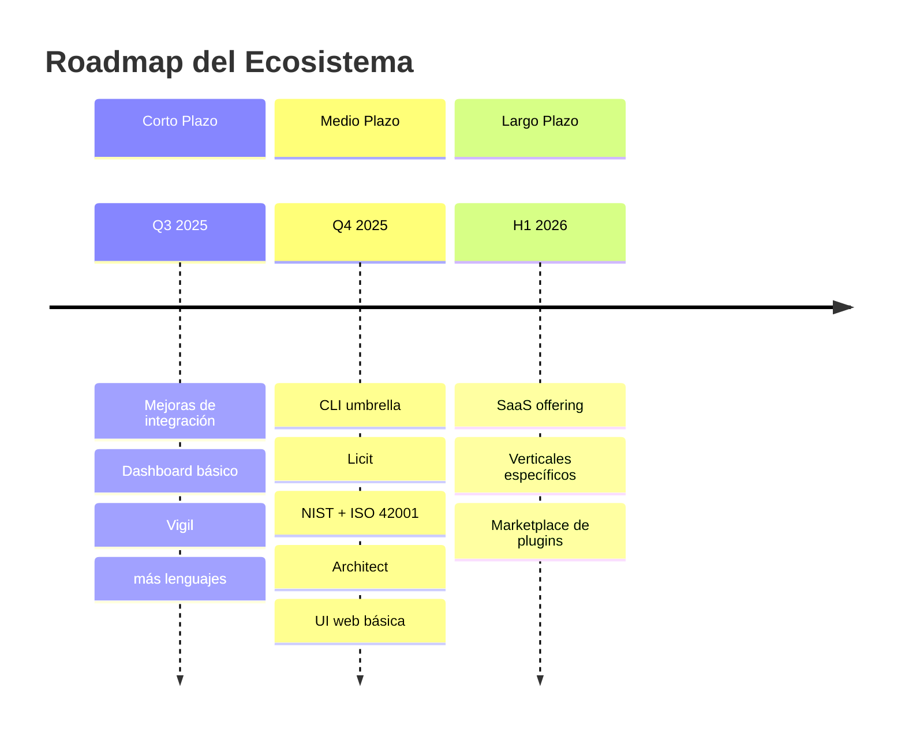
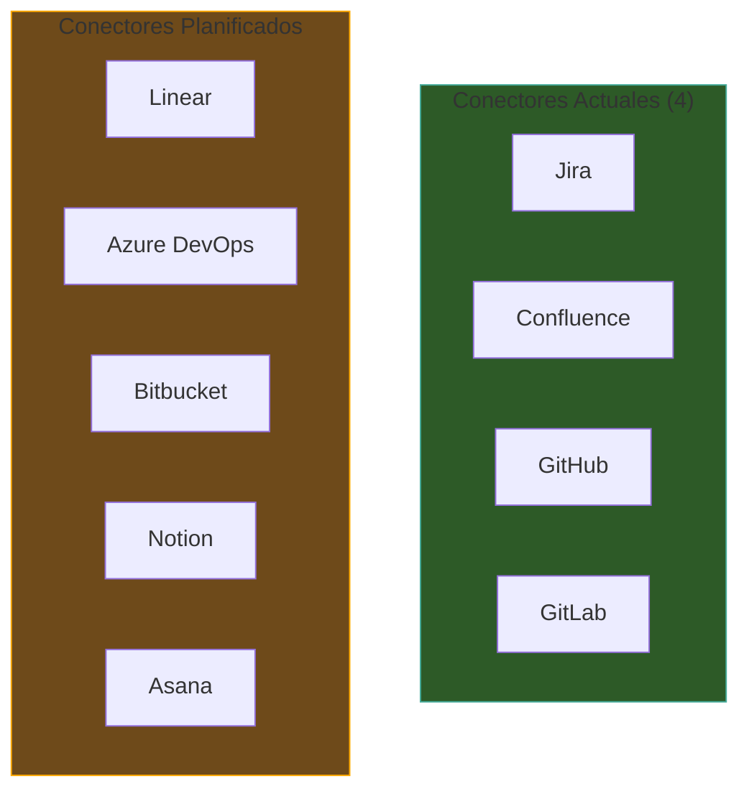
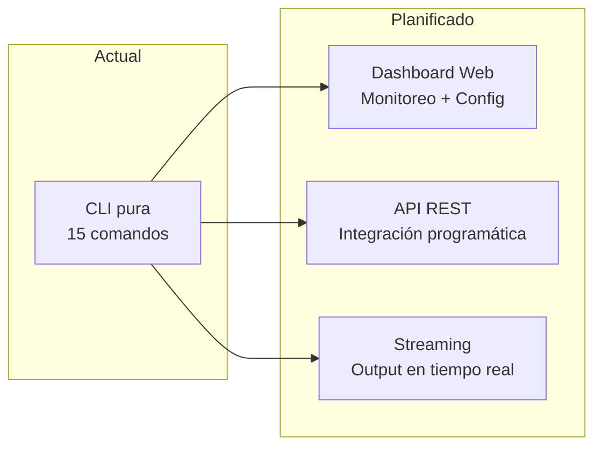
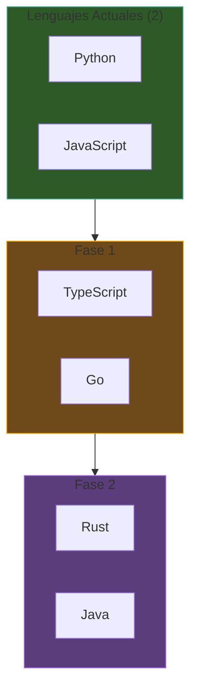
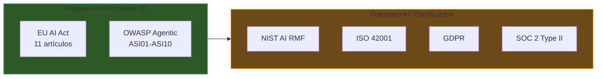
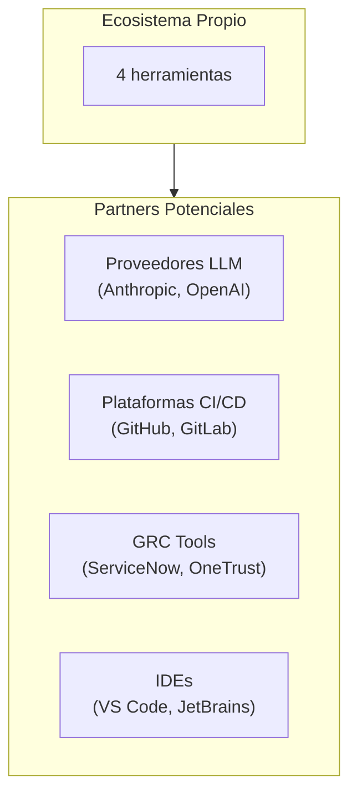
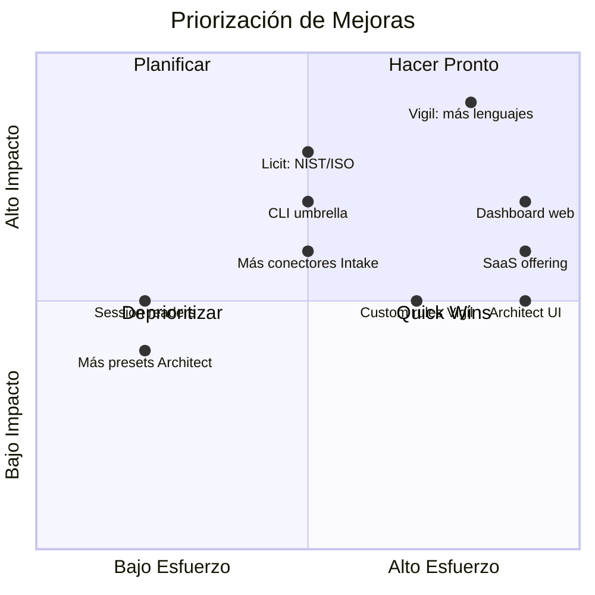

# Ecosistema — Roadmap y Dirección Futura

> [!abstract] Resumen
> Roadmap de mejoras para el ecosistema basado en ==gaps identificados== en [[ecosistema-vs-competidores]]. Cubre mejoras por herramienta (Intake: más conectores y parsers; Architect: UI web y más presets; Vigil: más lenguajes y reglas; Licit: más frameworks de compliance), ==mejoras de integración== (dashboard unificado, CLI umbrella, shared models), y ==oportunidades de mercado== (verticales específicos, partnerships, SaaS offering). ^resumen

> [!warning] Nota de draft
> Este documento tiene status ==draft==. El roadmap es tentativo y sujeto a cambios según prioridades, recursos, y feedback del mercado. No representa compromisos firmes.

---

## Visión a Alto Nivel



---

## Mejoras por Herramienta

### Intake — Mejoras Planificadas

| Mejora | Prioridad | Esfuerzo | Descripción |
|--------|-----------|----------|-------------|
| Más parsers | ==Alta== | Medio | Notion, Asana, Monday.com |
| Más conectores | ==Alta== | Medio | Linear, Azure DevOps, Bitbucket |
| Análisis de conflictos | Media | Alto | Detectar requisitos contradictorios entre fuentes |
| Template marketplace | Media | Medio | Compartir templates *Jinja2* entre equipos |
| UI web para MCP | Baja | Alto | Interfaz visual para el servidor MCP |
| Modo multi-idioma | Media | Medio | Specs en múltiples idiomas simultáneamente |

> [!tip] Prioridad: más conectores
> La mayor demanda identificada es ==más conectores nativos==. Linear y Azure DevOps son los más solicitados. El sistema de plugins permite que la comunidad cree conectores, pero los nativos ofrecen mejor experiencia.



---

### Architect — Mejoras Planificadas

| Mejora | Prioridad | Esfuerzo | Descripción |
|--------|-----------|----------|-------------|
| UI web básica | ==Alta== | ==Alto== | Dashboard para monitorear sesiones y costos |
| Más presets | Media | Bajo | Rust, Go, Java, mobile |
| Agent marketplace | Media | Medio | Compartir agentes custom |
| Streaming output | ==Alta== | Medio | Output en tiempo real durante ejecución |
| MCP client nativo | Media | Medio | Consumir herramientas MCP de terceros |
| Rollback automático | Media | Medio | Revertir cambios si checks fallan |
| Multi-repo support | Media | Alto | Operar en múltiples repositorios |

> [!info] UI web vs CLI
> La UI web ==no reemplazaría la CLI==. Sería un dashboard complementario para:
> - Monitorear sesiones en tiempo real
> - Visualizar costos acumulados
> - Revisar resultados de evaluación competitiva
> - Gestionar configuración visualmente
>
> La CLI seguiría siendo la interfaz principal para ejecución.



---

### Vigil — Mejoras Planificadas

| Mejora | Prioridad | Esfuerzo | Descripción |
|--------|-----------|----------|-------------|
| ==Más lenguajes== | ==Alta== | ==Alto== | TypeScript, Go, Rust, Java |
| Más reglas DEP | ==Alta== | Medio | Registros adicionales (crates.io, pkg.go.dev) |
| Reglas de prompt injection | Media | Alto | Detectar vulnerabilidades de prompt injection |
| Custom rules (YAML) | Media | Alto | Permitir reglas personalizadas como Semgrep |
| Vigil daemon | Baja | Medio | Escaneo continuo en background |
| IDE plugins | Baja | Alto | Integración con VS Code, JetBrains |
| Más frameworks auth | Media | Medio | Django, Spring Boot, Gin |

> [!danger] Más lenguajes es la prioridad #1
> Vigil actualmente soporta ==solo Python y JavaScript==. Esto limita su utilidad para proyectos en Go, Rust, Java, TypeScript, etc. La expansión de lenguajes es la mejora más crítica identificada en [[ecosistema-vs-competidores]].



#### Nuevos Registros de Paquetes

| Registro | Lenguaje | Reglas Nuevas |
|----------|----------|---------------|
| crates.io | Rust | DEP-001 a DEP-007 adaptadas |
| pkg.go.dev | Go | DEP-001 a DEP-007 adaptadas |
| Maven Central | Java | DEP-001 a DEP-007 adaptadas |
| NuGet | C# | DEP-001 a DEP-007 adaptadas |

---

### Licit — Mejoras Planificadas

| Mejora | Prioridad | Esfuerzo | Descripción |
|--------|-----------|----------|-------------|
| ==NIST AI RMF== | ==Alta== | Medio | Risk Management Framework |
| ==ISO 42001== | ==Alta== | Medio | AI Management System |
| Más session readers | Media | Bajo | Cursor, Copilot, Windsurf sessions |
| Dashboard de compliance | Media | Alto | UI web para tracking |
| Export a GRC tools | Baja | Medio | Integración con ServiceNow, RSA Archer |
| SOC 2 mappings | Baja | Medio | Mapeo de controles SOC 2 |
| GDPR evaluator | Media | Medio | Evaluación de protección de datos |

> [!question] ¿Cuándo se añaden NIST e ISO 42001?
> NIST AI RMF e ISO 42001 están ==planificados para Q4 2025==. Ambos frameworks se integrarán al sistema de evaluación dinámica existente. El architecture de evaluadores dinámicos ([[licit-architecture]]) permite agregar nuevos frameworks sin cambios en el core.



### Session Readers Adicionales

| Reader | Herramienta | Formato de Sesión |
|--------|-------------|-------------------|
| Claude Code | ==Ya implementado== | JSONL |
| Cursor | Planificado | TBD |
| GitHub Copilot | Planificado | TBD |
| Windsurf | Exploración | TBD |
| Aider | Exploración | JSONL |

---

## Mejoras de Integración

### CLI Umbrella

Una CLI "umbrella" que unifique los 4 herramientas:

> [!example]- Concepto de CLI umbrella
> ```bash
> # En lugar de 4 CLIs separadas:
> intake verify
> architect run build "..."
> vigil scan
> licit verify
>
> # Una sola CLI:
> eco verify-specs        # → intake verify
> eco build "..."         # → architect run build "..."
> eco scan               # → vigil scan
> eco compliance         # → licit verify
>
> # Pipeline completo con un solo comando:
> eco pipeline full --feature "auth module" --budget 5.00
> ```

> [!tip] Beneficio de la CLI umbrella
> Reduce la ==curva de aprendizaje==: un solo comando (`eco`) con sub-comandos intuitivos en lugar de 4 CLIs con 52 comandos combinados. La CLI umbrella invocaría las herramientas individuales internamente.

---

### Dashboard Unificado

```mermaid
flowchart TB
    subgraph Dashboard["Dashboard Web Unificado"]
        D1["Estado de Specs<br/>(Intake)"]
        D2["Sesiones Activas<br/>(Architect)"]
        D3["Security Findings<br/>(Vigil)"]
        D4["Compliance Score<br/>(Licit)"]
        D5["Costos Acumulados"]
        D6["Timeline de Actividad"]
    end

    I["Intake"] --> D1
    A["Architect"] --> D2 & D5
    V["Vigil"] --> D3
    L["Licit"] --> D4

    style Dashboard fill:#1a4a6e,stroke:#4af
```



| Componente | Datos | Fuente |
|------------|-------|--------|
| Specs status | Verificación actual, fuentes | Intake |
| Sessions | En curso, completadas, costos | ==Architect== |
| Security | Hallazgos por severidad, tendencias | Vigil SARIF |
| Compliance | ==Scores por framework==, gaps | Licit |
| Timeline | Actividad combinada de 4 herramientas | Todas |

---

### Shared Pydantic Models

Una biblioteca compartida de modelos *Pydantic v2*:

| Modelo Compartido | Usado Por |
|-------------------|-----------|
| `Requirement` | Intake, Architect |
| `SecurityFinding` | Vigil, Licit |
| `ComplianceScore` | Licit, Dashboard |
| `CostEntry` | Architect, Dashboard |
| `ToolResult` | Architect, Licit |

> [!info] Beneficio de shared models
> Modelos compartidos ==eliminan la necesidad de transformaciones== entre herramientas. Hoy, Licit tiene que parsear el formato de Architect. Con shared models, ambos usarían el mismo tipo directamente.

---

## Oportunidades de Mercado

### Verticales Específicos

| Vertical | Opportunity | Herramientas Relevantes |
|----------|------------|------------------------|
| ==FinTech== | Regulación estricta (EU AI Act, PSD2) | Licit (compliance), Vigil (seguridad) |
| ==HealthTech== | FDA, HIPAA, MDR | Licit (compliance), Vigil |
| ==GovTech== | Procurement requirements | Intake (specs), Licit (compliance) |
| SaaS B2B | SOC 2 requirement | Licit (compliance) |
| Startups AI | Velocidad + compliance | Ecosistema completo |

> [!tip] FinTech como vertical inicial
> FinTech es el vertical más prometedor porque:
> 1. ==EU AI Act es obligatorio== para servicios financieros AI
> 2. Los presupuestos de compliance son altos
> 3. La automatización de Licit ahorra semanas de consultoría
> 4. Las reglas de Vigil son directamente relevantes (auth, secrets)

---

### Partnerships Potenciales



| Partner | Tipo de Integración | Valor |
|---------|--------------------|----|
| Anthropic | Optimización para Claude | Mejor rendimiento con Claude models |
| GitHub | ==Action oficial + SARIF== | Distribución a millones de repos |
| GitLab | CI/CD templates | Distribución en enterprise |
| ServiceNow | Export de compliance data | Integración con GRC enterprise |

---

### SaaS Offering

> [!question] ¿Debería existir una versión SaaS?
> La filosofía actual es ==filesystem-first y offline==. Un SaaS contradice estos principios pero podría:
> - Ofrecer dashboard web sin setup local
> - Almacenar compliance data en la nube para equipos distribuidos
> - Proporcionar compliance-as-a-service para empresas sin expertise técnico
>
> La decisión depende de si el mercado target valora más la ==privacidad y control local== o la ==comodidad del SaaS==.

| Modelo | Ventajas | Desventajas |
|--------|----------|-------------|
| ==CLI solo (actual)== | Privacidad, control, offline | Curva de aprendizaje |
| CLI + Dashboard SaaS | Lo mejor de ambos mundos | Complejidad de mantener |
| SaaS completo | Fácil de usar | Contradice filosofía |

---

## Priorización de Mejoras

### Matriz de Impacto vs Esfuerzo



### Top 5 Prioridades

| # | Mejora | Impacto | Herramienta |
|---|--------|---------|-------------|
| 1 | ==Más lenguajes en Vigil== | Crítico | [[vigil-overview\|Vigil]] |
| 2 | ==NIST AI RMF + ISO 42001== | Alto | [[licit-overview\|Licit]] |
| 3 | ==CLI umbrella== | Alto | Ecosistema |
| 4 | ==Más conectores Intake== | Alto | [[intake-overview\|Intake]] |
| 5 | ==Session readers adicionales== | Medio | [[licit-overview\|Licit]] |

> [!success] Quick wins identificados
> Las mejoras de ==bajo esfuerzo y alto impacto== (quick wins):
> - Más presets para Architect (python, node, rust, go, java)
> - Session readers adicionales para Licit (Cursor, Copilot)
> - Templates adicionales para Intake

---

## Métricas de Éxito

| Métrica | Estado Actual | Meta 6 Meses | Meta 12 Meses |
|---------|--------------|--------------|---------------|
| Lenguajes Vigil | 2 | ==4== | 6 |
| Frameworks Licit | 2 | ==4== | 5 |
| Conectores Intake | 4 | ==6== | 8 |
| Tests totales | ~3200 | 4000 | 5000 |
| Cobertura Vigil | 97% | ==97%+== | 97%+ |

---

## Enlaces y referencias

> [!quote]- Referencias internas
> - [[ecosistema-completo]] — Estado actual del ecosistema
> - [[ecosistema-vs-competidores]] — Gaps identificados
> - [[ecosistema-cicd-integration]] — Base para mejoras de integración
> - [[intake-overview]] — Mejoras planificadas para Intake
> - [[architect-overview]] — Mejoras planificadas para Architect
> - [[vigil-overview]] — Prioridad #1: más lenguajes
> - [[licit-overview]] — Prioridad #2: más frameworks
> - [[vigil-vs-alternatives]] — Comparación que identifica gaps

[^1]: El roadmap es tentativo y sujeto a cambios. Las prioridades se re-evalúan trimestralmente.
[^2]: El timeline supone dedicación a tiempo parcial al ecosistema. Con dedicación a tiempo completo, los plazos se reducirían significativamente.
[^3]: La decisión SaaS vs CLI-only se tomará basándose en feedback de los primeros usuarios del ecosistema.
