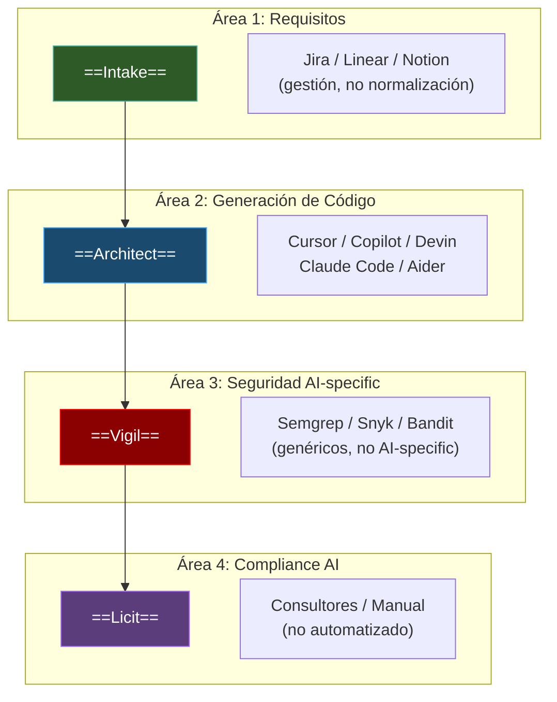
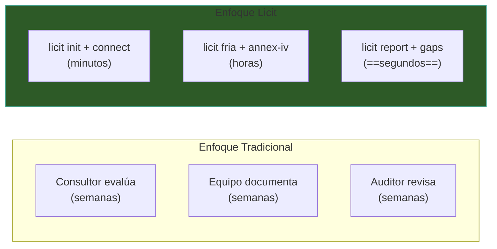
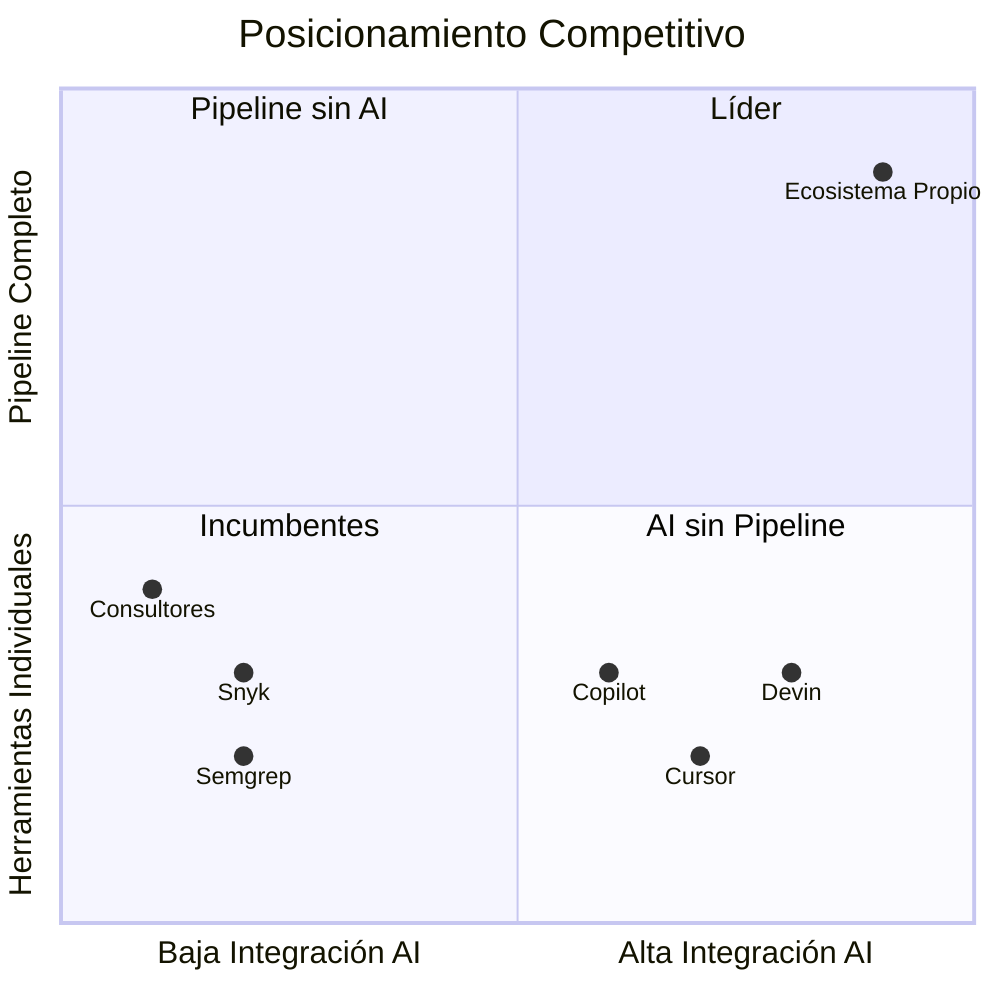
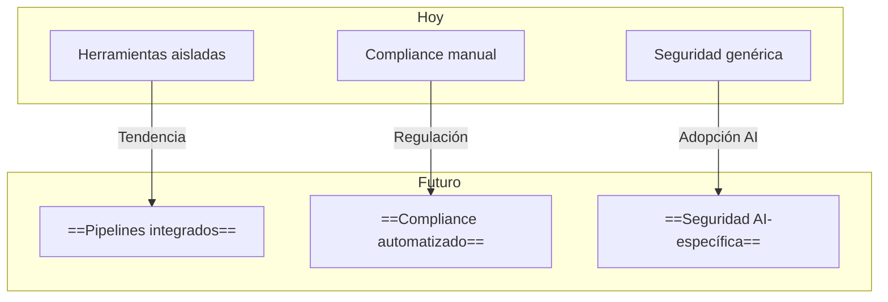

# Ecosistema vs Competidores

> [!abstract] Resumen
> ==Ningún competidor individual cubre las 4 áreas== del ecosistema (requisitos, generación de código, seguridad AI-específica, compliance). Los competidores parciales incluyen: **coding agents** (Cursor, Copilot, Devin, Claude Code), **security** (Semgrep, Snyk, SonarQube), y **compliance** (procesos manuales, consultores). El ==valor único== es el pipeline integrado de requisitos a compliance con herramientas diseñadas específicamente para desarrollo con IA. Se identifican también gaps y áreas de mejora. ^resumen

> [!warning] Nota de volatilidad
> Este documento tiene status ==volatile==. El mercado de herramientas AI para desarrollo cambia rápidamente. Las comparaciones reflejan el estado al momento de escritura y deben verificarse periódicamente.

---

## Mapa Competitivo

> [!tip] Brecha competitiva
> La brecha más grande está en las ==Áreas 1 y 4==. No existe ningún competidor que normalice requisitos para agentes AI (Área 1), ni que automatice compliance del EU AI Act para desarrollo AI (Área 4).

---

## Área 1: Requisitos — Intake vs Alternativas

| Criterio | Intake | Jira | Linear | Notion |
|----------|--------|------|--------|--------|
| ==Normalización para AI== | ==✓== | ✗ | ✗ | ✗ |
| 12 formatos de entrada | ==✓== | ✗ | ✗ | ✗ |
| Export para agentes AI | ==6 formatos== | ✗ | ✗ | ✗ |
| Deduplicación de requisitos | ==✓ (Jaccard 0.75)== | ✗ | ✗ | ✗ |
| Pipeline de verificación | ==✓ (4 check types)== | ✗ | ✗ | ✗ |
| Servidor MCP | ==✓ (9 tools)== | ✗ | ✗ | ✗ |
| Gestión de tareas | Básica | ==Completa== | ==Completa== | ==Completa== |
| UI gráfica | ✗ | ==✓== | ==✓== | ==✓== |
| Colaboración en equipo | ✗ | ==✓== | ==✓== | ==✓== |

> [!info] Intake no compite con Jira/Linear
> Intake ==no reemplaza== herramientas de gestión de proyectos. Las complementa: Intake *consume* datos de Jira, Linear, y otras fuentes, y los normaliza para agentes AI. El flujo ideal es Jira (gestión humana) → Intake (normalización) → [[architect-overview|Architect]] (generación).

---

## Área 2: Generación de Código — Architect vs Agentes

| Criterio | Architect | Cursor | Copilot | Devin | Claude Code | Aider |
|----------|-----------|--------|---------|-------|-------------|-------|
| ==CLI headless== | ==✓== | ✗ | ✗ | ✗ | ==✓== | ==✓== |
| UI gráfica/IDE | ✗ | ==✓== | ==✓== | ==✓== | ✗ | ✗ |
| ==22 capas de seguridad== | ==✓== | ✗ | ✗ | Parcial | Parcial | ✗ |
| Ralph Loop | ==✓== | ✗ | ✗ | Parcial | ✗ | ✗ |
| ==Pipelines YAML== | ==✓== | ✗ | ✗ | ✗ | ✗ | ✗ |
| Ejecución paralela | ==✓== | ✗ | ✗ | ✗ | ✗ | ✗ |
| Evaluación competitiva | ==✓== | ✗ | ✗ | ✗ | ✗ | ✗ |
| Custom agents YAML | ==✓== | ✗ | ✗ | ✗ | ✗ | ✗ |
| ==OpenTelemetry== | ==✓== | ✗ | ✗ | ✗ | ✗ | ✗ |
| Cost tracking | ==✓== | ✗ | ✗ | ✗ | Parcial | ==✓== |
| CI/CD native | ==✓== | ✗ | ==✓== | ✗ | ==✓== | ==✓== |
| Auto-review | ==✓== | ✗ | ✗ | ✗ | ✗ | ✗ |
| Experiencia interactiva | Limitada | ==Excelente== | ==Excelente== | ==Buena== | Buena | Limitada |
| Multi-modelo | ==✓ (LiteLLM)== | Parcial | ✗ | ✗ | ✗ | ==✓== |

> [!warning] Experiencia de usuario
> Architect es un ==CLI headless== diseñado para automatización y CI/CD. No compite en experiencia interactiva con IDEs como Cursor o Copilot. La fortaleza de Architect está en ==automatización, seguridad, y reproducibilidad==, no en la experiencia de "pair programming" que ofrecen los IDEs.

### Diferenciadores Clave de Architect

| Diferenciador | Valor |
|--------------|-------|
| ==22 capas de seguridad== | Ningún competidor tiene seguridad comparable |
| ==Pipelines YAML== | Orquestación multi-agente declarativa |
| ==Ralph Loop== | Iteración automática hasta que tests pasen |
| ==Evaluación competitiva== | Comparar modelos con scoring objetivo |
| ==OpenTelemetry== | Observabilidad de grado producción |
| ==Cost tracking== | Control de costos por paso |

> [!question] ¿Architect reemplaza a Cursor/Copilot?
> ==No==. Architect y Cursor/Copilot sirven casos de uso diferentes:
> - **Cursor/Copilot**: desarrollo interactivo humano-AI, pair programming
> - **Architect**: ==automatización==, CI/CD, tareas repetitivas, pipelines complejos
>
> Pueden usarse juntos: Cursor para desarrollo interactivo, Architect para automatización.

---

## Área 3: Seguridad — Vigil vs Escáneres

Consulta [[vigil-vs-alternatives]] para la comparación detallada. Resumen:

| Criterio | Vigil | Semgrep | Snyk | SonarQube |
|----------|-------|---------|------|-----------|
| ==Reglas AI-específicas== | ==✓ (26)== | ✗ | ✗ | ✗ |
| Slopsquatting | ==✓== | ✗ | ✗ | ✗ |
| Test theater | ==✓== | ✗ | ✗ | Parcial |
| SAST completo | ✗ | ==✓== | ✗ | ==✓== |
| CVE database | ✗ | ✗ | ==✓== | ✗ |
| 30+ lenguajes | ✗ | ==✓== | ==✓== | ==✓== |

> [!tip] Vigil complementa, no reemplaza
> La estrategia recomendada es ==Vigil + un escáner SAST tradicional==. Vigil cubre la brecha de seguridad AI-específica que ningún otro escáner cubre.

---

## Área 4: Compliance — Licit vs Alternativas

| Criterio | Licit | Consultores | Manual | Vanta/Drata |
|----------|-------|-------------|--------|-------------|
| ==EU AI Act automático== | ==✓ (11 artículos)== | Manual | Manual | ✗ |
| ==OWASP Agentic automático== | ==✓ (ASI01-ASI10)== | Manual | Manual | ✗ |
| Provenance tracking | ==✓ (6 heurísticas)== | ✗ | ✗ | ✗ |
| FRIA generation | ==✓ (16 preguntas)== | Manual | Manual | ✗ |
| Annex IV generation | ==✓ (27 variables)== | Manual | Manual | ✗ |
| Evidence bundles | ==✓ (18 campos)== | Manual | Manual | Parcial |
| ==Filesystem-first, offline== | ==✓== | N/A | N/A | ✗ (cloud) |
| Costo | ==Gratis== | $$$$$ | $$ | $$$$ |
| Expertise requerido | Medio | ==Bajo (consultores hacen todo)== | Alto | Medio |
| SOC 2 / ISO 27001 | ✗ | ==✓== | ✓ | ==✓== |
| Scope AI-específico | ==✓== | Parcial | Parcial | ✗ |

> [!danger] Licit no reemplaza consultores legales
> Licit ==automatiza la recopilación de evidencia y generación de documentación==, pero no reemplaza el criterio legal. Para compliance formal del EU AI Act, se recomienda que un abogado o consultor especializado ==revise== los reportes generados por Licit.

### Brecha Competitiva en Compliance

---

## Comparación del Pipeline Completo

| Etapa | Ecosistema Propio | Mejor Alternativa | Gap |
|-------|-------------------|-------------------|-----|
| Requisitos → Specs AI | ==Intake== | No existe | ==Sin competencia== |
| Specs → Código | ==Architect== | Devin, Claude Code | Architect: más seguro, CI/CD native |
| Código → Seguridad AI | ==Vigil== | No existe (AI-specific) | ==Sin competencia AI-specific== |
| Todo → Compliance AI | ==Licit== | No existe (automatizado) | ==Sin competencia automatizada== |
| Pipeline integrado | ==4 herramientas== | No existe | ==Sin competencia integrada== |

> [!success] Valor único del ecosistema
> El valor diferencial no está en ninguna herramienta individual, sino en el ==pipeline integrado end-to-end==. Ningún competidor ofrece el flujo completo de requisitos → código → seguridad → compliance de forma automatizada.

---

## Assessment Honesto de Gaps

> [!failure] Áreas donde el ecosistema es débil
>
> ### Experiencia de Usuario
> Las 4 herramientas son ==CLI puras==. No hay UI gráfica, IDE plugins, ni dashboards web. Para equipos que prefieren interfaces gráficas, esto es una barrera.
>
> ### Soporte de Lenguajes
> Vigil solo soporta ==Python y JavaScript==. Proyectos en Go, Rust, Java, etc. tienen cobertura reducida.
>
> ### Madurez del Mercado
> Cursor y Copilot tienen ==millones de usuarios y ecosistemas maduros==. Architect es una herramienta más nueva y menos probada en producción a gran escala.
>
> ### SAST Tradicional
> Vigil ==no reemplaza== Semgrep/Snyk/SonarQube. Es un complemento, no un sustituto, para vulnerabilidades clásicas.
>
> ### Compliance Tradicional
> Licit cubre ==EU AI Act y OWASP Agentic==, pero no SOC 2, ISO 27001, HIPAA, ni otros frameworks de compliance tradicionales.
>
> ### Documentación y Comunidad
> Las herramientas comerciales tienen ==mejor documentación, tutoriales, y comunidad== que un ecosistema propio.

---

## Estrategia de Posicionamiento

> [!tip] Posición defendible
> El ecosistema se posiciona en el cuadrante de ==alta integración AI + pipeline completo==. Esta posición es defendible porque:
> 1. Requiere expertise en 4 áreas distintas
> 2. La integración entre herramientas crea valor compuesto
> 3. El foco AI-específico es difícil de replicar por incumbentes genéricos

---

## Escenarios de Uso Complementario

| Escenario | Ecosistema Propio | Complemento Recomendado |
|-----------|-------------------|------------------------|
| Desarrollo interactivo | — | ==Cursor o Copilot== |
| SAST completo | Vigil (AI-specific) | ==Semgrep o SonarQube== |
| CVE tracking | — | ==Snyk o Trivy== |
| SOC 2 compliance | — | ==Vanta o Drata== |
| Gestión de proyecto | — | ==Jira o Linear== |
| Dashboard de métricas | — | ==Grafana + OTel== |

---

## Análisis por Tipo de Usuario

### Para el Desarrollador Individual

| Necesidad | Ecosistema | Alternativa |
|-----------|-----------|-------------|
| Escribir código con AI | Architect (CLI) | ==Cursor (IDE, más intuitivo)== |
| Verificar seguridad | Vigil (rápido, simple) | Semgrep (más completo) |
| Documentar compliance | Licit (automatizado) | Manual (tedioso) |
| Normalizar requisitos | ==Intake (único)== | No existe |

> [!info] Para desarrolladores individuales, la combinación ==Cursor + Vigil + Licit== puede ser más práctica que el ecosistema completo, ya que Cursor ofrece mejor experiencia interactiva.

### Para Equipos de Desarrollo

| Necesidad | Ecosistema | Alternativa |
|-----------|-----------|-------------|
| CI/CD automatizado | ==Ecosistema (nativo)== | Configuración manual por herramienta |
| Reproducibilidad | ==Architect (pipelines YAML)== | Scripts custom |
| Auditoría de agentes | ==Licit (evidence bundle)== | No existe automatizado |
| Multi-modelo eval | ==Architect (eval competitiva)== | Benchmarks manuales |

### Para Compliance Officers

| Necesidad | Ecosistema | Alternativa |
|-----------|-----------|-------------|
| EU AI Act eval | ==Licit (11 artículos)== | Consultores ($$$) |
| OWASP Agentic | ==Licit (ASI01-ASI10)== | Manual |
| FRIA generation | ==Licit (16 preguntas)== | Documentos Word ($) |
| Evidence collection | ==Licit (18 campos auto)== | Meses de trabajo manual |
| Annex IV | ==Licit (27 variables)== | Consultores ($$$) |

> [!success] Valor para compliance officers
> El ecosistema ofrece el mayor valor diferencial para ==compliance officers de organizaciones que usan AI para desarrollo==. Ninguna alternativa automatiza la recopilación de evidencia y generación de documentación regulatoria al nivel de [[licit-overview|Licit]].

---

## Tendencias del Mercado

> [!tip] Ventaja de primer movimiento
> El ecosistema tiene ==ventaja de primer movimiento== en las 3 tendencias:
> 1. **Pipelines integrados**: primer ecosistema end-to-end de requisitos a compliance
> 2. **Compliance automatizado**: primer CLI que automatiza EU AI Act para desarrollo AI
> 3. **Seguridad AI-específica**: primera herramienta determinista para vulnerabilidades de código AI

---

## Enlaces y referencias

> [!quote]- Referencias internas
> - [[ecosistema-completo]] — Las 4 herramientas integradas
> - [[vigil-vs-alternatives]] — Comparación detallada de Vigil
> - [[intake-overview]] — Sin competencia en normalización AI
> - [[architect-overview]] — Diferencias con Cursor/Copilot/Devin
> - [[vigil-overview]] — Reglas AI-específicas únicas
> - [[licit-overview]] — Compliance automatizado único
> - [[ecosistema-roadmap]] — Plan para cerrar gaps identificados

[^1]: Las comparaciones con productos comerciales se basan en información pública disponible al momento de escritura.
[^2]: El mercado de herramientas AI para desarrollo está en fase de crecimiento rápido, con nuevos competidores entrando frecuentemente.
[^3]: Los precios de consultores de compliance varían entre $200-$500/hora para EU AI Act.
[^4]: La ventaja de primer movimiento solo es sostenible si se mantiene el ritmo de innovación. Los incumbentes tienen más recursos.
