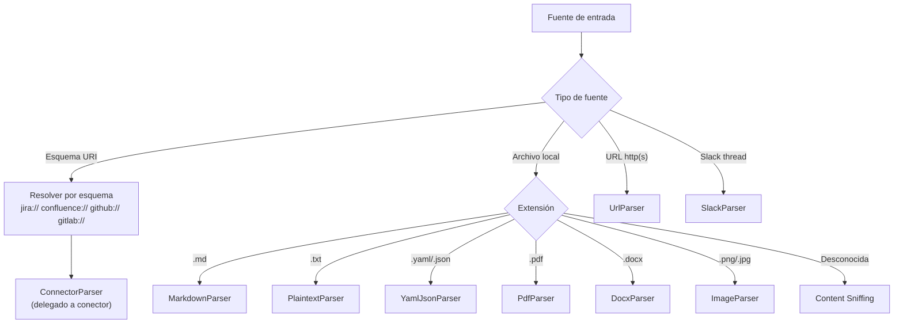
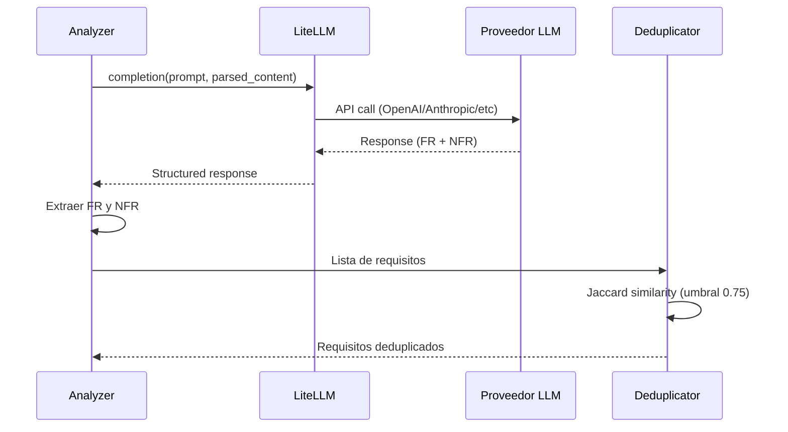
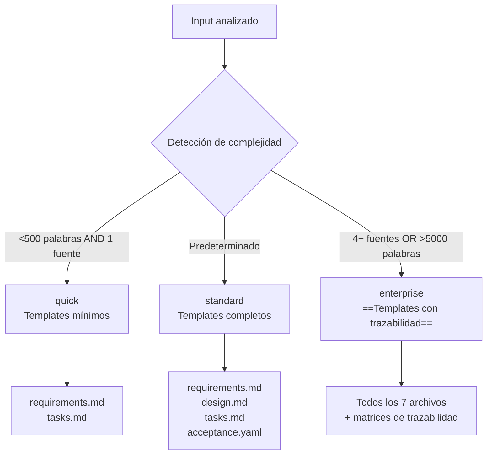
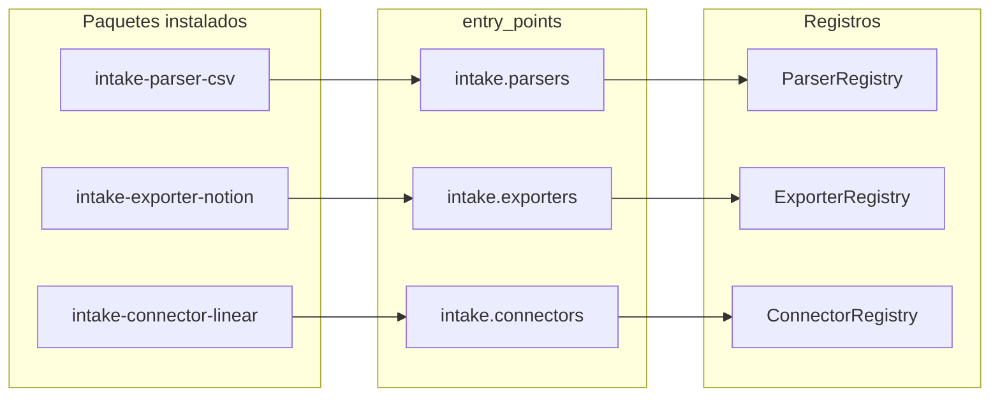
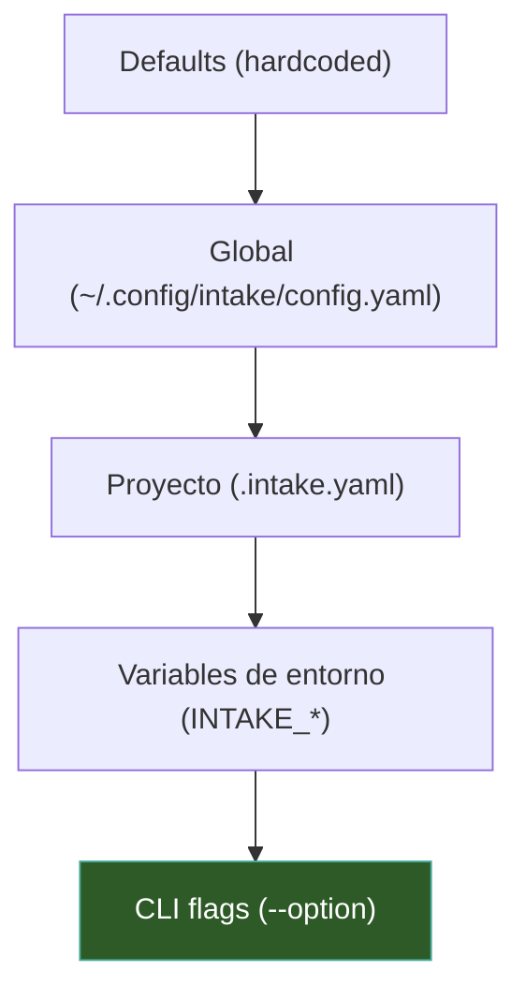
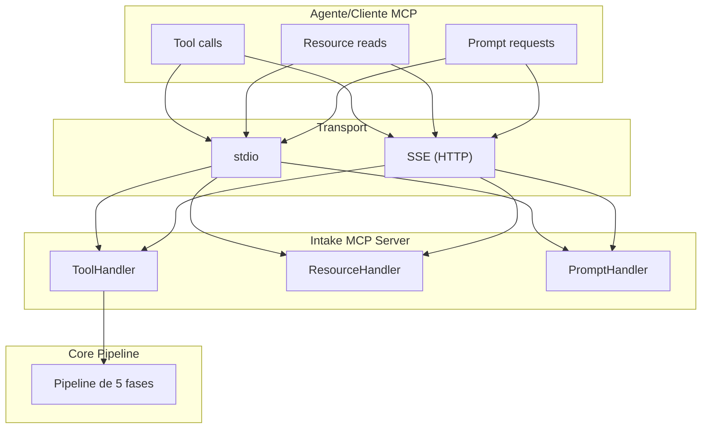
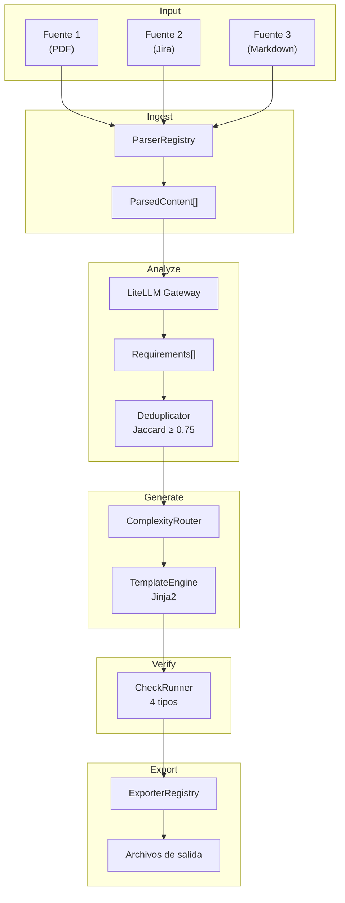

# Intake — Arquitectura Técnica

> [!abstract] Resumen
> La arquitectura de Intake se organiza alrededor de un ==pipeline secuencial de 5 fases== con registros de *parsers*, *exporters* y conectores descubiertos vía *entry_points*. Utiliza ==*Pydantic v2* para validación==, *LiteLLM* como gateway LLM, *Jinja2* para generación de templates, y un ==sistema de plugins con protocolos V1/V2==. La configuración centralizada en `.intake.yaml` controla todos los aspectos del sistema. ^resumen

---

## Arquitectura General

```mermaid
flowchart TB
    subgraph CLI["CLI Layer (Click + Rich)"]
        CMD[22 Comandos]
        MCP_S["MCP Server<br/>9 tools, 6 resources, 2 prompts"]
    end

    subgraph Core["Core Pipeline"]
        direction LR
        ING["Ingest<br/>ParserRegistry"]
        ANZ["Analyze<br/>LiteLLM + Dedup"]
        GEN["Generate<br/>Jinja2 Engine"]
        VER["Verify<br/>CheckRunner"]
        EXP["Export<br/>ExporterRegistry"]
    end

    subgraph Infra["Infrastructure"]
        CFG["Config<br/>.intake.yaml"]
        PLG["Plugin System<br/>entry_points"]
        CON["Connectors<br/>Jira/Confluence/GitHub/GitLab"]
        LOG["Logging<br/>structlog"]
        VAL["Validation<br/>Pydantic v2"]
    end

    CMD --> Core
    MCP_S --> Core
    Core --> Infra
    ING --> ANZ --> GEN --> VER --> EXP

    style CLI fill:#1a3a5c,stroke:#4a9
    style Core fill:#2d5a27,stroke:#4a9
    style Infra fill:#5a3d7a,stroke:#4a9
```



> [!info] Principio arquitectónico
> Intake sigue una arquitectura de ==pipeline lineal con registros==. Cada fase es un módulo independiente que recibe datos de la fase anterior y produce datos para la siguiente. Los registros (*ParserRegistry*, *ExporterRegistry*) permiten extensibilidad sin modificar el core.

---

## Parser Registry y Auto-detección

El *ParserRegistry* es el componente central de la fase de Ingest. Gestiona los ==12 parsers== disponibles y decide cuál usar para cada fuente de entrada[^1].

### Mecanismo de Auto-detección



> [!tip] Content Sniffing
> Cuando la extensión del archivo no es suficiente para determinar el parser, Intake lee los primeros bytes del archivo y aplica *content sniffing*: busca patrones como `---` al inicio (YAML *frontmatter*), `{` (JSON), o encabezados Markdown (`#`).

### Estructura del ParserRegistry

| Componente | Responsabilidad |
|------------|----------------|
| `ParserRegistry` | Registro central, descubrimiento vía *entry_points* |
| `BaseParser` | ==Clase base== con interfaz `parse(source) → ParsedContent` |
| `ParsedContent` | Modelo *Pydantic v2* con texto, metadatos, formato original |
| `SourceDetector` | Algoritmo de auto-detección de formato |

> [!example]- Interfaz de un Parser (Protocolo V2)
> ```python
> from pydantic import BaseModel
> from abc import ABC, abstractmethod
>
> class ParsedContent(BaseModel):
>     """Contenido parseado normalizado."""
>     text: str
>     metadata: dict[str, Any]
>     source_format: str
>     word_count: int
>     sections: list[Section]
>     raw_content: bytes | None = None
>
> class BaseParser(ABC):
>     """Interfaz base para parsers V2."""
>
>     name: str
>     supported_extensions: list[str]
>     supported_schemes: list[str] = []
>
>     @abstractmethod
>     def can_parse(self, source: Source) -> bool:
>         """Determina si este parser puede procesar la fuente."""
>         ...
>
>     @abstractmethod
>     def parse(self, source: Source) -> ParsedContent:
>         """Parsea la fuente y retorna contenido normalizado."""
>         ...
>
>     def validate_source(self, source: Source) -> list[ValidationError]:
>         """Validación opcional pre-parseo."""
>         return []
> ```

---

## Integración LLM vía LiteLLM

La fase de Analyze utiliza ==*LiteLLM* como gateway== para comunicarse con cualquier proveedor de LLM[^2]. Esta abstracción permite cambiar de proveedor sin modificar código.

### Flujo de Análisis



### Extracción de Requisitos

El *prompt* de análisis está diseñado para extraer dos categorías:

| Categoría | Sigla | Ejemplo |
|-----------|-------|---------|
| Requisitos Funcionales | ==FR== | "El sistema debe permitir login con OAuth2" |
| Requisitos No Funcionales | ==NFR== | "Tiempo de respuesta < 200ms en el p99" |

### Deduplicación con Jaccard

Cuando se procesan múltiples fuentes, es común que el mismo requisito aparezca expresado de formas diferentes. Intake usa el ==coeficiente de Jaccard con umbral de 0.75== para detectar duplicados:

$$J(A, B) = \frac{|A \cap B|}{|A \cup B|}$$

Donde A y B son los conjuntos de tokens (palabras) de dos requisitos. Si $J(A,B) \geq 0.75$, se consideran duplicados y se fusionan.

> [!warning] Limitaciones del Jaccard
> El coeficiente de Jaccard opera a nivel de tokens (palabras). No captura similitud semántica profunda. Dos requisitos expresados con vocabulario completamente diferente pero significado idéntico podrían no detectarse como duplicados. El umbral de 0.75 es un ==compromiso entre precisión y recall==.

---

## Sistema de Templates Jinja2

La fase de Generate utiliza ==*Jinja2*== como motor de templates para producir los 7 archivos de salida[^3].

### Arquitectura del Template Engine

| Componente | Función |
|------------|---------|
| `TemplateEngine` | Carga y renderiza templates |
| `TemplateContext` | Modelo *Pydantic v2* con todos los datos para renderizado |
| `TemplateLoader` | Descubrimiento de templates (built-in + custom) |
| `ComplexityRouter` | Selecciona template set según modo (quick/standard/enterprise) |

### Modos de Complejidad



> [!example]- Template Jinja2 para requirements.md
> ```jinja2
> # {{ project.name }} — Requisitos
>
> ## Resumen
> {{ summary }}
>
> ## Requisitos Funcionales
> 
> ### FR-{{ loop.index }}: {{ fr.title }}
>
> **Prioridad:** {{ fr.priority }}
> **Fuente:** {{ fr.source }}
>
> {{ fr.description }}
>
> 
> **Criterios de aceptación:**
> 
> - [ ] {{ ac }}
> 
> 
> 
>
> ## Requisitos No Funcionales
> 
> ### NFR-{{ loop.index }}: {{ nfr.title }}
>
> **Categoría:** {{ nfr.category }}
> **Métrica:** {{ nfr.metric }}
>
> {{ nfr.description }}
> 
> ```

---

## Validación con Pydantic v2

==*Pydantic v2*== se usa en toda la aplicación para validación de datos[^4]:

| Modelo | Uso |
|--------|-----|
| `Source` | Validación de fuentes de entrada |
| `ParsedContent` | Salida normalizada de parsers |
| `Requirement` | Requisito individual (FR o NFR) |
| `SpecConfig` | Configuración de `.intake.yaml` |
| `VerificationResult` | Resultado de un check |
| `ExportConfig` | Configuración de exportación |

> [!success] Beneficios de Pydantic v2
> - ==Validación en tiempo de ejecución== con mensajes de error claros
> - Serialización/deserialización automática JSON/YAML
> - Generación de JSON Schema para documentación
> - Rendimiento nativo (core en Rust vía *pydantic-core*)

---

## Sistema de Plugins

### Descubrimiento por Entry Points



### Protocolos V1 y V2

| Aspecto | V1 | V2 |
|---------|----|----|
| Interfaz | Funciones simples | ==Clases con ciclo de vida== |
| Configuración | No | Sí, vía `configure()` |
| Validación | Manual | Automática con *Pydantic v2* |
| Hooks | No | `on_load()`, `on_unload()` |
| Complejidad | Baja | Media |
| Recomendado para | Plugins simples | ==Plugins con estado== |

> [!danger] Compatibilidad de protocolos
> Los plugins V1 y V2 ==no son intercambiables==. Un plugin V1 no puede registrarse como V2 ni viceversa. El sistema detecta automáticamente la versión del protocolo basándose en la interfaz implementada.

---

## Sistema de Configuración

El archivo `.intake.yaml` es procesado por un sistema de configuración con las siguientes características:

### Jerarquía de Configuración



> [!info] Precedencia
> La configuración se resuelve de ==menor a mayor prioridad==: defaults < global < proyecto < variables de entorno < flags CLI. Las variables de entorno usan el prefijo `INTAKE_` y guiones bajos para separar niveles (ej: `INTAKE_LLM_MODEL`).

### Secciones de Configuración

La configuración `.intake.yaml` tiene ==11 secciones== principales:

1. **`llm`** — proveedor, modelo, temperatura, max_tokens
2. **`project`** — nombre, descripción, tipo
3. **`spec`** — modo de complejidad, idioma
4. **`verification`** — checks habilitados, umbrales
5. **`export`** — formato por defecto, rutas
6. **`connectors`** — credenciales, URLs
7. **`feedback`** — configuración de retroalimentación
8. **`mcp`** — puerto, transporte, auth
9. **`watch`** — rutas monitorizadas, intervalo
10. **`templates`** — rutas a templates custom
11. **`security`** — sanitización, límites, allowlists

> [!warning] Seguridad de credenciales
> Las credenciales en `.intake.yaml` deben usar ==referencias a variables de entorno== (`${VAR}`), nunca valores literales. Intake emite una advertencia si detecta tokens o passwords hardcodeados en la configuración. Esto conecta con las prácticas de seguridad evaluadas por [[vigil-overview|Vigil]].

---

## Servidor MCP — Arquitectura

El servidor MCP de Intake implementa el *Model Context Protocol* con 2 transportes:

### Componentes del Servidor

| Componente | Cantidad | Descripción |
|------------|----------|-------------|
| Tools | ==9== | Operaciones ejecutables (add_source, regenerate, verify, etc.) |
| Resources | ==6== | Datos consultables (spec, sources, tasks, etc.) |
| Prompts | ==2== | Templates de prompt predefinidos |
| Transportes | 2 | stdio (integración directa), SSE (red) |



> [!question] ¿Cuándo usar stdio vs SSE?
> - **stdio**: cuando el agente se ejecuta en el mismo sistema. ==Más rápido==, sin overhead de red. Preferido para [[architect-overview|Architect]].
> - **SSE**: cuando necesitas acceso por red o múltiples clientes simultáneos. Útil para entornos distribuidos o IDEs remotos.

---

## Flujo de Datos Interno



> [!tip] Inmutabilidad
> Cada fase produce un ==nuevo conjunto de datos inmutable==. La fase siguiente recibe una copia, no una referencia. Esto permite debuggear cada fase de forma independiente y garantiza que no hay efectos colaterales entre fases.

---

## Stack Tecnológico Detallado

| Dependencia | Versión | Uso en Intake |
|-------------|---------|---------------|
| ==Python== | 3.12+ | Runtime |
| *Click* | — | Framework CLI, 22 comandos |
| *Rich* | — | ==UI terminal==, tablas, progress bars |
| *Pydantic v2* | — | Validación de todos los modelos |
| *LiteLLM* | — | Gateway LLM multi-proveedor |
| *Jinja2* | — | Motor de templates para generación |
| *structlog* | — | Logging estructurado JSON |

> [!info] Dependencias compartidas con el ecosistema
> Python 3.12+, *Click*, *Pydantic v2*, y *structlog* son las ==4 dependencias compartidas== entre las herramientas del ecosistema ([[architect-overview|Architect]], [[vigil-overview|Vigil]], [[licit-overview|Licit]]). Ver [[ecosistema-completo]] para la tabla completa de tecnologías compartidas.

---

## Enlaces y referencias

> [!quote]- Referencias internas
> - [[intake-overview]] — Visión general de Intake
> - [[intake-use-cases]] — Casos de uso prácticos
> - [[architect-architecture]] — Arquitectura de Architect (comparte patrones)
> - [[vigil-architecture]] — Arquitectura de Vigil (comparte stack)
> - [[licit-architecture]] — Arquitectura de Licit (comparte stack)
> - [[ecosistema-completo]] — Integración del ecosistema completo

[^1]: Los 12 parsers son: Markdown, plaintext, YAML/JSON, PDF, DOCX, Jira, Confluence, images, URLs, Slack, GitHub Issues, GitLab Issues.
[^2]: *LiteLLM* soporta 100+ proveedores incluyendo OpenAI, Anthropic, Google, Azure, AWS Bedrock, Ollama, y modelos locales.
[^3]: Los templates son personalizables. Se pueden agregar templates custom en la sección `templates` de `.intake.yaml`.
[^4]: *Pydantic v2* es 5-50x más rápido que v1 gracias a su core implementado en Rust (*pydantic-core*).
