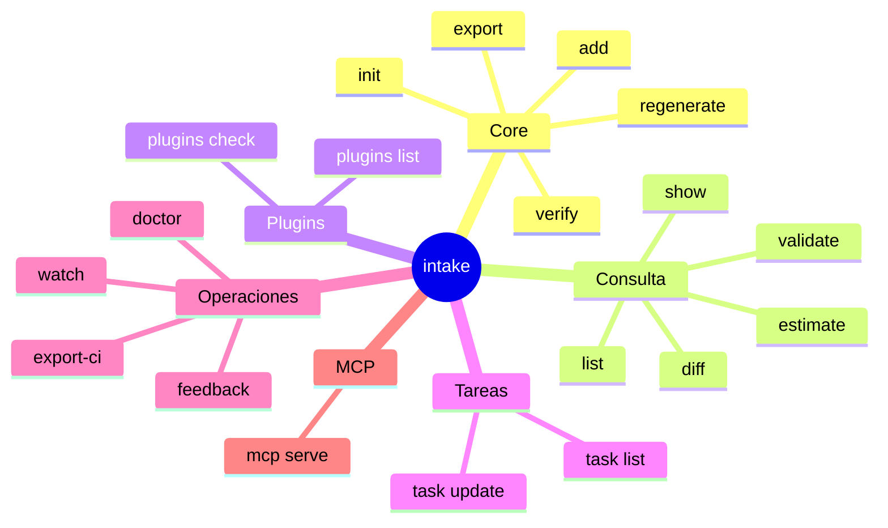
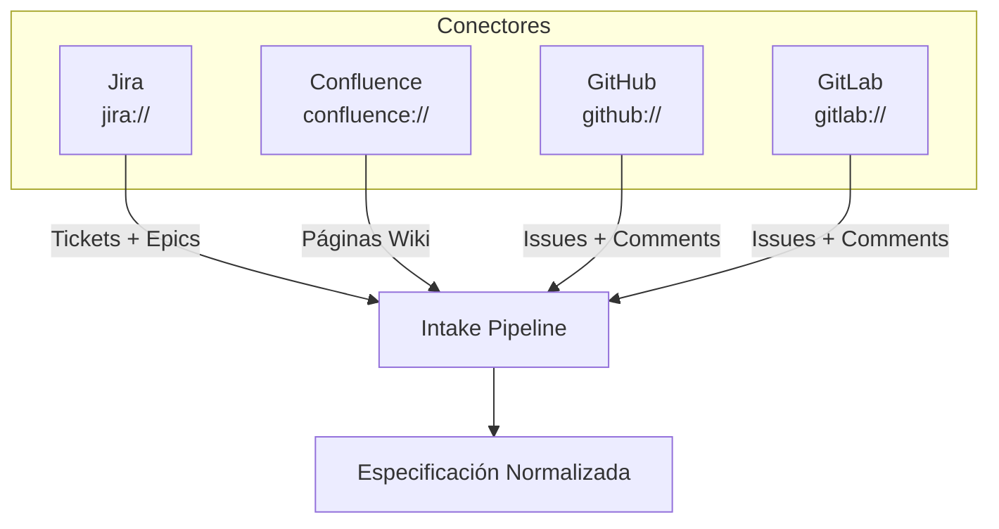
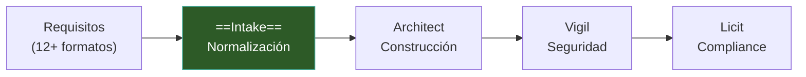

# Intake — Visión General

> [!abstract] Resumen
> **Intake** es una ==CLI que transforma requisitos desde 12+ formatos== en especificaciones normalizadas para agentes de IA. Opera a través de un ==pipeline de 5 fases==: Ingest → Analyze → Generate → Verify → Export. Ofrece 22 comandos CLI, un servidor MCP con 9 herramientas, conectores nativos para Jira/Confluence/GitHub/GitLab, y detección automática de complejidad (quick/standard/enterprise). ^resumen

---

## Qué es Intake

Intake es la ==puerta de entrada del ecosistema==. Antes de que un agente de IA pueda construir software, necesita entender *qué* debe construir. El problema fundamental es que los requisitos vienen en formatos dispares: documentos PDF, tickets de Jira, hilos de Slack, issues de GitHub, páginas de Confluence, imágenes de pizarras, y más.

Intake resuelve este problema con un enfoque de ==pipeline determinista==: cada formato pasa por un *parser* específico, se analiza con un LLM para extraer requisitos funcionales y no funcionales, se genera documentación estructurada, se verifica contra criterios objetivos, y se exporta en el formato que el agente destino necesita.

> [!tip] Filosofía de diseño
> Intake sigue el principio de **"garbage in, structured out"**: no importa cuán desordenada sea la entrada, la salida siempre es una especificación normalizada y verificable. Esto es crítico porque [[architect-overview|Architect]] y otros agentes dependen de especificaciones claras para funcionar correctamente.

---

## Pipeline de 5 Fases

El corazón de Intake es su *pipeline* de 5 fases, cada una con responsabilidades claramente definidas[^1]:

```mermaid
flowchart LR
    subgraph Ingest["1. Ingest"]
        P1[12 Parsers]
        P2[Auto-detección]
    end
    subgraph Analyze["2. Analyze"]
        A1[LLM vía LiteLLM]
        A2[Extracción FR/NFR]
        A3[Deduplicación Jaccard 0.75]
    end
    subgraph Generate["3. Generate"]
        G1[Jinja2 Templates]
        G2[3 Modos]
    end
    subgraph Verify["4. Verify"]
        V1[4 Tipos de Check]
    end
    subgraph Export["5. Export"]
        E1[6 Formatos]
    end

    Ingest --> Analyze --> Generate --> Verify --> Export

    style Ingest fill:#2d5a27,stroke:#4a9
    style Analyze fill:#1a4a6e,stroke:#4a9
    style Generate fill:#5a3d7a,stroke:#4a9
    style Verify fill:#6e4a1a,stroke:#4a9
    style Export fill:#4a1a1a,stroke:#4a9
```



### Fase 1: Ingest — 12 Parsers

La fase de *ingest* acepta ==12 formatos de entrada== con *parsers* especializados para cada uno:

| # | Parser | Formato | Descripción |
|---|--------|---------|-------------|
| 1 | Markdown | `.md` | ==Parser nativo==, extrae secciones y listas |
| 2 | Plaintext | `.txt` | Texto libre, análisis por párrafos |
| 3 | YAML/JSON | `.yaml`, `.json` | Estructuras de datos ya formalizadas |
| 4 | PDF | `.pdf` | Extracción de texto con OCR fallback |
| 5 | DOCX | `.docx` | Documentos Word con estilos |
| 6 | Jira | `jira://` | Tickets vía conector nativo |
| 7 | Confluence | `confluence://` | Páginas wiki vía conector |
| 8 | Images | `.png`, `.jpg` | OCR + análisis visual |
| 9 | URLs | `http(s)://` | Scraping de contenido web |
| 10 | Slack | `slack://` | Hilos de conversación |
| 11 | GitHub Issues | `github://` | Issues con comentarios |
| 12 | GitLab Issues | `gitlab://` | Issues con comentarios |

> [!info] Auto-detección de formato
> Intake detecta automáticamente el formato basándose en la extensión del archivo, el esquema URI, o el contenido del archivo. No es necesario especificar el parser manualmente, aunque se puede forzar con `--parser`.

### Fase 2: Analyze — Extracción con LLM

La fase de análisis utiliza un ==LLM a través de *LiteLLM*== para extraer requisitos:

- **Requisitos funcionales (FR)**: qué debe hacer el sistema
- **Requisitos no funcionales (NFR)**: cómo debe comportarse (rendimiento, seguridad, escalabilidad)
- **Deduplicación**: algoritmo de similitud *Jaccard* con umbral de ==0.75== para eliminar requisitos duplicados entre múltiples fuentes

> [!warning] Dependencia del LLM
> La fase de análisis es la ==única fase que requiere un LLM==. Si el LLM no está configurado o no hay conectividad, Intake puede ejecutar las fases 1 (Ingest) y 4 (Verify) de forma independiente, pero no puede generar especificaciones completas. Consulta [[intake-architecture]] para alternativas offline.

### Fase 3: Generate — Templates Jinja2

La generación usa ==plantillas *Jinja2*== con 3 modos de complejidad:

| Modo | Condición | Salida |
|------|-----------|--------|
| **quick** | <500 palabras, 1 fuente | Especificación ligera |
| **standard** | ==Predeterminado== | Especificación completa |
| **enterprise** | 4+ fuentes O >5000 palabras | Especificación detallada con trazabilidad |

> [!example]- Detección automática de complejidad
> ```python
> # Lógica simplificada de detección de complejidad
> def detect_complexity(sources: list[Source]) -> ComplexityMode:
>     total_words = sum(s.word_count for s in sources)
>     num_sources = len(sources)
>
>     if total_words < 500 and num_sources == 1:
>         return ComplexityMode.QUICK
>     elif num_sources >= 4 or total_words > 5000:
>         return ComplexityMode.ENTERPRISE
>     else:
>         return ComplexityMode.STANDARD
> ```

### Fase 4: Verify — 4 Tipos de Verificación

La verificación ejecuta ==4 tipos de checks== para validar la especificación generada:

1. **`command`**: ejecuta un comando shell y verifica el código de salida
2. **`files_exist`**: verifica que archivos específicos existan
3. **`pattern_present`**: verifica que un patrón regex esté presente en un archivo
4. **`pattern_absent`**: verifica que un patrón regex ==no== esté presente

> [!success] Verificación determinista
> A diferencia del análisis (que depende de un LLM), la verificación es ==completamente determinista==. Los mismos inputs siempre producen los mismos resultados de verificación. Esto es fundamental para [[ecosistema-cicd-integration|integración CI/CD]].

### Fase 5: Export — 6 Formatos

La exportación genera archivos en el formato que el agente destino necesita:

| Formato | Destino | Descripción |
|---------|---------|-------------|
| `architect` | [[architect-overview\|Architect]] | ==Formato nativo== del ecosistema |
| `generic` | Cualquier agente | Markdown estándar |
| `claude-code` | Claude Code | Optimizado para Anthropic |
| `cursor` | Cursor IDE | Formato `.cursorrules` |
| `kiro` | Kiro | Formato específico |
| `copilot` | GitHub Copilot | Instrucciones Copilot |

---

## 22 Comandos CLI

Intake ofrece ==22 comandos== organizados por función:



> [!tip] Comandos más usados
> El flujo típico es: `intake init` → `intake add <fuente>` → `intake export --format architect`. Para verificación continua: `intake watch`. Para CI/CD: `intake export-ci`.

| Comando | Descripción |
|---------|-------------|
| `init` | Inicializa un nuevo proyecto Intake |
| `add` | Agrega una fuente de requisitos |
| `regenerate` | Regenera la especificación |
| `verify` | Ejecuta verificaciones |
| `export` | Exporta en formato específico |
| `show` | Muestra la especificación actual |
| `list` | Lista fuentes agregadas |
| `diff` | Muestra diferencias entre versiones |
| `validate` | Valida la configuración |
| `estimate` | Estima costo y tiempo del LLM |
| `plugins list` | Lista plugins instalados |
| `plugins check` | Verifica integridad de plugins |
| `task list` | Lista tareas generadas |
| `task update` | Actualiza estado de una tarea |
| `doctor` | Diagnóstico del sistema |
| `feedback` | Envía retroalimentación |
| `mcp serve` | Inicia el servidor MCP |
| `watch` | Monitoreo continuo de cambios |
| `export-ci` | Exportación optimizada para CI/CD |

---

## Archivos de Salida

Intake genera ==7 archivos== de salida que conforman la especificación completa:

| Archivo | Propósito |
|---------|-----------|
| `requirements.md` | Requisitos funcionales y no funcionales |
| `design.md` | Diseño técnico propuesto |
| `tasks.md` | ==Tareas con columna de estado== |
| `acceptance.yaml` | Criterios de aceptación estructurados |
| `context.md` | Contexto del proyecto |
| `sources.md` | Registro de fuentes procesadas |
| `spec.lock.yaml` | ==Hashes, costos== y metadatos de integridad |

> [!danger] spec.lock.yaml
> El archivo `spec.lock.yaml` contiene hashes criptográficos de todas las fuentes y salidas. Esto permite detectar si alguien modifica la especificación fuera de Intake. [[licit-overview|Licit]] usa este archivo para verificar la ==trazabilidad de requisitos==.

---

## Servidor MCP

Intake incluye un servidor *MCP* (*Model Context Protocol*) completo[^2]:

| Componente | Cantidad | Descripción |
|------------|----------|-------------|
| Tools | ==9== | Herramientas ejecutables por agentes |
| Resources | ==6== | Recursos de datos accesibles |
| Prompts | ==2== | Prompts predefinidos |
| Transportes | 2 | ==stdio== y ==SSE== |

> [!example]- Iniciar el servidor MCP
> ```bash
> # Transporte stdio (para integración directa)
> intake mcp serve
>
> # Transporte SSE (para acceso por red)
> intake mcp serve --transport sse --port 8080
>
> # Con configuración personalizada
> intake mcp serve --config .intake.yaml
> ```

El servidor MCP permite que agentes como [[architect-overview|Architect]] interactúen con Intake de forma programática, consultando especificaciones, agregando fuentes, y ejecutando verificaciones sin pasar por la CLI.

---

## Conectores

Intake se integra con ==4 plataformas== mediante conectores nativos:



> [!question] ¿Puedo agregar conectores personalizados?
> Sí. El sistema de *plugins* permite crear conectores personalizados mediante los protocolos V1 y V2. Los conectores se registran como *entry_points* de Python. Consulta [[intake-architecture]] para detalles sobre el sistema de plugins.

---

## Configuración

Toda la configuración vive en `.intake.yaml` con las siguientes secciones[^3]:

| Sección | Propósito |
|---------|-----------|
| `llm` | Proveedor, modelo, temperatura, tokens |
| `project` | Nombre, descripción, tipo de proyecto |
| `spec` | Modo de complejidad, idioma, formato |
| `verification` | Checks habilitados, umbrales |
| `export` | Formato por defecto, rutas de salida |
| `connectors` | Credenciales y URLs de conectores |
| `feedback` | Configuración de retroalimentación |
| `mcp` | Puerto, transporte, autenticación |
| `watch` | Rutas monitorizadas, intervalo |
| `templates` | Rutas a templates personalizados |
| `security` | Sanitización, límites, allowlists |

> [!example]- Ejemplo de .intake.yaml
> ```yaml
> llm:
>   provider: openai
>   model: gpt-4o
>   temperature: 0.2
>   max_tokens: 4096
>
> project:
>   name: "mi-proyecto"
>   type: "web-app"
>
> spec:
>   mode: auto  # quick | standard | enterprise | auto
>   language: es
>
> verification:
>   enabled: true
>   fail_on: error
>
> export:
>   default_format: architect
>   output_dir: ./specs
>
> connectors:
>   jira:
>     url: https://mi-empresa.atlassian.net
>     token: ${JIRA_TOKEN}
>   github:
>     token: ${GITHUB_TOKEN}
>
> mcp:
>   transport: stdio
>   port: 8080
>
> security:
>   sanitize_inputs: true
>   max_file_size: 10MB
> ```

---

## Sistema de Plugins

El sistema de *plugins* soporta tres categorías con dos versiones del protocolo[^4]:

| Categoría | Entry Point | Descripción |
|-----------|-------------|-------------|
| Parsers | `intake.parsers` | Nuevos formatos de entrada |
| Exporters | `intake.exporters` | Nuevos formatos de salida |
| Connectors | `intake.connectors` | Nuevas plataformas externas |

> [!info] Protocolos V1 y V2
> - **V1**: interfaz simple basada en funciones. Suficiente para la mayoría de plugins.
> - **V2**: interfaz basada en clases con ciclo de vida (*lifecycle*) completo, configuración, y validación. Recomendado para plugins complejos.

---

## Stack Tecnológico

| Componente | Tecnología | Versión |
|------------|-----------|---------|
| Lenguaje | ==Python== | 3.12+ |
| CLI Framework | *Click* | — |
| UI Terminal | *Rich* | — |
| Validación | *Pydantic v2* | — |
| LLM Gateway | *LiteLLM* | — |
| Templates | *Jinja2* | — |
| Logging | *structlog* | — |

> [!tip] Tecnologías compartidas
> Python 3.12+, *Click*, *Pydantic v2*, y *structlog* son compartidos con [[architect-overview|Architect]], [[vigil-overview|Vigil]] y [[licit-overview|Licit]]. Esto permite una experiencia consistente y reduce la curva de aprendizaje. Ver [[ecosistema-completo]] para detalles.

---

## Quick Start

> [!example] Inicio rápido
> ```bash
> # 1. Instalar
> pip install intake-cli
>
> # 2. Inicializar proyecto
> intake init mi-proyecto
>
> # 3. Agregar fuentes de requisitos
> intake add requirements.md
> intake add user-stories.pdf
> intake add jira://PROJECT/epic/PROJ-100
>
> # 4. Verificar la especificación
> intake verify
>
> # 5. Exportar para Architect
> intake export --format architect
> ```

> [!warning] Prerequisitos
> - Python 3.12 o superior
> - Un proveedor de LLM configurado (OpenAI, Anthropic, o cualquier proveedor soportado por *LiteLLM*)
> - Para conectores: tokens de acceso configurados como variables de entorno

---

## Relación con el Ecosistema

Intake es el ==primer paso== en el flujo del ecosistema completo:



Las especificaciones generadas por Intake son consumidas directamente por [[architect-overview|Architect]] en formato `architect`. El archivo `spec.lock.yaml` es utilizado por [[licit-overview|Licit]] para trazabilidad de requisitos. Las tareas generadas en `tasks.md` pueden alimentar [[architect-pipelines|pipelines de Architect]].

---

## Enlaces y referencias

> [!quote]- Referencias internas
> - [[intake-architecture]] — Arquitectura técnica detallada
> - [[intake-use-cases]] — Casos de uso y flujos de trabajo
> - [[architect-overview]] — El agente que consume las specs de Intake
> - [[ecosistema-completo]] — Cómo funcionan las 4 herramientas juntas
> - [[ecosistema-cicd-integration]] — Integración en pipelines CI/CD
> - [[licit-overview]] — Compliance que usa spec.lock.yaml
> - [[vigil-overview]] — Seguridad del código generado

[^1]: El pipeline es secuencial por diseño: cada fase depende de la salida de la anterior, garantizando trazabilidad completa.
[^2]: MCP (*Model Context Protocol*) es el estándar de Anthropic para comunicación entre agentes y herramientas.
[^3]: Todas las rutas en `.intake.yaml` son relativas al directorio del proyecto. Variables de entorno se expanden con `${VAR}`.
[^4]: Los plugins se descubren automáticamente mediante *entry_points* de Python, sin necesidad de registro manual.
