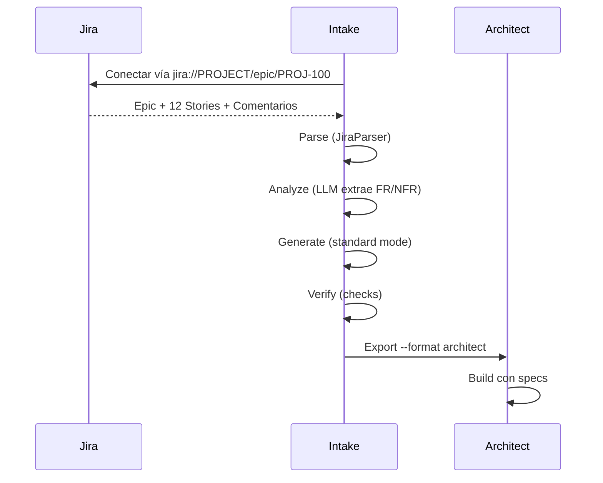
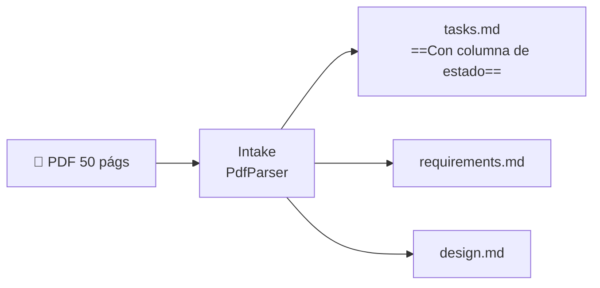
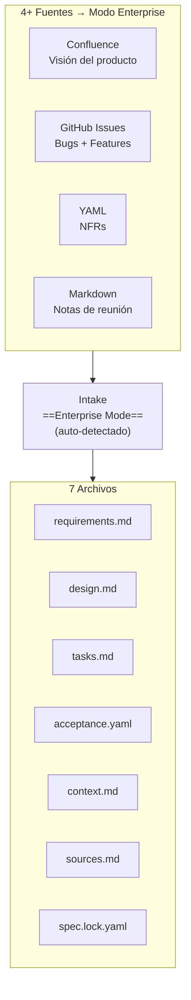
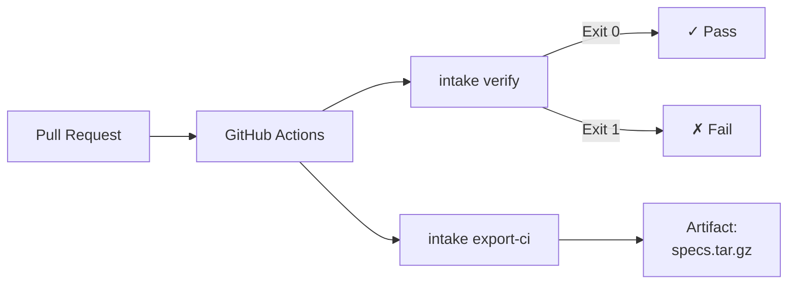
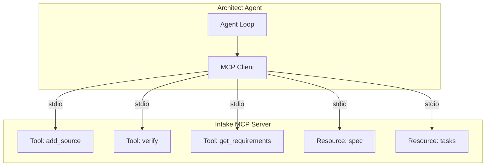
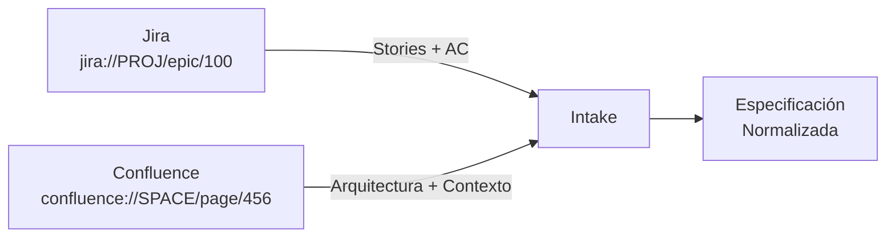
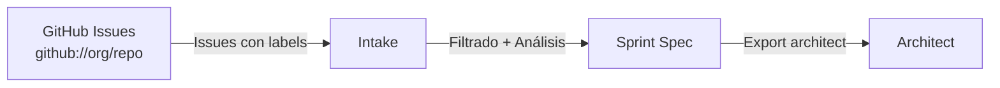

# Intake — Casos de Uso y Flujos de Trabajo

> [!abstract] Resumen
> Este documento presenta ==casos de uso prácticos== para Intake: desde convertir tickets de Jira en especificaciones técnicas hasta integrar el pipeline completo en CI/CD. Cubre flujos con los ==4 conectores nativos== (Jira, Confluence, GitHub, GitLab), el modo ==watch para verificación continua==, el ==servidor MCP para agentes interactivos==, y la generación de specs multi-fuente en modo enterprise. ^resumen

---

## Caso 1: De Tickets Jira a Especificaciones

### Escenario

Un equipo gestiona requisitos como epics y stories en Jira. Necesitan convertir un epic completo con sus stories en una especificación técnica que [[architect-overview|Architect]] pueda consumir.

### Flujo



> [!example]- Comandos paso a paso
> ```bash
> # 1. Inicializar proyecto
> intake init mi-servicio-api
>
> # 2. Configurar conector Jira en .intake.yaml
> # connectors:
> #   jira:
> #     url: https://empresa.atlassian.net
> #     token: ${JIRA_TOKEN}
>
> # 3. Agregar el epic como fuente
> intake add "jira://PROJ/epic/PROJ-100"
>
> # 4. También agregar stories individuales si hay contexto adicional
> intake add "jira://PROJ/issue/PROJ-101"
> intake add "jira://PROJ/issue/PROJ-102"
>
> # 5. Ver qué se extrajo
> intake show requirements
>
> # 6. Verificar coherencia
> intake verify
>
> # 7. Exportar para Architect
> intake export --format architect --output ./specs/
> ```

> [!tip] Deduplicación automática
> Cuando se agregan el epic y sus stories como fuentes separadas, es normal que haya duplicación. El algoritmo de ==deduplicación Jaccard (umbral 0.75)== fusiona automáticamente requisitos similares. Revisa la salida con `intake show requirements` para verificar.

---

## Caso 2: De PDF de Requisitos a Tareas Accionables

### Escenario

Un cliente entrega un PDF de 50 páginas con requisitos de software. El equipo necesita convertirlo en tareas con estados para tracking.

### Flujo



> [!example]- Proceso completo
> ```bash
> # 1. Inicializar
> intake init proyecto-cliente
>
> # 2. Agregar el PDF
> intake add requisitos-cliente-v3.pdf
>
> # 3. Estimar costo del análisis LLM
> intake estimate
> # Output: ~$0.45 (GPT-4o), ~15,000 tokens input, ~3,000 output
>
> # 4. Forzar modo enterprise para documento grande
> intake regenerate --mode enterprise
>
> # 5. Ver las tareas generadas
> intake task list
> # ID  | Tarea                    | Estado    | Prioridad
> # T-1 | Implementar autenticación| pending   | high
> # T-2 | API de usuarios          | pending   | high
> # T-3 | Dashboard frontend       | pending   | medium
> # ...
>
> # 6. Actualizar estado de una tarea
> intake task update T-1 --status in-progress
>
> # 7. Exportar
> intake export --format architect
> ```

> [!warning] PDFs escaneados
> Si el PDF es una imagen escaneada (no tiene texto seleccionable), Intake usa OCR como fallback. La calidad de la extracción ==depende de la legibilidad del documento==. Revisa siempre `intake show requirements` después de procesar PDFs escaneados.

---

## Caso 3: Especificación Multi-fuente Enterprise

### Escenario

Un proyecto enterprise tiene requisitos dispersos en múltiples fuentes: páginas de Confluence con la visión del producto, issues de GitHub con bugs y feature requests, un documento YAML con NFRs, y notas de reuniones en Markdown.

### Flujo



> [!example]- Configuración multi-fuente
> ```bash
> # 1. Inicializar
> intake init plataforma-enterprise
>
> # 2. Agregar todas las fuentes
> intake add "confluence://SPACE/page/12345"
> intake add "github://org/repo/issues?label=feature-request"
> intake add nfr-requirements.yaml
> intake add meeting-notes-2025-05.md
> intake add meeting-notes-2025-06.md
>
> # Con 5 fuentes, Intake auto-detecta modo enterprise
> # 3. Regenerar (el modo se detecta automáticamente)
> intake regenerate
> # [INFO] Detected complexity: enterprise (5 sources, ~8200 words)
>
> # 4. Verificar
> intake verify
> # ✓ 4/4 checks passed
>
> # 5. Ver las fuentes procesadas
> intake show sources
> # Source 1: confluence://SPACE/page/12345 (1,200 words)
> # Source 2: github://org/repo/issues (3,400 words, 15 issues)
> # Source 3: nfr-requirements.yaml (800 words)
> # Source 4: meeting-notes-2025-05.md (1,500 words)
> # Source 5: meeting-notes-2025-06.md (1,300 words)
>
> # 6. Exportar con todos los archivos
> intake export --format architect
> ```

> [!success] Detección automática de complejidad
> Con ==4+ fuentes O >5000 palabras==, Intake activa automáticamente el modo enterprise. Esto genera los 7 archivos de salida incluyendo matrices de trazabilidad que conectan cada requisito con su fuente original. [[licit-overview|Licit]] aprovecha esta trazabilidad para evaluaciones de compliance.

---

## Caso 4: Integración CI/CD con export-ci

### Escenario

Un equipo quiere que cada *pull request* valide automáticamente que los requisitos están actualizados y son coherentes.

### Pipeline CI/CD



> [!example]- GitHub Actions workflow
> ```yaml
> name: Intake Verification
> on:
>   pull_request:
>     paths:
>       - 'requirements/**'
>       - '.intake.yaml'
>
> jobs:
>   verify-specs:
>     runs-on: ubuntu-latest
>     steps:
>       - uses: actions/checkout@v4
>
>       - uses: actions/setup-python@v5
>         with:
>           python-version: '3.12'
>
>       - name: Install Intake
>         run: pip install intake-cli
>
>       - name: Verify specifications
>         run: intake verify
>         env:
>           INTAKE_LLM_PROVIDER: openai
>           INTAKE_LLM_MODEL: gpt-4o
>           OPENAI_API_KEY: ${{ secrets.OPENAI_API_KEY }}
>
>       - name: Export CI artifacts
>         run: intake export-ci --output specs-artifact/
>
>       - uses: actions/upload-artifact@v4
>         with:
>           name: specs
>           path: specs-artifact/
> ```

> [!info] El comando export-ci
> `export-ci` es una versión optimizada de `export` diseñada para CI/CD. Genera archivos mínimos sin formateo humano, optimizados para parsing por máquinas. Incluye metadatos de la ejecución (commit SHA, timestamp, resultado de verificación). Consulta [[ecosistema-cicd-integration]] para el pipeline CI/CD completo.

---

## Caso 5: Servidor MCP para Agentes Interactivos

### Escenario

Un agente de IA (como [[architect-overview|Architect]]) necesita consultar y modificar especificaciones durante su ejecución, sin pasar por la CLI.

### Arquitectura



> [!example]- Iniciar servidor MCP
> ```bash
> # Transporte stdio (integración directa con Architect)
> intake mcp serve
>
> # Transporte SSE (acceso por red, múltiples clientes)
> intake mcp serve --transport sse --port 8080
> ```

El servidor MCP expone ==9 tools, 6 resources, y 2 prompts==:

| Tipo | Componentes |
|------|-------------|
| **Tools** (9) | add_source, remove_source, regenerate, verify, export, update_task, estimate, validate_config, get_diff |
| **Resources** (6) | spec, requirements, design, tasks, sources, lock |
| **Prompts** (2) | analyze_requirements, generate_acceptance_criteria |

> [!tip] Cuándo usar MCP vs CLI
> - **CLI**: operaciones humanas interactivas, scripts de CI/CD, uso puntual
> - **MCP**: ==integración programática== con agentes de IA, consultas frecuentes durante sesiones largas, workflows automatizados

---

## Caso 6: Watch Mode para Verificación Continua

### Escenario

Un equipo modifica requisitos frecuentemente y quiere verificación automática cada vez que un archivo cambia.

> [!example]- Configurar y usar watch mode
> ```bash
> # Configurar en .intake.yaml
> # watch:
> #   paths:
> #     - ./requirements/
> #     - ./user-stories/
> #   interval: 5  # segundos
> #   on_change: verify
>
> # Iniciar monitoreo
> intake watch
> # [WATCH] Monitoring 2 paths...
> # [WATCH] Change detected: requirements/auth.md
> # [VERIFY] Running 4 checks...
> # [VERIFY] ✓ 4/4 passed
> # [WATCH] Change detected: user-stories/payment.md
> # [VERIFY] Running 4 checks...
> # [VERIFY] ✗ 1/4 failed: pattern_absent check
> ```

> [!warning] Consumo de recursos
> El *watch mode* ejecuta verificación completa en cada cambio detectado. Si las verificaciones incluyen llamadas al LLM (`command` checks con análisis), esto puede ==generar costos significativos==. Usa `intake estimate` para calcular costos antes de activar watch en un directorio con cambios frecuentes.

---

## Caso 7: Workflows con Conectores

### Jira → Confluence → Especificación



> [!example]- Flujo Jira + Confluence
> ```bash
> # Agregar epic de Jira (requisitos funcionales)
> intake add "jira://PROJ/epic/PROJ-100"
>
> # Agregar página de Confluence (contexto arquitectónico)
> intake add "confluence://DEVSPACE/page/arch-overview"
>
> # Las dos fuentes se combinan:
> # - Jira aporta FR y criterios de aceptación
> # - Confluence aporta contexto técnico y NFRs
> intake regenerate
> ```

### GitHub Issues → Especificación de Sprint



> [!example]- Flujo GitHub Issues
> ```bash
> # Agregar issues con label específico
> intake add "github://mi-org/mi-repo/issues?label=sprint-42"
>
> # Agregar issues individuales de alto impacto
> intake add "github://mi-org/mi-repo/issues/234"
> intake add "github://mi-org/mi-repo/issues/256"
>
> # Generar y exportar
> intake regenerate
> intake export --format architect
> ```

### GitLab Issues → Pipeline de Architect

> [!example]- Flujo GitLab → Architect Pipeline
> ```bash
> # Agregar grupo de issues de GitLab
> intake add "gitlab://grupo/proyecto/issues?milestone=v2.0"
>
> # Exportar como input para un pipeline de Architect
> intake export --format architect --output ./pipeline-input/
>
> # Usar con Architect pipeline
> architect pipeline run --from ./pipeline-input/ mi-pipeline.yaml
> ```

> [!question] ¿Puedo mezclar conectores?
> ==Sí==. Intake está diseñado para combinar múltiples fuentes de diferentes conectores en una sola especificación. Puedes mezclar Jira + GitHub + Confluence + archivos locales sin restricciones. La deduplicación Jaccard se encarga de eliminar redundancias entre fuentes.

---

## Caso 8: Plugin Personalizado

### Escenario

Un equipo usa Linear para gestión de proyectos. Linear no tiene conector nativo, pero se puede crear un plugin.

> [!example]- Crear un conector personalizado
> ```python
> # intake_connector_linear/connector.py
> from intake.connectors.base import BaseConnector, ConnectorResult
>
> class LinearConnector(BaseConnector):
>     """Conector para Linear (protocolo V2)."""
>
>     name = "linear"
>     scheme = "linear"  # linear://team/project/issues
>
>     def configure(self, config: dict) -> None:
>         self.api_key = config.get("api_key")
>         self.base_url = "https://api.linear.app/graphql"
>
>     def can_handle(self, uri: str) -> bool:
>         return uri.startswith("linear://")
>
>     def fetch(self, uri: str) -> ConnectorResult:
>         # Parsear URI: linear://team/project/issues
>         team, project, resource = self.parse_uri(uri)
>
>         # Consultar API GraphQL de Linear
>         issues = self._query_issues(team, project)
>
>         return ConnectorResult(
>             content=self._format_issues(issues),
>             metadata={"source": "linear", "count": len(issues)},
>             word_count=sum(len(i.description.split()) for i in issues)
>         )
> ```
>
> ```toml
> # pyproject.toml
> [project.entry-points."intake.connectors"]
> linear = "intake_connector_linear.connector:LinearConnector"
> ```

> [!info] Verificar plugins
> Después de instalar un plugin, verifica que Intake lo detecta correctamente:
> ```bash
> intake plugins list
> # Parsers: 12 (built-in) + 0 (custom)
> # Exporters: 6 (built-in) + 0 (custom)
> # Connectors: 4 (built-in) + 1 (custom: linear)
>
> intake plugins check
> # ✓ All plugins healthy
> ```

---

## Caso 9: Diagnóstico con Doctor

> [!example] Usar intake doctor
> ```bash
> intake doctor
> # ✓ Python 3.12.4
> # ✓ intake-cli 1.2.0
> # ✓ LLM: openai/gpt-4o (connected)
> # ✓ Config: .intake.yaml (valid)
> # ✓ Parsers: 12/12 loaded
> # ✓ Exporters: 6/6 loaded
> # ✓ Connectors: 4/4 loaded
> # ✗ Jira connector: authentication failed (check JIRA_TOKEN)
> # ✓ Plugins: 1 custom (linear connector)
> # ✓ Templates: 3 built-in + 1 custom
> ```

> [!tip] Diagnóstico antes de CI/CD
> Ejecuta `intake doctor` como primer paso en tus pipelines CI/CD para detectar problemas de configuración antes de que fallen los pasos costosos (análisis LLM). Ver [[ecosistema-cicd-integration]] para el pipeline recomendado.

---

## Caso 10: Diferencias entre Versiones

Intake puede mostrar diferencias entre la especificación actual y una versión anterior:

> [!example]- Ver diferencias
> ```bash
> # Mostrar diff contra la última versión
> intake diff
>
> # Diff contra una versión específica (por hash en spec.lock.yaml)
> intake diff --version abc123
>
> # Diff solo de requisitos
> intake diff --section requirements
> ```

> [!success] Trazabilidad con spec.lock.yaml
> El archivo `spec.lock.yaml` almacena ==hashes y costos== de cada generación. Esto permite:
> - Detectar modificaciones manuales no autorizadas
> - Calcular el costo acumulado del LLM
> - Proveer trazabilidad para [[licit-overview|Licit]]
> - Comparar versiones con `intake diff`

---

## Matriz de Casos de Uso por Formato de Exportación

| Caso de Uso | Formato Recomendado | Destino |
|-------------|-------------------|---------|
| Desarrollo con [[architect-overview\|Architect]] | ==`architect`== | Pipeline integrado |
| IDE con Cursor | `cursor` | Archivo `.cursorrules` |
| GitHub Copilot | `copilot` | Instrucciones Copilot |
| Claude Code directo | `claude-code` | CLAUDE.md |
| Kiro | `kiro` | Formato específico |
| Documentación general | `generic` | Markdown estándar |
| CI/CD artifacts | ==`export-ci`== | Optimizado para máquinas |

---

## Enlaces y referencias

> [!quote]- Referencias internas
> - [[intake-overview]] — Visión general y pipeline de 5 fases
> - [[intake-architecture]] — Arquitectura técnica detallada
> - [[architect-overview]] — Agente que consume las especificaciones
> - [[architect-pipelines]] — Pipelines YAML que usan specs de Intake
> - [[ecosistema-cicd-integration]] — Pipeline CI/CD completo
> - [[ecosistema-completo]] — Flujo integrado del ecosistema
> - [[licit-overview]] — Compliance y trazabilidad

[^1]: Los conectores usan esquemas URI propios: `jira://`, `confluence://`, `github://`, `gitlab://`.
[^2]: El *watch mode* usa polling del sistema de archivos, no *inotify*, para compatibilidad multiplataforma.
[^3]: El servidor MCP soporta autenticación por token cuando se usa el transporte SSE.
