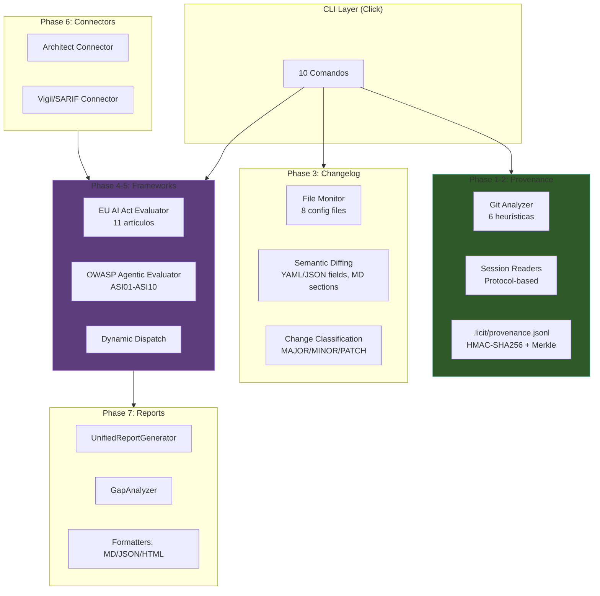
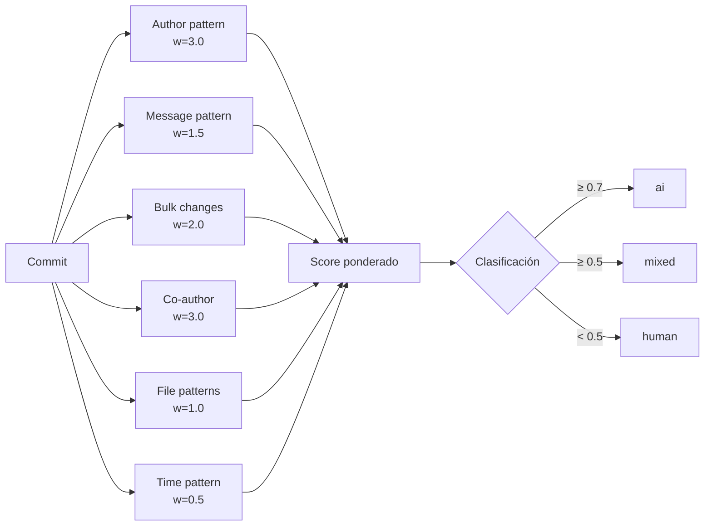
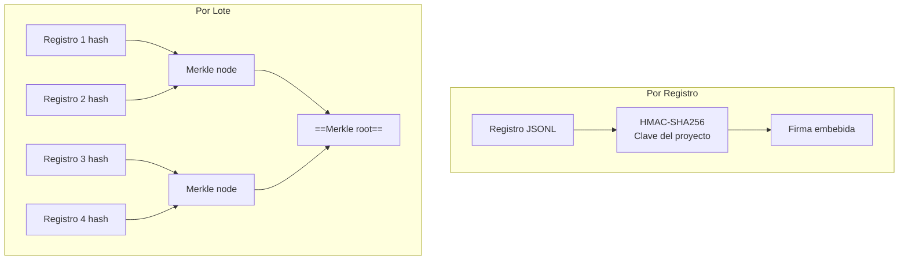
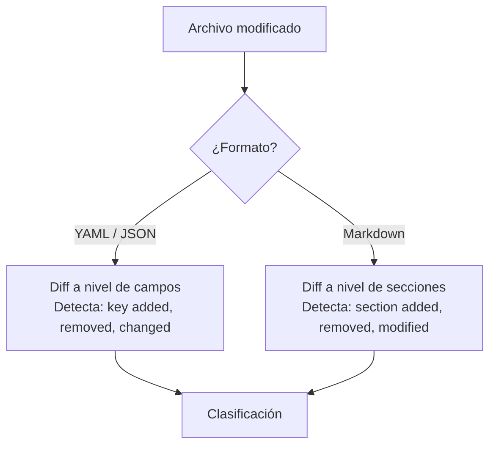
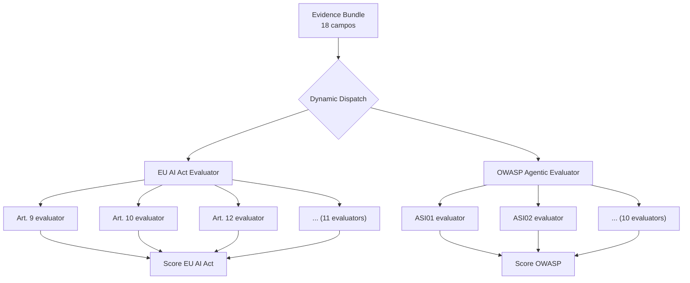
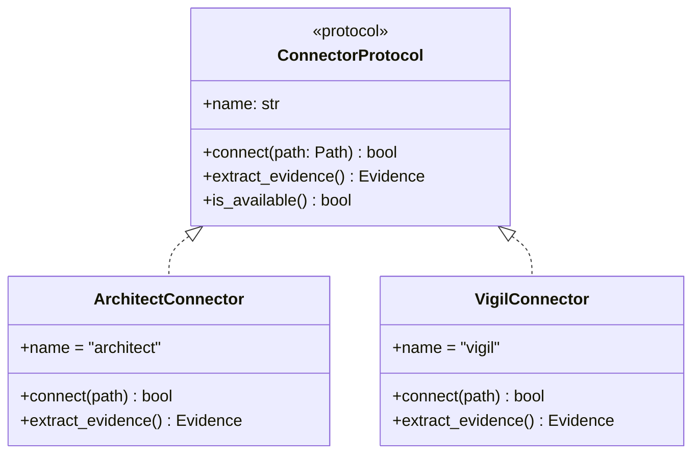

# Licit — Arquitectura Técnica

> [!abstract] Resumen
> La arquitectura de Licit se organiza en ==7 fases de implementación==. El sistema de *provenance* usa ==6 heurísticas ponderadas== con git analyzer y session readers, almacenando en ==JSONL append-only con HMAC-SHA256 por registro y Merkle tree por lotes==. El changelog hace ==semantic diffing== (campos para YAML/JSON, secciones para Markdown) con clasificación MAJOR/MINOR/PATCH. Los evaluadores de frameworks usan ==despacho dinámico==. El *evidence bundle* reúne ==18 campos==. Los conectores son ==basados en protocolo==. Los reportes usan un generador unificado con gap analysis. ^resumen

---

## Arquitectura General



---

## Sistema de Provenance

### 6 Heurísticas Ponderadas

El sistema analiza cada commit git con ==6 heurísticas== para determinar si fue escrito por un humano o por IA[^1]:



#### Detalle de Cada Heurística

| # | Heurística | Peso | Qué Analiza |
|---|------------|------|-------------|
| 1 | **Author pattern** | ==3.0== | Email/nombre del autor contiene "bot", "ai", "claude", etc. |
| 2 | **Message pattern** | 1.5 | Mensaje contiene "Co-Authored-By", "Generated by", etc. |
| 3 | **Bulk changes** | 2.0 | Muchos archivos modificados en un solo commit (>10 files) |
| 4 | **Co-author** | ==3.0== | Trailer `Co-Authored-By:` presente |
| 5 | **File patterns** | 1.0 | Archivos generados típicos (migrations, configs generados) |
| 6 | **Time pattern** | 0.5 | Commits a horas inusuales (ej: 3:00 AM) |

> [!tip] Pesos altos para señales fuertes
> Los pesos más altos (==3.0==) se asignan a señales que son ==casi deterministas==: el patrón del autor y la presencia de `Co-Authored-By` son indicadores muy fiables. El patrón de tiempo (0.5) es el menos fiable porque los humanos también trabajan de noche.

### Score Ponderado

El score se calcula como la ==suma ponderada normalizada==:

$$\text{score} = \frac{\sum_{i=1}^{6} w_i \cdot h_i}{\sum_{i=1}^{6} w_i}$$

Donde $w_i$ es el peso de la heurística $i$ y $h_i \in [0, 1]$ es el valor de la heurística.

### Clasificación

| Score | Clasificación | Significado |
|-------|--------------|-------------|
| ≥ 0.7 | ==`ai`== | Muy probablemente generado por IA |
| ≥ 0.5 | ==`mixed`== | Mezcla de humano e IA |
| < 0.5 | ==`human`== | Muy probablemente escrito por humano |

---

### Store JSONL Append-only

Los resultados de provenance se almacenan en `.licit/provenance.jsonl`:

> [!example]- Formato del store
> ```jsonl
> {"commit":"abc123","author":"dev@co.com","score":0.82,"class":"ai","heuristics":{"author":0.0,"message":0.8,"bulk":0.7,"coauthor":1.0,"files":0.3,"time":0.2},"hmac":"sha256:...","ts":"2025-06-01T10:00:00Z"}
> {"commit":"def456","author":"dev@co.com","score":0.25,"class":"human","heuristics":{"author":0.0,"message":0.0,"bulk":0.1,"coauthor":0.0,"files":0.2,"time":0.8},"hmac":"sha256:...","ts":"2025-06-01T11:00:00Z"}
> ```

### Integridad Criptográfica



| Mecanismo | Nivel | Protege contra |
|-----------|-------|----------------|
| ==HMAC-SHA256== | Por registro | Modificación de registros individuales |
| ==Merkle tree== | Por lote | Eliminación o reordenamiento de registros |

> [!danger] Inmutabilidad
> El store es ==append-only==. Intentar modificar un registro invalida su HMAC. Intentar eliminar un registro rompe el Merkle tree. Esto proporciona un *audit trail* inmutable verificable criptográficamente.

---

### Session Readers

Los *session readers* leen sesiones de herramientas de AI para enriquecer la clasificación de provenance:

| Reader | Fuente | Formato |
|--------|--------|---------|
| Claude Code | `~/.claude/projects/` | JSONL |

> [!info] Arquitectura basada en protocolos
> Los session readers implementan un ==protocolo Python== (`SessionReader`), lo que permite agregar soporte para nuevas herramientas de AI sin modificar el core de Licit. Solo se necesita implementar el protocolo y registrar el reader.

---

## Changelog — Semantic Diffing

### 8 Archivos Monitorizados

Licit monitorea ==8 archivos de configuración== de herramientas AI:

| # | Archivo | Herramienta |
|---|---------|-------------|
| 1 | `CLAUDE.md` | Claude Code |
| 2 | `.cursorrules` | Cursor |
| 3 | `.architect/config.yaml` | Architect |
| 4 | `.github/copilot-instructions.md` | GitHub Copilot |
| 5 | `.windsurfrules` | Windsurf |
| 6 | `.clinerules` | Cline |
| 7 | `.roomodes` | Roo |
| 8 | `.kirorules` | Kiro |

### Diffing Semántico



| Formato | Técnica | Granularidad |
|---------|---------|-------------|
| YAML/JSON | ==Field-level diff== | Cada key/value individual |
| Markdown | ==Section-level diff== | Secciones (`#`, `##`, etc.) |

> [!tip] Ventaja del diffing semántico
> Un diff textual de un YAML reordenado mostraría cambios en todas las líneas. El ==diff semántico== de Licit detecta que solo se reordenaron campos, sin cambios reales. Esto reduce ruido y mejora la clasificación de cambios.

### Clasificación MAJOR/MINOR/PATCH

| Tipo | Campos afectados | Ejemplo |
|------|-----------------|---------|
| ==MAJOR== | Modelo, proveedor | Cambiar `model: gpt-4o` → `model: claude-3.5-sonnet` |
| ==MINOR== | Prompt, guardrails, herramientas | Agregar una herramienta a la lista permitida |
| ==PATCH== | Todo lo demás | Corregir un typo en un comentario |

> [!warning] Implicaciones de cambios MAJOR
> Un cambio MAJOR puede afectar evaluaciones de compliance porque ==cambia las capacidades fundamentales del sistema AI==. Licit re-evalúa automáticamente los frameworks cuando detecta un cambio MAJOR.

---

## Framework Evaluators — Despacho Dinámico

Los evaluadores de frameworks usan ==despacho dinámico== (*dynamic dispatch*) para evaluar cada artículo o riesgo:



### Scoring Dinámico

Cada evaluador de artículo/riesgo:

1. Recibe el ==evidence bundle== completo (18 campos)
2. Evalúa la evidencia relevante para su artículo
3. Retorna un ==score dinámico con justificación==
4. Incluye la lista de evidencia utilizada

> [!info] Variable thresholds
> Los umbrales de cada evaluación son ==variables==, no fijos. Un artículo puede tener un umbral de 0.6 para "partial compliance" y 0.8 para "full compliance". Los umbrales se ajustan según la criticidad del artículo.

---

## Evidence Bundle — 18 Campos

El *evidence bundle* es la estructura central que reúne toda la evidencia:

```mermaid
flowchart TB
    subgraph Sources["Fuentes de Evidencia"]
        GIT["Git History"]
        ARCH["Architect"]
        VIG["Vigil / SARIF"]
        USER["Cuestionario FRIA"]
        PROJ["Proyecto"]
    end

    subgraph Bundle["Evidence Bundle (18 campos)"]
        P1["1. Provenance"]
        P2["2. Changelog"]
        P3["3. FRIA"]
        P4["4. Annex IV"]
        P5["5. Guardrails"]
        P6["6. Quality gates"]
        P7["7. Budget"]
        P8["8. Dry-run"]
        P9["9. Rollback"]
        P10["10. Audit trail"]
        P11["11. OTel"]
        P12["12. Human review"]
        P13["13. Requirements traceability"]
        P14["14. Security findings"]
        P15["15. Test coverage"]
        P16["16. Documentation"]
        P17["17. Risk assessment"]
        P18["18. Compliance score"]
    end

    GIT --> P1 & P2 & P12
    ARCH --> P5 & P6 & P7 & P8 & P9 & P10 & P11
    VIG --> P14
    USER --> P3
    PROJ --> P4 & P13 & P15 & P16 & P17 & P18
```



---

## Conectores — Protocol-based

### Arquitectura de Conectores



### Conector Architect — Qué Extrae

| Fuente en Architect | Evidencia Extraída |
|--------------------|-------------------|
| Reports (JSON/MD) | Resultados de agentes |
| `.architect/sessions/` | ==Audit trail completo== |
| `.architect/config.yaml` | Guardrails configurados |
| Cost tracking data | Budget y costos |
| Ralph progress | Iteraciones y resultados |
| Pipeline results | Gates de calidad |

### Conector Vigil — SARIF Universal

| Campo SARIF | Evidencia Extraída |
|-------------|-------------------|
| `results[]` | ==Hallazgos de seguridad== |
| `results[].ruleId` | Regla que detectó el problema |
| `results[].level` | Severidad |
| `tool.driver.name` | Herramienta que generó el SARIF |
| `tool.driver.version` | Versión |

> [!success] Conector SARIF universal
> El conector acepta ==cualquier SARIF 2.1.0==, no solo de Vigil. Esto permite alimentar Licit con resultados de Semgrep, CodeQL, Snyk, o cualquier herramienta compatible. Esto lo distingue de integraciones punto a punto.

---

## Reports — Generador Unificado

### UnifiedReportGenerator

El generador unificado produce reportes multi-framework:

| Formato | Características |
|---------|----------------|
| Markdown | Tablas con iconos, wikilinks, legible en vault |
| JSON | Estructura completa para procesamiento |
| HTML | ==Self-contained, XSS-safe== |

### Gap Analyzer

El *GapAnalyzer* produce recomendaciones accionables:

> [!example]- Estructura de un GapItem
> ```python
> class GapItem(BaseModel):
>     """Un gap identificado con recomendación."""
>     framework: str           # "eu-ai-act" | "owasp-agentic"
>     article: str             # "Art. 12" | "ASI08"
>     current_score: float     # 0.0 - 1.0
>     required_score: float    # Umbral mínimo
>     gap: float               # required - current
>     recommendation: str      # Acción recomendada
>     effort: str              # "low" | "medium" | "high"
>     tools_suggested: list[str]  # Herramientas que pueden ayudar
> ```

### Ejemplo de Recomendación

| Campo | Valor |
|-------|-------|
| Framework | EU AI Act |
| Artículo | Art. 12 (Logging) |
| Score actual | 0.4 |
| Score requerido | 0.7 |
| Gap | ==0.3== |
| Recomendación | "Habilitar OpenTelemetry en Architect para audit trail completo" |
| Esfuerzo | Low |
| Herramientas sugeridas | [[architect-overview\|Architect]] (OTel), [[licit-overview\|Licit]] (changelog) |

---

## Stack Tecnológico

| Dependencia | Uso |
|-------------|-----|
| ==Python 3.12+== | Runtime |
| *Click* | CLI framework |
| *Pydantic v2* | Validación de modelos |
| *structlog* | Logging estructurado |
| *Jinja2* | Templates para documentos |
| *cryptography* | ==HMAC-SHA256, Merkle tree== |

> [!info] Dependencia cryptography
> A diferencia de las otras herramientas del ecosistema, Licit tiene una dependencia adicional: la biblioteca `cryptography` de Python para ==firmas HMAC-SHA256 y construcción de Merkle trees==. Esto es necesario para la integridad criptográfica del store de provenance.

---

## Estructura del Directorio .licit/

```
.licit/
├── provenance.jsonl      # Store append-only de provenance
├── changelog.jsonl        # Historial de cambios de configuración
├── fria-data.json         # Datos del cuestionario FRIA
├── fria-report.md         # Reporte FRIA generado
├── annex-iv.md            # Documentación Annex IV
├── evidence-bundle.json   # Bundle completo de evidencia
├── reports/               # Reportes generados
│   ├── compliance.md
│   ├── compliance.json
│   └── compliance.html
└── config.yaml            # Configuración de Licit
```

> [!tip] Versionado con git
> Toda la estructura `.licit/` está diseñada para ser ==versionada con git==. Los archivos JSONL son append-only, lo que minimiza conflictos de merge. Los reportes Markdown son legibles en cualquier viewer.

---

## Enlaces y referencias

> [!quote]- Referencias internas
> - [[licit-overview]] — Visión general de Licit
> - [[licit-compliance-frameworks]] — Frameworks evaluados en detalle
> - [[licit-documentation-generation]] — Generación de documentación
> - [[architect-architecture]] — Arquitectura de Architect (conector)
> - [[vigil-architecture]] — Arquitectura de Vigil (conector SARIF)
> - [[ecosistema-completo]] — Integración del ecosistema

[^1]: Las 6 heurísticas se diseñaron analizando patrones reales de commits en proyectos que usan herramientas de AI como Claude Code, Cursor, y GitHub Copilot.
[^2]: HMAC-SHA256 usa una clave derivada del proyecto, almacenada en `.licit/config.yaml`.
[^3]: Los Merkle trees se recalculan en cada batch de registros de provenance para verificar integridad secuencial.
[^4]: El diffing semántico usa parsers nativos de Python (json, yaml, re) sin dependencias adicionales.
