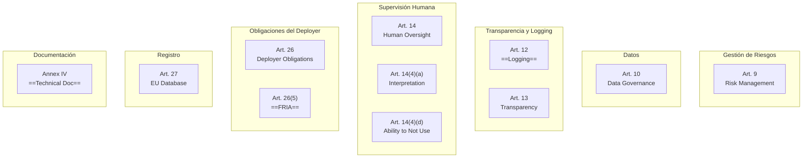
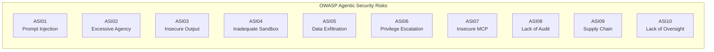
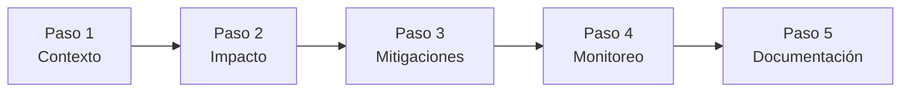
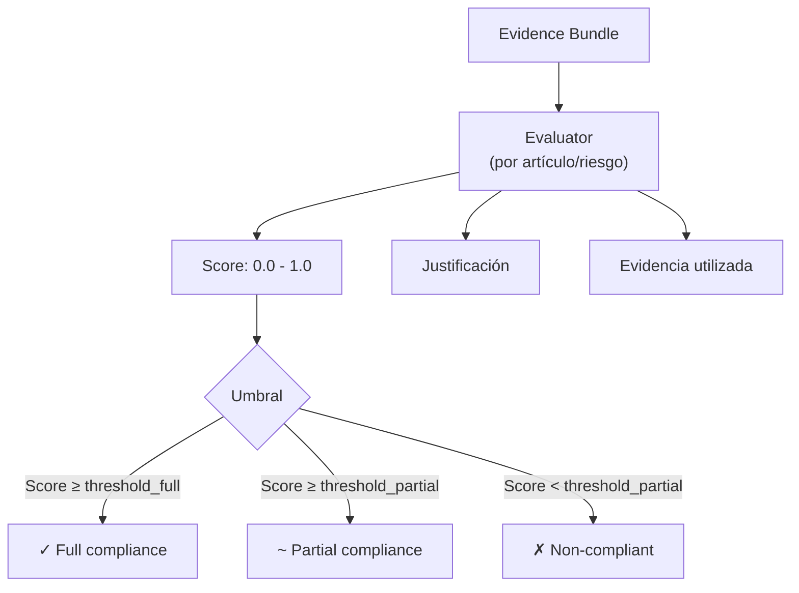

# Licit — Frameworks de Compliance

> [!abstract] Resumen
> Licit evalúa 2 frameworks de compliance: ==EU AI Act con 11 artículos== y ==OWASP Agentic Top 10 con ASI01-ASI10==. Cada evaluación usa scoring dinámico con umbrales variables y *evidence bundles*. Además genera documentación regulatoria: ==FRIA (5 pasos, 16 preguntas, 8 campos auto-detectados)== y ==Annex IV (6 secciones, 27 variables de template)==. Futuras evaluaciones incluyen NIST AI RMF e ISO 42001. ^resumen

---

## EU AI Act — 11 Artículos Evaluados

### Visión General



### Detalle de Cada Artículo

#### Art. 9 — Gestión de Riesgos

| Campo | Valor |
|-------|-------|
| Tema | Sistema de gestión de riesgos |
| Evidencia requerida | Risk assessment, mitigaciones, monitoreo |
| Fuentes de evidencia | FRIA, gap analysis, [[vigil-overview\|Vigil]] findings |
| Scoring | Presencia de risk assessment + mitigaciones documentadas |

> [!info] Qué evalúa
> Verifica que el proyecto tiene un ==sistema de gestión de riesgos== identificado, con riesgos documentados y mitigaciones implementadas. Las reglas de [[vigil-overview|Vigil]] contribuyen como evidencia de mitigación de riesgos de seguridad.

---

#### Art. 10 — Datos y Gobernanza

| Campo | Valor |
|-------|-------|
| Tema | Calidad y gobernanza de datos de entrenamiento |
| Evidencia requerida | Documentación de datos, sesgo, representatividad |
| Fuentes de evidencia | Documentación del proyecto, FRIA |
| Scoring | Documentación existente sobre datos utilizados |

> [!warning] Aplicabilidad
> Este artículo es más relevante cuando el sistema AI ==entrena o fine-tunea modelos==. Para sistemas que solo usan APIs de LLM (como [[architect-overview|Architect]]), la evidencia se centra en la documentación de qué modelos se usan y sus limitaciones conocidas.

---

#### Art. 12 — Logging

| Campo | Valor |
|-------|-------|
| Tema | ==Registro automático de eventos== |
| Evidencia requerida | Audit trail, sesiones, telemetría |
| Fuentes de evidencia | [[architect-architecture\|Architect sessions]], OpenTelemetry, [[licit-overview\|Licit]] changelog |
| Scoring | ==Alta== si tiene OTel + sessions + changelog |

> [!success] Artículo bien cubierto por el ecosistema
> Art. 12 es uno de los artículos ==mejor cubiertos== por el ecosistema:
> - **Architect**: 3 pipelines de logging + sessions auto-save + OpenTelemetry
> - **Licit**: changelog de configuración + provenance JSONL
> - **Vigil**: SARIF con historial de escaneos

---

#### Art. 13 — Transparencia

| Campo | Valor |
|-------|-------|
| Tema | Información clara para usuarios |
| Evidencia requerida | Documentación de capacidades y limitaciones |
| Fuentes de evidencia | Annex IV, documentación del proyecto |
| Scoring | Completitud de documentación |

---

#### Art. 14 — Supervisión Humana

| Campo | Valor |
|-------|-------|
| Tema | Capacidad de supervisión humana efectiva |
| Evidencia requerida | Mecanismos de intervención, revisión, control |
| Fuentes de evidencia | [[architect-overview\|Architect]] confirmation modes, human review en PRs |
| Scoring | Presencia de mecanismos de intervención |

> [!tip] Modos de confirmación como evidencia
> Los ==modos de confirmación de Architect== (`confirm-sensitive`, `confirm-all`) son evidencia directa de supervisión humana. El modo `yolo` reduce el score de este artículo.

---

#### Art. 14(4)(a) — Interpretación Correcta

| Campo | Valor |
|-------|-------|
| Tema | Capacidad de interpretar correctamente la salida del sistema |
| Evidencia requerida | Documentación de outputs, formatos, limitaciones |
| Fuentes de evidencia | Reports de Architect, documentación |
| Scoring | Claridad de los outputs del sistema |

---

#### Art. 14(4)(d) — Capacidad de No Usar

| Campo | Valor |
|-------|-------|
| Tema | Capacidad de ==decidir no usar== el sistema AI |
| Evidencia requerida | Mecanismos de opt-out, rollback |
| Fuentes de evidencia | Git rollback, [[architect-overview\|Architect]] dry-run |
| Scoring | Presencia de mecanismos de reversión |

---

#### Art. 26 — Obligaciones del Deployer

| Campo | Valor |
|-------|-------|
| Tema | Obligaciones generales del que despliega |
| Evidencia requerida | Conformidad general, medidas organizativas |
| Fuentes de evidencia | Evidence bundle completo |
| Scoring | Score agregado de otros artículos |

---

#### Art. 26(5) — FRIA

| Campo | Valor |
|-------|-------|
| Tema | ==Fundamental Rights Impact Assessment== |
| Evidencia requerida | FRIA completado |
| Fuentes de evidencia | `.licit/fria-data.json`, `.licit/fria-report.md` |
| Scoring | ==Binario==: FRIA completado o no |

> [!danger] FRIA obligatorio
> Para sistemas AI de alto riesgo, el FRIA es ==legalmente obligatorio==. Licit genera el FRIA mediante un cuestionario interactivo de 5 pasos con 16 preguntas. Ver [[licit-documentation-generation]] para el proceso completo.

---

#### Art. 27 — Registro en Base de Datos EU

| Campo | Valor |
|-------|-------|
| Tema | Registro del sistema en la base de datos de la UE |
| Evidencia requerida | Referencia al registro |
| Fuentes de evidencia | Configuración manual |
| Scoring | Presencia de referencia al registro |

---

#### Annex IV — Documentación Técnica

| Campo | Valor |
|-------|-------|
| Tema | ==Documentación técnica completa== |
| Evidencia requerida | Documento Annex IV generado con 6 secciones |
| Fuentes de evidencia | `.licit/annex-iv.md` |
| Scoring | Completitud del documento (==27 variables==) |

---

## OWASP Agentic Top 10

### Visión General



### Detalle de Cada Riesgo

| ID | Riesgo | Evidencia Evaluada | Fuente Principal |
|----|--------|-------------------|------------------|
| ASI01 | ==Prompt Injection== | Input sanitization, guardrails | [[architect-architecture\|Architect]] guardrails |
| ASI02 | ==Excessive Agency== | Tool permissions, max_steps, budget | [[architect-agents\|Architect]] agents |
| ASI03 | Insecure Output Handling | Output validation, sanitization | [[vigil-overview\|Vigil]] auth rules |
| ASI04 | Inadequate Sandboxing | Directory sandboxing, command blocklist | [[architect-architecture\|Architect]] security |
| ASI05 | Data Exfiltration | Network restrictions, file access control | [[architect-architecture\|Architect]] guardrails |
| ASI06 | Privilege Escalation | Command classification, sudo blocklist | [[architect-architecture\|Architect]] security |
| ASI07 | Insecure MCP Usage | MCP tool validation | [[architect-architecture\|Architect]] MCP |
| ASI08 | ==Lack of Audit== | Logging, sessions, OTel | [[architect-architecture\|Architect]] logging |
| ASI09 | ==Supply Chain== | Dependency analysis | [[vigil-overview\|Vigil]] DEP rules |
| ASI10 | ==Lack of Human Oversight== | Confirmation modes, review | [[architect-agents\|Architect]] modes |

> [!tip] Scoring dinámico
> Cada riesgo OWASP se evalúa con ==umbrales variables== basados en la criticidad. ASI01 (Prompt Injection) y ASI02 (Excessive Agency) tienen umbrales más estrictos porque son los riesgos más frecuentes en sistemas agénticos.

### Mapeo Ecosistema → OWASP

| Riesgo OWASP | Herramienta que Mitiga | Mecanismo |
|-------------|----------------------|-----------|
| ASI01 | [[architect-overview\|Architect]] | Guardrails, input validation |
| ASI02 | [[architect-overview\|Architect]] | ==Max steps, budget, tool permissions== |
| ASI03 | [[vigil-overview\|Vigil]] | AUTH rules, output scanning |
| ASI04 | [[architect-overview\|Architect]] | ==22 capas de seguridad== |
| ASI05 | [[architect-overview\|Architect]] | Directory sandboxing, network rules |
| ASI06 | [[architect-overview\|Architect]] | Command blocklist, classification |
| ASI07 | [[architect-overview\|Architect]] | MCP tool validation |
| ASI08 | [[architect-overview\|Architect]] + Licit | ==3 logging pipelines + OTel + changelog== |
| ASI09 | [[vigil-overview\|Vigil]] | ==DEP-001 a DEP-007== |
| ASI10 | [[architect-overview\|Architect]] | Confirmation modes, auto-review |

> [!success] Cobertura del ecosistema
> El ecosistema cubre ==los 10 riesgos== del OWASP Agentic Top 10. La cobertura es particularmente fuerte en ASI02 (Excessive Agency), ASI04 (Inadequate Sandboxing), ASI08 (Lack of Audit), y ASI09 (Supply Chain).

---

## FRIA — Fundamental Rights Impact Assessment

### 5 Pasos del Cuestionario



| Paso | Tema | Preguntas |
|------|------|-----------|
| 1 | Contexto del sistema | 4 preguntas |
| 2 | Impacto en derechos fundamentales | 4 preguntas |
| 3 | Medidas de mitigación | 3 preguntas |
| 4 | Monitoreo y revisión | 3 preguntas |
| 5 | Documentación y transparencia | 2 preguntas |
| **Total** | | ==16 preguntas== |

### 8 Campos Auto-detectados

Licit auto-detecta ==8 campos== del FRIA a partir de metadatos del proyecto:

| Campo | Fuente |
|-------|--------|
| Nombre del sistema | `package.json`, `pyproject.toml` |
| Tipo de sistema | Análisis de dependencias |
| Modelo AI utilizado | Config de Architect |
| Proveedor del modelo | Config de Architect |
| Herramientas de seguridad | Presencia de Vigil |
| Mecanismos de oversight | Confirmation modes |
| Logging habilitado | OpenTelemetry, sessions |
| Fecha del assessment | Timestamp actual |

> [!question] ¿El FRIA es completamente automático?
> ==No==. Los 8 campos auto-detectados reducen el trabajo manual, pero las ==16 preguntas requieren respuestas humanas== porque evalúan aspectos que no pueden inferirse del código (impacto social, contexto de uso, etc.). El cuestionario es interactivo vía CLI.

### Output del FRIA

| Archivo | Contenido |
|---------|-----------|
| `.licit/fria-data.json` | Respuestas estructuradas |
| `.licit/fria-report.md` | ==Reporte legible== en Markdown |

---

## Annex IV — Documentación Técnica

### 6 Secciones

| # | Sección | Variables |
|---|---------|-----------|
| 1 | Descripción general | 5 |
| 2 | Desarrollo y testing | 6 |
| 3 | ==Monitoreo y control== | 5 |
| 4 | Gestión de riesgos | 4 |
| 5 | Cambios y actualizaciones | 3 |
| 6 | Conformidad | 4 |
| **Total** | | ==27 variables== |

### 27 Variables de Template

> [!example]- Lista completa de variables Annex IV
> ```
> Section 1: Descripción General
>   1. system_name
>   2. system_description
>   3. intended_purpose
>   4. developer_info
>   5. system_version
>
> Section 2: Desarrollo y Testing
>   6. development_methodology
>   7. training_data_description
>   8. model_architecture
>   9. testing_methodology
>  10. performance_metrics
>  11. known_limitations
>
> Section 3: Monitoreo y Control
>  12. logging_capabilities
>  13. monitoring_mechanisms
>  14. human_oversight_measures
>  15. intervention_capabilities
>  16. audit_trail
>
> Section 4: Gestión de Riesgos
>  17. risk_identification
>  18. risk_mitigation
>  19. residual_risks
>  20. risk_monitoring
>
> Section 5: Cambios y Actualizaciones
>  21. change_management
>  22. update_procedures
>  23. version_history
>
> Section 6: Conformidad
>  24. compliance_standards
>  25. certifications
>  26. third_party_assessments
>  27. declaration_date
> ```

> [!tip] Auto-población
> Licit auto-puebla las ==27 variables== a partir de metadatos del proyecto: archivos de configuración, git history, resultados de Vigil, configuración de Architect, etc. Las variables que no pueden auto-detectarse se dejan como TODO para completar manualmente.

### Output del Annex IV

| Archivo | Contenido |
|---------|-----------|
| `.licit/annex-iv.md` | Documento completo en Markdown |

---

## Scoring Dinámico

### Mecanismo



### Ejemplo de Scoring

| Artículo | Score | Threshold Partial | Threshold Full | Resultado |
|----------|-------|-------------------|----------------|-----------|
| Art. 12 (Logging) | 0.85 | 0.5 | 0.7 | ==Full ✓== |
| Art. 14 (Oversight) | 0.60 | 0.5 | 0.8 | Partial ~ |
| Art. 26(5) (FRIA) | 0.00 | 0.5 | 0.9 | ==Non-compliant ✗== |

---

## Futuras Evaluaciones

> [!info] Frameworks futuros en el roadmap
> | Framework | Estado | Descripción |
> |-----------|--------|-------------|
> | NIST AI RMF | ==Planificado== | Risk Management Framework de NIST |
> | ISO 42001 | ==Planificado== | Sistema de gestión de AI |
> | SOC 2 Type II | Exploración | Controles de seguridad |
> | GDPR | Exploración | Protección de datos (overlap con EU AI Act) |
>
> Ver [[ecosistema-roadmap]] para el roadmap completo.

---

## Enlaces y referencias

> [!quote]- Referencias internas
> - [[licit-overview]] — Visión general de Licit
> - [[licit-architecture]] — Arquitectura técnica (evaluadores, scoring)
> - [[licit-documentation-generation]] — Generación de FRIA y Annex IV
> - [[architect-overview]] — Fuente de evidencia para ASI02, ASI04, ASI08
> - [[architect-architecture]] — 22 capas de seguridad evaluadas
> - [[vigil-overview]] — Fuente de evidencia para ASI09, security findings
> - [[ecosistema-completo]] — Cómo todo se conecta
> - [[ecosistema-roadmap]] — Futuras evaluaciones

[^1]: El EU AI Act entró en vigor el 1 de agosto de 2024 con períodos de transición escalonados.
[^2]: OWASP Agentic Top 10 es específico para sistemas de IA agénticos, a diferencia del OWASP Top 10 clásico para aplicaciones web.
[^3]: FRIA (Fundamental Rights Impact Assessment) es requerido por Art. 26(5) para sistemas de alto riesgo.
[^4]: Los 27 variables de Annex IV se auto-pueblan cuando es posible, dejando TODOs para campos que requieren input humano.
