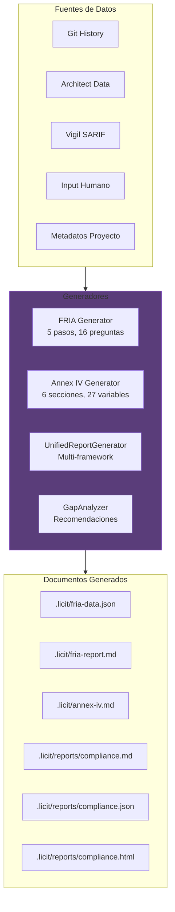
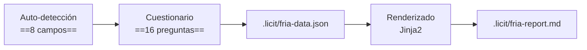
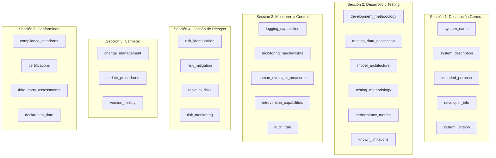
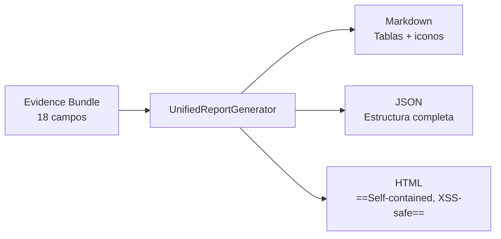
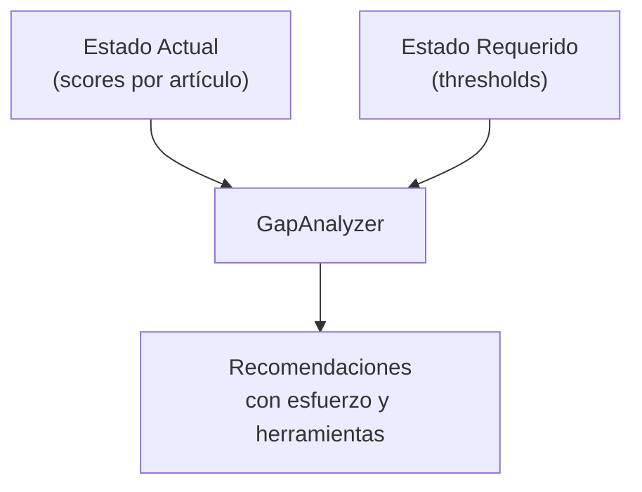
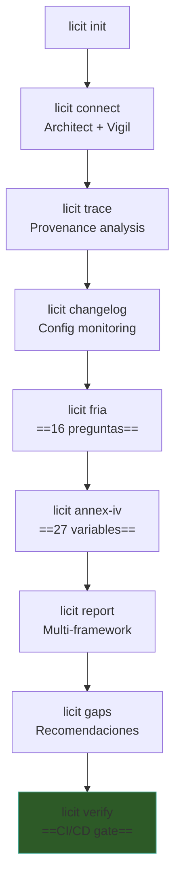

# Licit — Generación de Documentación

> [!abstract] Resumen
> Licit auto-genera documentación regulatoria para compliance. Esto incluye: ==FRIA== (cuestionario interactivo de 5 pasos con 16 preguntas + 8 campos auto-detectados), ==Annex IV== (27 variables auto-pobladas desde metadatos del proyecto), ==reportes unificados== en 3 formatos (Markdown, JSON, HTML self-contained y XSS-safe), y ==gap analysis== con recomendaciones accionables incluyendo esfuerzo estimado y herramientas sugeridas. Todos los documentos se almacenan en `.licit/`. ^resumen

---

## Visión General de la Generación Documental



---

## FRIA — Fundamental Rights Impact Assessment

### Qué es el FRIA

El FRIA (*Fundamental Rights Impact Assessment*) es una ==evaluación obligatoria== bajo el Art. 26(5) del EU AI Act para sistemas AI de alto riesgo. Licit facilita su generación mediante un cuestionario interactivo[^1].

### Proceso de Generación



### 8 Campos Auto-detectados

Antes de iniciar el cuestionario, Licit ==auto-detecta 8 campos== del FRIA:

| # | Campo | Fuente de Auto-detección |
|---|-------|-------------------------|
| 1 | Nombre del sistema | `package.json` name, `pyproject.toml` [project] name |
| 2 | Tipo de sistema | Análisis de dependencias (web, API, CLI, etc.) |
| 3 | Modelo AI utilizado | `.architect/config.yaml` → model |
| 4 | Proveedor del modelo | `.architect/config.yaml` → provider |
| 5 | Herramientas de seguridad | Presencia de `.vigil.yaml` o resultados SARIF |
| 6 | Mecanismos de oversight | Confirmation modes en Architect config |
| 7 | Logging habilitado | Presencia de OTel config, sessions |
| 8 | Fecha del assessment | ==Timestamp actual== |

> [!success] Reducción de trabajo manual
> Los 8 campos auto-detectados ==eliminan el 30-40% del trabajo manual== del FRIA. El usuario solo necesita responder las 16 preguntas del cuestionario que requieren juicio humano.

### 16 Preguntas del Cuestionario

#### Paso 1: Contexto del Sistema (4 preguntas)

| # | Pregunta |
|---|---------|
| 1 | ¿Cuál es el propósito principal del sistema AI? |
| 2 | ¿Quiénes son los usuarios finales del sistema? |
| 3 | ¿En qué contexto se despliega (sector, geografía)? |
| 4 | ¿Qué datos procesa el sistema? |

#### Paso 2: Impacto en Derechos Fundamentales (4 preguntas)

| # | Pregunta |
|---|---------|
| 5 | ¿El sistema puede afectar la privacidad de las personas? |
| 6 | ¿Puede generar discriminación o sesgo? |
| 7 | ¿Afecta la autonomía o capacidad de decisión de las personas? |
| 8 | ¿Tiene impacto en el acceso a servicios esenciales? |

#### Paso 3: Medidas de Mitigación (3 preguntas)

| # | Pregunta |
|---|---------|
| 9 | ¿Qué medidas técnicas de mitigación se implementaron? |
| 10 | ¿Qué medidas organizativas se implementaron? |
| 11 | ¿Cómo se validaron las medidas de mitigación? |

#### Paso 4: Monitoreo y Revisión (3 preguntas)

| # | Pregunta |
|---|---------|
| 12 | ¿Cómo se monitorea el sistema en producción? |
| 13 | ¿Con qué frecuencia se revisa el impacto? |
| 14 | ¿Existe un procedimiento de escalación? |

#### Paso 5: Documentación y Transparencia (2 preguntas)

| # | Pregunta |
|---|---------|
| 15 | ¿Cómo se comunica a los usuarios que interactúan con AI? |
| 16 | ¿La documentación está accesible a todos los stakeholders? |

> [!example] Iniciar el cuestionario FRIA
> ```bash
> # Interactivo (con prompts en terminal)
> licit fria
>
> # Con auto-detección visible
> licit fria --show-auto-detected
>
> # Regenerar desde datos existentes
> licit fria --regenerate
> ```

### Output del FRIA

> [!example]- Estructura de fria-data.json
> ```json
> {
>   "metadata": {
>     "system_name": "mi-api-service",
>     "assessment_date": "2025-06-01",
>     "assessor": "dev@company.com",
>     "auto_detected": {
>       "system_type": "web-api",
>       "ai_model": "gpt-4o",
>       "ai_provider": "openai",
>       "security_tools": ["vigil"],
>       "oversight_mechanisms": ["confirm-sensitive"],
>       "logging_enabled": true
>     }
>   },
>   "responses": [
>     {
>       "step": 1,
>       "question_id": 1,
>       "question": "¿Cuál es el propósito principal del sistema AI?",
>       "answer": "Automatizar la generación de código para APIs REST..."
>     }
>   ],
>   "risk_level": "high",
>   "overall_assessment": "partial_compliance"
> }
> ```

> [!info] Formato del reporte
> El reporte `.licit/fria-report.md` es un ==Markdown legible== que puede incluirse directamente en documentación del proyecto o compartirse con stakeholders. Usa templates *Jinja2* para el renderizado.

---

## Annex IV — Documentación Técnica

### Qué es Annex IV

El Annex IV del EU AI Act define los ==requisitos de documentación técnica== para sistemas AI. Licit genera este documento automáticamente usando 27 variables extraídas del proyecto[^2].

### 6 Secciones



### Auto-población de Variables

Licit extrae las ==27 variables== de múltiples fuentes:

| Variable | Fuente de Auto-población |
|----------|-------------------------|
| `system_name` | `package.json`, `pyproject.toml` |
| `system_description` | README.md, `.intake.yaml` description |
| `system_version` | Git tags, `version` en manifesto |
| `model_architecture` | `.architect/config.yaml` → model |
| `testing_methodology` | Presencia de frameworks (pytest, jest) |
| `performance_metrics` | ==Test coverage==, Architect health delta |
| `logging_capabilities` | OTel config, [[architect-architecture\|Architect]] pipelines |
| `monitoring_mechanisms` | Watch mode, changelog |
| `human_oversight_measures` | ==Confirmation modes== |
| `audit_trail` | Sessions, provenance JSONL |
| `risk_mitigation` | [[vigil-overview\|Vigil]] findings + fixes |
| `change_management` | [[licit-overview\|Licit]] changelog |
| `compliance_standards` | Evaluaciones de frameworks |

> [!warning] Variables no auto-poblables
> Algunas variables ==requieren input manual== porque dependen del contexto de negocio:
> - `intended_purpose` — solo el equipo sabe para qué se usa
> - `developer_info` — datos de la organización
> - `certifications` — certificaciones externas
> - `third_party_assessments` — auditorías externas
>
> Estas se dejan como `TODO: Complete manually` en el documento generado.

> [!example] Generar Annex IV
> ```bash
> # Generar con auto-detección
> licit annex-iv
>
> # Regenerar (sobreescribe)
> licit annex-iv --regenerate
>
> # Ver variables detectadas sin generar
> licit annex-iv --dry-run
> ```

---

## Reportes Unificados

### UnifiedReportGenerator

El generador unificado produce reportes ==multi-framework== en 3 formatos:



### Formato Markdown

| Característica | Detalle |
|---------------|---------|
| Tablas | Con ==iconos== (✓, ✗, ~) por estado |
| Wikilinks | Para navegación en vault de Obsidian |
| Secciones | Por framework (EU AI Act, OWASP) |
| Scores | Con barras visuales |

> [!example]- Fragmento de reporte Markdown
> ```markdown
> # Compliance Report
>
> ## EU AI Act
>
> | Artículo | Score | Estado |
> |----------|-------|--------|
> | Art. 9 - Risk Management | 0.72 | ✓ Full |
> | Art. 10 - Data Governance | 0.45 | ~ Partial |
> | Art. 12 - Logging | 0.85 | ✓ Full |
> | Art. 13 - Transparency | 0.60 | ~ Partial |
> | Art. 14 - Human Oversight | 0.55 | ~ Partial |
> | Art. 26(5) - FRIA | 0.90 | ✓ Full |
> | Annex IV - Technical Doc | 0.75 | ✓ Full |
>
> **Overall: 0.69 (Partial Compliance)**
> ```

### Formato JSON

| Característica | Detalle |
|---------------|---------|
| Estructura | Completa y parseable |
| Metadatos | Timestamp, versión, herramienta |
| Detalle | Score por artículo con justificación |
| Programático | ==Ideal para dashboards== |

### Formato HTML

| Característica | Detalle |
|---------------|---------|
| Self-contained | ==Sin dependencias externas== |
| XSS-safe | Sanitización de todo el contenido |
| Navegable | Índice interactivo |
| Compartible | Un solo archivo, por email o wiki |

> [!success] HTML self-contained
> El reporte HTML es un ==archivo único== sin JavaScript externo, CSS externo, ni imágenes externas. Todo está embebido. Esto garantiza:
> - No se rompe al mover o compartir
> - No hay riesgo de XSS (todo sanitizado)
> - Se puede ver offline
> - Ideal para ==presentar a auditores== o stakeholders

> [!example] Generar reportes
> ```bash
> # Markdown (default)
> licit report
>
> # JSON
> licit report --format json
>
> # HTML
> licit report --format html
>
> # Todos los formatos
> licit report --format all
>
> # Solo un framework
> licit report --framework eu-ai-act
> licit report --framework owasp-agentic
> ```

---

## Gap Analysis

### Qué es el Gap Analysis

El *gap analysis* identifica ==brechas entre el estado actual y el requerido==, con recomendaciones accionables:



### Estructura de un GapItem

| Campo | Tipo | Descripción |
|-------|------|-------------|
| `framework` | string | "eu-ai-act" o "owasp-agentic" |
| `article` | string | Artículo o riesgo (ej: "Art. 12") |
| `current_score` | float | Score actual (0.0 - 1.0) |
| `required_score` | float | Umbral mínimo requerido |
| `gap` | float | ==Diferencia== (required - current) |
| `recommendation` | string | ==Acción recomendada== |
| `effort` | string | "low", "medium", "high" |
| `tools_suggested` | list | Herramientas del ecosistema que ayudan |

### Ejemplo de Gap Analysis

> [!example]- Output de licit gaps
> ```
> Gap Analysis Report
> ====================
>
> 3 gaps identified (sorted by priority):
>
> 1. FRIA (Art. 26(5))
>    Current: 0.00 | Required: 0.90 | Gap: 0.90
>    → Run 'licit fria' to complete the FRIA questionnaire
>    Effort: medium | Tools: licit
>
> 2. Human Oversight (Art. 14)
>    Current: 0.55 | Required: 0.80 | Gap: 0.25
>    → Change Architect confirmation mode from 'yolo' to 'confirm-sensitive'
>    Effort: low | Tools: architect
>
> 3. Transparency (Art. 13)
>    Current: 0.60 | Required: 0.70 | Gap: 0.10
>    → Generate Annex IV with 'licit annex-iv' and complete missing sections
>    Effort: low | Tools: licit
> ```

> [!tip] Recomendaciones accionables
> Las recomendaciones del gap analysis son ==específicas y accionables==: incluyen el comando exacto a ejecutar, la herramienta a usar, y una estimación de esfuerzo. Esto las diferencia de auditorías genéricas que solo listan problemas sin soluciones.

```bash
# Ejecutar gap analysis
licit gaps

# Solo para un framework
licit gaps --framework eu-ai-act

# Output JSON para procesamiento
licit gaps --format json
```

---

## Evidence Bundles para Auditoría

### Qué es un Evidence Bundle

Un *evidence bundle* es el ==conjunto completo de evidencia== que respalda las evaluaciones de compliance. Se genera automáticamente y contiene ==18 campos==:

| # | Campo | Descripción |
|---|-------|-------------|
| 1 | Provenance | Clasificación AI/human/mixed por commit |
| 2 | Changelog | Historial de cambios en config AI |
| 3 | FRIA | Assessment de derechos fundamentales |
| 4 | Annex IV | Documentación técnica |
| 5 | Guardrails | Guardrails configurados en Architect |
| 6 | Quality gates | Checks y pipelines |
| 7 | Budget | Presupuesto y costos reales |
| 8 | Dry-run | Capacidad de simulación |
| 9 | Rollback | Capacidad de reversión |
| 10 | Audit trail | Historial completo de acciones |
| 11 | OTel | Telemetría de OpenTelemetry |
| 12 | Human review | Evidencia de revisión humana |
| 13 | Requirements traceability | Trazabilidad de requisitos (Intake) |
| 14 | Security findings | Hallazgos de seguridad (Vigil) |
| 15 | Test coverage | Cobertura de tests |
| 16 | Documentation | Documentación del proyecto |
| 17 | Risk assessment | Evaluación de riesgos |
| 18 | Compliance score | ==Score agregado== |

> [!danger] Para auditorías reales
> El evidence bundle está diseñado para ==auditorías reales de compliance==. Cada campo es verificable: los datos de provenance tienen firmas HMAC-SHA256, los datos de Architect y Vigil son trazables a archivos concretos, y el FRIA tiene timestamps y respuestas del evaluador humano.

---

## Flujo Completo de Generación



> [!tip] Orden recomendado
> El flujo de arriba es el ==orden recomendado== para generar documentación completa. Cada paso enriquece el *evidence bundle*, y los pasos posteriores se benefician de la evidencia acumulada.

---

## Enlaces y referencias

> [!quote]- Referencias internas
> - [[licit-overview]] — Visión general de Licit
> - [[licit-architecture]] — Arquitectura técnica del generador
> - [[licit-compliance-frameworks]] — Frameworks evaluados
> - [[architect-overview]] — Fuente de evidencia para auto-población
> - [[vigil-overview]] — Fuente de hallazgos de seguridad
> - [[ecosistema-completo]] — Flujo integrado del ecosistema
> - [[ecosistema-cicd-integration]] — licit verify en CI/CD

[^1]: El FRIA es obligatorio bajo el Art. 26(5) del EU AI Act para "deployers" de sistemas AI de alto riesgo.
[^2]: Annex IV define los contenidos mínimos de la documentación técnica para sistemas AI de alto riesgo.
[^3]: El HTML self-contained usa inline CSS y no incluye JavaScript dinámico para evitar riesgos de XSS.
