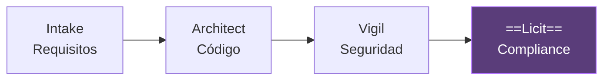
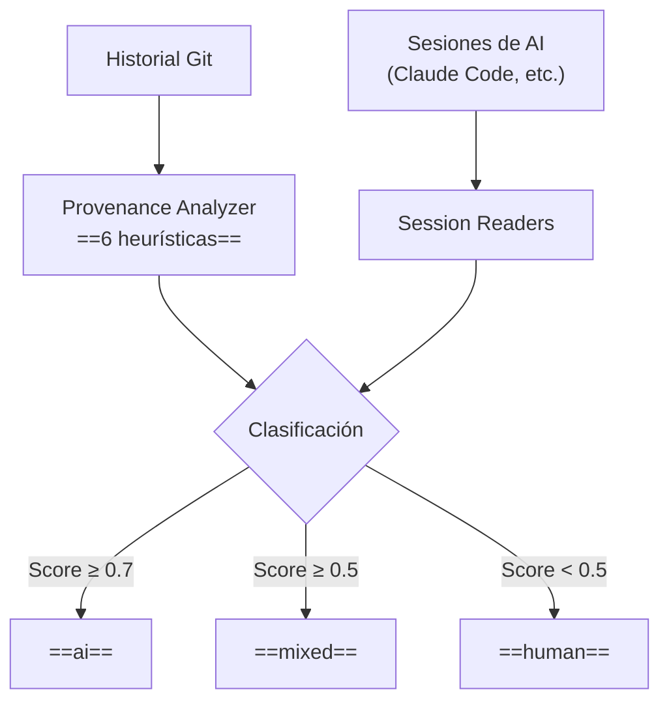
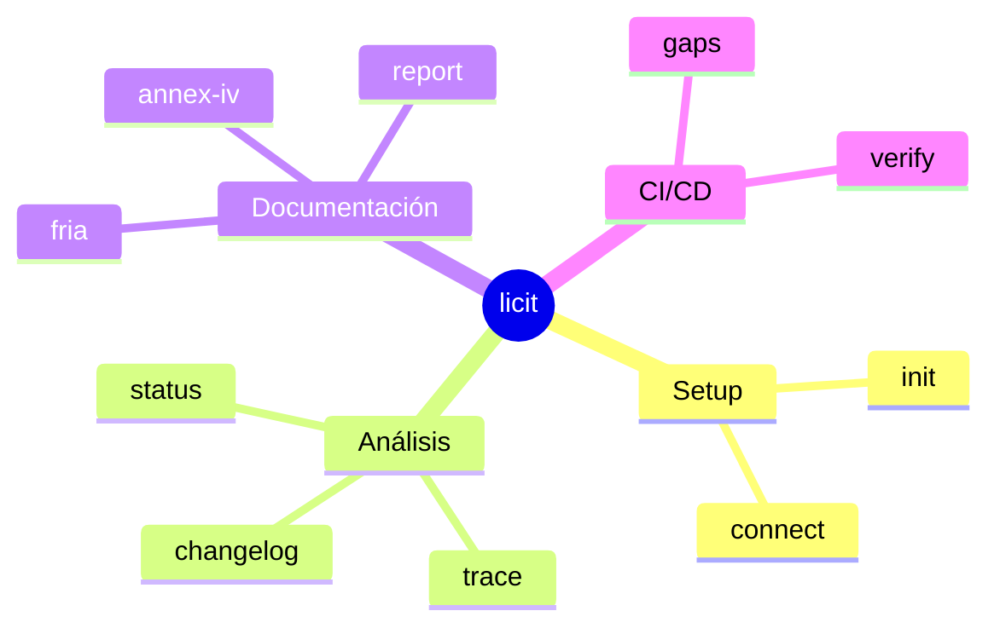
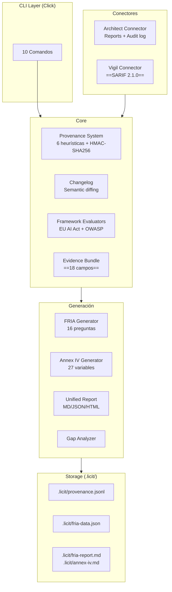

# Licit — Visión General

> [!abstract] Resumen
> **Licit** es una ==CLI de compliance y trazabilidad==. Opera con enfoque *filesystem-first*: todos los datos en `.licit/`, sin servicios externos, ==completamente offline==. Evalúa 2 frameworks: ==EU AI Act (11 artículos)== y ==OWASP Agentic Top 10 (ASI01-ASI10)==. Genera documentación regulatoria: FRIA (5 pasos, 16 preguntas), Annex IV (6 secciones, 27 variables), y reportes unificados. Tiene 10 comandos CLI, conectores para [[architect-overview|Architect]] y [[vigil-overview|Vigil]], y ==789 tests==. ^resumen

---

## Qué es Licit

Licit cierra el ciclo del ecosistema. Después de que [[intake-overview|Intake]] normaliza requisitos, [[architect-overview|Architect]] genera código, y [[vigil-overview|Vigil]] escanea vulnerabilidades, Licit responde la pregunta: ==¿estamos en compliance?==



> [!tip] Filesystem-first
> A diferencia de herramientas de compliance que requieren bases de datos, servidores, o servicios cloud, Licit almacena ==todo en el directorio `.licit/`== del proyecto. Funciona completamente offline. Los datos son archivos JSONL y Markdown, legibles y auditables sin herramientas especiales.

---

## ¿Para Qué Sirve?

Licit resuelve tres problemas fundamentales del desarrollo con IA:

### 1. Provenance — ¿Quién Escribió el Código?



> [!info] Las 6 heurísticas de provenance
> | # | Heurística | Peso |
> |---|------------|------|
> | 1 | Author pattern | ==3.0== |
> | 2 | Message pattern | 1.5 |
> | 3 | Bulk changes | 2.0 |
> | 4 | Co-author | ==3.0== |
> | 5 | File patterns | 1.0 |
> | 6 | Time pattern | 0.5 |

### 2. Compliance — ¿Cumplimos la Regulación?

| Framework | Evaluaciones |
|-----------|-------------|
| ==EU AI Act== | 11 artículos (Art. 9, 10, 12, 13, 14, 14(4)(a), 14(4)(d), 26, 26(5), 27, Annex IV) |
| ==OWASP Agentic Top 10== | ASI01 a ASI10 |

### 3. Documentación — ¿Tenemos Evidencia?

| Documento | Descripción |
|-----------|-------------|
| FRIA | ==Fundamental Rights Impact Assessment== (5 pasos, 16 preguntas) |
| Annex IV | Documentación técnica EU AI Act (6 secciones, 27 variables) |
| Reportes | Markdown, JSON, HTML (self-contained) |
| Gap Analysis | Recomendaciones accionables |

---

## 10 Comandos CLI

| Comando | Descripción |
|---------|-------------|
| `licit init` | Inicializa `.licit/` en el proyecto |
| `licit status` | ==Estado actual de compliance== |
| `licit connect` | Conecta con Architect/Vigil |
| `licit trace` | Trazabilidad de provenance |
| `licit changelog` | Changelog de configuración AI |
| `licit fria` | Genera FRIA (cuestionario interactivo) |
| `licit annex-iv` | Genera documentación Annex IV |
| `licit report` | Genera reporte unificado |
| `licit gaps` | Análisis de brechas con recomendaciones |
| `licit verify` | ==Verificación CI/CD== (exit codes) |



---

## Arquitectura General



---

## Provenance — Tracking de Autoría

El sistema de *provenance* responde: ==¿este commit fue escrito por un humano o por IA?==

### Store Append-only

Los datos de provenance se almacenan en `.licit/provenance.jsonl` como ==JSONL append-only==:

```jsonl
{"commit": "abc123", "score": 0.85, "classification": "ai", "heuristics": {...}, "timestamp": "..."}
{"commit": "def456", "score": 0.30, "classification": "human", "heuristics": {...}, "timestamp": "..."}
```

### Integridad Criptográfica

| Mecanismo | Nivel | Uso |
|-----------|-------|-----|
| ==HMAC-SHA256== | Por registro | Cada línea JSONL firmada individualmente |
| ==Merkle tree== | Por lote | Integridad de batches de registros |

> [!danger] Append-only
> El store de provenance es ==append-only por diseño==. No se pueden modificar ni eliminar registros. Esto garantiza un *audit trail* inmutable que cumple con requisitos de compliance.

### Session Readers

Licit puede leer sesiones de herramientas de AI para mejorar la precisión de clasificación:

| Reader | Fuente | Formato |
|--------|--------|---------|
| Claude Code | `~/.claude/projects/` | JSONL |

> [!tip] Extensibilidad
> El sistema de *session readers* es ==basado en protocolos==, extensible para soportar nuevas herramientas de AI sin modificar el core.

---

## Changelog — Monitoreo de Configuración

Licit monitorea ==8 archivos de configuración== de herramientas AI:

| Archivo | Herramienta |
|---------|-------------|
| `CLAUDE.md` | Claude Code |
| `.cursorrules` | Cursor |
| `.architect/config.yaml` | [[architect-overview\|Architect]] |
| `.github/copilot-instructions.md` | GitHub Copilot |
| `.windsurfrules` | Windsurf |
| `.clinerules` | Cline |
| `.roomodes` | Roo |
| `.kirorules` | Kiro |

### Semantic Diffing

A diferencia de un `git diff` textual, Licit hace ==diffing semántico==:

| Formato | Técnica |
|---------|---------|
| YAML/JSON | Diff a nivel de campos |
| Markdown | Diff a nivel de secciones |

### Clasificación de Cambios

| Tipo | Ejemplos | Impacto |
|------|----------|---------|
| ==MAJOR== | Cambio de modelo, cambio de proveedor | Alto |
| ==MINOR== | Cambio de prompt, guardrails, herramientas | Medio |
| ==PATCH== | Todo lo demás | Bajo |

> [!warning] Cambios MAJOR
> Un cambio MAJOR (como cambiar de GPT-4 a Claude) puede tener ==implicaciones de compliance== significativas. Licit registra estos cambios y actualiza las evaluaciones de los frameworks automáticamente.

---

## Frameworks de Compliance

### EU AI Act — 11 Artículos

| Artículo | Tema |
|----------|------|
| Art. 9 | Gestión de riesgos |
| Art. 10 | Datos y gobernanza |
| Art. 12 | ==Logging== |
| Art. 13 | Transparencia |
| Art. 14 | Supervisión humana |
| Art. 14(4)(a) | Interpretación correcta |
| Art. 14(4)(d) | Capacidad de no usar |
| Art. 26 | Obligaciones de deployers |
| Art. 26(5) | FRIA |
| Art. 27 | Registro en base de datos EU |
| Annex IV | ==Documentación técnica== |

### OWASP Agentic Top 10

| ID | Riesgo |
|----|--------|
| ASI01 | Prompt Injection |
| ASI02 | Excessive Agency |
| ASI03 | Insecure Output Handling |
| ASI04 | Inadequate Sandboxing |
| ASI05 | Data Exfiltration |
| ASI06 | Privilege Escalation |
| ASI07 | Insecure MCP Usage |
| ASI08 | Lack of Audit |
| ASI09 | Supply Chain |
| ASI10 | Lack of Human Oversight |

> [!info] Scoring dinámico
> Las evaluaciones usan ==scoring dinámico con evidencia==, no checklists estáticas. Cada artículo/riesgo se evalúa basándose en la evidencia real encontrada en el proyecto. Consulta [[licit-compliance-frameworks]] para detalles de scoring.

---

## Conectores

### Conector Architect

Lee datos de [[architect-overview|Architect]] para extraer evidencia:

| Fuente | Evidencia Extraída |
|--------|-------------------|
| Reports | Resultados de ejecución |
| Audit log | ==Audit trail completo== |
| Config | Guardrails, gates, budget |

### Conector Vigil

Lee resultados de [[vigil-overview|Vigil]] en ==formato SARIF 2.1.0==:

| Fuente | Evidencia Extraída |
|--------|-------------------|
| SARIF results | Hallazgos de seguridad |
| SARIF rules | Reglas evaluadas |
| SARIF tool | Versión del escáner |

> [!success] Conector SARIF universal
> El conector Vigil lee ==cualquier archivo SARIF 2.1.0==, no solo de Vigil. Esto permite alimentar Licit con resultados de Semgrep, CodeQL, o cualquier herramienta que genere SARIF.

---

## Evidence Bundle — 18 Campos

El *evidence bundle* es el ==conjunto completo de evidencia== que Licit recopila:

| # | Campo | Fuente |
|---|-------|--------|
| 1 | Provenance | Git + session readers |
| 2 | Changelog | Monitoreo de config |
| 3 | FRIA | Cuestionario interactivo |
| 4 | Annex IV | Generación automática |
| 5 | Guardrails | Conector Architect |
| 6 | Quality gates | Conector Architect |
| 7 | Budget | Conector Architect |
| 8 | Dry-run | Conector Architect |
| 9 | Rollback | Conector Architect |
| 10 | Audit trail | Conector Architect |
| 11 | OTel | Conector Architect |
| 12 | Human review | Git + PR analysis |
| 13 | Requirements traceability | [[intake-overview\|Intake]] spec.lock |
| 14 | Security findings | Conector Vigil (SARIF) |
| 15 | Test coverage | Análisis de tests |
| 16 | Documentation | Archivos del proyecto |
| 17 | Risk assessment | Evaluadores de frameworks |
| 18 | Compliance score | Cálculo agregado |

---

## Quick Start

> [!example] Inicio rápido
> ```bash
> # 1. Instalar
> pip install licit-cli
>
> # 2. Inicializar en el proyecto
> licit init
>
> # 3. Conectar con Architect y Vigil
> licit connect --architect .architect/
> licit connect --vigil results.sarif
>
> # 4. Ver estado de compliance
> licit status
>
> # 5. Generar FRIA
> licit fria
>
> # 6. Generar Annex IV
> licit annex-iv
>
> # 7. Generar reporte completo
> licit report --format html
>
> # 8. Análisis de brechas
> licit gaps
>
> # 9. Verificación CI/CD
> licit verify
> ```

---

## CI/CD Integration

| Exit Code | Significado |
|-----------|-------------|
| 0 | ==COMPLIANT== |
| 1 | ==NON_COMPLIANT== |
| 2 | ==PARTIAL== |

```bash
# En pipeline CI/CD
licit verify --framework eu-ai-act --threshold 0.7
```

> [!tip] Umbral configurable
> El umbral de compliance es configurable con `--threshold`. Un valor de 0.7 significa que se requiere al menos 70% de compliance para pasar. Ver [[ecosistema-cicd-integration]] para el pipeline completo.

---

## Reportes

| Formato | Descripción |
|---------|-------------|
| ==Markdown== | Tablas con iconos, legible en IDEs |
| ==JSON== | Para procesamiento programático |
| ==HTML== | Self-contained, ==XSS-safe==, para stakeholders |

> [!info] HTML self-contained
> El reporte HTML es un ==archivo único sin dependencias externas==. Todo el CSS y JavaScript está embebido. Es seguro compartir por email o subir a una wiki sin riesgo de XSS.

---

## Estadísticas del Proyecto

| Métrica | Valor |
|---------|-------|
| Tests | ==789== |
| Comandos CLI | 10 |
| Artículos EU AI Act | 11 |
| Riesgos OWASP Agentic | 10 |
| Campos evidence bundle | ==18== |
| Heurísticas de provenance | 6 |
| Preguntas FRIA | 16 |
| Variables Annex IV | 27 |

---

## Enlaces y referencias

> [!quote]- Referencias internas
> - [[licit-architecture]] — Arquitectura técnica detallada
> - [[licit-compliance-frameworks]] — Frameworks evaluados en detalle
> - [[licit-documentation-generation]] — Generación de documentación regulatoria
> - [[architect-overview]] — Fuente de evidencia via conector
> - [[vigil-overview]] — Fuente de hallazgos de seguridad via SARIF
> - [[ecosistema-completo]] — Flujo integrado del ecosistema
> - [[ecosistema-cicd-integration]] — Licit en pipelines CI/CD
> - [[intake-overview]] — Fuente de trazabilidad de requisitos

[^1]: El enfoque filesystem-first permite que los datos de Licit se versionan con git junto al código del proyecto.
[^2]: FRIA es el Fundamental Rights Impact Assessment requerido por el Artículo 26(5) del EU AI Act.
[^3]: El conector SARIF es genérico: acepta SARIF 2.1.0 de cualquier herramienta, no solo Vigil.
