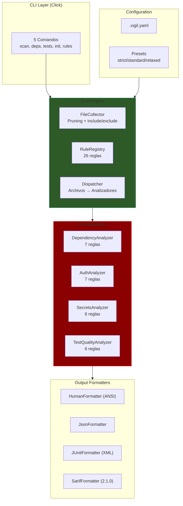
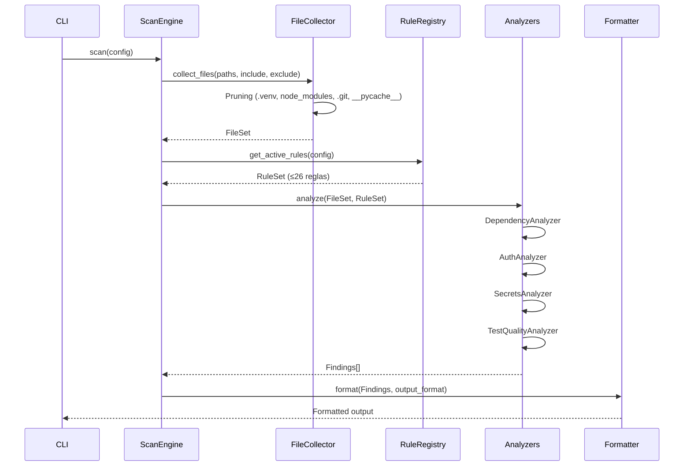
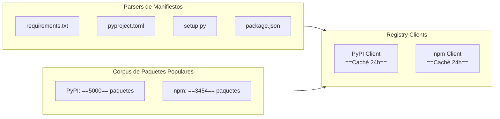
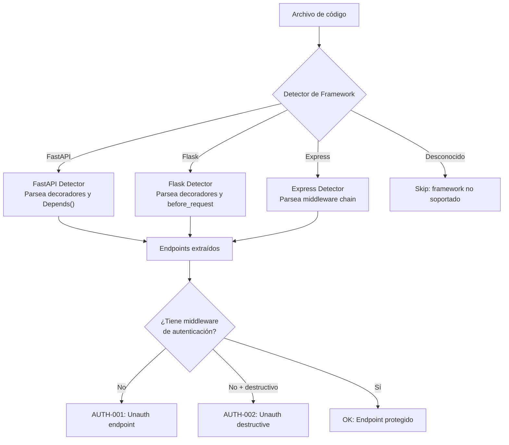
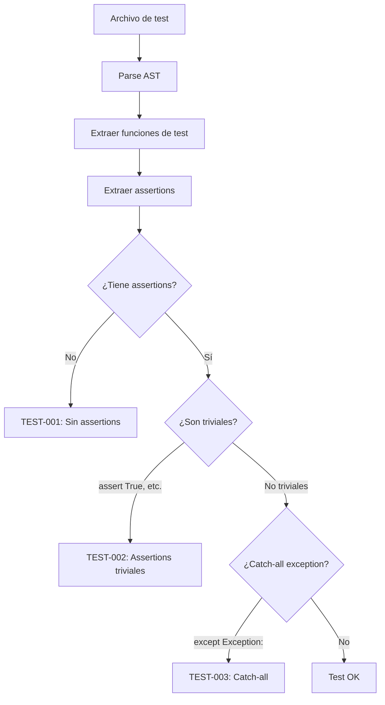
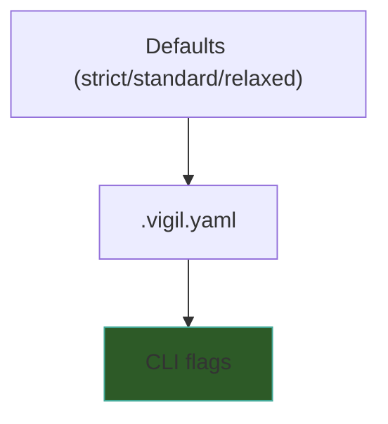

# Vigil — Arquitectura Técnica

> [!abstract] Resumen
> La arquitectura de Vigil se organiza alrededor de un ==*ScanEngine*== que orquesta un *FileCollector* con pruning, un ==*RuleRegistry* con 26 reglas==, y 4 analizadores especializados. El *DependencyAnalyzer* usa ==clientes de registro (PyPI/npm) con caché de 24h== y ==*Damerau-Levenshtein* con umbral 0.85== para typosquatting. El *AuthAnalyzer* tiene detectores de endpoints para FastAPI, Flask y Express. El *SecretsAnalyzer* opera con ==32 patrones regex y entropía Shannon==. El *TestQualityAnalyzer* usa ==parsing AST== para extraer assertions. ^resumen

---

## Arquitectura General



---

## ScanEngine — Orquestación

El *ScanEngine* es el componente central que coordina todo el proceso de escaneo[^1]:

### Flujo de Ejecución



---

## FileCollector — Recolección y Pruning

### Pruning Automático

El *FileCollector* ==excluye automáticamente== directorios que no deben escanearse:

| Directorio | Razón |
|-----------|-------|
| `.venv` | Entorno virtual Python (código de terceros) |
| `node_modules` | Dependencias npm (código de terceros) |
| `.git` | Datos de control de versiones |
| `__pycache__` | Bytecode compilado de Python |

### Configuración de Include/Exclude

```yaml
include:
  - "src/**/*.py"
  - "tests/**/*.py"
  - "package.json"
  - "requirements.txt"

exclude:
  - "src/generated/**"
  - "tests/fixtures/**"
  - "**/migrations/**"
```

> [!info] Orden de precedencia
> 1. Pruning automático (siempre activo, no configurable)
> 2. `exclude` (se aplica después del pruning)
> 3. `include` (si se especifica, solo se incluyen los que coinciden)

---

## DependencyAnalyzer — Detalles Técnicos

### Registry Clients

El *DependencyAnalyzer* consulta ==registros reales== de paquetes:



| Componente | Descripción |
|------------|-------------|
| PyPI Client | Consulta `https://pypi.org/pypi/{name}/json` |
| npm Client | Consulta `https://registry.npmjs.org/{name}` |
| Caché | ==24 horas== de duración, por paquete |
| Modo offline | `--offline` salta verificaciones de registro |

### Damerau-Levenshtein para Typosquatting

La regla DEP-003 usa la ==distancia de *Damerau-Levenshtein*== para detectar nombres de paquetes similares a paquetes populares[^2]:

$$DL(a, b) = \text{inserciones} + \text{eliminaciones} + \text{sustituciones} + \text{transposiciones}$$

La similitud se calcula como:

$$\text{similitud} = 1 - \frac{DL(a, b)}{\max(|a|, |b|)}$$

Si la ==similitud ≥ 0.85==, se reporta como posible typosquatting.

> [!example]- Ejemplo de detección de typosquatting
> ```
> Paquete declarado: "requets"
> Paquete popular:   "requests"
>
> DL("requets", "requests") = 2 (1 eliminación + 1 transposición)
> Similitud = 1 - 2/8 = 0.75 → NO reportado (< 0.85)
>
> Paquete declarado: "requsts"
> Paquete popular:   "requests"
>
> DL("requsts", "requests") = 1 (1 sustitución)
> Similitud = 1 - 1/8 = 0.875 → REPORTADO (≥ 0.85)
> ```

### Corpus de Paquetes Populares

| Registro | Paquetes en Corpus | Criterio |
|----------|-------------------|----------|
| PyPI | ==5000== | Top por descargas mensuales |
| npm | ==3454== | Top por descargas semanales |

El corpus se usa para:
1. **DEP-001**: verificar existencia (si no está en corpus, consultar registro)
2. **DEP-003**: comparar nombres para typosquatting
3. **DEP-004**: evaluar popularidad relativa

> [!warning] Mantenimiento del corpus
> El corpus está embebido en el paquete de Vigil. Se actualiza con cada release. Entre releases, ==paquetes nuevos legítimos podrían generar falsos positivos== en DEP-001. Usa `--exclude-rule DEP-001` si esto es un problema, o agrega el paquete a la allowlist en `.vigil.yaml`.

---

## AuthAnalyzer — Detectores de Endpoints

### Frameworks Soportados

| Framework | Lenguaje | Detección |
|-----------|----------|-----------|
| ==FastAPI== | Python | Decoradores `@app.get/post/put/delete` |
| ==Flask== | Python | Decoradores `@app.route`, `@blueprint.route` |
| ==Express== | JavaScript | `app.get/post/put/delete`, `router.*` |

### Flujo de Análisis



### Middleware Checkers

| Check | Regla | Qué busca |
|-------|-------|-----------|
| JWT Lifetime | AUTH-003 | `expires_in` o `exp` > 86400 segundos (==24h==) |
| Cookie Flags | AUTH-004 | `HttpOnly`, `Secure`, `SameSite` faltantes |
| CORS | AUTH-005 | `Access-Control-Allow-Origin: *` |
| Basic Auth | AUTH-006 | `Authorization: Basic` sin HTTPS |
| Timing | AUTH-007 | Comparación de strings sin `hmac.compare_digest` |

---

## SecretsAnalyzer — Detección de Secretos

### 32 Patrones Regex

El *SecretsAnalyzer* usa ==32 patrones regex== para detectar placeholders y secretos:

> [!example]- Categorías de patrones regex
> ```
> # Patrones de API Keys
> sk-[a-zA-Z0-9]{20,}           # OpenAI
> AKIA[0-9A-Z]{16}              # AWS Access Key
> ghp_[a-zA-Z0-9]{36}           # GitHub Personal Token
> xoxb-[0-9]+-[a-zA-Z0-9]+      # Slack Bot Token
>
> # Patrones de Placeholders
> your[-_]?(api[-_]?key|token|secret|password)
> <(API_KEY|TOKEN|SECRET|PASSWORD)>
> INSERT[-_]YOUR[-_].*[-_]HERE
> CHANGE[-_]?ME
> REPLACE[-_]?WITH[-_]?.*
> TODO:?\s*(add|set|replace|update).*key
>
> # Patrones de credenciales
> password\s*[:=]\s*["'][^"']{4,}["']
> (mysql|postgres|mongodb)://[^:]+:[^@]+@
> -----BEGIN (RSA |EC |DSA |OPENSSH )?PRIVATE KEY-----
> ```

### Entropía Shannon

Para la regla SEC-002, Vigil calcula la ==entropía Shannon== de strings que parecen secretos:

$$H(X) = -\sum_{i=1}^{n} p(x_i) \log_2 p(x_i)$$

| Valor de Entropía | Interpretación |
|-------------------|----------------|
| < 3.0 | ==Baja==: probablemente un placeholder o valor trivial |
| 3.0 - 4.0 | Media: podría ser un secreto débil |
| > 4.0 | Alta: probablemente un secreto real |

> [!tip] Umbrales configurables
> El umbral de entropía se puede ajustar en `.vigil.yaml`:
> ```yaml
> secrets:
>   entropy_threshold: 3.0  # Default
> ```
> Un umbral más bajo genera más alertas (más falsos positivos). Un umbral más alto es más permisivo.

---

## TestQualityAnalyzer — Análisis de Tests

### Parsing AST

El *TestQualityAnalyzer* usa ==parsing AST== (Abstract Syntax Tree) para analizar la estructura de los tests[^3]:



### Frameworks de Testing Soportados

| Framework | Lenguaje | Detección de Tests |
|-----------|----------|-------------------|
| ==pytest== | Python | Funciones `test_*`, clases `Test*` |
| ==unittest== | Python | Métodos `test*` en clases `TestCase` |
| ==jest== | JavaScript | `describe()`, `it()`, `test()` |
| ==mocha== | JavaScript | `describe()`, `it()` |

### Assertions Triviales (TEST-002)

| Patrón Trivial | Por qué es problemático |
|---------------|----------------------|
| `assert True` | ==Siempre pasa==, no prueba nada |
| `assert 1 == 1` | Tautología |
| `self.assertTrue(True)` | Siempre pasa |
| `expect(true).toBe(true)` | Siempre pasa |

> [!danger] Test Theater
> Los "tests de teatro" (TEST-001 + TEST-002) son especialmente peligrosos en código generado por IA: el LLM puede generar ==tests que parecen correctos== pero no verifican nada real. Esto da una falsa sensación de seguridad. Vigil es una de las pocas herramientas que detecta esto. Ver [[vigil-vs-alternatives]] para comparación.

---

## RuleRegistry

El *RuleRegistry* gestiona las ==26 reglas== activas:

| Función | Descripción |
|---------|-------------|
| `get_all_rules()` | Retorna las 26 reglas |
| `get_rules_by_category(cat)` | Filtra por categoría (deps, auth, secrets, tests) |
| `get_rule(id)` | Obtiene regla por ID |
| `is_enabled(id, config)` | Verifica si la regla está habilitada |

> [!info] Desactivar reglas
> Las reglas se pueden desactivar individualmente en `.vigil.yaml` o con `--exclude-rule`:
> ```yaml
> rules:
>   exclude:
>     - TEST-004  # Permitir tests skipped
>     - DEP-006   # No reportar dependencias faltantes
> ```

---

## Output Formatters

### SARIF 2.1.0

El formato SARIF es el más completo e incluye:

| Campo SARIF | Fuente en Vigil |
|-------------|----------------|
| `tool.driver.name` | "vigil" |
| `tool.driver.rules[]` | 26 reglas con descripción |
| `results[].ruleId` | ID de la regla (ej: DEP-001) |
| `results[].level` | ==Mapeo de severidad== |
| `results[].locations` | Archivo y línea |
| `results[].properties.cwe` | ==Mapeo CWE== |
| `results[].properties.owasp` | ==Mapeo OWASP== |

> [!success] Compatible con GitHub Advanced Security
> La salida SARIF es ==100% compatible== con GitHub Advanced Security. Los resultados aparecen directamente en la pestaña "Security" → "Code scanning alerts" del repositorio. Esto se integra con el pipeline CI/CD descrito en [[ecosistema-cicd-integration]].

### Mapeo de Severidades

| Vigil | SARIF | GitHub |
|-------|-------|--------|
| Critical | error | ==Error== |
| High | error | Error |
| Medium | warning | Warning |
| Low | note | Note |

---

## Sistema de Configuración

### Jerarquía



### Presets

| Preset | fail_on | Reglas excluidas | Uso |
|--------|---------|------------------|-----|
| **strict** | medium | Ninguna | ==SOC2/ISO compliance== |
| **standard** | high | TEST-004 | Balance |
| **relaxed** | critical | TEST-004, DEP-006 | Desarrollo |

---

## Stack Tecnológico

| Dependencia | Uso |
|-------------|-----|
| ==Python 3.12+== | Runtime |
| *Click* | CLI framework |
| *Pydantic v2* | Validación de modelos |
| *httpx* | HTTP client para registros |
| *structlog* | Logging estructurado |

> [!info] Sin dependencia de AI/ML
> Vigil ==no tiene ninguna dependencia de AI/ML==. No usa TensorFlow, PyTorch, ni servicios de LLM. Todo el análisis es determinista basado en patrones, regex, y algoritmos clásicos. Esto es deliberado: un escáner de seguridad que depende de AI para funcionar tendría los mismos problemas que intenta detectar.

---

## Enlaces y referencias

> [!quote]- Referencias internas
> - [[vigil-overview]] — Visión general de Vigil
> - [[vigil-vulnerability-catalog]] — Catálogo completo de 26 reglas
> - [[vigil-vs-alternatives]] — Comparación con otras herramientas
> - [[architect-architecture]] — Arquitectura de Architect (genera el código)
> - [[licit-architecture]] — Arquitectura de Licit (consume SARIF)
> - [[ecosistema-completo]] — Integración del ecosistema

[^1]: El ScanEngine es stateless: cada invocación crea una instancia nueva, sin caché entre ejecuciones (excepto el caché de registro que persiste 24h).
[^2]: La distancia de Damerau-Levenshtein se diferencia de Levenshtein estándar en que también cuenta transposiciones de caracteres adyacentes como una operación única.
[^3]: El parsing AST de Python usa el módulo `ast` de la biblioteca estándar. Para JavaScript se usa un parser compatible.
