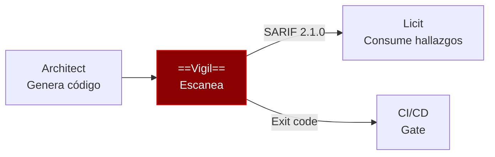

# Vigil — Visión General

> [!abstract] Resumen
> **Vigil** es un ==escáner de seguridad determinista para código generado por IA==. No usa AI/ML para su análisis: opera mediante ==4 analizadores con 26 reglas== distribuidas en categorías de dependencias, autenticación, secretos y calidad de tests. Genera salida en ==4 formatos== (Human, JSON, JUnit XML, SARIF 2.1.0). Tiene ==1706 tests y 97% de cobertura==. Compatible con GitHub Advanced Security vía SARIF. ^resumen

---

## Qué es Vigil

Vigil resuelve un problema específico: el código generado por agentes de IA (como [[architect-overview|Architect]]) puede contener ==vulnerabilidades que los escáneres tradicionales no detectan==. Específicamente:

- **Dependencias inventadas** (*slopsquatting*): el LLM "inventa" nombres de paquetes que no existen
- **Tests de teatro**: tests que parecen funcionar pero no prueban nada real
- **Secretos placeholder**: valores como `sk-your-api-key-here` que pasan filtros de entropía
- **Autenticación incompleta**: endpoints sin protección que el LLM "olvidó" asegurar

> [!tip] Determinista por diseño
> A diferencia de herramientas que usan AI/ML para detectar vulnerabilidades, Vigil es ==completamente determinista==: los mismos inputs siempre producen los mismos outputs. Esto es crítico para CI/CD y compliance ([[licit-overview|Licit]] requiere resultados reproducibles).

---

## Arquitectura — 4 Analizadores

```mermaid
flowchart TB
    subgraph Input["Entrada"]
        FILES["Archivos de código"]
        CFG[".vigil.yaml"]
    end

    subgraph Engine["ScanEngine"]
        FC["FileCollector<br/>(pruning)"]
        RR["RuleRegistry<br/>26 reglas"]
    end

    subgraph Analyzers["4 Analizadores"]
        DEP["DependencyAnalyzer<br/>==7 reglas== (DEP-001 → DEP-007)"]
        AUTH["AuthAnalyzer<br/>==7 reglas== (AUTH-001 → AUTH-007)"]
        SEC["SecretsAnalyzer<br/>==6 reglas== (SEC-001 → SEC-006)"]
        TEST["TestQualityAnalyzer<br/>==6 reglas== (TEST-001 → TEST-006)"]
    end

    subgraph Output["Formatos de Salida"]
        HUM["Human (ANSI)"]
        JSON["JSON"]
        JUNIT["JUnit XML"]
        SARIF["SARIF 2.1.0"]
    end

    Input --> Engine --> Analyzers --> Output

    style DEP fill:#8b0000,stroke:#f00
    style AUTH fill:#6e4a1a,stroke:#fa0
    style SEC fill:#5a3d7a,stroke:#a6f
    style TEST fill:#1a4a6e,stroke:#4af
```



### DependencyAnalyzer — 7 Reglas

| ID | Severidad | Detección |
|----|-----------|-----------|
| DEP-001 | ==Critical== | *Slopsquatting*: paquete no existe en registro |
| DEP-002 | High | Paquete nuevo (<30 días en registro) |
| DEP-003 | High | *Typosquatting*: nombre similar a paquete popular |
| DEP-004 | Medium | Pocas descargas |
| DEP-005 | Medium | Sin repositorio de código fuente |
| DEP-006 | Low | Dependencia faltante (declarada pero no usada) |
| DEP-007 | Medium | Versión pinned no existe |

> [!danger] Slopsquatting (DEP-001)
> El *slopsquatting* es el riesgo más crítico del código generado por IA. Un LLM puede "inventar" un nombre de paquete que suena razonable (ej: `flask-auth-utils`) pero ==no existe en PyPI/npm==. Un atacante podría registrar ese nombre y distribuir malware. Vigil verifica cada dependencia contra los ==registros reales de PyPI y npm==.

### AuthAnalyzer — 7 Reglas

| ID | Severidad | Detección |
|----|-----------|-----------|
| AUTH-001 | High | Endpoints sin autenticación |
| AUTH-002 | ==Critical== | Endpoints destructivos sin autenticación |
| AUTH-003 | High | Lifetime de JWT >24 horas |
| AUTH-004 | Medium | Flags de cookies faltantes |
| AUTH-005 | High | CORS con wildcard (`*`) |
| AUTH-006 | High | Basic auth sin HTTPS |
| AUTH-007 | Medium | Vulnerable a timing attacks |

> [!warning] Detección de frameworks
> AuthAnalyzer detecta automáticamente endpoints de ==FastAPI, Flask, y Express==. Para otros frameworks, los patrones pueden no detectarse correctamente. Consulta [[vigil-architecture]] para detalles sobre los detectores de endpoints.

### SecretsAnalyzer — 6 Reglas

| ID | Severidad | Detección |
|----|-----------|-----------|
| SEC-001 | ==Critical== | Placeholders (==32 patrones regex==) |
| SEC-002 | High | Baja entropía Shannon (<3.0) |
| SEC-003 | High | Connection strings con passwords |
| SEC-004 | High | Credenciales por defecto |
| SEC-005 | ==Critical== | Claves privadas |
| SEC-006 | Medium | Valores de `.env.example` |

> [!info] Entropía Shannon
> La entropía Shannon mide la aleatoriedad de un string. Un ==umbral de <3.0== detecta secretos que parecen reales pero son demasiado simples (ej: `password123`). Los secretos reales típicamente tienen entropía >4.0.

### TestQualityAnalyzer — 6 Reglas

| ID | Severidad | Detección |
|----|-----------|-----------|
| TEST-001 | High | Tests sin assertions |
| TEST-002 | ==High== | ==Assertions triviales== (`assert True`) |
| TEST-003 | Medium | Catch-all exceptions en tests |
| TEST-004 | Low | Tests skipped sin razón |
| TEST-005 | Medium | Tests de API sin verificación de status |
| TEST-006 | Medium | Mock que replica la implementación |

> [!question] ¿Qué frameworks de testing soporta?
> Vigil detecta tests de ==pytest, unittest, jest, y mocha==. Los analizadores parsean la estructura del test para identificar assertions, mocks, y patrones problemáticos.

---

## 5 Comandos CLI

| Comando | Descripción |
|---------|-------------|
| `vigil scan` | ==Escaneo completo== del proyecto |
| `vigil deps` | Solo análisis de dependencias |
| `vigil tests` | Solo análisis de calidad de tests |
| `vigil init` | Inicializa `.vigil.yaml` |
| `vigil rules` | Lista todas las reglas disponibles |

### Flags Principales

| Flag | Descripción |
|------|-------------|
| `--format` | Formato de salida: human, json, junit, sarif |
| `--fail-on` | Severidad mínima para exit code 1: ==critical, high, medium, low== |
| `--category` | Filtrar por categoría: deps, auth, secrets, tests |
| `--rule` | Ejecutar regla específica |
| `--exclude-rule` | Excluir regla específica |
| `--offline` | Modo sin red (sin verificación de registros) |
| `--changed-only` | Solo archivos modificados (git diff) |

> [!example] Escaneo básico
> ```bash
> # Escaneo completo con salida humana
> vigil scan
>
> # Solo dependencias, formato JSON
> vigil deps --format json
>
> # Solo archivos cambiados, fallar en high+
> vigil scan --changed-only --fail-on high
>
> # SARIF para GitHub Advanced Security
> vigil scan --format sarif > results.sarif
> ```

---

## Formatos de Salida

| Formato | Uso | Detalles |
|---------|-----|---------|
| **Human** | Terminal | ==ANSI colors==, tabla resumen, detalles |
| **JSON** | Programático | Estructura completa parseable |
| **JUnit XML** | CI/CD | Compatible con Jenkins, GitLab CI |
| **SARIF 2.1.0** | ==GitHub Advanced Security== | Con CWE y OWASP mappings |

> [!success] SARIF con CWE/OWASP
> La salida SARIF 2.1.0 incluye ==mapeos a CWE y OWASP==, lo que permite integración directa con GitHub Advanced Security. Las vulnerabilidades aparecen en la pestaña "Security" del repositorio.

---

## Configuración

Vigil se configura mediante `.vigil.yaml`:

> [!example]- Ejemplo de .vigil.yaml
> ```yaml
> # Archivos a incluir/excluir
> include:
>   - "src/**"
>   - "tests/**"
> exclude:
>   - "src/generated/**"
>   - "tests/fixtures/**"
>
> # Directorios de tests
> test_dirs:
>   - "tests/"
>   - "test/"
>
> # Severidad mínima para fallo
> fail_on: high
>
> # Idiomas a analizar
> languages:
>   - python
>   - javascript
>
> # Configuración por categoría
> deps:
>   registries:
>     - pypi
>     - npm
>   offline: false
>
> auth:
>   frameworks:
>     - fastapi
>     - flask
>     - express
>
> secrets:
>   entropy_threshold: 3.0
>   custom_patterns: []
>
> tests:
>   frameworks:
>     - pytest
>     - jest
>
> # Salida
> output:
>   format: human
>   file: null
>
> # Reglas
> rules:
>   exclude:
>     - TEST-004  # Permitir skipped tests
> ```

---

## Presets

| Preset | Descripción | fail_on |
|--------|-------------|---------|
| **strict** | ==SOC2/ISO compliance== | medium |
| **standard** | Balance entre seguridad y ruido | high |
| **relaxed** | Mínimo de alertas | critical |

```bash
# Usar preset strict
vigil scan --preset strict

# Equivalente a:
vigil scan --fail-on medium
```

---

## Exit Codes

| Código | Significado |
|--------|-------------|
| 0 | ==Clean==: sin hallazgos por encima del umbral |
| 1 | ==Findings==: hallazgos ≥ umbral de `--fail-on` |
| 2 | Execution error |

> [!tip] Integración CI/CD
> Los exit codes permiten integrar Vigil como ==gate de calidad== en pipelines CI/CD. Un exit code 1 falla el pipeline si se detectan vulnerabilidades por encima del umbral. Ver [[ecosistema-cicd-integration]] para el pipeline completo.

---

## File Pruning

Vigil ==excluye automáticamente== ciertos directorios para eficiencia:

| Directorio | Razón |
|-----------|-------|
| `.venv` | Entorno virtual Python |
| `node_modules` | Dependencias npm |
| `.git` | Control de versiones |
| `__pycache__` | Cache de Python |

---

## Quick Start

> [!example] Inicio rápido
> ```bash
> # 1. Instalar
> pip install vigil-scanner
>
> # 2. Inicializar configuración
> vigil init
>
> # 3. Escanear el proyecto
> vigil scan
>
> # 4. Ver reglas disponibles
> vigil rules
>
> # 5. Escaneo para CI/CD con SARIF
> vigil scan --format sarif --fail-on high > results.sarif
> ```

---

## Estadísticas del Proyecto

| Métrica | Valor |
|---------|-------|
| Tests | ==1706== |
| Cobertura | ==97%== |
| Analizadores | 4 |
| Reglas totales | ==26== |
| Patrones de secretos | 32 regex |
| Paquetes populares PyPI | 5000 |
| Paquetes populares npm | 3454 |

---

## Relación con el Ecosistema

Vigil escanea el código generado por [[architect-overview|Architect]] y produce resultados que [[licit-overview|Licit]] consume:



---

## Enlaces y referencias

> [!quote]- Referencias internas
> - [[vigil-architecture]] — Arquitectura técnica detallada
> - [[vigil-vulnerability-catalog]] — Catálogo completo de 26 reglas
> - [[vigil-vs-alternatives]] — Comparación con Semgrep, Snyk, etc.
> - [[architect-overview]] — Genera el código que Vigil escanea
> - [[licit-overview]] — Consume resultados SARIF de Vigil
> - [[ecosistema-completo]] — Flujo integrado del ecosistema
> - [[ecosistema-cicd-integration]] — Vigil en pipelines CI/CD

[^1]: El término *slopsquatting* describe cuando un LLM genera nombres de paquetes que no existen, creando oportunidades para supply chain attacks.
[^2]: SARIF 2.1.0 (Static Analysis Results Interchange Format) es el estándar de OASIS para intercambio de resultados de análisis estático.
[^3]: La entropía Shannon se calcula como $H = -\sum p_i \log_2 p_i$ donde $p_i$ es la probabilidad de cada carácter.
