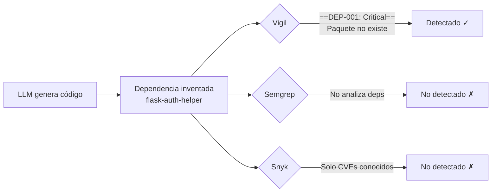
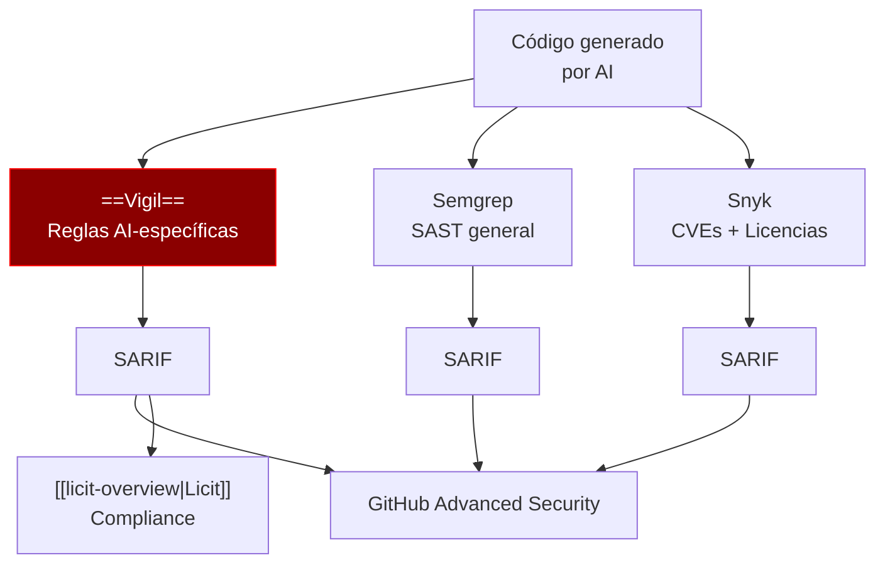

# Vigil vs Alternativas

> [!abstract] Resumen
> Comparación honesta de Vigil contra ==6 herramientas de seguridad==: Semgrep, Snyk, SonarQube, CodeQL, Bandit y Trivy. Vigil se diferencia por sus ==reglas específicas para código generado por IA== (slopsquatting, test theater, secretos placeholder), su naturaleza ==completamente determinista== sin dependencia de AI/ML, y su ==salida SARIF 2.1.0 con mapeos CWE/OWASP==. Se identifican también las áreas donde las alternativas superan a Vigil. ^resumen

> [!warning] Nota de volatilidad
> Este documento tiene status ==volatile== porque el panorama de herramientas de seguridad cambia frecuentemente. Las comparaciones reflejan el estado al momento de escritura y deben verificarse periódicamente.

---

## Tabla Comparativa General

| Criterio | Vigil | Semgrep | Snyk | SonarQube | CodeQL | Bandit |
|----------|-------|---------|------|-----------|--------|--------|
| ==Reglas AI-específicas== | ==✓ 26 reglas== | ✗ | ✗ | ✗ | ✗ | ✗ |
| Determinista | ==✓== | ✓ | ✗ (cloud) | ✓ | ✓ | ✓ |
| Slopsquatting | ==✓== | ✗ | Parcial | ✗ | ✗ | ✗ |
| Test theater | ==✓== | ✗ | ✗ | Parcial | ✗ | ✗ |
| Placeholder secrets | ==✓ (32 regex)== | Parcial | ✗ | ✗ | ✗ | Parcial |
| SARIF output | ==✓ 2.1.0== | ✓ | ✓ | ✗ | ✓ | ✗ |
| CI/CD nativo | ✓ | ✓ | ✓ | ✓ | ✓ | ✓ |
| Open source | ✓ | ✓ (core) | ✗ | Parcial | ✓ | ✓ |
| SCA (deps) | ==✓ (AI-focused)== | ✗ | ✓ | ✗ | ✗ | ✗ |
| SAST completo | ✗ | ==✓== | ✗ | ==✓== | ==✓== | Python |
| CVE database | ✗ | ✗ | ==✓== | ✗ | ✗ | ✗ |
| Multi-lenguaje | 2 (Py/JS) | ==30+== | ==30+== | ==30+== | ==10+== | 1 (Py) |
| Setup time | ==< 1 min== | < 5 min | < 5 min | > 30 min | > 15 min | < 1 min |
| Requiere cloud | ==No== | No (OSS) | Sí | Opcional | No | No |

---

## Qué Vigil Detecta que Otros No

### 1. Slopsquatting (DEP-001)

> [!danger] Brecha de seguridad única
> ==Ninguna== herramienta tradicional verifica si un paquete realmente existe en el registro. Snyk verifica vulnerabilidades de paquetes que existen, pero no puede detectar paquetes que no existen. Esto es un problema exclusivo del código generado por IA.

---

### 2. Test Theater (TEST-001, TEST-002)

| Herramienta | Detecta tests sin assertions | Detecta `assert True` | Detecta mock = implementación |
|-------------|-----------------------------|-----------------------|-------------------------------|
| ==Vigil== | ==✓ TEST-001== | ==✓ TEST-002== | ==✓ TEST-006== |
| Semgrep | Custom rules posible | Custom rules posible | ✗ |
| SonarQube | Parcial (cobertura) | ✗ | ✗ |
| CodeQL | ✗ | ✗ | ✗ |
| Bandit | ✗ | ✗ | ✗ |

> [!tip] Tests de teatro en código AI
> Los LLMs frecuentemente generan tests que "pasan" pero no verifican nada real. Esto es un ==problema sistémico== del código generado por IA que las herramientas tradicionales no están diseñadas para detectar.

---

### 3. Secretos Placeholder (SEC-001)

| Herramienta | Detecta `your-api-key-here` | Detecta `CHANGE_ME` | 32 patrones específicos |
|-------------|----------------------------|--------------------|----------------------|
| ==Vigil== | ==✓== | ==✓== | ==✓== |
| Semgrep | Parcial (custom rules) | ✗ | ✗ |
| Snyk | ✗ | ✗ | ✗ |
| GitGuardian | Parcial | ✗ | ✗ |
| Bandit | Parcial | ✗ | ✗ |

> [!info] Diferencia clave con detectores de secretos
> Los detectores de secretos tradicionales buscan ==secretos reales== (alta entropía, patrones de API keys). Vigil busca ==placeholders== que el LLM pone como sustitutos. Estos tienen baja entropía y patrones textuales específicos que los detectores de secretos ignoran o descartan como falsos positivos.

---

## Qué Otros Detectan que Vigil No

> [!failure] Limitaciones de Vigil
> Es importante ser honesto sobre lo que Vigil ==no hace==:

### SAST Completo

| Capacidad | Vigil | Semgrep | SonarQube | CodeQL |
|-----------|-------|---------|-----------|--------|
| SQL Injection | ✗ | ==✓== | ==✓== | ==✓== |
| XSS | ✗ | ==✓== | ==✓== | ==✓== |
| Buffer overflow | ✗ | ✗ | ==✓== | ==✓== |
| Path traversal (en código) | ✗ | ==✓== | ==✓== | ==✓== |
| Deserialization | ✗ | ==✓== | ==✓== | ==✓== |
| Data flow analysis | ✗ | ==✓== | ==✓== | ==✓== |

> [!warning] Vigil no es un SAST
> Vigil ==no reemplaza== un escáner SAST completo. No hace análisis de flujo de datos (*data flow analysis*), no detecta SQL injection, XSS, ni la mayoría de vulnerabilidades clásicas del OWASP Top 10 para aplicaciones web. ==Vigil complementa== estas herramientas, no las reemplaza.

### CVE Database

| Capacidad | Vigil | Snyk | Trivy |
|-----------|-------|------|-------|
| CVEs conocidos | ✗ | ==✓== | ==✓== |
| Versiones vulnerables | ✗ | ==✓== | ==✓== |
| Remediation advice | ✗ | ==✓== | ==✓== |
| License compliance | ✗ | ==✓== | ==✓== |

### Cobertura de Lenguajes

| Vigil | Semgrep | SonarQube |
|-------|---------|-----------|
| ==Python, JavaScript== | 30+ lenguajes | 30+ lenguajes |

> [!question] ¿Vigil soportará más lenguajes?
> Actualmente Vigil se enfoca en ==Python y JavaScript== porque son los lenguajes más comúnmente generados por LLMs. Soporte para más lenguajes está en el [[ecosistema-roadmap|roadmap]].

---

## Comparación Detallada por Herramienta

### Vigil vs Semgrep

```mermaid
flowchart TB
    subgraph Vigil
        V1["26 reglas AI-específicas"]
        V2["Verificación de registros<br/>(PyPI/npm)"]
        V3["Test quality analysis"]
        V4["SARIF 2.1.0"]
    end

    subgraph Semgrep
        S1["1000+ reglas SAST"]
        S2["Data flow analysis"]
        S3["Custom rules (YAML)"]
        S4["30+ lenguajes"]
    end

    style Vigil fill:#2d5a27,stroke:#4a9
    style Semgrep fill:#1a4a6e,stroke:#4af
```

| Aspecto | Vigil | Semgrep |
|---------|-------|---------|
| Foco | ==Código AI== | Código en general |
| Reglas | 26 curated | 1000+ community |
| Custom rules | No | ==✓ (YAML DSL)== |
| Falsos positivos | ==Bajo== (reglas específicas) | Variable |
| Complejidad | Simple | Moderada |
| Mejor para | ==Post-AI code generation== | SAST completo |

> [!tip] Uso complementario recomendado
> La combinación ideal es ==Vigil + Semgrep==: Vigil para problemas específicos de código AI, Semgrep para SAST general. Ambos generan SARIF y se integran en el mismo pipeline CI/CD. Ver [[ecosistema-cicd-integration]].

---

### Vigil vs Snyk

| Aspecto | Vigil | Snyk |
|---------|-------|------|
| Foco | Código AI + deps | ==SCA + SAST== |
| Deps: existencia | ==✓== | ✗ |
| Deps: CVEs | ✗ | ==✓== |
| Deps: licencias | ✗ | ==✓== |
| Container scanning | ✗ | ==✓== |
| Precio | ==Gratis== | Freemium |
| Cloud required | ==No== | Sí |

---

### Vigil vs SonarQube

| Aspecto | Vigil | SonarQube |
|---------|-------|-----------|
| Setup | ==< 1 minuto== | > 30 minutos |
| Server required | ==No== | Sí (o SonarCloud) |
| Code coverage | ✗ | ==✓== |
| Duplicación | ✗ | ==✓== |
| Technical debt | ✗ | ==✓== |
| AI-specific | ==✓== | ✗ |
| Test quality | ==✓ (6 reglas)== | Parcial |

---

### Vigil vs CodeQL

| Aspecto | Vigil | CodeQL |
|---------|-------|--------|
| Data flow analysis | ✗ | ==✓== |
| Custom queries | ✗ | ==✓ (QL language)== |
| GitHub integration | Via SARIF | ==Nativo== |
| AI-specific | ==✓== | ✗ |
| Complejidad | ==Baja== | Alta |
| Build required | ==No== | Sí |

---

### Vigil vs Bandit

| Aspecto | Vigil | Bandit |
|---------|-------|--------|
| Lenguajes | Python + JS | ==Solo Python== |
| AI-specific | ==✓== | ✗ |
| SAST Python | ✗ | ==✓== |
| Configuración | `.vigil.yaml` | `.bandit.yaml` |
| SARIF output | ==✓== | ✗ |

---

## Estrategia de Integración Recomendada

> [!success] Vigil como capa adicional
> La mejor estrategia no es "Vigil O Semgrep" sino "==Vigil Y Semgrep==". Vigil cubre una brecha que ninguna otra herramienta cubre (código generado por AI), mientras que las herramientas tradicionales cubren las vulnerabilidades clásicas que Vigil no detecta.

---

## Métricas de Comparación

| Métrica | Vigil | Semgrep OSS | Bandit |
|---------|-------|-------------|--------|
| Tests del proyecto | ==1706== | ~5000 | ~800 |
| Cobertura | ==97%== | ~85% | ~75% |
| Tiempo de escaneo (10K LOC) | ==< 5s== | < 10s | < 3s |
| Falsos positivos (AI code) | ==Bajo== | Alto | Medio |
| Falsos positivos (normal code) | N/A | ==Bajo== | Medio |

> [!info] Falsos positivos en código normal
> Vigil está optimizado para ==código generado por AI==. Si se ejecuta contra código escrito por humanos, las reglas de dependencias (DEP-001 a DEP-003) tendrán pocos hallazgos, pero las de auth y secretos seguirán siendo útiles. Las reglas de test quality son universales.

---

## Conclusión

| Si necesitas... | Usa... |
|-----------------|--------|
| Detectar problemas de código AI | ==Vigil== |
| SAST completo multi-lenguaje | Semgrep o SonarQube |
| CVEs en dependencias | Snyk o Trivy |
| Data flow analysis | CodeQL |
| Todo lo anterior | ==Vigil + Semgrep + Snyk== |

---

## Criterios de Evaluación Detallados

### Velocidad de Escaneo

| Herramienta | 1K LOC | 10K LOC | 100K LOC |
|-------------|--------|---------|----------|
| ==Vigil== | ==< 1s== | ==< 5s== | < 30s |
| Semgrep | < 2s | < 10s | < 60s |
| Bandit | < 1s | < 3s | < 20s |
| SonarQube | > 10s | > 30s | > 120s |
| CodeQL | > 30s | > 120s | > 300s |

> [!info] Velocidad de Vigil
> Vigil es rápido porque sus ==análisis son ligeros==: regex matching, string comparison, y consultas HTTP cacheadas. No hace parsing completo del AST como CodeQL ni análisis de flujo de datos como Semgrep. Esto es un ==trade-off deliberado== entre profundidad y velocidad.

### Facilidad de Configuración

| Herramienta | Setup Inicial | Config Ongoing | Curva de Aprendizaje |
|-------------|--------------|----------------|---------------------|
| ==Vigil== | ==`vigil init` (1 min)== | `.vigil.yaml` simple | Baja |
| Semgrep | `semgrep --config auto` (2 min) | Reglas custom YAML | Media |
| Snyk | Registro + token (5 min) | Web dashboard | Baja |
| SonarQube | Servidor + DB (30+ min) | Web config | ==Alta== |
| CodeQL | Build config (15+ min) | QL queries | ==Muy alta== |
| Bandit | `pip install` (1 min) | `.bandit.yaml` | Baja |

### Integración con el Ecosistema

| Herramienta | SARIF | Integración con Licit | Integración con Architect |
|-------------|-------|----------------------|--------------------------|
| ==Vigil== | ==✓ 2.1.0 nativo== | ==Conector nativo== | ==Check en pipelines== |
| Semgrep | ✓ | Via SARIF genérico | Manual |
| Snyk | ✓ | Via SARIF genérico | Manual |
| SonarQube | ✗ | No soportado | Manual |
| CodeQL | ✓ | Via SARIF genérico | Manual |
| Bandit | ✗ | No soportado | Manual |

> [!success] Ventaja de integración nativa
> Vigil es la ==única herramienta con integración nativa== en el ecosistema: conector dedicado en [[licit-overview|Licit]], check integrado en [[architect-pipelines|pipelines de Architect]], y formato SARIF optimizado para el evidence bundle. Las demás herramientas pueden integrarse pero requieren configuración manual.

---

## Escenarios de Decisión

> [!question] ¿Qué herramienta elegir según el escenario?

### Escenario 1: Solo código generado por AI

> [!tip] Recomendación: ==Vigil== como herramienta principal
> Si todo tu código es generado por AI (ej: usando [[architect-overview|Architect]] o Cursor), Vigil es la herramienta más relevante. Las reglas AI-específicas (slopsquatting, test theater, placeholders) son las que más valor aportan.

### Escenario 2: Mezcla de código humano y AI

> [!tip] Recomendación: ==Vigil + Semgrep==
> Para proyectos mixtos, combina Vigil (para el código AI) con Semgrep (para SAST general). Ambos generan SARIF y se integran en el mismo pipeline.

### Escenario 3: Enterprise con compliance estricto

> [!tip] Recomendación: ==Vigil + Semgrep + Snyk + Licit==
> Para compliance SOC2/ISO, necesitas cobertura completa: Vigil (AI-specific), Semgrep (SAST), Snyk (SCA + CVEs), y [[licit-overview|Licit]] para agregar toda la evidencia de seguridad al evidence bundle.

---

## Enlaces y referencias

> [!quote]- Referencias internas
> - [[vigil-overview]] — Visión general de Vigil
> - [[vigil-architecture]] — Arquitectura técnica
> - [[vigil-vulnerability-catalog]] — Las 26 reglas en detalle
> - [[ecosistema-vs-competidores]] — Comparación del ecosistema completo
> - [[ecosistema-cicd-integration]] — Integración con múltiples escáneres
> - [[licit-overview]] — Consume SARIF de Vigil y otros escáneres

[^1]: Semgrep OSS es la versión open source. Semgrep Cloud (de pago) tiene funcionalidades adicionales.
[^2]: SonarQube Community Edition es gratuita pero limitada. La versión Enterprise es de pago.
[^3]: Las métricas de falsos positivos son estimaciones basadas en uso típico, no benchmarks formales.
[^4]: Las mediciones de velocidad son aproximadas y dependen del hardware y la complejidad del código.
