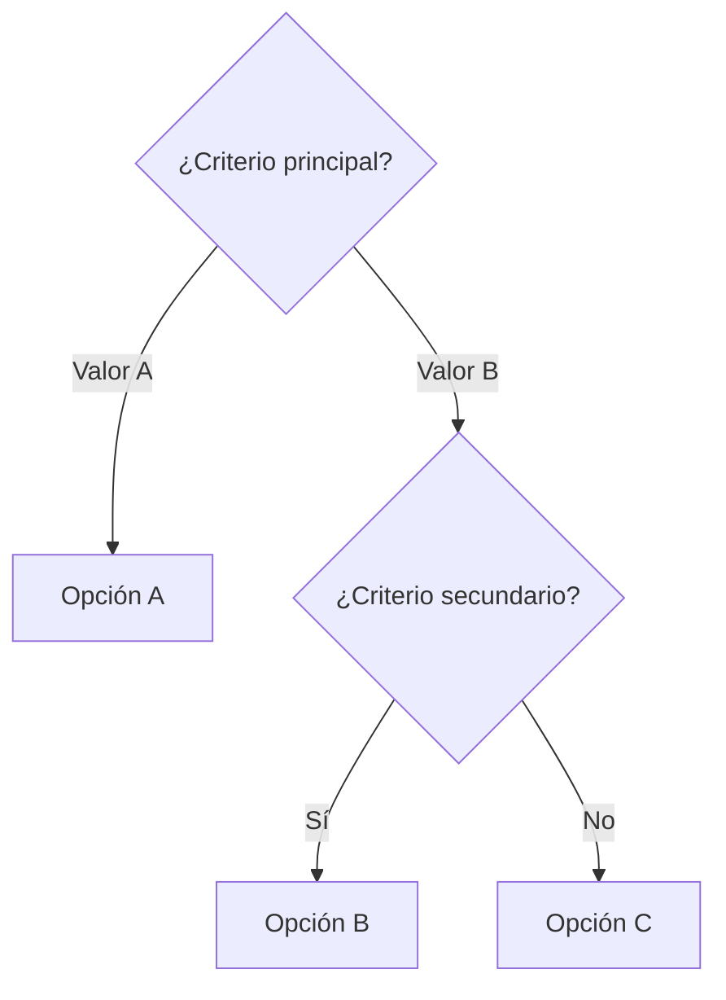

---
tags:
  - herramienta
  - comparativa
aliases:
  -
created: {{date:YYYY-MM-DD}}
updated: {{date:YYYY-MM-DD}}
category:
status: volatile
difficulty: intermediate
related:
  - "[[]]"
  - "[[]]"
  - "[[]]"
  - "[[]]"
  - "[[]]"
up: "[[]]"
---

# {{title}}

> [!abstract] Resumen
> Comparativa de X herramientas/técnicas para resolver Y. ==Recomendación principal==. ^resumen

> [!warning] Última verificación: {{date:YYYY-MM-DD}}
> Los precios, features y benchmarks cambian rápidamente. Verifica antes de tomar decisiones.

---

## Criterios de evaluación

| Criterio | Peso | Qué se evalúa |
|---|---|---|
| Criterio A | Alto | ... |
| Criterio B | Medio | ... |
| Criterio C | Bajo | ... |

---

## Comparativa general

| Criterio | Opción A | Opción B | Opción C |
|---|---|---|---|
| Criterio 1 | ==Mejor== | Bueno | Regular |
| Criterio 2 | Regular | ==Mejor== | Bueno |
| Criterio 3 | Bueno | Regular | ==Mejor== |
| **Precio** | $X | ==$Y== | $Z |

---

## Análisis detallado por opción

### Opción A

> [!success] Fortalezas
> - ...

> [!failure] Debilidades
> - ...

### Opción B

> [!success] Fortalezas
> - ...

> [!failure] Debilidades
> - ...

---

## Árbol de decisión

---

## Mi recomendación

> [!tip] Mi recomendación
> Para la mayoría de casos, usaría **Opción X** porque...
>
> Excepción: si necesitas Y, entonces **Opción Z** es mejor.

---

## Enlaces y referencias

- [[nota-detalle-opcion-a]] — Deep dive
- [[nota-detalle-opcion-b]] — Deep dive

> [!quote]- Fuentes de datos
> - Benchmarks de: fuente
> - Precios verificados en: fecha
