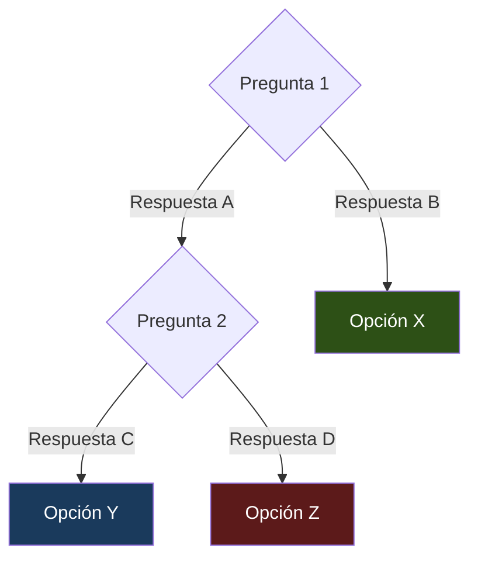

---
tags:
  - decision
aliases:
  -
created: {{date:YYYY-MM-DD}}
updated: {{date:YYYY-MM-DD}}
category: decisiones
status: current
difficulty: intermediate
related:
  - "[[]]"
  - "[[]]"
  - "[[]]"
  - "[[]]"
  - "[[]]"
up: "[[moc-decision-frameworks]]"
---

# {{title}}

> [!abstract] Resumen
> Framework de decisión para elegir entre X opciones en el contexto de Y. ==Decisión más común y por qué==. ^resumen

---

## Contexto

¿Cuándo te enfrentas a esta decisión? ¿Por qué es difícil?

---

## Árbol de decisión

---

## Tabla de trade-offs

| Factor | Opción A | Opción B | Opción C |
|---|---|---|---|
| Coste | Bajo | ==Medio== | Alto |
| Complejidad | ==Baja== | Media | Alta |
| Escalabilidad | Limitada | Buena | ==Excelente== |
| Time to market | ==Rápido== | Medio | Lento |

---

## Checklist de decisión

- [ ] ¿Cuál es mi restricción principal? (coste / tiempo / calidad)
- [ ] ¿Qué escala necesito? (prototipo / producción / enterprise)
- [ ] ¿Qué equipo tengo? (individual / startup / enterprise)
- [ ] ¿Qué restricciones regulatorias tengo?
- [ ] ¿Cuál es mi nivel de tolerancia al riesgo?

---

## Escenarios comunes

> [!example] Escenario: Startup con presupuesto limitado
> **Contexto**: ...
> **Recomendación**: Opción A porque...

> [!example] Escenario: Enterprise con requisitos de compliance
> **Contexto**: ...
> **Recomendación**: Opción C porque...

---

## Errores comunes

> [!danger] Trampas frecuentes
> - Error 1: elegir X cuando deberías elegir Y
> - Error 2: no considerar el factor Z

---

## Relación con el ecosistema

> [!info] Cómo mis herramientas ayudan en esta decisión
> - ...

---

## Enlaces y referencias

- [[nota-detalle]] — Profundización
- [[nota-relacionada]] — Contexto adicional
